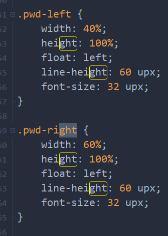
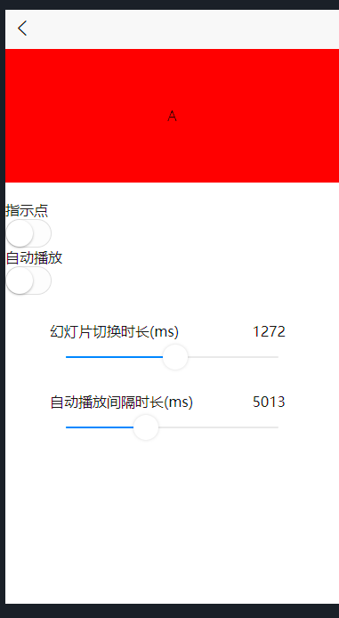
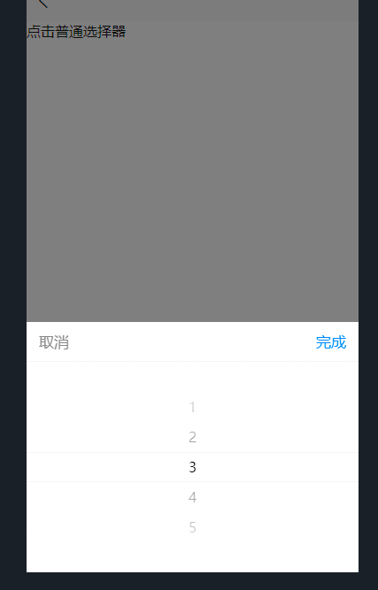
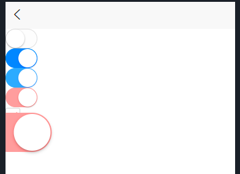
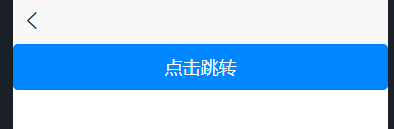
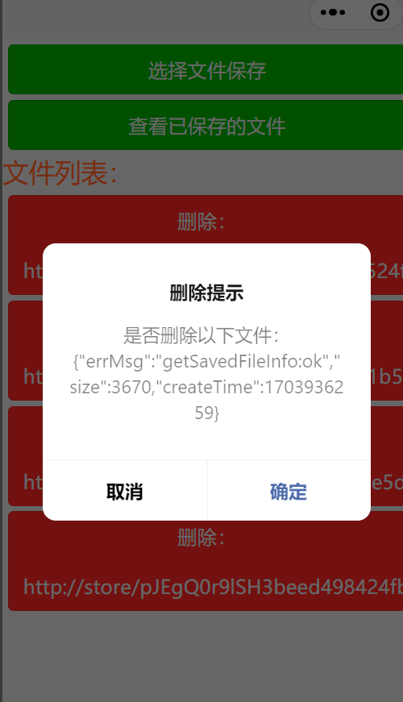

<h1 style="font-size:3em;color:skyblue;text-align:center">uniapp学习笔记</h1>

[toc]

---


# 概述

uni-app 是一个使用 Vue.js 开发所有前端应用的框架，开发者编写一套代码，可发布到iOS、Android、Web（响应式）、以及各种小程序（微信/支付宝/百度/头条/飞书/QQ/快手/钉钉/淘宝）、快应用等多个平台

即使不跨端，`uni-app`也是更好的小程序开发框架、更好的App跨平台框架、更方便的H5开发框架


## 特点

`uni-app`在开发者数量、案例、跨端抹平度、扩展灵活性、性能体验、周边生态、学习成本、开发成本等8大关键指标上拥有更强的优势


* 开发者/案例数量更多

* 平台能力不受限：在跨端的同时，通过条件编译+平台特有API调用，可以优雅的为某平台写个性化代码，调用专有能力而不影响其他平台

* 性能体验优秀：加载新页面速度更快、自动diff更新数据，App端支持原生渲染，可支撑更流畅的用户体验

* 周边生态丰富

* 学习成本低：基于通用的前端技术栈，采用vue语法+微信小程序api，无额外学习成本

* 开发成本低：不止开发成本，招聘、管理、测试各方面成本都大幅下降


## 功能框架图


# HBuilderX

## 概述

HBuilderX是通用的前端开发工具，但为uni-app做了特别强化

HBuilderX，H是HTML的首字母，Builder是构造者，X是HBuilder的下一代版本。我们也简称HX。 HX是轻如编辑器、强如IDE的合体版本


## 特点

1. 轻巧 仅10余M的绿色发行包(不含插件)
2. 极速 不管是启动速度、大文档打开速度、编码提示，都极速响应 C++的架构性能远超Java或Electron架构
3. vue开发强化 `HX`对vue做了大量优化投入，开发体验远超其他开发工具
4. 小程序支持 国外开发工具没有对中国的小程序开发优化，`HX`可新建`uni-app` `小程序`等项目，为国人提供更高效工具
5. markdown利器 `HX`是唯一一个新建文件默认类型是markdown的编辑器，也是对md支持最强的编辑器 `HX`为md强化了众多功能
6. 清爽护眼 HX的界面比其他工具更清爽简洁，绿柔主题经过科学的脑疲劳测试，是最适合人眼长期观看的主题界面
7. 强大的语法提示 `HX`是中国唯一一家拥有自主IDE语法分析引擎的公司，对前端语言提供准确的代码提示和[转到定义](https://hx.dcloud.net.cn/Tutorial/UserGuide/goto?id=转到定义)(Alt+鼠标左键)
8. 高效极客工具 更强大的多光标、智能双击...让字处理的效率大幅提升
9. 更强的json支持 现代js开发中大量json结构的写法，`HX`提供了比其他工具更高效的操作


## 安装

以Windows为例


**下载**

HBuilderX下载地址: [下载地址](https://www.dcloud.io/hbuilderx.html)

### 

**解压**

HBuilderX，Windows为zip包，解压后才能使用


**创建快捷方式**


**启动**

HBuilderX，首次启动后，您会看到一个选择窗口，您可以在此选择您喜欢的主题、快捷键


## 入门

### 新建项目


选择一个模板


### 运行项目


点击运行到内置浏览器


### 语法提示

框架语法提示库是在页面的右下角选择


### 代码助手

可以按`alt+数字`选择直接选择某个项目，类似中文输入法数字选词


### 语法帮助

光标放到某api处，按下F1，就可跳转到这个api的官方手册。目前支持vue、uni-app、5+等api


### 多光标

hx支持多光标，按 `ctrl+鼠标左键` 就可增加一个光标，`ctrl+鼠标右键` 可取消一个光标或选区


还可以选择相同词。`ctrl+e` (mac是`cmd+d`)可选中相同的词做批处理





### 列选择

hx的列选择，是alt+鼠标拖选。或者用快捷键ctrl+alt+↑或↓


### 选择编码、着色高亮

当你打开一个不认识的文档时，即hx的无法高亮着色，可以在右下角选择使用其他编辑器打开。

当你打开一个文件编码错乱，产生乱码时，也可以在右下角选择编码重新打开。


### 转到定义

转到定义是非常常用的功能，普通编辑器不长于此，只能猜单词跳转。

HBuilderX有强大的语法分析引擎，可以准确的跳转定义位置。

转到定义的快捷键是`Alt+d`，鼠标操作是alt+左键单击


而HBuilderX还有一个特色是`转到定义到分栏`，`ctrl+alt+左键`，可以把一个定义处的代码打开在另一侧，方便共同查看


在HBuilderX中，`Alt+Left`或点击工具栏上的`<`, 即可回到上一个光标位置


### 文件快速打开

在顶部工具栏直接搜索工程下的文件名并打开，或者使用快捷键`ctrl+p`


### 目录内搜索

项目管理器点右键，选：查找字符串(当前目录)，可在该目录下所有文件中搜索字符串


点击支付搜索


### 缩进调整

hx默认使用`tab`缩进，`tab`长度为4个空格

如果你需要调整缩进长度，比如`tab`长度为2个空格，在工具设置-编辑器中调整


如果不喜欢使用tab而喜欢使用空格，也可以在设置中调。注意这个调节只是编辑器里敲tab按键时转为了空格，格式化时仍是tab。


### 语法校验

hx的语法校验都是插件，在工具插件安装中选择各种校验插件，不同语言的校验插件不一样。安装校验插件后，保存文件时会自动执行语法校验

校验概要结果会显示在状态栏，可以按`F4`切换到不同的错误处


### svn/git项目导入

新建项目时选择左下方


也可以在左边导入


## 设置

Windows: 顶部菜单【工具】-> 【设置】(快捷键: ctrl + alt + ,)


设置视图，主要分为5部分：

- 常用配置
- 编辑器配置
- 运行配置：手机/模拟器运行和浏览器运行相关配置
- 插件配置：已安装的插件扩展配置
- 源码视图：json文件，包含以上自定义的配置


### 常用配置项

- 编辑器字体大小
- 项目管理器字体大小
- 编辑字体
- 制表符长度
- 空格代替制表符
- 失去焦点自动保存：默认未开启，如需要，请手动开启
- 语言关联配置
- 项目管理器过滤器配置
- 搜索默认不包含的目录：搜索时默认不包含`.git`、`.cvs`、`.svn`、`node_modules`、`unpackage`
- 打开终端数量：最多允许打开的终端数量，默认8
- 本地历史记录
- 项目管理器单击展开/折叠目录（备注：若关闭此项则是双击展开/折叠目录）
- 项目管理器点击目录时打开内部资源管理器 (即点击时，是否打开内置资源管理器)


### 编辑器配置

- 自动换行: 默认不换行，如需要，请启用。
- 高亮时显示空白字符：默认启用。
- 显示换行符
- 选择默认换行符
- 迷你地图最大像素宽度：默认100
- 鼠标悬停预览
- 关闭时记忆文档折叠状态
- 启动.editorconfig支持：默认启用
- 显示代码缩进对齐线
- 显示长行指示竖线
- 长行指示竖线显示在第几列： 默认值80
- 编辑器行高：文档行间距比例，默认1.2
- 仅在选择一个完整的单词时触发相同词高亮
- 启动代码助手：默认启用，可手动关闭
- Tab键自动插入代码助手选中项
- 代码助手字体大小：默认12
- 代码助手触发字符
- 启用px转rem提示
- 启用px转rpx/upx提示 
- 自动匹配匹配字符
- 中文标点免干扰输入
- 文字分隔符
- 插入多光标使用的修饰键
- 使用Ctrl+鼠标滚轮缩放编辑器
- 智能计算制表符长度
- 编辑器向下滚动一屏


## 主题

### 选择主题

1. 在HBuilderX中，您可以点击顶部菜单【工具】【主题】，选择切换您喜欢的主题颜色。
2. HBuilderX内置了3个主题, 分别为`绿柔` `雅蓝` `酷黑`


### 自定义窗体主题

在文件setting.json的源码视图中，通过定义"workbench.colorCustomizations"字段来自定义您喜欢的主题颜色


```json
"workbench.colorCustomizations": {
    "[Default]": {//绿柔
        "sideBar.background":"#faf6e6", //加深项目管理器颜色
        "editor.background":"#faf6e6" //加深编辑区域背景颜色
    },
    "[Monokai]": {//酷黑
        "toolBar.background": "#272822", //工具栏背景色设为黑色
        "sideBar.background":"#272822" //项目管理器背景色设为黑色
    },
    "[Atom One Dark]": {//雅蓝
        "sideBar.background": "#282c34", //项目管理器背景色设为与代码区背景色相同
        "editor.background":"#282c3f" //调亮编辑区域背景颜色
    }
}
```


## 快捷键

HBuilderX，预设了5种快捷键方案，分别为: `HBuilderX`、`VS Code`、`Sublime Text`、`IntelliJ Idea / Webstorm`、`Eclipse`


## 鼠标滚轮

|   向上    |      向下      |                |
| :-------: | :------------: | :------------: |
|   Ctrl    |      放大      |      缩小      |
|    Alt    |  向上滚动一屏  |  向下滚动一屏  |
|   Shift   |  向左滚动3列   |  向右滚动3列   |
| Alt+Shift |  向左滚动一屏  |  向右滚动一屏  |
| Ctrl+Alt  | 向左切换选项卡 | 向右切换选项卡 |


## 项目

### 导入项目/目录

点击顶部菜单【文件】【导入】，或点击菜单【打开目录】，即可导入项目到HBuilderX


### 关闭项目

当项目管理器，项目数量过多时，您可以`关闭项目`

在项目管理器，选中项目，右键菜单，点击【关闭项目】，即可将目移动到【已关闭项目】列表中。

当然，后期也可以从【已关闭项目】中，将需要的项目打开，移动到项目管理器


### 项目别名

HBuilderX，支持对项目创建或修改`别名`

项目管理器，选中项目，右键菜单，点击【修改项目别名】，即创建别名


## 智能双击

在HBuilderX中，但凡特殊点的字符，都能智能双击。

- 双击引号/括号内侧，是选中引号/括号内的内容
- 双击逗号两侧，是选择逗号前一段或后一段
- 双击行尾，是选中该行(不含回车符)
- 双击连词符（-_）选中整个词
- 双击折叠行首内容开头，选择折叠段落
- 双击行首缩进，选择相同缩进的段落
- 双击列表符号，选择列表段落
- 双击Tag开头或结尾，选择整段Tag
- 双击属性赋值等号=，选择Html属性
- 双击if、function等关键字，选择整段包围区域
- 双击分号，选择js等语言的;分号前段落
- 双击css类名左侧，选择Css类
- 双击注释符选择注释区域
- 双击#选择markdown标题段落
- 双击语法定义符开头选择markdown图片、超链接、加粗、倾斜、代码等语法区


## 同时注释if段首尾

if块的调整很常见，除了包围、反包围外，常用操作还有同时注释掉if段首尾。

1. 双击if选中if代码块
2. 按`Ctrl+\`在选区首尾加光标，变成多光标模式
3. 按`Ctrl+/`注释掉选区首尾行


## 跳转/转到定义

### 上一个光标位置

在HBuilderX中，`Alt+Left` (MacOSX: `ctrl + -`)、点击工具栏上的`<`, 即可回到上一个光标位置


### 转到行

转到行快捷键：`ctrl + G`


HBuilderX 3.1.13+版本，支持输入0跳转到首行、输入$跳转到最后一行


### 转到定义

转到定义的快捷键是`Alt+d`，鼠标操作是alt+左键单击


### 转到定义到分栏

`ctrl+alt+左键`，可以把一个定义处的代码打开在另一侧，方便共同查看


## 查找替换

### 快速查找文件

`ctrl+p (MacOSX: ⌘P)`，可以定位到搜索框，输入文件名，快速打开任何文件。

文件名后，敲击空格，输入项目名称，可以只搜索指定项目下文件

按住`Ctrl+Tab`, 可以查看在编辑器中，打开的所有文件的列表


### 查找索引符号

在当前文件，按下`Ctrl + Shift + O`, 可以查找索引符号


### 查找字符串

ctrl +F

- 范围：字符串查找，支持`按当前文件`、`按目录`、`按左侧选中`、`按当前项目`、`按所有项目`进行搜索查找。
- 功能：字符串查找，支持`整词匹配`、`正则匹配`、`大小写匹配`，且支持`排除`特定目录


### 区域内搜索

支持选中一段文字，在顶部搜索栏选中区域搜索【Ctrl+Shift+f】，可以在特殊背景区内`搜索`、`替换`、`全选相同词`


## 折叠

折叠的快捷键是`alt+-`和`=`。

或点击`行号`右边的`-`或`+`，即可完成折叠展开。


## 格式化

格式化快捷键, win：`ctrl + K`； mac: `command + K`


### 格式化插件

| 插件名称         | 对应插件配置中的名称    | 是否内置         | 可格式化的文件                             | 插件市场                                             | 插件教程                                                     |
| ---------------- | ----------------------- | ---------------- | ------------------------------------------ | ---------------------------------------------------- | ------------------------------------------------------------ |
| js-beautify      | format                  | 内置插件         | vue、html、js、css、json                   |                                                      | [文档](https://hx.dcloud.net.cn/Tutorial/extension/js-beautify) |
| prettier         | format-prettier         | 非内置，需要下载 | less、sass、vue、stylus(vue内嵌)、ts、yaml | [下载地址](https://ext.dcloud.net.cn/plugin?id=2025) | [文档](https://hx.dcloud.net.cn/Tutorial/extension/prettier) |
| stylus-supremacy | format-stylus-supremacy | 非内置，需要下载 | 格式化单独stylus文件                       | [下载地址](https://ext.dcloud.net.cn/plugin?id=2039) | [文档](https://ext.dcloud.net.cn/plugin?id=2039)             |


1. 当同时存在`js-beautify`和`format-prettier`插件是，格式化`vue`文件，调用的是`format-prettier`插件
2. `stylus-supremacy`只支持格式化独立的stylus文件，如需格式化vue文件内的stylus代码，需要同时安装prettier插件
3. 本地插件目录：HBuilderX所有的插件，都存放于本地`plugins`目录下


### 格式化插件配置

点击菜单【工具】【设置 -> 插件配置】，选择相应插件, 点击`配置文件`进行配置


## 语法校验

代码语法校验，需要安装相应插件


### 语法校验插件

|        语言        |      插件名称      |                           插件地址                           |                           插件文档                           |
| :----------------: | :----------------: | :----------------------------------------------------------: | :----------------------------------------------------------: |
|        html        |   validate-html    | [下载地址](https://ext.dcloud.net.cn/plugin?name=validate-html) | [文档教程](https://hx.dcloud.net.cn/Tutorial/extension/validate-html) |
| css/less/sass/scss | validate-stylelint | [下载地址](https://ext.dcloud.net.cn/plugin?name=validate-stylelint) | [文档教程](https://hx.dcloud.net.cn/Tutorial/extension/validate-stylelint) |
|         js         |     eslint-js      | [下载地址](https://ext.dcloud.net.cn/plugin?name=eslint-js)  | [文档教程](https://hx.dcloud.net.cn/Tutorial/extension/eslint-js) |
|        vue         |     eslint-vue     | [下载地址](https://ext.dcloud.net.cn/plugin?name=eslint-vue) | [文档教程](https://hx.dcloud.net.cn/Tutorial/extension/eslint-vue) |


### 使用方法

在对应的文件上，右键菜单，点击【验证本文档语法】

校验概要结果会显示在`状态栏`

比如有2个错误（如下图），可以按`F4`切换到不同的错误处


## 文件对比

项目管理器，选中两个要对比的文件，右键菜单，点击【对比选中文件】


## 本地历史记录

HBuilderX，文件修改、保存时在本地进行备份，防止意外丢失，可通过 “本地历史记录”查看备份文件

在编辑器打开的文件上，点击右键菜单，点击【本地历史记录】


菜单【设置】【常用设置】，可以配置`本地历史记录`

- 单个文件最大备份数量
- 单个文件大小限制
- 最长保存时间


## editorconfig

### 概述

很多公司都要求各开发成员使用相同的编码风格，比如缩进是空格还是tab。

`editorconfig`是一套解决这个问题的业内通用规范，通过在项目下存放配置文件`.editorconfig`，并在这个配置文件中描述规则，然后把这个配置文件和其他代码一起提交git/svn，所有项目成员，都会遵循相同的编码规范。

`editorconfig`可以帮助开发者在不同的编辑器和IDE之间定义和维护一致的代码风格。 `editorconfig`包含一个用于定义代码格式的文件和一批编辑器插件，这些插件可以让编辑器读取配置文件并依此格式化代码。 `editorconfig`的配置文件十分易读，并且可以在各个操作系统、编辑器下工作


### 示例

`jQuery`在`Github`上的`.editorconfig`配置文件如下：


```sh
root = true

[*]
indent_style = tab
end_of_line = lf
charset = utf-8
trim_trailing_whitespace = true
insert_final_newline = true

[package.json]
indent_style = space
indent_size = 2
```


用于设置Python和JavaScript行尾和缩进风格的配置文件：

```sh
# EditorConfig is awesome: http://EditorConfig.org

# top-most EditorConfig file
root = true

# Unix-style newlines with a newline ending every file
[*]
end_of_line = lf
insert_final_newline = true

# 4 space indentation
[*.py]
indent_style = space
indent_size = 4

# Tab indentation (no size specified)
[*.js]
indent_style = tab

# Indentation override for all JS under lib directory
[lib/**.js]
indent_style = space
indent_size = 2

# Matches the exact files either package.json or .travis.yml
[{package.json,.travis.yml}]
indent_style = space
indent_size = 2
```


### 在哪里存放配置文件

当打开一个文件时，`editorconfig`插件会在打开文件的目录和其每一级父目录查找.`editorconfig`文件，直到有一个配置文件`root=true`

如果一个工程中出现多个配置文件，EditorConfig配置文件的读取层级是自上而下的，最深层的配置文件，最后读取。配置规则也是 按照读取的顺序来生效，所以路径上离代码最近的配置规则，优先级最高。


### 文件格式详情

`editorconfig`文件使用INI格式（译注：请参考维基百科），目的是可以与Python ConfigParser Library兼容，但是允许在分段名（译注：原文是section names）中使用“and”。 分段名是全局的文件路径，格式类似于`gitignore`。斜杠`/`作为路径分隔符，`#`或者`;`作为注释。注释应该单独占一行。`editorconfig`文件使用`UTF-8`格式、`CRLF`或`LF`作为换行符。


|   通配符   |                 说明                 |
| :--------: | :----------------------------------: |
|     *      |       匹配除/之外的任意字符串        |
|     **     |            匹配任意字符串            |
|     ？     |           匹配任意单个字符           |
|   [name]   |             匹配name字符             |
|  [!name]   |            匹配非name字符            |
| {s1,s3,s3} | 匹配任意给定的字符串（0.11.0起支持） |


特殊字符可以用`\`转义，以使其不被认为是通配符


|         属性说明         |                             说明                             |
| :----------------------: | :----------------------------------------------------------: |
|       indent_style       |               tab为hard-tabs，space为soft-tabs               |
|       indent_size        | 设置整数表示规定每级缩进的列数和soft-tabs的宽度（译注：空格数）。如果设定为tab，则会使用tab_width的值（如果已指定） |
|        tab_width         | 设置整数用于指定替代tab的列数。默认值就是indent_size的值，一般无需指定。 |
|       end_of_line        |                定义换行符，支持lf、cr和crlf。                |
| trim_trailing_whitespace |     设为true表示会除去换行行首的任意空白字符，false反之      |
|   insert_final_newline   |        设为true表明使文件以一个空白行结尾，false反之         |
|           root           | 表明是最顶层的配置文件，发现设为true时，才会停止查找.`editorconfig`文件。 |


1. 所有的属性名和属性值对`大小写不敏感`。通常，如果没有明确指定某个属性，则会使用编辑器的配置，而`editorconfig`不会处理。
2. 推荐不要指定某些`editorconfig`属性。比如，tab_width不需要特别指定，除非它与`indent_size`不同。同样的，当`indent_style`设为`tab`时，不需要配置`indent_size`，这样才方便阅读者使用他们习惯的缩进格式。另外，如果某些属性并没有规范化（比如`end_of_line`），就最好不要设置它。


### 启用或关闭

在【设置】中，有个editorconfig开关


## 外部命令

### 使用场景

- 压缩文件与解压
- 压缩图片
- 文档转换（比如markdown转pdf）
- 调用python、shell脚本
- 打开本地的某个程序
- 传输文件到服务器
- 操作服务器的某些服务（如启动、停止、重启nginx)
- 下载文件
- 安装apk到手机
- 上传应用到应用分发网站（比如蒲公英）
- 批量压缩
- 其它的自动化操作
- 上传文件到七牛云、阿里云等


### 外部命令在哪里？

菜单【工具】-->【外部命令】

点击菜单【工具】-->【外部命令】-->【自定义外部命令】，就可以自定义外部命令，格式为json


### 示例

模板如下：

```sh
//配置外层为数组结构，数组内可添加多个外部命令设置

//外部命令可以让您在HBuilderX中通过菜单、快捷键等方式调用外部程序或命令行

//注意: 左侧为教程，不是配置，需在右侧用户设置中添加外部命令才生效

[
    //------------外部命令 配置属性说明------------//
    {
        //名称，用于在“工具-运行外部命令”菜单中显示
        "name":"Echo",

        //需要执行的外部命令及参数：
        // - 值支持string 和 array 两种形式 
        // - 填写path环境中包含的命令或具体的程序路径及参数
        // - 支持使用变量

        // - command值为string: 命令与参数连写，命令或参数包含空格时需要使用\"\"包围
        "command":"echo ${file}",

        // - command值为array: 命令与参数分开写，命令或参数包含空格时不需要额外处理
        "command": ["C:/Program Files (x86)/Google/Chrome/Application/chrome.exe", "${file}"],

        //运行的环境 [可选项]：
        // - process(默认值): 后台运行，运行时不显示输入输出
        // - shell: 在cmd这样的独立shell环境下运行，运行时会打开shell窗口
        // - terminal: 在HBuilderX自带的内置终端插件中运行
        "type" : "shell",

        //工作目录 [可选项]：命令运行时的工作目录，默认是文件所在目录
        // - 支持使用变量
        "workingDir" : "",

        //快捷键 [可选项] : 可通过此快捷键直接运行此外部命令
        "key": "ctrl+r"
    },

    //------------外部命令 变量说明------------//
    //'command'、'workingDir'中可使用预定义的变量来获取当前文件的路径信息
    // - ${file}             当前文件的完整路径,            比如 D:\\files\\test.txt
    // - ${fileName}         当前文件的文件名,              比如 test.txt
    // - ${fileExtension}    当前文件的扩展名,              比如 txt
    // - ${fileBasename}     当前文件仅包含文件名的部分,     比如 test
    // - ${fileDir}          当前文件所在目录的完整路径,     比如 D:\\files
    // - ${projectDir}       当前文件所在项目的完整路径,     只有当前文件是项目管理器中某个项目下的文件时才起作用

    //------------外部命令 示例------------//
    //1. 在独立shell窗体下使用dir命令打印当前文件所在目录下文件列表
    {
        "name":"Dir",
        "command":"dir ${fileDir}",
        "type": "shell"
    },
    //2. 如安装了Android Studio，可以在avd中新建一个模拟器，然后在HBuilderX中使用快捷键将模拟器直接启动而不必启动AS。注意该终端关闭会导致模拟器关闭，所以更适合在HBuilderX的内置终端中打开
    {
        "name":"Android模拟器",
        "command":"C:\\Users\\username\\AppData\\Local\\Android\\sdk\\emulator\\emulator.exe -netdelay none -netspeed full -avd Nexus_5X_API_27_x86",
        "type" : "terminal",
        "key":"alt+shift+e"
    }

]

```


压缩、解压：

```sh
[{
    "name": "文件: 压缩7z格式",
    "command": "\"C:/Program\ Files/7-Zip/7z.exe\" a ${file}.7z ${file}",
    "type": "process",
    "key": ""
  },
  {
    "name": "文件: 压缩zip格式",
    "command": [
      "C:/Program Files/7-Zip/7z.exe",
      "a",
      "${file}.zip",
      "${file}"
    ],
    "type": "process",
    "key": ""
  },
  {
    "name": "文件: 解压",
    "command": "\"C:/Program Files/7-Zip/7z.exe\" x ${file}",
    "type": "shell",
    "key": ""
  }
]
```


调用外部python、shell等脚本

```sh
[{
  "name":"调用python脚本",
  "command":"python script.py",
  "type" : "terminal",
  "key":"alt+shift+p"
  }]
```


## 终端

### 安装内置终端

点击顶部菜单【工具 - 插件安装】，打开插件安装窗口，选择`内置终端`，点击安装


### 启动终端

HBuilderX支持通过多种方式打开终端：

- 左侧视图（项目管理器），选中项目，右键菜单【使用命令行窗口打开所在目录】
- 顶部菜单【视图 - 显示终端】
- 底部状态栏，点击终端图标
- 快捷键方式：Windows (Alt+C); MacOSX (Ctrl+Shift+C)


## 代码块

### 概述

代码块是快速开发的利器。简单的敲几个字母，回车，就能生成大段代码。

比如我们经常会敲if...else结构，在HBuilderX中，只需敲`ife`回车，就能直接生成相应的代码结构。


回车后生成if结构体


### 常用代码块列表

- iff ：简单if
- forr ：for循环结构体
- fori ：for循环结构体并包含i
- funn：函数
- funa：匿名函数
- clog：打印日志
- clogvar：打印变量命名和值


- dg ：document.getElementById
- dl ：$("")


敲v，即可拉出各种vue代码块


### 代码块设置

查看内建的代码块，点击菜单-工具-代码块设置，选择你要查看的语言的代码块


### 自定义代码块

自定义代码块都是配置json文件中的

ife的示例如下：

```json
{
"if ... else": {
    "body": [
        "if ($1) {",
        "\t$0",
        "} else{",
        "\t",
        "}"
    ],
    "prefix": "ife",
    "scope": "source.js"
}
}
```


|    配置项     |                             说明                             |
| :-----------: | :----------------------------------------------------------: |
|      key      | 代码块显示名称，显示在代码助手列表中的名字。key是不能重复的。上面例子中`"if ... else"`就是一个`key`。 |
|    prefix     |     代码块的触发字符，就是敲什么字母可以激活这个代码块。     |
|     body      |                         代码块的内容                         |
| triggerAssist | 为`true`表示该代码块输入到文档后立即在第一个`tabstop`上触发代码提示，拉出代码助手，默认为`false`。 |
|    project    | 将代码块控制在指定项目类型下生效。可取值有：`uni-app`、`Web`、`App`、`Wap2App`。 `Web`指普通项目，`App`指5+App项目。如果不设置，则该代码块在所有项目类型下均生效。 比如：`"project": "uni-app"`，代表这个代码块仅在uni-app项目下生效。 如需设置多种项目类型，用逗号分隔。比如：`"project": "uni-app,App"` |


**配置项body详细说明:**

- `$1` 表示代码块输入后光标的所在位置。如需要多光标，就在多个地方配置`$1`；如该位置有预置数据且需要选中，则写法是`${1:selectedtext}`；这里还支持下拉候选菜单，多选项即下拉候选列表使用`${1:foo1/foo2/foo3}`
- `$2` 表示代码块输入后再次按tab后光标的切换位置`tabstops`（代码块展开后按tab可以跳到下一个`tabstop`，在HBuilderX中看到类似绿色光标的不闪的竖线，就可以按tab或回车跳转光标过去）
- `$0`代表代码块输入后最终光标的所在位置（也可以按回车直接跳过去）。


## vue doc

### 概述

可以理解为，vue`组件`使用说明。

在其它文件，使用`组件`的时候，弹出代码提示。


### 支持的标签

**主要用在`script`部分，需要写在`export default`上面**


|    标签     |                             用法                             |                             说明                             |
| :---------: | :----------------------------------------------------------: | :----------------------------------------------------------: |
| description |                @description 这是一个描述信息                 |                        一个组件描述。                        |
|  tutorial   |  @tutorial [https://www.dcloud.io](https://www.dcloud.io/)   |                   用于引用其他文档或教程。                   |
|  property   |                    @property {type} name                     |                     用于描述组件的属性。                     |
|    value    |                 @value 描述属性能够使用的值                  |  值域，用于限定属性能够使用的值。它紧跟在property后面使用。  |
|    event    | @event {(e:MouseEvent)=>void} 事件名称 @event {Function} 事件名称 | 用于提示事件说明。 有两种使用方式, 可写死Function, 也可以写箭头函数。 |
|   example   |  @example `<Pagination @total="50" @close=""></Pagination>`  | 用于提供示例代码。它可以包含一段代码片段，用于演示如何使用注释的代码。可以多行，支持 markdown 语法。 |
| uniPlatform | @uniPlatform {"web": {"uniVer": "3.6.2+", "unixVer": "x" }}  | 仅用于提供uniapp兼容性信息。 `uniPlatform`需要参考详细规范。**`3.9.0+版本后支持`** |


### 示例

```vue
/**
 * 翻页组件
 * @description 翻页组件
 * @tutorial http://www.baidu.com
 * @property {Number} total 翻页数据总数
 * @property {String} size  组件大小
 * @value big 大
 * @value small 小
 * @event {(e:MouseEvent)=>void} open 事件名称
 * @event {Function} close 关闭事件
 * @example <Pagination @total="50" @close=""></Pagination>
 * @uniPlatform {
 *   "app": {
 *     "android": {
 *       "osVer": "8.0",
 *       "uniVer": "3.7.0",
 *       "unixVer": "3.9.0"
 *     },
 *     "ios": {
 *       "osVer": "8.0",
 *       "uniVer": "3.7.0",
 *       "unixVer": "3.9.0"
 *     }
 *   },
 *   "mp": {
 *     "weixin": {
 *       "hostVer": "8.0",
 *       "uniVer": "3.7.0",
 *       "unixVer": "x"
 *     },
 *     "kuaishou": {
 *       "hostVer": "8.0",
 *       "uniVer": "3.7.0",
 *       "unixVer": "x"
 *     }
 *   },
 *   "web": {
 *     "uniVer": "3.6.2+",
 *     "unixVer": "x"
 *   }
 * }
 */
export default {
    props: {
        total: Number,
        size: String,
    },
    data() {
        return {
            pageSize: 10,
            pageNumber: 0,
        };
    },
    methods: {
        handleChange(data, event) {
            this.$emit('PsPn', this.pageSize, this.pageNumber);
        },
    },
};
```


## JSDoc

### 概述

**JSDoc有2个作用，导出API文档和明确代码类型，辅助代码提示。**

JSDoc描述了函数或变量的功能、值域、示例等很多代码提示时需要的数据，还可以通过类型定义，给动态的JS变量或函数赋予明确的类型。

- 对于普通开发者，书写JSDoc有助于代码可读性的提升，在很多要求严格的大公司，JSDoc是强制要求编写的。 完善的JSDoc也能让开发者自定义的函数在引用时得到更方便的代码提示。
- 对于框架开发者，书写好的JSDoc是必须的，除了生成API手册，良好的JSDoc可以让框架在IDE里得到更好的提示。


敲`/**`回车即可生成JSDoc注释模板


### 支持的标签

|                             标签                             |                          用法                          |                       说明                        |
| :----------------------------------------------------------: | :----------------------------------------------------: | :-----------------------------------------------: |
| [description](https://hx.dcloud.net.cn/Tutorial/Language/jsdoc?id=description) |                   @description 内容                    |              描述。支持markdown语法               |
| [example](https://hx.dcloud.net.cn/Tutorial/Language/jsdoc?id=example) |                        @example                        |      示例代码，可以多行，支持 markdown 语法       |
| [param](https://hx.dcloud.net.cn/Tutorial/Language/jsdoc?id=param) |              @param {Type} paramName 描述              |              可以指定参数类型及描述               |
| [property](https://hx.dcloud.net.cn/Tutorial/Language/jsdoc?id=property) |             @property {Type} propName 描述             |            可以指定对象属性类型及描述             |
| [value](https://hx.dcloud.net.cn/Tutorial/Language/jsdoc?id=value) |                    @value value描述                    | 变量支持的值域，需要紧跟在@property或者@param后面 |
| [defaultValue](https://hx.dcloud.net.cn/Tutorial/Language/jsdoc?id=defaultvalue) |                  @defaultValue value                   |                      默认值                       |
| [remark](https://hx.dcloud.net.cn/Tutorial/Language/jsdoc?id=remark) |                      @remark 内容                      |  提供注意事项说明，可以多行，支持 markdown 语法   |
| [return](https://hx.dcloud.net.cn/Tutorial/Language/jsdoc?id=return) |                       {属性类型}                       |                 描述函数的返回值                  |
| [since](https://hx.dcloud.net.cn/Tutorial/Language/jsdoc?id=since) |                           无                           |  版本号 从哪个 HBuilderX 或者编译器版本开始支持   |
| [tutorial](https://hx.dcloud.net.cn/Tutorial/Language/jsdoc?id=tutorial) |                     @tutorial url                      |                   引用教程文档                    |
| [type](https://hx.dcloud.net.cn/Tutorial/Language/jsdoc?id=type) |                      @type {Type}                      |                  描述变量的类型                   |
| [uniPlatform](https://hx.dcloud.net.cn/Tutorial/Language/jsdoc?id=uniplatform) | `@uniPlatform { "app":{...},"mp":{...},"web":{...}} }` |      用于提供兼容性信息。仅用于`uni-app`项目      |


### 示例


```js
/**
 * @description 这是一个动物的构建函数
 */
function Animal(name, weight) {
    this.name = name;
    this.weight = weight;
}
```


```js
/**
 * @description 这是一个构造函数
 * @example
 * 函数使用示例：
 * var animal = new Animal('cat', 10);
 */
function Animal(name,weight){
    this.name = name;
    this.weight = weight;
}
```


## 常用插件

### validate-html

html语法校验插件，需要到[插件市场](https://ext.dcloud.net.cn/plugin?name=validate-html)安装


安装完成后，进入【设置】【插件配置】【htmlhintrc】，点击htmlhintrc, 即可配置相关规则

|           选项           |                           说明                           |
| :----------------------: | :------------------------------------------------------: |
|    tagname-lowercase     |        标签名是否开启小写; true:启用, false:禁用         |
|      attr-lowercase      |        属性名是否开启小写，true:启用, false:禁用         |
| attr-value-double-quotes |    属性值是否必须放在双引号中，true:启用, false:禁用     |
|      doctype-first       | Doctype是否必须是HTML文档的第一行，true:启用, false:禁用 |
|         tag-pair         |         标签是否必须成对，true:启用, false:禁用          |
|     spec-char-escape     |       特殊字符是否必须转义，true:启用, false:禁用        |
|        id-unique         |        ID属性是否必须唯一，true:启用, false:禁用         |
|      src-not-empty       |          src属性是否为空，true:启用, false:禁用          |
|   attr-no-duplication:   |  同一标签中，属性值是否不可重复, true:启用, false:禁用   |


### validate-stylelint

validate-stylelint, 用于校验css、less、scss语法

此插件，需要到[插件市场](https://ext.dcloud.net.cn/plugin?name=validate-stylelint)安装


### eslint-js

eslint-js, 用于校验js和html中的js代码

[eslint-js插件安装地址](https://ext.dcloud.net.cn/plugin?id=2037)


### eslint-vue

此插件用于vue语法校验。[eslint-vue插件安装地址](https://ext.dcloud.net.cn/plugin?id=2005)


### js-beautify

HBuilderX 3.7.6+, 内置format插件(即js-beautify)，支持项目下格式化配置.jsbeautifyrc文件

只有项目下存在`.jsbeautifyrc`文件时才会生效。否则则采用HBuilderX内置的jsbeautifyrc格式化规则


### Formator-Prettier

此插件用于格式化less、sass、vue、stylus、ts、yaml代码

此插件需要到[插件市场](https://ext.dcloud.net.cn/plugin?id=2025)下载。


### compile-node-sass

Scss/Sass 是一款强化 CSS 的辅助工具，它在 CSS 语法的基础上增加了变量 (variables)、嵌套 (nested rules)、混合 (mixins)、导入 (inline imports) 等高级功能，这些拓展令 CSS 更加强大与优雅。

使用 Scss/Sass 以及 Scss/Sass 的样式库（如 Compass）有助于更好地组织管理样式文件，以及更高效地开发项目。

compile-node-sass插件，编译sass/scss为css。

在HBuilderX中，使用`scss/sass`是需要安装`compile-node-sass编译插件`的

安装sass插件，需要到[插件市场](https://ext.dcloud.net.cn/plugin?id=2046)安装


- uni-app项目，会自动编译使用sass的文件。
- 单独编译sass文件。选中sass文件，点击右键菜单 -> 外部命令 -> sass -> 编译scss/sass


点击菜单【工具 -> 插件配置 -> compile-node-sass -> package.json】，即可打开配置文件文件。

打开package.json, 修改key值，即可配置快捷键；可通过此快捷键直接运行此外部命令


点击菜单【工具 -> 插件配置 -> compile-node-sass -> package.json】，即可打开配置文件文件。

配置文件中`onDidSaveExecution`，表示保存的时候是否触发编译，默认为false


### sftp/ftp插件

此插件是vscode中流行的ftp插件，因HBuilderX兼容vscode的部分插件生态，也可以在HBuilderX中使用。

- 使用此插件，可将本地工作区文件，与FTP服务器或linux服务器文件同步。
- 支持`ftp/sftp`协议
- 支持远程文件目录`浏览`、`上传`、`下载`、`删除`
- 支持`自动保存上传`


[SFTP/FTP插件市场插件地址](https://ext.dcloud.net.cn/plugin?id=2038)


1. 在项目管理器，新建一个空目录或空项目，然后选中
2. 右键菜单，点击【Ftp: 创建连接配置】
3. 系统自动创建`.ftp/ftp-sync.json`配置文件
4. 编辑`ftp-sync.json`, 填写`host（ip）`、`username（用户名）`、`password（密码）`、`port（端口）`、`protocol（协议）`
5. 填写完配置文件，右键菜单，点击【Ftp: 浏览远程文件】
6. 选择文件目录，进行`上传`、`下载`、`删除`操作


# uni-app组成和跨端原理

## 基本语言和开发规范

uni-app代码编写，基本语言包括js、vue、css。以及ts、scss等css预编译器。

在app端，还支持原生渲染的nvue，以及可以编译为kotlin和swift的uts。


为了实现多端兼容，综合考虑编译速度、运行性能等因素，`uni-app` 约定了如下开发规范：

- 页面文件遵循 [Vue 单文件组件 (SFC) 规范](https://vue-loader.vuejs.org/zh/spec.html)，即每个页面是一个.vue文件
- 组件标签靠近小程序规范，详见[uni-app 组件规范](https://uniapp.dcloud.net.cn/component/)
- 接口能力（JS API）靠近小程序规范，但需将前缀 `wx`、`my` 等替换为 `uni`，详见[uni-app接口规范](https://uniapp.dcloud.net.cn/api/)
- 数据绑定及事件处理同 `Vue.js` 规范，同时补充了[应用生命周期](https://uniapp.dcloud.net.cn/collocation/App.html#applifecycle)及[页面的生命周期](https://uniapp.dcloud.net.cn/tutorial/page.html#lifecycle)
- 如需兼容app-nvue平台，建议使用flex布局进行开发


uni-app分`编译器`和`运行时（runtime）`。uni-app能实现一套代码、多端运行，是通过这2部分配合完成的


编译器将开发者的代码进行编译，编译的输出物由各个终端的runtime进行解析，每个平台（Web、Android App、iOS App、各家小程序）都有各自的runtime


## 编译器

- 编译器运行在电脑开发环境。一般是内置在HBuilderX工具中，也可以使用独立的cli版。
- 开发者按uni-app规范编写代码，由编译器将开发者的代码编译生成每个平台支持的特有代码
  - 在web平台，将.vue文件编译为js代码。与普通的vue cli项目类似
  - 在微信小程序平台，编译器将.vue文件拆分生成wxml、wxss、js等代码
  - 在app平台，将.vue文件编译为js代码。进一步，如果涉及uts代码：
    - 在Android平台，将.uts文件编译为kotlin代码
    - 在iOS平台，将.uts文件编译为swift代码
- 编译器分vue2版和vue3版
  - vue2版：基于`webpack`实现
  - vue3版：基于`Vite`实现，性能更快
- 编译器支持条件编译，即可以指定某部分代码只编译到特定的终端平台。从而将公用和个性化融合在一个工程中。


## 运行时

runtime不是运行在电脑开发环境，而是运行在真正的终端上。

uni-app在每个平台（Web、Android App、iOS App、各家小程序）都有各自的runtime。这是一个比较庞大的工程。

- 在小程序端，uni-app的runtime，主要是一个小程序版的vue runtime，页面路由、组件、api等方面基本都是转义。
- 在web端，uni-app的runtime相比普通的vue项目，多了一套ui库、页面路由框架、和uni对象（即常见API封装）
- 在App端，uni-app的runtime更复杂，可以先简单理解为DCloud也有一套小程序引擎，打包app时将开发者的代码和DCloud的小程序打包成了apk或ipa


uni-app runtime包括3部分：基础框架、组件、API。


1. 基础框架：
   - 包括语法、数据驱动、全局文件、应用管理、页面管理、js引擎、渲染和排版引擎等
   - 在web和小程序上，不需要uni-app提供js引擎和排版引擎，直接使用浏览器和小程序的即可。但app上需要uni-app提供
   - App的js引擎：App-Android上，uni-app的js引擎是v8，App-iOS是jscore
   - App的渲染引擎：同时提供了2套渲染引擎，`.vue`页面文件由webview渲染，原理与小程序相同；`.nvue`页面文件由原生渲染，原理与react native相同。开发者可以根据需要自主选择渲染引擎。
2. 组件：
   - runtime中包括的组件只有基础组件，如`<view>`、`<button>`等。扩展组件不包含在uni-app的runtime中，而是下载到用户的项目代码中。（这些组件都是vue组件）
   - 为了降低开发者的学习成本，uni-app的内置基础组件命名规范与小程序基本相同。
   - 这几十个组件不管在哪个平台，已被处理为均有一致表现。
   - 在小程序端，uni-app基础组件会直接转义为小程序自己的内置组件。在小程序的runtime中不占体积。
   - 在web和android、iOS端，这几十个组件都在uni-app的runtime中，会占用一定体积，相当于内置了一套ui库。
   - 组件的扩展：
     - 有了几十个基础组件，大多数扩展组件也都是基于这些基础组件封装的。比如官方提供的扩展ui库`uni ui`。
     - 在web平台，for web的各种ui库（如elementUI）也可以使用，但这些库由于操作了dom，无法跨端在app和小程序中使用。
     - 在App平台，uni-app也支持使用原生编程语言来自行扩展原生组件，比如原生的地图、ar等。
     - uni-app同时支持将[微信自定义组件](https://uniapp.dcloud.net.cn/tutorial/miniprogram-subject)运行到微信小程序、web、app这3个平台。注意微信自定义组件不是vue组件。
3. API：
   - uni-app runtime内置了大量常见的、跨端的 [API](https://uniapp.dcloud.net.cn/api/)，比如联网(uni.request)、读取存储(uni.getStorage)
   - 同时uni-app不限制各端原生平台的API调用。开发者可以在uni-app框架中无限制的调用该平台所有能使用的API。即，在小程序平台，小程序的所有API都可以使用；在web平台，浏览器的所有API都可使用；在iOS和Android平台，os的所有API都可以使用。
   - 也就是说，使用uni-app的标准API，可以跨端使用。但对于不跨端的部分，仍可以调用该端的专有API。由于常见的API都已经被封装内置，所以日常开发时，开发者只需关注uni标准API，当需要调用特色端能力时在条件编译里编写特色API调用代码。
   - [ext API](https://uniapp.dcloud.net.cn/api/extapi)：web和app的runtime体积不小，如果把小程序的所有API等内置进去会让开发者的最终应用体积变大。所以有部分不常用的API被剥离为ext API。虽然仍然是uni.开头，但需要单独下载插件到项目下
   - 小程序平台：uni对象会转为小程序的自有对象，比如在微信小程序平台，编写uni.request等同于wx.request。那么所有wx.的API都可以这样使用。
   - web平台：window、dom等浏览器专用API仍可以使用
   - app平台：除了uni.的API，还可以使用[plus.的API](https://www.html5plus.org/doc/h5p.html)、[Native.js](https://uniapp.dcloud.net.cn/tutorial/native-js)，以及通过uts编写原生插件，或者使用java和objectC编写原生插件。这些原生插件调用os的API并封装给js使用。


## 逻辑层和渲染层分离

在web平台，逻辑层（js）和渲染层（html、css），都运行在统一的webview里。

但在小程序和app端，逻辑层和渲染层被分离了。

分离的核心原因是性能。过去很多开发者吐槽基于webview的app性能不佳，很大原因是js运算和界面渲染抢资源导致的卡顿。

不管小程序还是app，逻辑层都独立为了单独的js引擎，渲染层仍然是webview

**所以注意小程序和app的逻辑层都不支持浏览器专用的window、dom等API。app只能在渲染层操作window、dom**，即[renderjs](https://uniapp.dcloud.net.cn/tutorial/renderjs)


# 工程

## 概述

一个 uni-app 工程，就是一个 Vue 项目


## 目录结构

一个uni-app工程，默认包含如下目录及文件：

```sh
┌─uniCloud              云空间目录，阿里云为uniCloud-aliyun,腾讯云为uniCloud-tcb
│─components            符合vue组件规范的uni-app组件目录
│  └─comp-a.vue         可复用的a组件
├─utssdk                存放uts文件
├─pages                 业务页面文件存放的目录
│  ├─index
│  │  └─index.vue       index页面
│  └─list
│     └─list.vue        list页面
├─static                存放应用引用的本地静态资源（如图片、视频等）的目录，注意：静态资源都应存放于此目录
├─uni_modules           存放[uni_module](/uni_modules)。
├─platforms             存放各平台专用页面的目录
├─nativeplugins         App原生语言插件 
├─nativeResources       App端原生资源目录
│  ├─android            Android原生资源目录
|  └─ios                iOS原生资源目录
├─hybrid                App端存放本地html文件的目录
├─wxcomponents          存放小程序组件的目录
├─unpackage             非工程代码，一般存放运行或发行的编译结果
├─AndroidManifest.xml   Android原生应用清单文件
├─Info.plist            iOS原生应用配置文件
├─main.js               Vue初始化入口文件
├─App.vue               应用配置，用来配置App全局样式以及监听 应用生命周期
├─manifest.json         配置应用名称、appid、logo、版本等打包信息
├─pages.json            配置页面路由、导航条、选项卡等页面类信息
└─uni.scss              这里是uni-app内置的常用样式变量
```


## static目录

uni-app编译器根据pages.json扫描需要编译的页面，并根据页面引入的js、css合并打包文件。
对于本地的图片、字体、视频、文件等资源，如果可以直接识别，那么也会把这些资源文件打包进去，但如果这些资源以变量的方式引用， 比如：`<image :src="url"></image>`，甚至可能有更复杂的函数计算，此时编译器无法分析

那么有了static目录，编译器就会把这个目录整体复制到最终编译包内。这样只要运行时确实能获取到这个图片，就可以显示。

当然这也带来一个注意事项，如果static里有一些没有使用的废文件，也会被打包到编译包里，造成体积变大

另外注意，static目录支持特殊的平台子目录，比如web、app、mp-weixin等，这些目录存放专有平台的文件，这些平台的文件在打包其他平台时不会被包含

非 `static` 目录下的文件（vue组件、js、css 等）只有被引用时，才会被打包编译


# 页面

## 概述

uni-app项目中，一个页面就是一个符合`Vue SFC规范`的 vue 文件

在 uni-app js 引擎版中，后缀名是`.vue`文件或`.nvue`文件。 这些页面均全平台支持，差异在于当 uni-app 发行到App平台时，`.vue`文件会使用webview进行渲染，`.nvue`会使用原生进行渲染

一个页面可以同时存在vue和nvue，在[pages.json](https://uniapp.dcloud.net.cn/collocation/pages)的路由注册中不包含页面文件名后缀，同一个页面可以对应2个文件名。重名时优先级如下：

- 在非app平台，先使用vue，忽略nvue
- 在app平台，使用nvue，忽略vue


在 uni-app x 中，后缀名是`.uvue`文件

uni-app x 中没有js引擎和webview，不支持和vue页面并存。

uni-app x 在app-android上，每个页面都是一个全屏activity，不支持透明。


## 新建页面

`uni-app`中的页面，默认保存在工程根目录下的`pages`目录下

每次新建页面，均需在`pages.json`中配置`pages`列表；未在`pages.json -> pages` 中注册的页面，`uni-app`会在编译阶段进行忽略

通过HBuilderX开发 `uni-app` 项目时，在 `uni-app` 项目上右键“新建页面”，HBuilderX会自动在`pages.json`中完成页面注册，开发更方便


新建页面时，可以选择`是否创建同名目录`。创建目录的意义在于：

* 如果你的页面较复杂，需要拆分多个附属的js、css、组件等文件，则使用目录归纳比较合适
* 如果只有一个页面文件，大可不必多放一层目录


## 删除页面

删除页面时，需做两件工作：

- 删除`.vue`文件、`.nvue`、`.uvue`文件
- 删除`pages.json -> pages`列表项中的配置


## pages.json

pages.json是工程的页面管理配置文件，包括：页面路由注册、页面参数配置（原生标题栏、下拉刷新...）、首页tabbar等众多功能


## 页面生命周期

`uni-app` 页面除支持 Vue 组件生命周期外还支持下方页面生命周期函数，当以组合式 API 使用时，在 Vue2 和 Vue3 中存在一定区别


|               函数名                |                             说明                             |                         平台差异说明                         | 最低版本 |
| :---------------------------------: | :----------------------------------------------------------: | :----------------------------------------------------------: | :------: |
|               onInit                | 监听页面初始化，其参数同 onLoad 参数，为上个页面传递的数据，参数类型为 Object（用于页面传参），触发时机早于 onLoad |                          百度小程序                          |  3.1.0+  |
|               onLoad                | 监听页面加载，该钩子被调用时，响应式数据、计算属性、方法、侦听器、props、slots 已设置完成，其参数为上个页面传递的数据，参数类型为 Object（用于页面传参），参考[示例](https://uniapp.dcloud.net.cn/api/router#navigateto)。 |                                                              |          |
|               onShow                | 监听页面显示，页面每次出现在屏幕上都触发，包括从下级页面点返回露出当前页面 |                                                              |          |
|               onReady               | 监听页面初次渲染完成，此时组件已挂载完成，DOM 树($el)已可用，注意如果渲染速度快，会在页面进入动画完成前触发 |                                                              |          |
|               onHide                |                         监听页面隐藏                         |                                                              |          |
|              onUnload               |                         监听页面卸载                         |                                                              |          |
|              onResize               |                       监听窗口尺寸变化                       |                 App、微信小程序、快手小程序                  |          |
|          onPullDownRefresh          | 监听用户下拉动作，一般用于下拉刷新，参考[示例](https://uniapp.dcloud.net.cn/api/ui/pulldown) |                                                              |          |
|            onReachBottom            | 页面滚动到底部的事件（不是scroll-view滚到底），常用于下拉下一页数据。具体见下方注意事项 |                                                              |          |
|            onTabItemTap             |      点击 tab 时触发，参数为Object，具体见下方注意事项       | 微信小程序、QQ小程序、支付宝小程序、百度小程序、H5、App、快手小程序、京东小程序 |          |
|          onShareAppMessage          |                      用户点击右上角分享                      | 微信小程序、QQ小程序、支付宝小程序、抖音小程序、飞书小程序、快手小程序、京东小程序 |          |
|            onPageScroll             |                  监听页面滚动，参数为Object                  |                          nvue不支持                          |          |
|      onNavigationBarButtonTap       |           监听原生标题栏按钮点击事件，参数为Object           |                           App、H5                            |          |
|             onBackPress             | 监听页面返回，返回 event = {from:backbutton、 navigateBack} ，backbutton 表示来源是左上角返回按钮或 android 返回键；navigateBack表示来源是 uni.navigateBack；[详见](https://uniapp.dcloud.net.cn/tutorial/page.html#onbackpress) |                    app、H5、支付宝小程序                     |          |
|  onNavigationBarSearchInputChanged  |           监听原生标题栏搜索输入框输入内容变化事件           |                           App、H5                            |  1.6.0   |
| onNavigationBarSearchInputConfirmed | 监听原生标题栏搜索输入框搜索事件，用户点击软键盘上的“搜索”按钮时触发。 |                           App、H5                            |  1.6.0   |
|  onNavigationBarSearchInputClicked  | 监听原生标题栏搜索输入框点击事件（pages.json 中的 searchInput 配置 disabled 为 true 时才会触发） |                           App、H5                            |  1.6.0   |
|           onShareTimeline           |                监听用户点击右上角转发到朋友圈                |                          微信小程序                          |  2.8.1+  |
|          onAddToFavorites           |                    监听用户点击右上角收藏                    |                     微信小程序、QQ小程序                     |  2.8.1+  |


## onShow和onHide

页面显示，是一个会重复触发的事件

a页面刚进入时，会触发a页面的onShow

当a跳转到b页面时，a会触发onHide，而b会触发onShow

但当b被关闭时，b会触发onUnload，此时a再次显示出现，会再次触发onShow

在tabbar页面（指pages.json里配置的tabbar），不同tab页面互相切换时，会触发各自的onShow和onHide。


## onInit

- 仅百度小程序基础库 3.260 以上支持 onInit 生命周期
- 其他版本或平台可以同时使用 onLoad 生命周期进行兼容，注意避免重复执行相同逻辑
- 不依赖页面传参的逻辑可以直接使用 created 生命周期替代


## onReachBottom

可在pages.json里定义具体页面底部的触发距离onReachBottomDistance

比如设为50，那么滚动页面到距离底部50px时，就会触发onReachBottom事件。

如使用scroll-view导致页面没有滚动，则触底事件不会被触发


## onPageScroll

|   属性    |  类型  |                 说明                 |
| :-------: | :----: | :----------------------------------: |
| scrollTop | Number | 页面在垂直方向已滚动的距离（单位px） |


```js
onPageScroll : function(e) { //nvue暂不支持滚动监听，可用bindingx代替
	console.log("滚动距离为：" + e.scrollTop);
}
```


## onBackPress

| 属性 |  类型  |                             说明                             |
| ---- | :----: | :----------------------------------------------------------: |
| from | String | 触发返回行为的来源：'backbutton'——左上角导航栏按钮及安卓返回键；'navigateBack'——uni.navigateBack() 方法。**支付宝小程序端不支持返回此字段** |


```js
export default {
	onBackPress(options) {
		console.log('from:' + options.from)
	}
}
```


- `onBackPress`上不可使用`async`，会导致无法阻止默认返回
- 支付宝小程序只有真机可以监听到非`navigateBack`引发的返回事件（使用小程序开发工具时不会触发`onBackPress`），不可以阻止默认返回行为


## onTabItemTap

|   属性   |  类型  |             说明             |
| :------: | :----: | :--------------------------: |
|  index   | Number | 被点击tabItem的序号，从0开始 |
| pagePath | String |   被点击tabItem的页面路径    |
|   text   | String |   被点击tabItem的按钮文字    |


```js
onTabItemTap : function(e) {
	console.log(e);
	// e的返回格式为json对象： {"index":0,"text":"首页","pagePath":"pages/index/index"}
},
```


* onTabItemTap常用于点击当前tabitem，滚动或刷新当前页面。如果是点击不同的tabitem，一定会触发页面切换。
* 如果想在App端实现点击某个tabitem不跳转页面，不能使用onTabItemTap，可以使用plus.nativeObj.view放一个区块盖住原先的tabitem，并拦截点击事件。
* 支付宝小程序平台onTabItemTap表现为点击非当前tabitem后触发，因此不能用于实现点击返回顶部这种操作


## 组件生命周期

`uni-app` 组件支持的生命周期，与vue标准组件的生命周期相同


|    函数名     |                             说明                             | 平台差异说明 | 最低版本 |
| :-----------: | :----------------------------------------------------------: | :----------: | :------: |
| beforeCreate  |                    在实例初始化之前被调用                    |              |          |
|    created    |                  在实例创建完成后被立即调用                  |              |          |
|  beforeMount  |                    在挂载开始之前被调用。                    |              |          |
|    mounted    | 挂载到实例上去之后调用。注意：此处并不能确定子组件被全部挂载，如果需要子组件完全挂载之后在执行操作可以使用`$nextTick` |              |          |
| beforeUpdate  |          数据更新时调用，发生在虚拟 DOM 打补丁之前           | 仅H5平台支持 |          |
|    updated    | 由于数据更改导致的虚拟 DOM 重新渲染和打补丁，在这之后会调用该钩子 | 仅H5平台支持 |          |
| beforeDestroy |         实例销毁之前调用。在这一步，实例仍然完全可用         |              |          |
|   destroyed   | Vue 实例销毁后调用。调用后，Vue 实例指示的所有东西都会解绑定，所有的事件监听器会被移除，所有的子实例也会被销毁 |              |          |


## 页面调用接口

### getApp()

`getApp()` 函数用于获取当前应用实例，一般用于获取globalData。也可通过应用实例调用 `App.vue methods` 中定义的方法

```js
const app = getApp()
console.log(app.globalData)
```


- 不要在定义于 `App()` 内的函数中，或调用 `App` 前调用 `getApp()` ，可以通过 `this.$scope` 获取对应的app实例
- 通过 `getApp()` 获取实例之后，不要私自调用生命周期函数。
- 当在首页`nvue`中使用`getApp()`不一定可以获取真正的`App`对象。对此提供了`const app = getApp({allowDefault: true})`用来获取原始的`App`对象，可以用来在首页对`globalData`等初始化


### getCurrentPages()

`getCurrentPages()` 函数用于获取当前[页面栈](https://uniapp.dcloud.net.cn/tutorial/page.html#页面栈)的实例，以数组形式按栈的顺序给出，数组中的元素为页面实例，第一个元素为首页，最后一个元素为当前页面


每个页面实例的方法属性列表：


| 方法                  | 描述                          | 平台说明 |
| --------------------- | ----------------------------- | -------- |
| page.$getAppWebview() | 获取当前页面的webview对象实例 | App      |
| page.route            | 获取当前页面的路由            |          |


`getCurrentPages()`仅用于展示页面栈的情况，请勿修改页面栈，以免造成页面状态错误。
页面关闭时，对应页面实例会在页面栈中删除


- `navigateTo`, `redirectTo` 只能打开非 tabBar 页面。
- `switchTab` 只能打开 `tabBar` 页面。
- `reLaunch` 可以打开任意页面。
- 页面底部的 `tabBar` 由页面决定，即只要是定义为 `tabBar` 的页面，底部都有 `tabBar`。
- 不能在首页 `onReady` 之前进行页面跳转


### $getAppWebview()

`uni-app` 在 `getCurrentPages()`获得的页面里内置了一个方法 `$getAppWebview()` 可以得到当前webview的对象实例，从而实现对 webview 更强大的控制。在 html5Plus 中，plus.webview具有强大的控制能力

但`uni-app`框架有自己的窗口管理机制，请不要自己创建和销毁webview，如有需求覆盖子窗体上去

**此方法仅 App 支持**


## 页面通讯

### uni.$emit(eventName,OBJECT)

触发全局的自定义事件。附加参数都会传给监听器回调。


|   属性    |  类型  |          描述          |
| :-------: | :----: | :--------------------: |
| eventName | String |         事件名         |
|  OBJECT   | Object | 触发事件携带的附加参数 |


```js
uni.$emit('update',{msg:'页面更新'})
```


### uni.$on(eventName,callback)

监听全局的自定义事件。事件可以由 uni.$emit 触发，回调函数会接收所有传入事件触发函数的额外参数


|   属性    |   类型   |      描述      |
| :-------: | :------: | :------------: |
| eventName |  String  |     事件名     |
| callback  | Function | 事件的回调函数 |


```js
uni.$on('update',function(data){
		console.log('监听到事件来自 update ，携带参数 msg 为：' + data.msg);
	})
```


### uni.$once(eventName,callback)

监听全局的自定义事件。事件可以由 uni.$emit 触发，但是只触发一次，在第一次触发之后移除监听器


|   属性    |   类型   |      描述      |
| :-------: | :------: | :------------: |
| eventName |  String  |     事件名     |
| callback  | Function | 事件的回调函数 |


```js
uni.$once('update',function(data){
		console.log('监听到事件来自 update ，携带参数 msg 为：' + data.msg);
	})
```


### uni.$off([eventName, callback])

移除全局自定义事件监听器


|   属性    |      类型       |      描述      |
| :-------: | :-------------: | :------------: |
| eventName | Array＜String＞ |     事件名     |
| callback  |    Function     | 事件的回调函数 |


- 如果没有提供参数，则移除所有的事件监听器；
- 如果只提供了事件，则移除该事件所有的监听器；
- 如果同时提供了事件与回调，则只移除这个回调的监听器；
- 提供的回调必须跟$on的回调为同一个才能移除这个回调的监听器；


### 示例

`$emit`、`$on`、`$off`常用于跨页面、跨组件通讯


```vue
<template>
	<view class="content">
		<view class="data">
			<text>{{val}}</text>
		</view>
		<button type="primary" @click="comunicationOff">结束监听</button>
		<button type="primary" @click="start()">开始监听</button>
	</view>
</template>

<script>
	export default {
		data() {
			return {
				val: 0
			}
		},
		onLoad() {
			setInterval(() => {
				uni.$emit('add', {
					data: 2
				})
			}, 1000)
			uni.$on('add', this.add)
		},
		methods: {
			comunicationOff() {
				uni.$off('add', this.add)
			},
			add(e) {
			
				this.val += e.data
			},
			start() {
				uni.$on('add', this.add)
			}
		}
	}
</script>

<style>
	.content {
		display: flex;
		flex-direction: column;
		align-items: center;
		justify-content: center;
	}

	.data {
		text-align: center;
		line-height: 40px;
		margin-top: 40px;
	}

	button {
		width: 200px;
		margin: 20px 0;
	}
</style>
```


## 路由

`uni-app`页面路由为框架统一管理，开发者需要在[pages.json](https://uniapp.dcloud.net.cn/collocation/pages#pages)里配置每个路由页面的路径及页面样式。类似小程序在 app.json 中配置页面路由一样。所以 `uni-app` 的路由用法与 `Vue Router` 不同


`uni-app` 有两种页面路由跳转方式：使用[navigator](https://uniapp.dcloud.net.cn/component/navigator)组件跳转、调用[API](https://uniapp.dcloud.net.cn/api/router)跳转。


页面返回时会自动关闭 loading 及 toast, modal 及 actionSheet 不会自动关闭。

页面关闭时，只是销毁了页面实例


## 页面栈

框架以栈的形式管理当前所有页面， 当发生路由切换的时候，页面栈的表现如下：

|  路由方式  |            页面栈表现             |                           触发时机                           |
| :--------: | :-------------------------------: | :----------------------------------------------------------: |
|   初始化   |            新页面入栈             |                   uni-app 打开的第一个页面                   |
| 打开新页面 |            新页面入栈             | 调用 API  [uni.navigateTo](https://uniapp.dcloud.net.cn/api/router#navigateto) 、使用组件  \<navigator open-type="navigate"/> |
| 页面重定向 |     当前页面出栈，新页面入栈      | 调用 API  [uni.redirectTo](https://uniapp.dcloud.net.cn/api/router#redirectto) 、使用组件 \<navigator open-type="redirectTo"/> |
|  页面返回  |   页面不断出栈，直到目标返回页    | 调用 API  [uni.navigateBack](https://uniapp.dcloud.net.cn/api/router#navigateback)  、使用组件 \<navigator open-type="navigateBack"/> 、用户按左上角返回按钮、安卓用户点击物理back按键 |
|  Tab 切换  | 页面全部出栈，只留下新的 Tab 页面 | 调用 API  [uni.switchTab](https://uniapp.dcloud.net.cn/api/router#switchtab) 、使用组件 \<navigator open-type="switchTab"/> 、用户切换 Tab |
|   重加载   |   页面全部出栈，只留下新的页面    | 调用 API  [uni.reLaunch](https://uniapp.dcloud.net.cn/api/router#relaunch) 、使用组件  \<navigator open-type="reLaunch"/> |


# 互相引用

## 引用组件

传统vue项目开发，引用组件需要`导入 - 注册 - 使用`三个步骤

```vue
<template>
	<view>
		<!-- 3.使用组件 -->
		<uni-rate text="1"></uni-rate>
	</view>
</template>
<script>
	// 1. 导入组件
	import uniRate from '@/components/uni-rate/uni-rate.vue';
	export default {
		components: { uniRate } // 2. 注册组件
	}
</script>
```


`uni-app`的`easycom`机制，将组件引用进一步优化，开发者只管使用，无需考虑导入和注册

```vue
<template>
	<view>
		<!-- 1.使用组件 -->
		<uni-rate text="1"></uni-rate>
	</view>
</template>
<script>
</script>
```


在 uni-app 项目中，页面引用组件和组件引用组件的方式都是一样的（可以理解为：页面是一种特殊的组件），均支持通过 `easycom` 方式直接引用


## 引用js

### 引入

`js`文件或`script`标签内（包括 renderjs 等）引入`js`文件时，可以使用相对路径和绝对路径

```js
// 绝对路径，@指向项目根目录，在cli项目中@指向src目录
import add from '@/common/add.js';
// 相对路径
import add from '../../common/add.js';
```


- js 文件不支持使用`/`开头的方式引入


### NPM支持

uni-app支持使用**npm**安装第三方包。


若项目之前未使用npm管理依赖（项目根目录下无package.json文件），先在项目根目录执行命令初始化npm工程：

```sh
npm init -y
```


cli项目默认已经有package.json了。HBuilderX创建的项目默认没有，需要通过初始化命令来创建


在项目根目录执行命令安装npm包：

```sh
npm install xxx --save
```


安装完即可使用npm包，js中引入npm包：

```js
import package from 'xxx'
const package = require('xxx')
```


node_modules 目录必须在项目根目录下。不管是cli项目还是HBuilderX创建的项目


## 引用css

使用`@import`语句可以导入外联样式表，`@import`后跟需要导入的外联样式表的相对路径，用`;`表示语句结束

```vue
<style>
    @import "../../common/uni.css";

    .uni-card {
        box-shadow: none;
    }
</style>
```


## 静态资源

`template`内引入静态资源，如`image`、`video`等标签的`src`属性时，可以使用相对路径或者绝对路径

```html
<!-- 绝对路径，/static指根目录下的static目录，在cli项目中/static指src目录下的static目录 -->
<image class="logo" src="/static/logo.png"></image>
<image class="logo" src="@/static/logo.png"></image>
<!-- 相对路径 -->
<image class="logo" src="../../static/logo.png"></image>
```


`css`文件或`style标签`内引入`css`文件时（scss、less 文件同理），可以使用相对路径或绝对路径

```js
/* 绝对路径 */
@import url('/common/uni.css');
@import url('@/common/uni.css');
/* 相对路径 */
@import url('../../common/uni.css');
```


# js语法

## 标准js和浏览器js的区别

`uni-app`的js代码，h5端运行于浏览器中。非h5端（包含小程序和App），Android平台运行在v8引擎中，iOS平台运行在iOS自带的jscore引擎中，都没有运行在浏览器或webview里

非H5端，虽然不支持window、document、navigator等浏览器的js API，但也支持标准ECMAScript

所以uni-app的非H5端，一样支持标准js，支持if、for等语法，支持字符串、数字、时间、布尔值、数组、自定义对象等变量类型及各种处理方法。仅仅是不支持window、document、navigator等浏览器专用对象


## ES6支持

uni-app 在支持绝大部分 ES6 API 的同时，也支持了 ES7 的 await/async


## Android平台

JS脚本运行在独立Google V8引擎中，版本与Chrome83一致，因此支持的语法与Android系统版本无关

vue页面渲染在系统Webview中，受Android系统版本影响，在Android低端机上存在css浏览器兼容性问题，太新的css语法在低版本不支持

nvue页面使用系统原生View渲染


## iOS平台

JS脚本运行在iOS操作系统提供的JavaScriptCore 引擎，因此支持的语法与iOS系统有关，跟iOS系统的Safari浏览器一致

vue页面渲染在系统WKWebview中，受iOS系统版本影响，兼容性与iOS系统的Safari浏览器一致

nvue页面使用系统原生View渲染


# TypeScript支持

uni-app 支持使用 ts 开发

类型定义文件由 @dcloudio/types 模块提供，安装后请注意配置 tsconfig.json 文件中的 compilerOptions > types 部分


在 vue 或 nvue 页面的 script 节点，添加属性 `lang="ts"`

```vue
<script lang="ts">
    
</script>
```


在根目录创建 `tsconfig.json` 文件，并进行个性化配置

```json
{
  "compilerOptions": {
    "target": "esnext",
    "module": "esnext",
    "strict": true,
    "jsx": "preserve",
    "moduleResolution": "node",
    "esModuleInterop": true,
    "sourceMap": true,
    "skipLibCheck": true,
    "importHelpers": true,
    "allowSyntheticDefaultImports": true,
    "useDefineForClassFields": true,
    "resolveJsonModule": true,
    "lib": [
      "esnext",
      "dom"
    ],
    "types": [
      "@dcloudio/types"
    ]
  },
  "exclude": [
    "node_modules",
    "unpackage",
    "src/**/*.nvue"
  ]
}
```


uni-app 的 vue2 模式：nvue 文件中不支持编写 ts。vue 文件中可以使用 ts，但 ts 版本根据项目类型有区别。HBuilderX 创建的项目使用 ts 3.7.5，cli 创建的项目使用 ts 4.x

uni-app 的 vue3 模式：vue 文件及 nvue 文件均支持最新版 ts


# 条件编译

## 编译器

- vue2：`uni-app`编译器基于wepback实现
- vue3：`uni-app`编译器基于Vite实现，编译速度更快


`cli` 方式创建的项目，编译器安装在项目下。编译器不会跟随`HBuilderX`升级

`HBuilderX`可视化界面创建的项目，编译器在`HBuilderX`的安装目录下的`plugin`目录，随着`HBuilderX`的升级会自动升级编译器


## 条件编译

在 C 语言中，通过 #ifdef、#ifndef 的方式，为 windows、mac 等不同 os 编译不同的代码。 `uni-app` 参考这个思路，为 `uni-app` 提供了条件编译手段，在一个工程里优雅的完成了平台个性化实现

条件编译是用特殊的注释作为标记，在编译时根据这些特殊的注释，将注释里面的代码编译到不同平台


**写法：** 以 `#ifdef` 或 `#ifndef` 加 `%PLATFORM%` 开头，以 `#endif` 结尾

- `#ifdef`：if defined 仅在某平台存在
- `#ifndef`：if not defined 除了某平台均存在
- `%PLATFORM%`：平台名称


|                       条件编译写法                       |                             说明                             |
| :------------------------------------------------------: | :----------------------------------------------------------: |
|       #ifdef **APP-PLUS** 需条件编译的代码 #endif        |                  仅出现在 App 平台下的代码                   |
|          #ifndef **H5** 需条件编译的代码 #endif          |    除了 H5 平台，其它平台均存在的代码（注意if后面有个n）     |
| #ifdef **H5** \|\| **MP-WEIXIN** 需条件编译的代码 #endif | 在 H5 平台或微信小程序平台存在的代码（这里只有\|\|，不可能出现&&，因为没有交集） |


%PLATFORM% **可取值如下：**

|                         |                                                              |                  |
| :---------------------: | :----------------------------------------------------------: | :--------------: |
|           值            |                           生效条件                           |     版本支持     |
|          VUE3           | uni-app js引擎版用于区分vue2和3，[详情](https://ask.dcloud.net.cn/article/37834) | HBuilderX 3.2.0+ |
|        UNI-APP-X        | 用于区分是否是uni-app x项目 [详情](https://uniapp.dcloud.net.cn/tutorial/platform.html#UNI-APP-X) | HBuilderX 3.9.0+ |
|       uniVersion        | 用于区分编译器的版本 [详情](https://uniapp.dcloud.net.cn/tutorial/platform.html#uniVersion) | HBuilderX 3.9.0+ |
|           APP           |                             App                              |                  |
|        APP-PLUS         |                 uni-app js引擎版编译为App时                  |                  |
| APP-PLUS-NVUE或APP-NVUE |                        App nvue 页面                         |                  |
|       APP-ANDROID       | App Android 平台 [详情](https://uniapp.dcloud.net.cn/tutorial/platform.html#UTS) |                  |
|         APP-IOS         | App iOS 平台 [详情](https://uniapp.dcloud.net.cn/tutorial/platform.html#UTS) |                  |
|           H5            |                     H5（推荐使用 `WEB`）                     |                  |
|           WEB           |                        web（同`H5`）                         | HBuilderX 3.6.3+ |
|        MP-WEIXIN        |                          微信小程序                          |                  |
|        MP-ALIPAY        |                         支付宝小程序                         |                  |
|        MP-BAIDU         |                          百度小程序                          |                  |
|       MP-TOUTIAO        |                          抖音小程序                          |                  |
|         MP-LARK         |                          飞书小程序                          |                  |
|          MP-QQ          |                           QQ小程序                           |                  |
|       MP-KUAISHOU       |                          快手小程序                          |                  |
|          MP-JD          |                          京东小程序                          |                  |
|         MP-360          |                          360小程序                           |                  |
|           MP            | 微信小程序/支付宝小程序/百度小程序/抖音小程序/飞书小程序/QQ小程序/360小程序 |                  |
|    QUICKAPP-WEBVIEW     |                  快应用通用(包含联盟、华为)                  |                  |
| QUICKAPP-WEBVIEW-UNION  |                          快应用联盟                          |                  |
| QUICKAPP-WEBVIEW-HUAWEI |                          快应用华为                          |                  |


条件编译是利用注释实现的，在不同语法里注释写法不一样，js/uts使用 `// 注释`、css 使用 `/* 注释 */`、vue/nvue/uvue 模板里使用 `<!-- 注释 -->`

条件编译APP-PLUS包含APP-NVUE和APP-VUE，APP-PLUS-NVUE和APP-NVUE没什么区别，为了简写后面出了APP-NVUE

对于未定义平台名称，`#ifdef` 中的代码不会生效，而 `#ifndef` 中的代码会生效；


## 示例

```vue
<template>
	<view class="content">
		<view class="text-area">
			<!-- #ifdef H5 -->
			<text @click="show()" class="title">H5</text>
			<!-- #endif -->
			<!-- #ifdef APP-ANDROID -->
			<text @click="show()" class="title">安卓平台</text>
			<!-- #endif -->
			<!-- #ifdef MP-WEIXIN -->
			<text @click="show()" class="title">微信小程序</text>
			<!-- #endif -->
			<!-- #ifdef APP-IOS -->
			<text @click="show()" class="title">IOS平台</text>
			<!-- #endif -->
		</view>
	</view>
</template>

<script>
	export default {
		data() {
			return {
				
			}
		},
		methods:
		{
			show()
			{
				// #ifdef H5
				uni.showModal({
					title:'提示',
					content:'当前编译的是H5代码',
					showCancel:false,
				})
				// #endif
				// #ifdef APP-ANDROID
				uni.showModal({
					title:'提示',
					content:'当前编译的是安卓代码',
					showCancel:false,
				})
				// #endif
				// #ifdef MP-WEIXIN
				uni.showModal({
					title:'提示',
					content:'当前编译的是微信小程序代码',
					showCancel:false,
				})
				// #endif
				// #ifdef APP-IOS
				uni.showModal({
					title:'提示',
					content:'当前编译的是IOS代码',
					showCancel:false,
				})
				// #endif
			}
		}
	}
</script>

<style>
	.content
	{
		/* #ifdef H5 */
		background-color: aquamarine;
		/* #endif */
		/* #ifdef APP-ANDROID */
		background-color: red;
		/* #endif */
		/* #ifdef MP-WEIXIN */
		background-color: greenyellow;
		/* #endif */
		/* #ifdef APP-IOS */
		background-color: blueviolet;
		/* #endif */
	}
</style>

```


使用h5运行：


使用微信小程序打开：


## static目录的条件编译

在不同平台，引用的静态资源可能也存在差异，通过 static 的条件编译可以解决此问题，static 目录下新建不同平台的专有目录，目录名称均为小写

|  目录名称   |         说明         |   版本支持   |
| :---------: | :------------------: | :----------: |
|  app-plus   | app（推荐使用`app`） |              |
|     app     |         app          | uni-app 3.9+ |
|     h5      | H5（推荐使用`web`）  |              |
|     web     |         web          | uni-app 3.9+ |
|  mp-weixin  |      微信小程序      |              |
|  mp-alipay  |     支付宝小程序     |              |
|  mp-baidu   |      百度小程序      |              |
|    mp-qq    |       QQ小程序       |              |
| mp-toutiao  |      抖音小程序      |              |
|   mp-lark   |      飞书小程序      |              |
| mp-kuaishou |      快手小程序      |              |
|    mp-jd    |      京东小程序      |              |


`a.png` 只有在微信小程序平台才会编译进去，`b.png` 在所有平台都会被编译：

```sh
┌─static
│  ├─mp-weixin
│  │  └─a.png
│  └─b.png
├─main.js
├─App.vue
├─manifest.json
└─pages.json
```


# pages.json

## 概述

`pages.json` 文件用来对 uni-app 进行全局配置，决定页面文件的路径、窗口样式、原生的导航栏、底部的原生tabbar 等。

它类似微信小程序中`app.json`的**页面管理**部分。注意定位权限申请等原属于`app.json`的内容，在uni-app中是在manifest中配置


## 配置项列表

|                             属性                             |     类型     | 必填 |                  描述                   |         平台兼容         |
| :----------------------------------------------------------: | :----------: | :--- | :-------------------------------------: | :----------------------: |
| [globalStyle](https://uniapp.dcloud.net.cn/collocation/pages#globalstyle) |    Object    | 否   |         设置默认页面的窗口表现          |                          |
| [pages](https://uniapp.dcloud.net.cn/collocation/pages#pages) | Object Array | 是   |         设置页面路径及窗口表现          |                          |
| [easycom](https://uniapp.dcloud.net.cn/collocation/pages#easycom) |    Object    | 否   |            组件自动引入规则             |          2.5.5+          |
| [tabBar](https://uniapp.dcloud.net.cn/collocation/pages#tabbar) |    Object    | 否   |           设置底部 tab 的表现           |                          |
| [condition](https://uniapp.dcloud.net.cn/collocation/pages#condition) |    Object    | 否   |              启动模式配置               |                          |
| [subPackages](https://uniapp.dcloud.net.cn/collocation/pages#subPackages) | Object Array | 否   |              分包加载配置               |   H5、uni-app x 不支持   |
| [preloadRule](https://uniapp.dcloud.net.cn/collocation/pages#preloadrule) |    Object    | 否   |             分包预下载规则              |        微信小程序        |
| [workers](https://developers.weixin.qq.com/miniprogram/dev/framework/workers.html) |    String    | 否   |         `Worker` 代码放置的目录         |        微信小程序        |
| [leftWindow](https://uniapp.dcloud.net.cn/collocation/pages#leftwindow) |    Object    | 否   |              大屏左侧窗口               |            H5            |
| [topWindow](https://uniapp.dcloud.net.cn/collocation/pages#topwindow) |    Object    | 否   |              大屏顶部窗口               |            H5            |
| [rightWindow](https://uniapp.dcloud.net.cn/collocation/pages#rightwindow) |    Object    | 否   |              大屏右侧窗口               |            H5            |
| [uniIdRouter](https://uniapp.dcloud.net.cn/uniCloud/uni-id-summary#uni-id-router) |    Object    | 否   | 自动跳转相关配置，新增于HBuilderX 3.5.0 |     uni-app x 不支持     |
|                        entryPagePath                         |    String    | 否   |   默认启动首页，新增于HBuilderX 3.7.0   | 微信小程序、支付宝小程序 |


## globalStyle

用于设置应用的状态栏、导航条、标题、窗口背景色等


|             属性             |   类型   | 默认值  |                             描述                             |                         平台差异说明                         |
| :--------------------------: | :------: | :-----: | :----------------------------------------------------------: | :----------------------------------------------------------: |
| navigationBarBackgroundColor | HexColor | #F8F8F8 |               导航栏背景颜色（同状态栏背景色）               |       APP与H5为#F8F8F8，小程序平台请参考相应小程序文档       |
|    navigationBarTextStyle    |  String  |  black  |      导航栏标题颜色及状态栏前景颜色，仅支持 black/white      |                                                              |
|    navigationBarTitleText    |  String  |         |                      导航栏标题文字内容                      |                                                              |
|     navigationBarShadow      |  Object  |         |                   导航栏阴影，配置参考下方                   |                       uni-app x 不支持                       |
|       navigationStyle        |  String  | default | 导航栏样式，仅支持 default/custom。custom即取消默认的原生导航栏 |        微信小程序 7.0+、百度小程序、H5、App（2.0.3+）        |
|        disableScroll         | Boolean  |  false  | 设置为 true 则页面整体不能上下滚动（bounce效果），只在页面配置中有效，在globalStyle中设置无效 |             微信小程序（iOS）、百度小程序（iOS）             |
|       backgroundColor        | HexColor | #ffffff |                         窗口的背景色                         |  微信小程序、百度小程序、抖音小程序、飞书小程序、京东小程序  |
|     backgroundTextStyle      |  String  |  dark   |            下拉 loading 的样式，仅支持 dark/light            |                       uni-app x 不支持                       |
|    enablePullDownRefresh     | Boolean  |  false  |                       是否开启下拉刷新                       |                                                              |
|    onReachBottomDistance     |  Number  |   50    |      页面上拉触底事件触发时距页面底部距离，单位只支持px      |                       uni-app x 不支持                       |
|      backgroundColorTop      | HexColor | #ffffff |              顶部窗口的背景色（bounce回弹区域）              |                         仅 iOS 平台                          |
|    backgroundColorBottom     | HexColor | #ffffff |              底部窗口的背景色（bounce回弹区域）              |                         仅 iOS 平台                          |
|       disableSwipeBack       | Boolean  |  false  |                       是否禁用滑动返回                       |                      App-iOS（3.4.0+）                       |
|          titleImage          |  String  |         | 导航栏图片地址（替换当前文字标题），支付宝小程序内必须使用https的图片链接地址 |           支付宝小程序、H5、App(uni-app x 不支持)            |
|       transparentTitle       |  String  |  none   | 导航栏透明设置。支持 always 一直透明 / auto 滑动自适应 / none 不透明 |           支付宝小程序、H5、APP(uni-app x 不支持)            |
|        titlePenetrate        |  String  |   NO    |                        导航栏点击穿透                        |                       支付宝小程序、H5                       |
|           app-plus           |  Object  |         |                设置编译到 App 平台的特定样式                 |                             App                              |
|              h5              |  Object  |         | 设置编译到 H5 平台的特定样式，配置项参考下方 [H5](https://uniapp.dcloud.net.cn/collocation/pages#h5) |                              H5                              |
|          mp-alipay           |  Object  |         |             设置编译到 mp-alipay 平台的特定样式              |                         支付宝小程序                         |
|          mp-weixin           |  Object  |         |             设置编译到 mp-weixin 平台的特定样式              |                          微信小程序                          |
|           mp-baidu           |  Object  |         |              设置编译到 mp-baidu 平台的特定样式              |                          百度小程序                          |
|          mp-toutiao          |  Object  |         |             设置编译到 mp-toutiao 平台的特定样式             |                          抖音小程序                          |
|           mp-lark            |  Object  |         |              设置编译到 mp-lark 平台的特定样式               |                          飞书小程序                          |
|            mp-qq             |  Object  |         |               设置编译到 mp-qq 平台的特定样式                |                           QQ小程序                           |
|         mp-kuaishou          |  Object  |         |            设置编译到 mp-kuaishou 平台的特定样式             |                          快手小程序                          |
|            mp-jd             |  Object  |         |               设置编译到 mp-jd 平台的特定样式                |                          京东小程序                          |
|       usingComponents        |  Object  |         |                        引用小程序组件                        | App(uni-app x 不支持)、微信小程序、支付宝小程序、百度小程序、京东小程序 |
|          leftWindow          | Boolean  |  true   |       当存在 leftWindow时，当前页面是否显示 leftWindow       |                              H5                              |
|          topWindow           | Boolean  |  true   |       当存在 topWindow 时，当前页面是否显示 topWindow        |                              H5                              |
|         rightWindow          | Boolean  |  true   |      当存在 rightWindow时，当前页面是否显示 rightWindow      |                              H5                              |
|           maxWidth           |  Number  |         | 单位px，当浏览器可见区域宽度大于maxWidth时，两侧留白，当小于等于maxWidth时，页面铺满；不同页面支持配置不同的maxWidth；maxWidth = leftWindow(可选)+page(页面主体)+rightWindow(可选) |                         H5（2.9.9+）                         |


## topWindow

用于解决宽屏适配问题。

以现有的手机应用为mainWindow，在左、上、右，可以追加新的页面显示窗体

| 属性       | 类型   | 默认值 |         描述         |
| ---------- | :----- | :----: | :------------------: |
| path       | String |        |     配置页面路径     |
| style      | Object |        |   配置页面窗口表现   |
| matchMedia | Object |        | 配置显示该窗口的规则 |


## pages

`uni-app` 通过 pages 节点配置应用由哪些页面组成，pages 节点接收一个数组，数组每个项都是一个对象，其属性值如下：

|   属性    |  类型   | 默认值 |         描述         |
| :-------: | :-----: | :----: | :------------------: |
|   path    | String  |        |     配置页面路径     |
|   style   | Object  |        |   配置页面窗口表现   |
| needLogin | Boolean | false  | 是否需要登录才可访问 |


- pages节点的第一项为应用入口页（即首页）
- **应用中新增/减少页面**，都需要对 pages 数组进行修改
- 文件名**不需要写后缀**，框架会自动寻找路径下的页面资源


## style

用于设置每个页面的状态栏、导航条、标题、窗口背景色等。

页面中配置项会覆盖 globalStyle 中相同的配置项


|             属性             |   类型   | 默认值  |                             描述                             |                         平台差异说明                         |
| :--------------------------: | :------: | :-----: | :----------------------------------------------------------: | :----------------------------------------------------------: |
| navigationBarBackgroundColor | HexColor | #F8F8F8 |               导航栏背景颜色（同状态栏背景色）               |       APP与H5为#F8F8F8，小程序平台请参考相应小程序文档       |
|    navigationBarTextStyle    |  String  |  black  |      导航栏标题颜色及状态栏前景颜色，仅支持 black/white      |                                                              |
|    navigationBarTitleText    |  String  |         |                      导航栏标题文字内容                      |                                                              |
|     navigationBarShadow      |  Object  |         |                          导航栏阴影                          |                       uni-app x 不支持                       |
|       navigationStyle        |  String  | default | 导航栏样式，仅支持 default/custom。custom即取消默认的原生导航栏 |        微信小程序 7.0+、百度小程序、H5、App（2.0.3+）        |
|        disableScroll         | Boolean  |  false  | 设置为 true 则页面整体不能上下滚动（bounce效果），只在页面配置中有效，在globalStyle中设置无效 |             微信小程序（iOS）、百度小程序（iOS）             |
|       backgroundColor        | HexColor | #ffffff |                         窗口的背景色                         |  微信小程序、百度小程序、抖音小程序、飞书小程序、京东小程序  |
|     backgroundTextStyle      |  String  |  dark   |            下拉 loading 的样式，仅支持 dark/light            |                       uni-app x 不支持                       |
|    enablePullDownRefresh     | Boolean  |  false  |                       是否开启下拉刷新                       |                                                              |
|    onReachBottomDistance     |  Number  |   50    |      页面上拉触底事件触发时距页面底部距离，单位只支持px      |                       uni-app x 不支持                       |
|      backgroundColorTop      | HexColor | #ffffff |              顶部窗口的背景色（bounce回弹区域）              |                         仅 iOS 平台                          |
|    backgroundColorBottom     | HexColor | #ffffff |              底部窗口的背景色（bounce回弹区域）              |                         仅 iOS 平台                          |
|       disableSwipeBack       | Boolean  |  false  |                       是否禁用滑动返回                       |                      App-iOS（3.4.0+）                       |
|          titleImage          |  String  |         | 导航栏图片地址（替换当前文字标题），支付宝小程序内必须使用https的图片链接地址 |           支付宝小程序、H5、App(uni-app x 不支持)            |
|       transparentTitle       |  String  |  none   | 导航栏透明设置。支持 always 一直透明 / auto 滑动自适应 / none 不透明 |           支付宝小程序、H5、APP(uni-app x 不支持)            |
|        titlePenetrate        |  String  |   NO    |                        导航栏点击穿透                        |                       支付宝小程序、H5                       |
|           app-plus           |  Object  |         |                设置编译到 App 平台的特定样式                 |                             App                              |
|              h5              |  Object  |         |                 设置编译到 H5 平台的特定样式                 |                              H5                              |
|          mp-alipay           |  Object  |         |             设置编译到 mp-alipay 平台的特定样式              |                         支付宝小程序                         |
|          mp-weixin           |  Object  |         |             设置编译到 mp-weixin 平台的特定样式              |                          微信小程序                          |
|           mp-baidu           |  Object  |         |              设置编译到 mp-baidu 平台的特定样式              |                          百度小程序                          |
|          mp-toutiao          |  Object  |         |             设置编译到 mp-toutiao 平台的特定样式             |                          抖音小程序                          |
|           mp-lark            |  Object  |         |              设置编译到 mp-lark 平台的特定样式               |                          飞书小程序                          |
|            mp-qq             |  Object  |         |               设置编译到 mp-qq 平台的特定样式                |                           QQ小程序                           |
|         mp-kuaishou          |  Object  |         |            设置编译到 mp-kuaishou 平台的特定样式             |                          快手小程序                          |
|            mp-jd             |  Object  |         |               设置编译到 mp-jd 平台的特定样式                |                          京东小程序                          |
|       usingComponents        |  Object  |         |                        引用小程序组件                        | App(uni-app x 不支持)、微信小程序、支付宝小程序、百度小程序、京东小程序 |
|          leftWindow          | Boolean  |  true   |       当存在 leftWindow时，当前页面是否显示 leftWindow       |                              H5                              |
|          topWindow           | Boolean  |  true   |       当存在 topWindow 时，当前页面是否显示 topWindow        |                              H5                              |
|         rightWindow          | Boolean  |  true   |      当存在 rightWindow时，当前页面是否显示 rightWindow      |                              H5                              |
|           maxWidth           |  Number  |         | 单位px，当浏览器可见区域宽度大于maxWidth时，两侧留白，当小于等于maxWidth时，页面铺满；不同页面支持配置不同的maxWidth；maxWidth = leftWindow(可选)+page(页面主体)+rightWindow(可选) |                         H5（2.9.9+）                         |


# 内置组件

## 视图容器

### 概述

所有的视图组件，包括view、swiper等，本身不显示任何可视化元素。它们的用途都是为了包裹其他真正显示的组件


### view

#### 概述

它类似于传统html中的div，用于包裹各种元素内容

|         属性名         |  类型   | 默认值 |                             说明                             |
| :--------------------: | :-----: | :----: | :----------------------------------------------------------: |
|      hover-class       | String  |  none  | 指定按下去的样式类。当 hover-class="none" 时，没有点击态效果 |
| hover-stop-propagation | Boolean | false  | 指定是否阻止本节点的祖先节点出现点击态，App、H5、支付宝小程序、百度小程序不支持（支付宝小程序、百度小程序文档中都有此属性，实测未支持） |
|    hover-start-time    | Number  |   50   |                按住后多久出现点击态，单位毫秒                |
|    hover-stay-time     | Number  |  400   |              手指松开后点击态保留时间，单位毫秒              |


小程序平台如果使用 `<div>` ，编译时会被转换为 `<view>`

App平台 Vue2 项目在节点非常多时可以尝试使用 `<div>` 替换 `<view>` 以提升渲染性能


#### 示例

```vue
<template>
    <view>
        <view>1</view>
		<view>2</view>
		<view>3</view>
    </view>
</template>

<script>
	export default {
		data() {
			return {
				
			}
		},
		methods: {
			
		}
	}
</script>

<style>

</style>

```


### scroll-view

#### 概述

可滚动视图区域。用于区域滚动


#### 属性

|         属性名          |     类型      | 默认值  |                             说明                             |                平台差异说明                 |
| :---------------------: | :-----------: | :-----: | :----------------------------------------------------------: | :-----------------------------------------: |
|        scroll-x         |    Boolean    |  false  |                         允许横向滚动                         |                                             |
|        scroll-y         |    Boolean    |  false  |                         允许纵向滚动                         |                                             |
|     upper-threshold     | Number/String |   50    |     距顶部/左边多远时（单位px），触发 scrolltoupper 事件     |                                             |
|     lower-threshold     | Number/String |   50    |     距底部/右边多远时（单位px），触发 scrolltolower 事件     |                                             |
|       scroll-top        | Number/String |         |                      设置竖向滚动条位置                      |                                             |
|       scroll-left       | Number/String |         |                      设置横向滚动条位置                      |                                             |
|    scroll-into-view     |    String     |         | 值应为某子元素id（id不能以数字开头）。设置哪个方向可滚动，则在哪个方向滚动到该元素 |                                             |
|  scroll-with-animation  |    Boolean    |  false  |                在设置滚动条位置时使用动画过渡                |                                             |
|   enable-back-to-top    |    Boolean    |  false  | iOS点击顶部状态栏、安卓双击标题栏时，滚动条返回顶部，只支持竖向 |            app-nvue，微信小程序             |
|     show-scrollbar      |    Boolean    |  false  |                      控制是否出现滚动条                      |               App-nvue 2.1.5+               |
|    refresher-enabled    |    Boolean    |  false  |                      开启自定义下拉刷新                      | H5、app-vue 2.5.12+,微信小程序基础库2.10.1+ |
|   refresher-threshold   |    Number     |   45    |                    设置自定义下拉刷新阈值                    | H5、app-vue 2.5.12+,微信小程序基础库2.10.1+ |
| refresher-default-style |    String     | "black" | 设置自定义下拉刷新默认样式，支持设置 black，white，none，none 表示不使用默认样式 | H5、app-vue 2.5.12+,微信小程序基础库2.10.1+ |
|  refresher-background   |    String     | "#FFF"  |                设置自定义下拉刷新区域背景颜色                | H5、app-vue 2.5.12+,微信小程序基础库2.10.1+ |
|   refresher-triggered   |    Boolean    |  false  | 设置当前下拉刷新状态，true 表示下拉刷新已经被触发，false 表示下拉刷新未被触发 | H5、app-vue 2.5.12+,微信小程序基础库2.10.1+ |
|       enable-flex       |    Boolean    |  false  | 启用 flexbox 布局。开启后，当前节点声明了 display: flex 就会成为 flex container，并作用于其孩子节点。 |              微信小程序 2.7.3               |
|    scroll-anchoring     |    Boolean    |  false  | 开启 scroll anchoring 特性，即控制滚动位置不随内容变化而抖动，仅在 iOS 下生效，安卓下可参考 CSS overflow-anchor 属性。 |              微信小程序 2.8.2               |
|     @scrolltoupper      |  EventHandle  |         |          滚动到顶部/左边，会触发 scrolltoupper 事件          |                                             |
|     @scrolltolower      |  EventHandle  |         |          滚动到底部/右边，会触发 scrolltolower 事件          |                                             |
|         @scroll         |  EventHandle  |         | 滚动时触发，event.detail = {scrollLeft, scrollTop, scrollHeight, scrollWidth, deltaX, deltaY} |                                             |
|    @refresherpulling    |  EventHandle  |         |                   自定义下拉刷新控件被下拉                   | H5、app-vue 2.5.12+,微信小程序基础库2.10.1+ |
|    @refresherrefresh    |  EventHandle  |         |                     自定义下拉刷新被触发                     | H5、app-vue 2.5.12+,微信小程序基础库2.10.1+ |
|    @refresherrestore    |  EventHandle  |         |                     自定义下拉刷新被复位                     | H5、app-vue 2.5.12+,微信小程序基础库2.10.1+ |
|     @refresherabort     |  EventHandle  |         |                     自定义下拉刷新被中止                     | H5、app-vue 2.5.12+,微信小程序基础库2.10.1+ |


#### 示例

```vue
<template>
	<view>
		<view class="uni-padding-wrap uni-common-mt">
			<view class="uni-title uni-common-mt">
				<text>\n纵向滚动</text>
			</view>
			<view>
				<scroll-view :scroll-top="scrollTop" scroll-y="true" class="scroll-Y" @scrolltoupper="upper"
					@scrolltolower="lower" @scroll="scroll">
					<view id="demo1" class="scroll-view-item uni-bg-red">A</view>
					<view id="demo2" class="scroll-view-item uni-bg-green">B</view>
					<view id="demo3" class="scroll-view-item uni-bg-blue">C</view>
				</scroll-view>
			</view>
			<view @tap="goTop" class="uni-link uni-center uni-common-mt">
				点击这里返回顶部
			</view>
		
			<view class="uni-title uni-common-mt">
				<text>\n横向滚动</text>
			</view>
			<view>
				<scroll-view class="scroll-view_H" scroll-x="true" @scroll="scroll" scroll-left="120">
					<view id="demo1" class="scroll-view-item_H uni-bg-red">A</view>
					<view id="demo2" class="scroll-view-item_H uni-bg-green">B</view>
					<view id="demo3" class="scroll-view-item_H uni-bg-blue">C</view>
				</scroll-view>
			</view>
			<view class="uni-common-pb"></view>
		</view>
	</view>
</template>

<script>
	export default {
		data() {
			return {
				scrollTop: 0,
				old: {
					scrollTop: 0
				}
			}
		},
		methods: {
			upper: function(e) {
				console.log(e)
			},
			lower: function(e) {
				console.log(e)
			},
			scroll: function(e) {
				console.log(e)
				this.old.scrollTop = e.detail.scrollTop
			},
			goTop: function(e) {
				// 解决view层不同步的问题
				this.scrollTop = this.old.scrollTop
				this.$nextTick(function() {
					this.scrollTop = 0
				});
				uni.showToast({
					icon: "none",
					title: "纵向滚动 scrollTop 值已被修改为 0"
				})
			}
		}
	}
</script>

<style>
	.scroll-Y {
		height: 300rpx;
	}
	.scroll-view_H {
		white-space: nowrap;
		width: 100%;
	}
	.scroll-view-item {
		height: 300rpx;
		line-height: 300rpx;
		text-align: center;
		font-size: 36rpx;
	}
	.scroll-view-item_H {
		display: inline-block;
		width: 100%;
		height: 300rpx;
		line-height: 300rpx;
		text-align: center;
		font-size: 36rpx;
	}
</style>

```


事件对象内容：

```json
{
	"_processed": true,
	"changedTouches": [],
	"currentTarget": {
		"dataset": {},
		"id": "",
		"offsetLeft": 0,
		"offsetTop": 42
	},
	"detail": {
		"deltaX": 0,
		"deltaY": 1,
		"scrollHeight": 450,
		"scrollLeft": 0,
		"scrollTop": 21,
		"scrollWidth": 375
	},
	"mp": {
		"@warning": "mp is deprecated",
		"changedTouches": [],
		"currentTarget": {
			"dataset": {},
			"id": "",
			"offsetLeft": 0,
			"offsetTop": 42
		},
		"detail": {
			"deltaX": 0,
			"deltaY": 1,
			"scrollHeight": 450,
			"scrollLeft": 0,
			"scrollTop": 21,
			"scrollWidth": 375
		},
		"preventDefault": "function(){}",
		"stopPropagation": "function(){}",
		"target": {
			"dataset": {},
			"deltaX": 0,
			"deltaY": 1,
			"id": "",
			"offsetLeft": 0,
			"offsetTop": 42,
			"scrollHeight": 450,
			"scrollLeft": 0,
			"scrollTop": 21,
			"scrollWidth": 375
		},
		"timeStamp": 9744.719999958761,
		"touches": [],
		"type": "scroll"
	},
	"preventDefault": "function(){}",
	"stopPropagation": "function(){}",
	"target": {
		"dataset": {},
		"deltaX": 0,
		"deltaY": 1,
		"id": "",
		"offsetLeft": 0,
		"offsetTop": 42,
		"scrollHeight": 450,
		"scrollLeft": 0,
		"scrollTop": 21,
		"scrollWidth": 375
	},
	"timeStamp": 9744.719999958761,
	"touches": [],
	"type": "scroll"
}
```


示例2：

```vue
<template>
	<view>
		<scroll-view :scroll-y="true" :lower-threshold="100" @scroll="scroll()" @scrolltolower="lower()">
			<view v-for="item in list" :key="item">{{item}}</view>
		</scroll-view>
	</view>
</template>

<script>
	export default {
		data() {
			return {
				list:[]
			}
		},
		methods: {
			lower()
			{
				console.log("到底了");
				const index=this.list.length;
				for (var i = index; i < index+50; i++) {
					this.list.push(i)
				}
			},
			scroll(e)
			{
				console.log("滚动事件触发");
			}
		},
		onLoad() {
			for (var i = 0; i < 50; i++) {
				this.list.push(i)
			}
		}
	}
</script>

<style>
scroll-view{
	height: 500px;
	background-color: antiquewhite;
}
</style>

```


下拉刷新：

```vue
<template>
	<view>
		<scroll-view refresher-enabled="true" :refresher-triggered="triggered" @refresherrefresh="refresherrefresh()" :scroll-y="true" :lower-threshold="100" @scroll="scroll()" @scrolltolower="lower()">
			<view v-for="item in list" :key="item">{{item}}</view>
		</scroll-view>
	</view>
</template>

<script>
	export default {
		data() {
			return {
				list:[],
				triggered:false,
			}
		},
		methods: {
			lower()
			{
				console.log("到底了");
				const index=this.list.length;
				for (var i = index; i < index+50; i++) {
					this.list.push(i)
				}
			},
			scroll(e)
			{
				console.log("滚动事件触发");
			},
			refresherrefresh()
			{
				console.log("下拉刷新被触发");
				this.list=[];
				for (var i = 0; i < 50; i++) {
					this.list.push(i)
				}
			}
		},
		onLoad() {
			for (var i = 0; i < 50; i++) {
				this.list.push(i)
			}
		}
	}
</script>

<style>
scroll-view{
	height: 500px;
	background-color: antiquewhite;
}
</style>

```


### swiper

#### 概述

滑块视图容器

一般用于左右滑动或上下滑动，比如banner轮播图


#### 属性

|             属性名             |    类型     |      默认值       |                             说明                             |                         平台差异说明                         |
| :----------------------------: | :---------: | :---------------: | :----------------------------------------------------------: | :----------------------------------------------------------: |
|         indicator-dots         |   Boolean   |       false       |                      是否显示面板指示点                      |                                                              |
|        indicator-color         |    Color    | rgba(0, 0, 0, .3) |                          指示点颜色                          |                                                              |
|     indicator-active-color     |    Color    |      #000000      |                     当前选中的指示点颜色                     |                                                              |
|          active-class          |   String    |                   |                  swiper-item 可见时的 class                  |                         支付宝小程序                         |
|         changing-class         |   String    |                   | acceleration 设置为 true 时且处于滑动过程中，中间若干屏处于可见时的class |                         支付宝小程序                         |
|            autoplay            |   Boolean   |       false       |                         是否自动切换                         |                                                              |
|            current             |   Number    |         0         |                     当前所在滑块的 index                     |                                                              |
|        current-item-id         |   String    |                   |      当前所在滑块的 item-id ，不能与 current 被同时指定      |                      支付宝小程序不支持                      |
|            interval            |   Number    |       5000        |                       自动切换时间间隔                       |                                                              |
|            duration            |   Number    |        500        |                         滑动动画时长                         |                        app-nvue不支持                        |
|            circular            |   Boolean   |       false       |         是否采用衔接滑动，即播放到末尾后重新回到开头         |                                                              |
|            vertical            |   Boolean   |       false       |                      滑动方向是否为纵向                      |                                                              |
|        previous-margin         |   String    |        0px        |    前边距，可用于露出前一项的一小部分，接受 px 和 rpx 值     |            app-nvue、抖音小程序、飞书小程序不支持            |
|          next-margin           |   String    |        0px        |    后边距，可用于露出后一项的一小部分，接受 px 和 rpx 值     |            app-nvue、抖音小程序、飞书小程序不支持            |
|          acceleration          |   Boolean   |       false       |            当开启时，会根据滑动速度，连续滑动多屏            |                         支付宝小程序                         |
| disable-programmatic-animation |   Boolean   |       false       |         是否禁用代码变动触发 swiper 切换时使用动画。         |                         支付宝小程序                         |
|     display-multiple-items     |   Number    |         1         |                      同时显示的滑块数量                      |                 app-nvue、支付宝小程序不支持                 |
|    skip-hidden-item-layout     |   Boolean   |       false       | 是否跳过未显示的滑块布局，设为 true 可优化复杂情况下的滑动性能，但会丢失隐藏状态滑块的布局信息 |                 App、微信小程序、京东小程序                  |
|         disable-touch          |   Boolean   |       false       |                   是否禁止用户 touch 操作                    | App 2.5.5+、H5 2.5.5+、支付宝小程序、抖音小程序与飞书小程序（只在初始化时有效，不能动态变更） |
|           touchable            |   Boolean   |       true        |    是否监听用户的触摸事件，只在初始化时有效，不能动态变更    | 抖音小程序与飞书小程序（uni-app 2.5.5+ 推荐统一使用 disable-touch） |
|        easing-function         |   String    |      default      | 指定 swiper 切换缓动动画类型，有效值：default、linear、easeInCubic、easeOutCubic、easeInOutCubic |              微信小程序、快手小程序、京东小程序              |
|            @change             | EventHandle |                   | current 改变时会触发 change 事件，event.detail = {current: current, source: source} |                                                              |
|          @transition           | EventHandle |                   | swiper-item 的位置发生改变时会触发 transition 事件，event.detail = {dx: dx, dy: dy}，支付宝小程序暂不支持dx, dy | App、H5、微信小程序、支付宝小程序、抖音小程序、飞书小程序、QQ小程序、快手小程序 |
|        @animationfinish        | EventHandle |                   | 动画结束时会触发 animationfinish 事件，event.detail = {current: current, source: source} |                 抖音小程序与飞书小程序不支持                 |


easing-function值：

|       值       |     说明     |
| :------------: | :----------: |
|    default     | 默认缓动函数 |
|     linear     |   线性动画   |
|  easeInCubic   |   缓入动画   |
|  easeOutCubic  |   缓出动画   |
| easeInOutCubic | 缓入缓出动画 |


#### 示例

```vue
<template>
	<view>
		<view class="uni-margin-wrap">
			<swiper class="swiper" circular :indicator-dots="indicatorDots" :autoplay="autoplay" :interval="interval"
				:duration="duration">
				<swiper-item>
					<view class="swiper-item uni-bg-red">A</view>
				</swiper-item>
				<swiper-item>
					<view class="swiper-item uni-bg-green">B</view>
				</swiper-item>
				<swiper-item>
					<view class="swiper-item uni-bg-blue">C</view>
				</swiper-item>
				<swiper-item>
					<view class="swiper-item uni-bg-skyblue">D</view>
				</swiper-item>
			</swiper>
		</view>
		
		<view class="swiper-list">
			<view class="uni-list-cell uni-list-cell-pd">
				<view class="uni-list-cell-db">指示点</view>
				<switch :checked="indicatorDots" @change="changeIndicatorDots" />
			</view>
			<view class="uni-list-cell uni-list-cell-pd">
				<view class="uni-list-cell-db">自动播放</view>
				<switch :checked="autoplay" @change="changeAutoplay" />
			</view>
		</view>
		
		<view class="uni-padding-wrap">
			<view class="uni-common-mt">
				<text>幻灯片切换时长(ms)</text>
				<text class="info">{{duration}}</text>
			</view>
			<slider @change="durationChange" :value="duration" min="500" max="2000" />
			<view class="uni-common-mt">
				<text>自动播放间隔时长(ms)</text>
				<text class="info">{{interval}}</text>
			</view>
			<slider @change="intervalChange" :value="interval" min="2000" max="10000" />
		</view>
	</view>
</template>

<script>
export default {
    data() {
        return {
            background: ['color1', 'color2', 'color3'],
            indicatorDots: true,
            autoplay: true,
            interval: 2000,
            duration: 500
        }
    },
    methods: {
        changeIndicatorDots(e) {
            this.indicatorDots = !this.indicatorDots
        },
        changeAutoplay(e) {
            this.autoplay = !this.autoplay
        },
        intervalChange(e) {
            this.interval = e.target.value
        },
        durationChange(e) {
            this.duration = e.target.value
        }
    }
}
</script>

<style>
	.uni-margin-wrap {
		width: 690rpx;
		width: 100%;
	}
	.swiper {
		height: 300rpx;
	}
	.swiper-item {
		display: block;
		height: 300rpx;
		line-height: 300rpx;
		text-align: center;
	}
	.swiper-list {
		margin-top: 40rpx;
		margin-bottom: 0;
	}
	.uni-common-mt {
		margin-top: 60rpx;
		position: relative;
	}
	.info {
		position: absolute;
		right: 20rpx;
	}
	.uni-padding-wrap {
		width: 550rpx;
		padding: 0 100rpx;
	}
	.uni-bg-red{
		background-color: red;
	}
	.uni-bg-green{
		background-color: green;
	}
	.uni-bg-blue{
		background-color: blue;
	}
	.uni-bg-skyblue{
		background-color: skyblue;
	}
</style>

```





### match-media

#### 概述

media query 匹配检测节点

类似于网页开发中使用媒体查询来适配大屏小屏，match-media是一个可适配不同屏幕的基本视图组件。可以指定一组 media query 媒体查询规则，满足查询条件时，这个组件才会被展示

例如在match-media组件中放置一个侧边栏，媒体查询规则设置为宽屏才显示，就可以实现在PC宽屏显示该侧边栏，而在手机窄屏中不显示侧边栏的效果


#### 属性

|   属性名    |  类型  | 默认值 | 必填 |                说明                 |
| :---------: | :----: | :----: | :--: | :---------------------------------: |
|  min-width  | number |        |  否  |     页面最小宽度（ px 为单位）      |
|  max-width  | number |        |  否  |     页面最大宽度（ px 为单位）      |
|    width    | number |        |  否  |       页面宽度（ px 为单位）        |
| min-height  | number |        |  否  |     页面最小高度（ px 为单位）      |
| max-height  | number |        |  否  |     页面最大高度（ px 为单位）      |
|   height    | number |        |  否  |       页面高度（ px 为单位）        |
| orientation | string |        |  否  | 屏幕方向（ landscape 或 portrait ） |


#### 示例

```vue
<template>
	<view>
		<match-media min-width="300" max-width="700">宽度300-700</match-media>
		<match-media min-width="0" max-width="300">宽度0-300</match-media>
		<match-media min-width="700" max-width="1000">宽度300-700</match-media>
		<match-media min-width="1000" max-width="10000">宽度1000-10000</match-media>
		<match-media min-height="300" max-height="700">高度300-700</match-media>
		<match-media min-height="0" max-height="300">高度0-300</match-media>
		<match-media min-height="700" max-height="1000">高度700-1000</match-media>
		<match-media min-height="1000" max-height="10000">高度1000-10000</match-media>
	</view>
</template>

<script>
	export default {
		data() {
			return {
				
			}
		},
		methods: {
			
		}
	}
</script>

<style>

</style>
```


### movable-area

由于app和小程序的架构是逻辑层与视图层分离，使用js监听拖动时会引发逻辑层和视图层的频繁通讯，影响性能。为了方便高性能的实现拖动，平台特封装了`movable-area`组件

`movable-area`指代可拖动的范围，在其中内嵌`movable-view`组件用于指示可拖动的区域

即手指/鼠标按住`movable-view`拖动或双指缩放，但拖不出`movable-area`规定的范围


| 属性名     |  类型   | 默认值 |                             说明                             |
| :--------- | :-----: | :----: | :----------------------------------------------------------: |
| scale-area | Boolean | false  | 当里面的 movable-view 设置为支持双指缩放时，设置此值可将缩放手势生效区域修改为整个 movable-area |


### movable-view

#### 概述

可移动的视图容器，在页面中可以拖拽滑动或双指缩放

`movable-view`必须在`movable-area`组件中，并且必须是直接子节点，否则不能移动


#### 属性

|    属性名     |      类型       | 默认值 |                             说明                             |  平台差异说明   |
| :-----------: | :-------------: | :----: | :----------------------------------------------------------: | :-------------: |
|   direction   |     String      |  none  | movable-view的移动方向，属性值有all、vertical、horizontal、none |                 |
|    inertia    |     Boolean     | false  |                   movable-view是否带有惯性                   |                 |
| out-of-bounds |     Boolean     | false  |         超过可移动区域后，movable-view是否还可以移动         |                 |
|       x       | Number / String |        | 定义x轴方向的偏移，如果x的值不在可移动范围内，会自动移动到可移动范围；改变x的值会触发动画 |                 |
|       y       | Number / String |        | 定义y轴方向的偏移，如果y的值不在可移动范围内，会自动移动到可移动范围；改变y的值会触发动画 |                 |
|    damping    |     Number      |   20   | 阻尼系数，用于控制x或y改变时的动画和过界回弹的动画，值越大移动越快 | 360小程序不支持 |
|   friction    |     Number      |   2    | 摩擦系数，用于控制惯性滑动的动画，值越大摩擦力越大，滑动越快停止；必须大于0，否则会被设置成默认值 | 360小程序不支持 |
|   disabled    |     Boolean     | false  |                           是否禁用                           |                 |
|     scale     |     Boolean     | false  |   是否支持双指缩放，默认缩放手势生效区域是在movable-view内   | 360小程序不支持 |
|   scale-min   |     Number      |  0.5   |                      定义缩放倍数最小值                      |                 |
|   scale-max   |     Number      |   10   |                      定义缩放倍数最大值                      |                 |
|  scale-value  |     Number      |   1    |              定义缩放倍数，取值范围为 0.5 - 10               |                 |
|   animation   |     Boolean     |  true  |                         是否使用动画                         |                 |
|    @change    |   EventHandle   |        | 拖动过程中触发的事件，event.detail = {x: x, y: y, source: source}，其中source表示产生移动的原因，值可为touch（拖动）、touch-out-of-bounds（超出移动范围）、out-of-bounds（超出移动范围后的回弹）、friction（惯性）和空字符串（setData） |                 |
|    @scale     |   EventHandle   |        | 缩放过程中触发的事件，event.detail = {x: x, y: y, scale: scale}， |                 |


* movable-view 必须设置width和height属性，不设置默认为10px
* movable-view 默认为绝对定位，top和left属性为0px
* 当movable-view小于movable-area时，movable-view的移动范围是在movable-area内；当movable-view大于movable-area时，movable-view的移动范围必须包含movable-area


#### 示例

```vue
<template>
	<view>
		<movable-area>
			<movable-view direction="all" @change="change" :out-of-bounds="true" :inertia="true"></movable-view>
		</movable-area>
	</view>
</template>

<script>
	export default {
		data() {
			return {
				
			}
		},
		methods: {
			change(e)
			{
				console.log("事件触发,",e);
			}
		}
	}
</script>

<style>
movable-area{
	width: 300px;
	height: 600px;
	background-color: aqua;
}
movable-view{
	width: 30px;
	height: 30px;
	background-color: red;
}
</style>

```


事件对象：

```json
{
	"_processed": true,
	"currentTarget": {
		"dataset": {},
		"id": "",
		"offsetLeft": 0,
		"offsetTop": 0
	},
	"detail": {
		"source": "friction",
		"x": 42.700000000000003,
		"y": 121.3
	},
	"mp": {
		"@warning": "mp is deprecated",
		"currentTarget": {
			"dataset": {},
			"id": "",
			"offsetLeft": 0,
			"offsetTop": 0
		},
		"detail": {
			"source": "friction",
			"x": 42.700000000000003,
			"y": 121.3
		},
		"preventDefault": "function(){}",
		"stopPropagation": "function(){}",
		"target": {
			"dataset": {},
			"id": "",
			"offsetLeft": 0,
			"offsetTop": 0,
			"source": "friction",
			"x": 42.700000000000003,
			"y": 121.3
		},
		"timeStamp": 0,
		"type": "change"
	},
	"preventDefault": "function(){}",
	"stopPropagation": "function(){}",
	"target": {
		"dataset": {},
		"id": "",
		"offsetLeft": 0,
		"offsetTop": 0,
		"source": "friction",
		"x": 42.700000000000003,
		"y": 121.3
	},
	"timeStamp": 0,
	"type": "change"
}
```


### cover-view

覆盖在原生组件上的文本视图

| 属性名     |     类型      | 默认值 |                             说明                             |    平台差异说明    |
| :--------- | :-----------: | :----: | :----------------------------------------------------------: | :----------------: |
| scroll-top | number/string |        | 设置顶部滚动偏移量，仅在设置了 overflow-y: scroll 成为滚动元素后生效 | 支付宝小程序不支持 |


### cover-image

#### 概述

覆盖在原生组件上的图片视图。可覆盖的原生组件同`cover-view`，支持嵌套在`cover-view`里


**不支持的 CSS**

- position: fixed
- opacity
- overflow
- padding
- linebreak
- white-space


#### 属性


| 属性名 |    类型     | 默认值 |                          说明                          |                         平台差异说明                         |
| :----- | :---------: | :----: | :----------------------------------------------------: | :----------------------------------------------------------: |
| src    |   String    |        | 图标路径。支持本地路径、网络路径。不支持 base64 格式。 |                                                              |
| @load  | eventhandle |        |                   图片加载成功时触发                   | 微信小程序 2.1.0、百度小程序、QQ小程序、快手小程序、京东小程序 |
| @error | eventhandle |        |                   图片加载失败时触发                   |   微信小程序 2.1.0、百度小程序、QQ小程序、快手小程序、京东   |


## 基础内容

### icon

#### 概述

图标。


| 属性名 |  类型  | 默认值 |           说明           |
| :----: | :----: | :----: | :----------------------: |
|  type  | String |        |        icon的类型        |
|  size  | Number |   23   |    icon的大小，单位px    |
| color  | Color  |        | icon的颜色，同css的color |


各平台 type 有效值说明：

|             平台              |                         type 有效值                          |
| :---------------------------: | :----------------------------------------------------------: |
| App、H5、微信小程序、QQ小程序 | success, success_no_circle, info, warn, waiting, cancel, download, search, clear |
|         支付宝小程序          | info, warn, waiting, cancel, download, search, clear, success, success_no_circle,loading |
|          百度小程序           | success, info, warn, waiting, success_no_circle, clear, search, personal, setting, top, close, cancel, download, checkboxSelected, radioSelected, radioUnselect |


#### 示例

```vue
<template>
<view>
	<icon type="success" size="30"/>
	<icon type="success_no_circle" size="30"/>
	<icon type="info" size="30"/>
	<icon type="warn" size="30"/>
	<icon type="waiting" size="30"/>
	<icon type="cancel" size="30"/>
	<icon type="download" size="30"/>
	<icon type="search" size="30"/>
	<icon type="clear" size="30"/>
</view>
</template>

<script>
export default {
    data() {
        return {
        }
    },
}
</script>

<style>

</style>
```


### text

#### 概述

文本组件。用于包裹文本内容。

在app-uvue和app-nvue中，文本只能写在text中，而不能写在view的text区域。


#### 属性

|   属性名    |  类型   | 默认值 |     说明     |      平台差异说明      |
| :---------: | :-----: | :----: | :----------: | :--------------------: |
| selectable  | Boolean | false  | 文本是否可选 |                        |
| user-select | Boolean | false  | 文本是否可选 |       微信小程序       |
|    space    | String  |        | 显示连续空格 |    钉钉小程序不支持    |
|   decode    | Boolean | false  |   是否解码   | 百度、钉钉小程序不支持 |


**space**：

|  值  |          说明          |
| :--: | :--------------------: |
| ensp |  中文字符空格一半大小  |
| emsp |    中文字符空格大小    |
| nbsp | 根据字体设置的空格大小 |


- 支持 `\n` 方式换行。
- 在app-nvue下，只有`<text>`才能包裹文本内容。无法在`<view>`组件包裹文本。
- decode 可以解析的有 ` ` `<` `>` `&` `'` ` ` ` `。
- 各个操作系统的空格标准并不一致。
- 除了文本节点以外的其他节点都无法长按选中。
- 如果使用 `<span>` 组件编译时会被转换为 `<text>`。
- nvue 样式 `word-wrap` 在 Android 平台暂不支持


#### 示例

```vue
<template>
	<view>
		<text>文本文本文本文本</text>
		<br><br>
		<text>文本文本换行\n文本文本</text>
		<br><br>
		<text :selectable="true">可选文本文本文本文本</text>
		<br><br>
	</view>
</template>

<script>
	export default {
		data() {
			return {
				
			}
		},
		methods: {
			
		}
	}
</script>

<style>

</style>
```


### progress

#### 概述

进度条。


#### 属性

|     属性名      |     类型      |          默认值          |                          说明                           |                         平台差异说明                         |
| :-------------: | :-----------: | :----------------------: | :-----------------------------------------------------: | :----------------------------------------------------------: |
|     percent     |    Number     |            无            |                       百分比0~100                       |                                                              |
|    show-info    |    Boolean    |          false           |                 在进度条右侧显示百分比                  |                                                              |
|  border-radius  | Number/String |            0             |                        圆角大小                         | app-nvue、微信基础库2.3.1+、QQ小程序、快手小程序、京东小程序 |
|    font-size    | Number/String |            16            |                   右侧百分比字体大小                    |       app-nvue、微信基础库2.3.1+、QQ小程序、京东小程序       |
|  stroke-width   |    Number     |            6             |                 进度条线的宽度，单位px                  |                                                              |
|   activeColor   |     Color     | #09BB07（百度为#E6E6E6） |                  已选择的进度条的颜色                   |                                                              |
| backgroundColor |     Color     |         #EBEBEB          |                  未选择的进度条的颜色                   |                                                              |
|     active      |    Boolean    |          false           |                  进度条从左往右的动画                   |                                                              |
|   active-mode   |    String     |        backwards         | backwards: 动画从头播；forwards：动画从上次结束点接着播 |    App、H5、微信小程序、QQ小程序、快手小程序、京东小程序     |
|    duration     |    Number     |            30            |                  进度增加1%所需毫秒数                   | App-nvue2.6.1+、微信基础库2.8.2+、H5 3.1.11+、App-Vue 3.1.11+、快手小程序、京东小程序 |
|   @activeend    |  EventHandle  |                          |                      动画完成事件                       |                    微信小程序、京东小程序                    |


#### 示例

```vue
<template>
	<view>
		<progress percent="30"></progress>
		<progress percent="52" show-info="true"></progress>
		<progress percent="52" show-info="true" font-size="30"></progress>
		<progress percent="52" show-info="true" font-size="20" stroke-width="12"></progress>
		<progress percent="90" show-info="true" font-size="20" stroke-width="12" active="true"></progress>
		<progress percent="88" show-info="true" 
		font-size="20" stroke-width="12" 
		active="true" active-color="#ffaa00" background-color="#00ffff"></progress>
		<progress percent="88" show-info="true"
		font-size="20" stroke-width="12" 
		active="true" active-color="#ffaa00" background-color="#aaff00" duration="15"></progress>
	</view>
</template>

<script>
	export default {
		data() {
			return {
				
			}
		},
		methods: {
			
		}
	}
</script>

<style>

</style>
```


## 表单组件

### button

#### 概述

按钮


#### 属性

|           属性名           |  类型   |    默认值    |                             说明                             |               生效时机                | 平台差异说明                                             |
| :------------------------: | :-----: | :----------: | :----------------------------------------------------------: | :-----------------------------------: | :------------------------------------------------------- |
|            size            | String  |   default    |                          按钮的大小                          |                                       |                                                          |
|            type            | String  |   default    |                        按钮的样式类型                        |                                       |                                                          |
|           plain            | Boolean |    false     |                   按钮是否镂空，背景色透明                   |                                       |                                                          |
|          disabled          | Boolean |    false     |                           是否禁用                           |                                       |                                                          |
|          loading           | Boolean |    false     |                  名称前是否带 loading 图标                   |                                       | H5、App(App-nvue 平台，在 ios 上为雪花，Android上为圆圈) |
|         form-type          | String  |              | 用于 `<form>` 组件，点击分别会触发 `<form>` 组件的 submit/reset 事件 |                                       |                                                          |
|         open-type          | String  |              |                           开放能力                           |                                       |                                                          |
|        hover-class         | String  | button-hover | 指定按钮按下去的样式类。当 hover-class="none" 时，没有点击态效果 |                                       | App-nvue 平台暂不支持                                    |
|      hover-start-time      | Number  |      20      |                按住后多久出现点击态，单位毫秒                |                                       |                                                          |
|      hover-stay-time       | Number  |      70      |              手指松开后点击态保留时间，单位毫秒              |                                       |                                                          |
|       app-parameter        | String  |              |  打开 APP 时，向 APP 传递的参数，open-type=launchApp时有效   |                                       | 微信小程序、QQ小程序                                     |
|   hover-stop-propagation   | boolean |    false     |            指定是否阻止本节点的祖先节点出现点击态            |                                       | 微信小程序                                               |
|            lang            | string  |     'en'     | 指定返回用户信息的语言，zh_CN 简体中文，zh_TW 繁体中文，en 英文。 |                                       | 微信小程序                                               |
|        session-from        | string  |              |             会话来源，open-type="contact"时有效              |                                       | 微信小程序                                               |
|     send-message-title     | string  |   当前标题   |        会话内消息卡片标题，open-type="contact"时有效         |                                       | 微信小程序                                               |
|     send-message-path      | string  | 当前分享路径 | 会话内消息卡片点击跳转小程序路径，open-type="contact"时有效  |                                       | 微信小程序                                               |
|      send-message-img      | string  |     截图     |        会话内消息卡片图片，open-type="contact"时有效         |                                       | 微信小程序                                               |
|     show-message-card      | boolean |    false     | 是否显示会话内消息卡片，设置此参数为 true，用户进入客服会话会在右下角显示"可能要发送的小程序"提示，用户点击后可以快速发送小程序消息，open-type="contact"时有效 |                                       | 微信小程序                                               |
|          group-id          | String  |              |                  打开群资料卡时，传递的群号                  |     open-type="openGroupProfile"      | QQ小程序                                                 |
|          guild-id          | String  |              |                 打开频道页面时，传递的频道号                 |     open-type="openGuildProfile"      | QQ小程序                                                 |
|         public-id          | String  |              |                打开公众号资料卡时，传递的号码                |     open-type="openPublicProfile"     | QQ小程序                                                 |
|         data-im-id         | String  |              |                         客服的抖音号                         |            open-type="im"             | 抖音小程序2.68.0版本+                                    |
|        data-im-type        | String  |              |                          IM卡片类型                          |            open-type="im"             | 抖音小程序2.80.0版本+                                    |
|       data-goods-id        | String  |              |     商品的id，仅支持泛知识课程库和生活服务商品库中的商品     |            open-type="im"             | 抖音小程序2.80.0版本+                                    |
|       data-order-id        | String  |              |                 订单的id，仅支持交易2.0订单                  |            open-type="im"             | 抖音小程序2.80.0版本+                                    |
|       data-biz-line        | String  |              |          商品类型，“1”代表生活服务，“2”代表泛知识。          |            open-type="im"             | 抖音小程序2.80.0版本+                                    |
|      @getphonenumber       | Handler |              |                      获取用户手机号回调                      |      open-type="getPhoneNumber"       | 微信、支付宝、百度、抖音、快手、京东小程序               |
|        @getuserinfo        | Handler |              | 用户点击该按钮时，会返回获取到的用户信息，从返回参数的detail中获取到的值同uni.getUserInfo |        open-type="getUserInfo"        | 微信、QQ、百度、快手、京东小程序                         |
|           @error           | Handler |              |               当使用开放能力时，发生错误的回调               |         open-type="launchApp"         | 微信、QQ、快手、京东小程序                               |
|        @opensetting        | Handler |              |                 在打开授权设置页并关闭后回调                 |        open-type="openSetting"        | 微信、QQ、百度、快手、京东小程序                         |
|         @launchapp         | Handler |              |                 从小程序打开 App 成功的回调                  |         open-type="launchApp"         | 微信、QQ、快手、京东小程序                               |
|          @contact          | Handler |              |                         客服消息回调                         |          open-type="contact"          | 微信、QQ、百度、快手小程序                               |
|       @chooseavatar        | Handler |              |                       获取用户头像回调                       |       open-type="chooseAvatar"        | 微信小程序                                               |
| @agreeprivacyauthorization | Handler |              | 用户同意隐私协议事件回调，open-type="agreePrivacyAuthorization"时有效 | open-type="agreeprivacyauthorization" | 微信小程序2.33.0                                         |
|        @addgroupapp        | Handler |              |                       添加群应用的回调                       |        open-type="addGroupApp"        | QQ小程序                                                 |
|       @chooseaddress       | Handler |              |               调起用户编辑并选择收货地址的回调               |       open-type="chooseAddress"       | 百度小程序                                               |
|    @chooseinvoicetitle     | Handler |              |                    用户选择发票抬头的回调                    |    open-type="chooseInvoiceTitle"     | 百度小程序                                               |
|         @subscribe         | Handler |              |                       订阅消息授权回调                       |         open-type="subscribe"         | 百度小程序                                               |
|           @login           | Handler |              |                           登录回调                           |           open-type="login"           | 百度小程序                                               |
|            @im             | Handler |              |                     监听跳转IM的成功回调                     |            open-type="im"             | 抖音小程序2.68.0版本+                                    |


**size：**

|   值    |   说明   |
| :-----: | :------: |
| default | 默认大小 |
|  mini   |  小尺寸  |


**type：**

|   值    |                             说明                             |
| :-----: | :----------------------------------------------------------: |
| primary | 微信小程序、360小程序为绿色，App、H5、百度小程序、支付宝小程序、飞书小程序、快应用为蓝色，抖音小程序为红色，QQ小程序为浅蓝色。如想在多端统一颜色，请改用default，然后自行写样式 |
| default |                             白色                             |
|  warn   |                             红色                             |


**form-type：**

|   值   |   说明   |
| :----: | :------: |
| submit | 提交表单 |
| reset  | 重置表单 |


**open-type：**

|            值             |                             说明                             |                         平台差异说明                         |
| :-----------------------: | :----------------------------------------------------------: | :----------------------------------------------------------: |
|         feedback          |       打开“意见反馈”页面，用户可提交反馈内容并上传日志       |                  App、微信小程序、QQ小程序                   |
|           share           |                         触发用户转发                         | 微信小程序、百度小程序、支付宝小程序、抖音小程序、飞书小程序、QQ小程序、快手小程序、京东小程序、360小程序 |
|        getUserInfo        |     获取用户信息，可以从@getuserinfo回调中获取到用户信息     | 微信小程序、百度小程序、QQ小程序、快手小程序、京东小程序、360小程序 |
|          contact          | 打开客服会话，如果用户在会话中点击消息卡片后返回应用，可以从 @contact 回调中获得具体信息 |        微信小程序、百度小程序、快手小程序、抖音小程序        |
|      getPhoneNumber       |  获取用户手机号，可以从@getphonenumber回调中获取到用户信息   | 微信小程序、百度小程序、抖音小程序、支付宝小程序、快手小程序、京东小程序。App平台另见[一键登陆](https://uniapp.dcloud.net.cn/univerify) |
|         launchApp         | 小程序中打开APP，可以通过app-parameter属性设定向APP传的参数  | [微信小程序](https://developers.weixin.qq.com/miniprogram/dev/framework/open-ability/launchApp.html)、[QQ小程序](https://q.qq.com/wiki/develop/miniprogram/frame/open_ability/open_app.html)、快手小程序、京东小程序 |
|        openSetting        |                        打开授权设置页                        | 微信小程序、QQ小程序、百度小程序、快手小程序、京东小程序、360小程序 |
|       chooseAvatar        |    获取用户头像，可以从@chooseavatar回调中获取到头像信息     |                    微信小程序2.21.2版本+                     |
| agreePrivacyAuthorization | 用户同意隐私协议按钮。用户点击一次此按钮后，所有隐私接口可以正常调用。可通过 @agreeprivacyauthorization 监听用户同意隐私协议事件 |                    微信小程序2.33.0版本+                     |
|     uploadDouyinVideo     |                         发布抖音视频                         |                    抖音小程序2.65.0版本+                     |
|            im             |                       跳转到抖音IM客服                       |                    抖音小程序2.80.0版本+                     |
|       getAuthorize        |                        支持小程序授权                        |                         支付宝小程序                         |
|         lifestyle         |                          关注生活号                          |                         支付宝小程序                         |
|       contactShare        |                       分享到通讯录好友                       |                支付宝小程序基础库1.11.0版本+                 |
|     openGroupProfile      | 呼起QQ群资料卡页面，可以通过group-id属性设定需要打开的群资料卡的群号，同时manifest.json中必须配置groupIdList |                   QQ小程序基础库1.4.7版本+                   |
|     openGuildProfile      |    呼起频道页面，可以通过guild-id属性设定需要打开的频道ID    |                  QQ小程序基础库1.46.8版本+                   |
|     openPublicProfile     | 打开公众号资料卡，可以通过public-id属性设定需要打开的公众号资料卡的号码，同时manifest.json中必须配置publicIdList |                  QQ小程序基础库1.12.0版本+                   |
|   shareMessageToFriend    |        在自定义开放数据域组件中,向指定好友发起分享据         |                  QQ小程序基础库1.17.0版本+                   |
|         addFriend         | 添加好友， 对方需要通过该小程序进行授权，允许被加好友后才能调用成功用户授权 |                           QQ小程序                           |
|       addColorSign        |          添加彩签，点击后添加状态有用户提示，无回调          |                  QQ小程序基础库1.10.0版本+                   |
|        addGroupApp        | 添加群应用（只有管理员或群主有权操作），添加后给button绑定@addgroupapp事件接收回调数据 |                  QQ小程序基础库1.16.0版本+                   |
|      addToFavorites       |   收藏当前页面，点击按钮后会触发Page.onAddToFavorites方法    |                  QQ小程序基础库1.19.0版本+                   |
|       chooseAddress       | 选择用户收货地址，可以从@chooseaddress回调中获取到用户选择的地址信息 |                    百度小程序3.160.3版本+                    |
|    chooseInvoiceTitle     | 选择用户发票抬头，可以从@chooseinvoicetitle回调中获取到用户选择发票抬头信息 |                    百度小程序3.160.3版本+                    |
|           login           |           登录，可以从@login回调中确认是否登录成功           |                    百度小程序3.230.1版本+                    |
|         subscribe         |             订阅类模板消息，需要用户授权才可发送             |                          百度小程序                          |
|         favorite          |                         触发用户收藏                         |                          快手小程序                          |
|        watchLater         |                       触发用户稍后再看                       |                          快手小程序                          |
|        openProfile        |                       触发打开用户主页                       |                          快手小程序                          |


#### 示例

```vue
<template>
	<view>
		<view class="uni-padding-wrap uni-common-mt">
					<button type="primary">页面主操作 Normal</button>
					<button type="primary" loading="true">页面主操作 Loading</button>
					<button type="primary" disabled="true">页面主操作 Disabled</button>
					<button type="default">页面次要操作 Normal</button>
					<button type="default" disabled="true">页面次要操作 Disabled</button>
					<button type="warn">警告类操作 Normal</button>
					<button type="warn" disabled="true">警告类操作 Disabled</button>
					<view class="button-sp-area">
						<button type="primary" plain="true">按钮</button>
						<button type="primary" disabled="true" plain="true">不可点击的按钮</button>
						<button type="default" plain="true">按钮</button>
						<button type="default" disabled="true" plain="true">按钮</button>
						<button class="mini-btn" type="primary" size="mini">按钮</button>
						<button class="mini-btn" type="default" size="mini">按钮</button>
						<button class="mini-btn" type="warn" size="mini">按钮</button>
					</view>
					<button @click="clickButton()" type="primary">有点击事件的按钮</button>
				</view>
	</view>
</template>

<script>
	export default {
		data() {
			return {
				
			}
		},
		methods: {
			clickButton()
			{
				console.log("按钮被点击了");
			}
		}
	}
</script>

<style>

</style>

```


### checkbox

#### 概述

* checkbox-group：多项选择器，内部由多个 checkbox 组成
* checkbox：多选项目


#### 属性

checkbox-group：

| 属性名  |    类型     | 默认值 |                             说明                             |
| :-----: | :---------: | :----- | :----------------------------------------------------------: |
| @change | EventHandle |        | `<checkbox-group>`中选中项发生改变是触发 change 事件，detail = {value:[选中的checkbox的value的数组]} |


checkbox：

|  属性名  |  类型   | 默认值 |                             说明                             |
| :------: | :-----: | :----: | :----------------------------------------------------------: |
|  value   | String  |        | `<checkbox>` 标识，选中时触发 `<checkbox-group>` 的 change 事件，并携带 `<checkbox>` 的 value。 |
| disabled | Boolean | false  |                           是否禁用                           |
| checked  | Boolean | false  |               当前是否选中，可用来设置默认选中               |
|  color   |  Color  |        |                 checkbox的颜色，同css的color                 |


#### 示例

```vue
<template>
	<view>
		<checkbox-group @change="c">
			<checkbox value="1">内容1</checkbox>
			<checkbox value="2">内容2</checkbox>
			<checkbox value="3">内容3</checkbox>
			<checkbox value="4">内容4</checkbox>
		</checkbox-group>
		<checkbox-group>
			<checkbox value="1">内容1</checkbox>
			<checkbox value="2" checked="true">内容2</checkbox>
			<checkbox value="3" checked="true">内容3</checkbox>
		</checkbox-group>
		<checkbox-group>
			<checkbox value="1">内容1</checkbox>
			<checkbox value="2" checked="true" disabled="true">内容2</checkbox>
			<checkbox value="3" disabled="true">内容3</checkbox>
		</checkbox-group>
	</view>
</template>

<script>
	export default {
		data() {
			return {
				
			}
		},
		methods: {
			c(e)
			{
				console.log(e);
				console.log(e.target.value);
			}
		}
	}
</script>

<style>

</style>

```


事件对象内容：

```json
{
	"_processed": true,
	"changedTouches": [],
	"currentTarget": {
		"dataset": {},
		"id": "",
		"offsetLeft": 0,
		"offsetTop": 0
	},
	"detail": {
		"value": ["2", "3", "4"]
	},
	"mp": {
		"@warning": "mp is deprecated",
		"changedTouches": [],
		"currentTarget": {
			"dataset": {},
			"id": "",
			"offsetLeft": 0,
			"offsetTop": 0
		},
		"detail": {
			"value": ["2", "3", "4"]
		},
		"preventDefault": "function(){}",
		"stopPropagation": "function(){}",
		"target": {
			"dataset": {},
			"id": "",
			"offsetLeft": 0,
			"offsetTop": 0,
			"value": ["2", "3", "4"]
		},
		"timeStamp": 107313.39000002481,
		"touches": [],
		"type": "change"
	},
	"preventDefault": "function(){}",
	"stopPropagation": "function(){}",
	"target": {
		"dataset": {},
		"id": "",
		"offsetLeft": 0,
		"offsetTop": 0,
		"value": ["2", "3", "4"]
	},
	"timeStamp": 107313.39000002481,
	"touches": [],
	"type": "change"
}
```


### editor

#### 概述

富文本编辑器，可以对图片、文字格式进行编辑和混排。

在web开发时，可以使用`contenteditable`来实现内容编辑。但这是一个dom API，在非H5平台无法使用。于是微信小程序和uni-app的App-vue提供了`editor`组件来实现这个功能，并且在uni-app的H5平台也提供了兼容。从技术本质来讲，这个组件仍然运行在视图层webview中，利用的也是浏览器的`contenteditable`功能。

编辑器导出内容支持带标签的 `html`和纯文本的 `text`，编辑器内部采用 `delta` 格式进行存储。

editor组件目前只有H5、App的vue页面、微信小程序、百度小程序支持，其他端平台自身未提供editor组件，只能使用web-view加载web页面


- 插入的 html 中事件绑定会被移除
- formats 中的 color 属性会统一以 hex 格式返回
- 粘贴时仅纯文本内容会被拷贝进编辑器
- 插入 html 到编辑器内时，编辑器会删除一些不必要的标签，以保证内容的统一。例如`<p><span>xxx</span></p>`会改写为`<p>xxx</p>`
- 编辑器聚焦时页面会被上推，系统行为以保证编辑区可见
- 不能直接插入视频或者其他文件，编辑时可以采用视频封面或者文件缩略图占位，并在图片属性中保存视频信息，预览时读取附加信息再还原为视频或者其他文件操作


#### 属性

|       属性       |    类型     | 默认值 | 必填 |                             说明                             |
| :--------------: | :---------: | :----: | :--: | :----------------------------------------------------------: |
|    read-only     |   boolean   | false  |  否  |                       设置编辑器为只读                       |
|   placeholder    |   string    |        |  否  |                           提示信息                           |
|  show-img-size   |   boolean   | false  |  否  |                  点击图片时显示图片大小控件                  |
| show-img-toolbar |   boolean   | false  |  否  |                   点击图片时显示工具栏控件                   |
| show-img-resize  |   boolean   | false  |  否  |                  点击图片时显示修改尺寸控件                  |
|      @ready      | eventhandle |        |  否  |                    编辑器初始化完成时触发                    |
|      @focus      | eventhandle |        |  否  |     编辑器聚焦时触发，event.detail = {html, text, delta}     |
|      @blur       | eventhandle |        |  否  |      编辑器失去焦点时触发，detail = {html, text, delta}      |
|      @input      | eventhandle |        |  否  |      编辑器内容改变时触发，detail = {html, text, delta}      |
|  @statuschange   | eventhandle |        |  否  | 通过 Context 方法改变编辑器内样式时触发，返回选区已设置的样式 |


#### 示例

```vue
<template>
	<view>
		<view class="container">
			<editor id="editor" class="ql-container" :placeholder="placeholder" @ready="onEditorReady"></editor>
			<button type="warn" @tap="undo">撤销</button>
		</view>
	</view>
</template>

<script>
	export default {
		data() {
			return {
				placeholder: '开始输入...'
			}
		},
		methods: {
			onEditorReady() {
				// #ifdef MP-BAIDU
				this.editorCtx = requireDynamicLib('editorLib').createEditorContext('editor');
				// #endif

				// #ifdef APP-PLUS || H5 ||MP-WEIXIN
				uni.createSelectorQuery().select('#editor').context((res) => {
					this.editorCtx = res.context
				}).exec()
				// #endif
			},
			undo() {
				this.editorCtx.undo()
			}
		}
	}
</script>

<style>
.container {
		padding: 10px;
	}

	#editor {
		width: 100%;
		height: 300px;
		background-color: #CCCCCC;
	}

	button {
		margin-top: 10px;
	}
</style>
```


### form

#### 概述

表单，将组件内的用户输入的`<switch>` `<input>` `<checkbox>` `<slider>` `<radio>` `<picker>` 提交

当点击 `<form>` 表单中 formType 为 submit 的 `<button>` 组件时，会将表单组件中的 value 值进行提交，需要在表单组件中加上 name 来作为 key


#### 属性


|        属性名         |    类型     |                             说明                             |       平台差异说明       |
| :-------------------: | :---------: | :----------------------------------------------------------: | :----------------------: |
|     report-submit     |   Boolean   |                   是否返回 formId 用于发送                   | 微信小程序、支付宝小程序 |
| report-submit-timeout |   number    | 等待一段时间（毫秒数）以确认 formId 是否生效。如果未指定这个参数，formId 有很小的概率是无效的（如遇到网络失败的情况）。指定这个参数将可以检测 formId 是否有效，以这个参数的时间作为这项检测的超时时间。如果失败，将返回 requestFormId:fail 开头的 formId |     微信小程序2.6.2      |
|        @submit        | EventHandle | 携带 form 中的数据触发 submit 事件，event.detail = {value : {'name': 'value'} , formId: ''}，report-submit 为 true 时才会返回 formId |                          |
|        @reset         | EventHandle |                 表单重置时会触发 reset 事件                  |                          |


#### 示例

```vue
<template>
	<view>
		<view>
			<view>
				<form @submit="formSubmit" @reset="formReset">
					<view class="uni-form-item uni-column">
						<view class="title">switch</view>
						<view>
							<switch name="switch" />
						</view>
					</view>
					<view class="uni-form-item uni-column">
						<view class="title">radio</view>
						<radio-group name="radio">
							<label>
								<radio value="radio1" /><text>选项一</text>
							</label>
							<label>
								<radio value="radio2" /><text>选项二</text>
							</label>
						</radio-group>
					</view>
					<view class="uni-form-item uni-column">
						<view class="title">checkbox</view>
						<checkbox-group name="checkbox">
							<label>
								<checkbox value="checkbox1" /><text>选项一</text>
							</label>
							<label>
								<checkbox value="checkbox2" /><text>选项二</text>
							</label>
						</checkbox-group>
					</view>
					<view class="uni-form-item uni-column">
						<view class="title">slider</view>
						<slider value="50" name="slider" show-value></slider>
					</view>
					<view class="uni-form-item uni-column">
						<view class="title">input</view>
						<input class="uni-input" name="input" placeholder="这是一个输入框" />
					</view>
					<view class="uni-btn-v">
						<button form-type="submit">Submit</button>
						<button type="default" form-type="reset">Reset</button>
					</view>
				</form>
			</view>
		</view>
	</view>
</template>

<script>
	export default {
		data() {
			return {}
		},
		methods: {
			formSubmit: function(e) {
				console.log('form发生了submit事件，携带数据为：' + JSON.stringify(e.detail.value))
				var formdata = e.detail.value
				uni.showModal({
					content: '表单数据内容：' + JSON.stringify(formdata),
					showCancel: false
				});
			},
			formReset: function(e) {
				console.log('清空数据')
			}
		}
	}
</script>

<style>

</style>
```


### input

#### 概述

单行输入框

html规范中input不仅是输入框，还有radio、checkbox、时间、日期、文件选择功能。

在uni-app规范中，input仅仅是输入框。其他功能uni-app有单独的组件或API


#### 属性

|          属性名           |    类型     |       默认值        |                             说明                             | 平台差异说明                                                 |
| :-----------------------: | :---------: | :-----------------: | :----------------------------------------------------------: | :----------------------------------------------------------- |
|           value           |   String    |                     |                       输入框的初始内容                       |                                                              |
|           type            |   String    |        text         |                         input 的类型                         | H5 暂未支持动态切换                                          |
|     text-content-type     |   String    |                     |               文本区域的语义，根据类型自动填充               | 仅 App-nvue-iOS 支持                                         |
|         password          |   Boolean   |        false        |                        是否是密码类型                        | H5和App写此属性时，type失效                                  |
|        placeholder        |   String    |                     |                      输入框为空时占位符                      |                                                              |
|     placeholder-style     |   String    |                     |                   指定 placeholder 的样式                    |                                                              |
|     placeholder-class     |   String    | "input-placeholder" | 指定 placeholder 的样式类，注意页面或组件的style中写了scoped时，需要在类名前写/deep/ | 抖音小程序、飞书小程序、快手小程序不支持                     |
|         disabled          |   Boolean   |        false        |                           是否禁用                           |                                                              |
|         maxlength         |   Number    |         140         |         最大输入长度，设置为 -1 的时候不限制最大长度         |                                                              |
|      cursor-spacing       |   Number    |          0          | 指定光标与键盘的距离，单位 px 。取 input 距离底部的距离和 cursor-spacing 指定的距离的最小值作为光标与键盘的距离 | App、微信小程序、百度小程序、QQ小程序、京东小程序            |
|           focus           |   Boolean   |        false        |                          获取焦点。                          | 在 H5 平台能否聚焦以及软键盘是否跟随弹出，取决于当前浏览器本身的实现。nvue 页面不支持，需使用组件的 focus()、blur() 方法控制焦点 |
|       confirm-type        |   String    |        done         |      设置键盘右下角按钮的文字，仅在 type="text" 时生效       | 微信小程序、App、H5、快手小程序、京东小程序                  |
|       confirm-hold        |   Boolean   |        false        |            点击键盘右下角按钮时是否保持键盘不收起            | App(3.3.7+)、H5 (3.3.7+)、微信小程序、支付宝小程序、百度小程序、QQ小程序、京东小程序 |
|          cursor           |   Number    |                     |                    指定focus时的光标位置                     |                                                              |
|      selection-start      |   Number    |         -1          |   光标起始位置，自动聚集时有效，需与selection-end搭配使用    |                                                              |
|       selection-end       |   Number    |         -1          |  光标结束位置，自动聚集时有效，需与selection-start搭配使用   |                                                              |
|      adjust-position      |   Boolean   |        true         |                 键盘弹起时，是否自动上推页面                 | App-Android（vue 页面 softinputMode 为 adjustResize 时无效，使用 x5 内核时无效）、微信小程序、百度小程序、QQ小程序、京东小程序 |
|         auto-blur         |   Boolean   |        false        |                 键盘收起时，是否自动失去焦点                 | App-Vue 3.0.0+                                               |
|  ignoreCompositionEvent   |   Boolean   |        true         | 是否忽略组件内对文本合成系统事件的处理。为 `false` 时将触发 `compositionstart、compositionend、compositionupdate` 事件，且在文本合成期间会触发 `input` 事件 | App-vue (3.4.4+)、H5 (3.4.4+)、App-nvue不支持                |
|       always-embed        |   Boolean   |        false        | 强制 input 处于同层状态，默认 focus 时 input 会切到非同层状态 (仅在 iOS 下生效) | 微信小程序 2.10.4+                                           |
|       hold-keyboard       |   Boolean   |        false        |              focus时，点击页面的时候不收起键盘               | 微信小程序 2.8.2+                                            |
|  safe-password-cert-path  |   String    |                     |            安全键盘加密公钥的路径，只支持包内路径            | 微信小程序 2.18.0+                                           |
|   safe-password-length    |   Number    |                     |                     安全键盘输入密码长度                     | 微信小程序 2.18.0+                                           |
| safe-password-time-stamp  |   Number    |                     |                      安全键盘加密时间戳                      | 微信小程序 2.18.0+                                           |
|    safe-password-nonce    |   String    |                     |                       安全键盘加密盐值                       | 微信小程序 2.18.0+                                           |
|    safe-password-salt     |   String    |                     |       安全键盘计算 hash 盐值，若指定custom-hash 则无效       | 微信小程序 2.18.0+                                           |
| safe-password-custom-hash |   String    |                     | 安全键盘计算 hash 的算法表达式，如 md5(sha1('foo' + sha256(sm3(password + 'bar')))) | 微信小程序 2.18.0+                                           |
|       random-number       |   Boolean   |        false        |    当 type 为 number, digit, idcard 数字键盘是否随机排列     | 支付宝小程序 1.9.0+                                          |
|        controlled         |   Boolean   |        false        | 是否为受控组件。为 true 时，value 内容会完全受 setData 控制  | 支付宝小程序 1.9.0+                                          |
|       always-system       |   Boolean   |        false        | 是否强制使用系统键盘和 Web-view 创建的 input 元素。为 true 时，confirm-type、confirm-hold 可能失效 | 支付宝小程序 2.7.3+                                          |
|         inputmode         |   String    |       "text"        | 是一个枚举属性，它提供了用户在编辑元素或其内容时可能输入的数据类型的提示 | H5（3.6.16+）、App-vue（3.6.16+）                            |
|          @input           | EventHandle |                     |     当键盘输入时，触发input事件，event.detail = {value}      | 差异见下方 Tips                                              |
|          @focus           | EventHandle |                     | 输入框聚焦时触发，event.detail = { value, height }，height 为键盘高度 | 仅微信小程序、京东小程序、App（2.2.3+） 、QQ小程序支持 height |
|           @blur           | EventHandle |                     |     输入框失去焦点时触发，event.detail = {value: value}      | 快手小程序不支持                                             |
|         @confirm          | EventHandle |                     |      点击完成按钮时触发，event.detail = {value: value}       | 快手小程序不支持                                             |
|   @keyboardheightchange   | eventhandle |                     | 键盘高度发生变化的时候触发此事件，event.detail = {height: height, duration: duration} | 微信小程序基础库2.7.0+、App 3.1.0+                           |


**type 有效值：**

|      值       |        说明        |                         平台差异说明                         |
| :-----------: | :----------------: | :----------------------------------------------------------: |
|     text      |    文本输入键盘    |                                                              |
|    number     |    数字输入键盘    | 均支持，App平台、H5平台 3.1.22 以下版本 vue 页面在 iOS 平台显示的键盘包含负数和小数。 |
|    idcard     |   身份证输入键盘   |     微信、支付宝、百度、QQ小程序、快手小程序、京东小程序     |
|     digit     | 带小数点的数字键盘 | 均支持，App平台、H5平台 vue 页面在 iOS 平台显示的键盘包含负数（原生键盘不支持负号）。 |
|      tel      |    电话输入键盘    |                                                              |
| safe-password |  密码安全输入键盘  |                          微信小程序                          |
|   nickname    |    昵称输入键盘    |                          微信小程序                          |


**text-content-type 有效值：**

|     值      |                说明                |
| :---------: | :--------------------------------: |
| oneTimeCode | 一次性验证码，常用于短信验证码输入 |


**confirm-type 有效值：**

弹出软键盘的右下角按钮的文字

|   值   |         说明         |                         平台差异说明                         |
| :----: | :------------------: | :----------------------------------------------------------: |
|  send  |  右下角按钮为“发送”  | 微信、支付宝、百度小程序、快手小程序、京东小程序、app-nvue、app-vue和h5(2.9.9+，且要求设备webview内核Chrome81+、Safari13.7+) |
| search |  右下角按钮为“搜索”  |                                                              |
|  next  | 右下角按钮为“下一个” | 微信、支付宝、百度小程序、快手小程序、京东小程序、app-nvue、app-vue和h5(2.9.9+，且要求设备webview内核Chrome81+、Safari13.7+) |
|   go   |  右下角按钮为“前往”  |                                                              |
|  done  |  右下角按钮为“完成”  | 微信、支付宝、百度小程序、快手小程序、京东小程序、app-nvue、app-vue和h5(2.9.9+，且要求设备webview内核Chrome81+、Safari13.7+) |


**inputmode 有效值：**

|   值    |                             说明                             |
| :-----: | :----------------------------------------------------------: |
|  none   | 无虚拟键盘。在应用程序或者站点需要实现自己的键盘输入控件时很有用。 |
|  text   |           使用用户本地区域设置的标准文本输入键盘。           |
| decimal | 小数输入键盘，包含数字和分隔符（通常是“ . ”或者“ , ”），设备可能也可能不显示减号键。 |
| numeric | 数字输入键盘，所需要的就是 0 到 9 的数字，设备可能也可能不显示减号键。 |
|   tel   | 电话输入键盘，包含 0 到 9 的数字、星号（*）和井号（#）键。表单输入里面的电话输入通常应该使用 \<input type="tel"> 。 |
| search  | 为搜索输入优化的虚拟键盘，比如，返回键可能被重新标记为“搜索”，也可能还有其他的优化。 |
|  email  | 为邮件地址输入优化的虚拟键盘，通常包含"@"符号和其他优化。表单里面的邮件地址输入应该使用 \<input type="email"> 。 |
|   url   | 为网址输入优化的虚拟键盘，比如，“/”键会更加明显、历史记录访问等。表单里面的网址输入通常应该使用 \<input type="url"> 。 |


#### 示例

```vue
<template>
	<view>
		<scroll-view scroll-y="true">
			<view>
				<view class="title">input</view>
				<input placeholder="输入框"/>
			</view>
			<view>
				<view class="title">焦点输入框</view>
				<input focus="true" placeholder="焦点输入框"/>
			</view>
			<view>
				<view class="title">最大长度为5的输入框</view>
				<input maxlength="5" placeholder="最大长度为5的输入框"/>
			</view>
			<view>
				<view class="title">数字输入框</view>
				<input type="number" placeholder="数字输入框"/>
			</view>
			<view>
				<view class="title">小数点数字输入框</view>
				<input type="digit" placeholder="小数点数字输入框"/>
			</view>
			<view>
				<view class="title">身份证输入框</view>
				<input type="idcard" placeholder="身份证输入框"/>
			</view>
			<view>
				<view class="title">电话输入框</view>
				<input type="tel" placeholder="电话输入框"/>
			</view>
			<view>
				<view class="title">密码输入框</view>
				<input type="safe-password" placeholder="密码输入框"/>
			</view>
			<view>
				<view class="title">昵称输入框</view>
				<input type="nickname" placeholder="昵称输入框"/>
			</view>
			<view>
				<view class="title">密码输入框</view>
				<input password="true" placeholder="密码输入框"/>
			</view>
			
			<view>
				<view class="title">禁用输入框</view>
				<input disabled="true" placeholder="禁用输入框" value="123"/>
			</view>
			
			
		</scroll-view>
	</view>
</template>

<script>
	export default {
		data() {
			return {

			}
		},
		methods: {

		}
	}
</script>

<style>

</style>
```


### label

#### 概述

用来改进表单组件的可用性，使用for属性找到对应的id，或者将控件放在该标签下，当点击时，就会触发对应的控件

for优先级高于内部控件，内部有多个控件的时候默认触发第一个控件

目前可以绑定的控件有：`<button>`, `<checkbox>`, `<radio>`, `<switch>`


#### 属性

| 属性名 | 类型   | 说明          |
| :----- | :----- | :------------ |
| for    | String | 绑定控件的 id |


### picker

#### 概述

从底部弹起的滚动选择器。支持五种选择器，通过mode来区分，分别是普通选择器，多列选择器，时间选择器，日期选择器，省市区选择器，默认是普通选择器


#### 属性


**mode = selector**

|    属性名     |          类型          | 默认值 |                             说明                             |   平台差异说明   |
| :-----------: | :--------------------: | :----- | :----------------------------------------------------------: | :--------------: |
|     range     | Array / Array\<Object> | []     |       mode为 selector 或 multiSelector 时，range 有效        |                  |
|   range-key   |         String         |        | 当 range 是一个 `Array＜Object＞` 时，通过 range-key 来指定 Object 中 key 的值作为选择器显示内容 |                  |
|     value     |         Number         | 0      |    value 的值表示选择了 range 中的第几个（下标从 0 开始）    |                  |
| selector-type |         String         | auto   | 大屏时UI类型，支持 picker、select、auto，默认在 iPad 以 picker 样式展示而在 PC 以 select 样式展示 |    H5 2.9.9+     |
|   disabled    |        Boolean         | false  |                           是否禁用                           | 快手小程序不支持 |
|    @change    |      EventHandle       |        | value 改变时触发 change 事件，event.detail = {value: value}  |                  |
|    @cancel    |      EventHandle       |        |             取消选择或点遮罩层收起 picker 时触发             | 快手小程序不支持 |


**mode = multiSelector**

支付宝小程序 picker 组件不支持多列选择，可以使用 picker-view 组件替代


|    属性名     |               类型                | 默认值 |                             说明                             |
| :-----------: | :-------------------------------: | :----: | :----------------------------------------------------------: |
|     range     | 二维 Array / 二维 Array＜Object＞ |   []   | mode为 selector 或 multiSelector 时，range 有效。二维数组，长度表示多少列，数组的每项表示每列的数据，如[["a","b"], ["c","d"]] |
|   range-key   |              String               |        | 当 range 是一个二维 Array＜Object＞ 时，通过 range-key 来指定 Object 中 key 的值作为选择器显示内容 |
|     value     |               Array               |   []   | value 每一项的值表示选择了 range 对应项中的第几个（下标从 0 开始） |
|    @change    |            EventHandle            |        | value 改变时触发 change 事件，event.detail = {value: value}  |
| @columnchange |            EventHandle            |        | 某一列的值改变时触发 columnchange 事件，event.detail = {column: column, value: value}，column 的值表示改变了第几列（下标从0开始），value 的值表示变更值的下标 |
|    @cancel    |            EventHandle            |        |              取消选择时触发（快手小程序不支持）              |
|   disabled    |              Boolean              | false  |                 是否禁用（快手小程序不支持）                 |


**mode = time**

时间选择在App端调用的是os的原生时间选择控件，在不同平台有不同的ui表现


|  属性名  |    类型     | 默认值 |                            说明                             | 平台差异说明 |
| :------: | :---------: | :----: | :---------------------------------------------------------: | :----------: |
|  value   |   String    |        |                表示选中的时间，格式为"hh:mm"                |              |
|  start   |   String    |        |         表示有效时间范围的开始，字符串格式为"hh:mm"         |  App 不支持  |
|   end    |   String    |        |         表示有效时间范围的结束，字符串格式为"hh:mm"         |  App 不支持  |
| @change  | EventHandle |        | value 改变时触发 change 事件，event.detail = {value: value} |              |
| @cancel  | EventHandle |        |                       取消选择时触发                        |              |
| disabled |   Boolean   | false  |                          是否禁用                           |              |


**mode = date**

日期选择默认在App端和H5端（PC版Chrome以及PC版FireFox）调用的是os的原生日期选择控件，在不同平台有不同的ui表现，当配置fields参数后使用统一的展示方式

|  属性名  |    类型     | 默认值 |                             说明                             |                         平台差异说明                         |
| :------: | :---------: | :----: | :----------------------------------------------------------: | :----------------------------------------------------------: |
|  value   |   String    |   0    |              表示选中的日期，格式为"YYYY-MM-DD"              |                                                              |
|  start   |   String    |        |       表示有效日期范围的开始，字符串格式为"YYYY-MM-DD"       |                                                              |
|   end    |   String    |        |       表示有效日期范围的结束，字符串格式为"YYYY-MM-DD"       |                                                              |
|  fields  |   String    |  day   | 有效值 year、month、day，表示选择器的粒度，默认为 day，App 端未配置此项时使用系统 UI | H5、App 2.6.3+、微信小程序、百度小程序、抖音小程序、飞书小程序 |
| @change  | EventHandle |        | value 改变时触发 change 事件，event.detail = {value: value}  |                                                              |
| @cancel  | EventHandle |        |                        取消选择时触发                        |                                                              |
| disabled |   Boolean   | false  |                           是否禁用                           |                                                              |


**fields 有效值**

|  值   |       说明       |
| :---: | :--------------: |
| year  |  选择器粒度为年  |
| month | 选择器粒度为月份 |
|  day  |  选择器粒度为天  |


**mode = region**

小程序平台在引擎层面内置了省市区数据。但省市区包含大量数据，占用体积，并非所有应用都需要，且很多城市数据有自维护需求，所以在App和H5平台没有在前端内置这些数据。可以基于多列picker或picker-view，自行填充城市数据。基于多列picker方式的地区选择不能运行在支付宝小程序上，只有基于picker-view的可以全端运行

|   属性名    |    类型     | 默认值 |                            说明                             |
| :---------: | :---------: | :----: | :---------------------------------------------------------: |
|    value    |    Array    |   []   |         表示选中的省市区，默认选中每一列的第一个值          |
| custom-item |   String    |        |             可为每一列的顶部添加一个自定义的项              |
|   @change   | EventHandle |        | value 改变时触发 change 事件，event.detail = {value: value} |
|   @cancel   | EventHandle |        |             取消选择时触发（快手小程序不支持）              |
|  disabled   |   Boolean   | false  |                是否禁用（快手小程序不支持）                 |


#### 示例

**mode = selector**

```vue
<template>
	<view>
		<picker mode="selector" :range="data" @change="change" @cancel="cancel()">点击普通选择器</picker>
	</view>
</template>

<script>
	export default {
		data() {
			return {
				data:['1','2','3','4','5'],
			}
		},
		methods: {
			change(e)
			{
				console.log("值被改变了，索引：",e.target.value,"值：",this.data[e.target.value]);
			},
			cancel()
			{
				console.log("取消");
			}
		}
	}
</script>

<style>

</style>

```





**mode = multiSelector**

```vue
<template>
	<view>
		<picker mode="multiSelector" :range="data" @change="change" @cancel="cancel()">点击多列选择器</picker>
	</view>
</template>

<script>
	export default {
		data() {
			return {
				data: [
					['1', '2', '3', '4', '5'],
					['6', '7', '8', '9', '10'],
					['11', '12', '13', '14', '15']
				],
			}
		},
		methods: {
			change(e) {
				console.log("值被改变了，索引：", e.target.value, "值：",
					this.data[0][e.target.value[0]],
					this.data[1][e.target.value[1]],
					this.data[2][e.target.value[2]]);
			},
			cancel() {
				console.log("取消");
			}
		}
	}
</script>

<style>

</style>
```


**mode = date**

```vue
<template>
	<view>
		<picker mode="date" @change="change" start="2023-06-03" 
		end="2024-07-22" @cancel="cancel()">点击日期选择器</picker>
	</view>
</template>

<script>
	export default {
		data() {
			return {
			}
		},
		methods: {
			change(e)
			{
				console.log("值被改变了，值：",e.target.value);
			},
			cancel()
			{
				console.log("取消");
			}
		}
	}
</script>

<style>

</style>

```


**mode = time**

```vue
<template>
	<view>
		<picker mode="time" @change="change" start="12:33" end="18:44" @cancel="cancel()">点击时间选择器</picker>
	</view>
</template>

<script>
	export default {
		data() {
			return {
			}
		},
		methods: {
			change(e)
			{
				console.log("值被改变了，值：",e.target.value);
			},
			cancel()
			{
				console.log("取消");
			}
		}
	}
</script>

<style>

</style>

```


**mode = region**

```vue
<template>
	<view>
		<picker mode="region" @change="change" @cancel="cancel()">点击省市区选择器</picker>
	</view>
</template>

<script>
	export default {
		data() {
			return {
				data:['1','2','3','4','5'],
			}
		},
		methods: {
			change(e)
			{
				console.log("值被改变了，索引：",e.target.value,"值：",this.data[e.target.value]);
			},
			cancel()
			{
				console.log("取消");
			}
		}
	}
</script>

<style>

</style>

```


使用微信小程序打开：


### picker-view

#### 概述

嵌入页面的滚动选择器

相对于`picker`组件，`picker-view`拥有更强的灵活性。当需要对自定义选择的弹出方式和UI表现时，往往需要使用`picker-view`


**picker-view-column：**`<picker-view />` 的子组件，仅可放置于 `<picker-view />` 中，其子节点的高度会自动设置成与 picker-view 的选中框的高度一致


#### 属性

|      属性名       |      类型       |                            默认值                            |              平台差异说明              |
| :---------------: | :-------------: | :----------------------------------------------------------: | :------------------------------------: |
|       value       | Array＜Number＞ | 数组中的数字依次表示 picker-view 内的 picker-view-column 选择的第几项（下标从 0 开始），数字大于 picker-view-column 可选项长度时，选择最后一项。 |                                        |
|  indicator-style  |     String      |                  设置选择器中间选中框的样式                  |                                        |
|  indicator-class  |     String      | 设置选择器中间选中框的类名，注意页面或组件的style中写了scoped时，需要在类名前写/deep/ | app-nvue与抖音小程序与飞书小程序不支持 |
|    mask-style     |     String      |                        设置蒙层的样式                        |                                        |
|  mask-top-style   |     String      |                    设置蒙层上半部分的样式                    |       仅 app-nvue（3.6.7+） 支持       |
| mask-bottom-style |     String      |                    设置蒙层下半部分的样式                    |       仅 app-nvue（3.6.7+） 支持       |
|    mask-class     |     String      |                        设置蒙层的类名                        | app-nvue与抖音小程序与飞书小程序不支持 |
| immediate-change  |     Boolean     | 是否在手指松开时立即触发 change 事件。若不开启则会在滚动动画结束后触发 change 事件。 |           微信小程序 2.21.1            |
|      @change      |   EventHandle   | 当滚动选择，value 改变时触发 change 事件，event.detail = {value: value}；value为数组，表示 picker-view 内的 picker-view-column 当前选择的是第几项（下标从 0 开始） |                                        |
|    @pickstart     |   eventhandle   |                  当滚动选择开始时候触发事件                  |      微信小程序2.3.1、快手小程序       |
|     @pickend      |   eventhandle   |                  当滚动选择结束时候触发事件                  |      微信小程序2.3.1、快手小程序       |


#### 示例

```vue
<template>
	<view>
		<view class="uni-padding-wrap">
			<view class="uni-title">日期：{{year}}年{{month}}月{{day}}日</view>
		</view>
		<picker-view v-if="visible" :indicator-style="indicatorStyle" :value="value" @change="bindChange"
			class="picker-view">
			<picker-view-column>
				<view class="item" v-for="(item,index) in years" :key="index">{{item}}年</view>
			</picker-view-column>
			<picker-view-column>
				<view class="item" v-for="(item,index) in months" :key="index">{{item}}月</view>
			</picker-view-column>
			<picker-view-column>
				<view class="item" v-for="(item,index) in days" :key="index">{{item}}日</view>
			</picker-view-column>
		</picker-view>
	</view>
</template>

<script>
	export default {
		data: function() {
			const date = new Date()
			const years = []
			const year = date.getFullYear()
			const months = []
			const month = date.getMonth() + 1
			const days = []
			const day = date.getDate()
			for (let i = 1990; i <= date.getFullYear(); i++) {
				years.push(i)
			}
			for (let i = 1; i <= 12; i++) {
				months.push(i)
			}
			for (let i = 1; i <= 31; i++) {
				days.push(i)
			}
			return {
				title: 'picker-view',
				years,
				year,
				months,
				month,
				days,
				day,
				value: [9999, month - 1, day - 1],
				visible: true,
				indicatorStyle: `height: 50px;`
			}
		},
		methods: {
			bindChange: function(e) {
				const val = e.detail.value
				this.year = this.years[val[0]]
				this.month = this.months[val[1]]
				this.day = this.days[val[2]]
			}
		}
	}
</script>

<style>
.picker-view {
		width: 750rpx;
		height: 600rpx;
		margin-top: 20rpx;
	}
	.item {
		line-height: 100rpx;
		text-align: center;
	}
</style>
```


### radio

#### 概述

* radio-group：单项选择器，内部由多个 `<radio>` 组成。通过把多个`radio`包裹在一个`radio-group`下，实现这些`radio`的单选
* radio：单选项目


#### 属性

radio-group：

| 属性名  |    类型     | 默认值 |                             说明                             |
| :-----: | :---------: | :----: | :----------------------------------------------------------: |
| @change | EventHandle |        | `<radio-group>` 中的选中项发生变化时触发 change 事件，event.detail = {value: 选中项radio的value} |


radio：

|  属性名  |  类型   | 默认值 |                             说明                             |
| :------: | :-----: | :----: | :----------------------------------------------------------: |
|  value   | String  |        | `<radio>` 标识。当该 `<radio>` 选中时，`<radio-group>` 的 change 事件会携带 `<radio>` 的 value |
| checked  | Boolean | false  |                         当前是否选中                         |
| disabled | Boolean | false  |                           是否禁用                           |
|  color   |  Color  |        |                  radio的颜色，同css的color                   |


#### 示例

```vue
<template>
	<view>
		<radio-group @change="change">
			<radio value="1">单选框1</radio>
			<radio value="2">单选框2</radio>
			<radio value="3">单选框3</radio>
		</radio-group>
		<radio-group @change="change">
			<radio value="1">单选框1</radio>
			<radio value="2">单选框2</radio>
			<radio value="3" disabled="true">单选框3</radio>
		</radio-group>
		<radio-group @change="change">
			<radio value="1" checked="true">单选框1</radio>
			<radio value="2">单选框2</radio>
			<radio value="3">单选框3</radio>
		</radio-group>
		<radio-group @change="change">
			<radio value="1" color="#aaff00">单选框1</radio>
			<radio value="2" color="#aaff00">单选框2</radio>
			<radio value="3" color="#aaff00">单选框3</radio>
		</radio-group>
	</view>
</template>

<script>
	export default {
		data() {
			return {
				
			}
		},
		methods: {
			change(e)
			{
				console.log(e);
				console.log("当前选择的是：",e.detail.value);
			}
		}
	}
</script>

<style>

</style>

```


事件对象：

```json
{
	"_processed": true,
	"changedTouches": [],
	"currentTarget": {
		"dataset": {},
		"id": "",
		"offsetLeft": 0,
		"offsetTop": 0
	},
	"detail": {
		"value": "1"
	},
	"mp": {
		"@warning": "mp is deprecated",
		"changedTouches": [],
		"currentTarget": {
			"dataset": {},
			"id": "",
			"offsetLeft": 0,
			"offsetTop": 0
		},
		"detail": {
			"value": "1"
		},
		"preventDefault": "function(){}",
		"stopPropagation": "function(){}",
		"target": {
			"dataset": {},
			"id": "",
			"offsetLeft": 0,
			"offsetTop": 0,
			"value": "1"
		},
		"timeStamp": 91939.100000075996,
		"touches": [],
		"type": "change"
	},
	"preventDefault": "function(){}",
	"stopPropagation": "function(){}",
	"target": {
		"dataset": {},
		"id": "",
		"offsetLeft": 0,
		"offsetTop": 0,
		"value": "1"
	},
	"timeStamp": 91939.100000075996,
	"touches": [],
	"type": "change"
}
```


### slider

#### 概述

滑动选择器


#### 属性

|     属性名      |    类型     |        默认值        |                          说明                           |
| :-------------: | :---------: | :------------------: | :-----------------------------------------------------: |
|       min       |   Number    |          0           |                         最小值                          |
|       max       |   Number    |         100          |                         最大值                          |
|      step       |   Number    |          1           |      步长，取值必须大于 0，并且可被(max - min)整除      |
|    disabled     |   Boolean   |        false         |                        是否禁用                         |
|      value      |   Number    |          0           |                        当前取值                         |
|   activeColor   |    Color    | 各个平台不同，详见下 |              滑块左侧已选择部分的线条颜色               |
| backgroundColor |    Color    |       #e9e9e9        |                  滑块右侧背景条的颜色                   |
|   block-size    |   Number    |          28          |             滑块的大小，取值范围为 12 - 28              |
|   block-color   |    Color    |       #ffffff        |                       滑块的颜色                        |
|   show-value    |   Boolean   |        false         |                   是否显示当前 value                    |
|     @change     | EventHandle |                      | 完成一次拖动后触发的事件，event.detail = {value: value} |
|    @changing    | EventHandle |                      |   拖动过程中触发的事件，event.detail = {value: value}   |


#### 示例

```vue
<template>
	<view>
		<view>
			<slider value="60" @change="sliderChange" />
		</view>
		<view>
			<slider value="60" @change="sliderChange" show-value />
		</view>
		<view>
			<slider value="240" min="100" max="3000" @change="sliderChange" show-value />
		</view>
		<view>
			<slider value="60" step="10" @change="sliderChange" show-value/>
		</view>
		<view>
			<slider value="44" disabled="true" @change="sliderChange" show-value />
		</view>
		<view>
			<slider value="60" @change="sliderChange" active-color="red" background-color="green" show-value />
		</view>
		<view>
			<slider value="72" @change="sliderChange" 
			active-color="red" background-color="green"
			block-color="skyblue" show-value />
		</view>
		<view>
			<slider value="45" @change="sliderChange" 
			active-color="red" background-color="green"
			block-color="skyblue" block-size="12" show-value />
		</view>
	</view>
</template>

<script>
	export default {
		data() {
			return {
				
			}
		},
		methods: {
			sliderChange(e)
			{
				console.log(e.detail.value);
			}
		}
	}
</script>

<style>

</style>

```


### switch

#### 概述

开关选择器。


#### 属性

| 属性名   |    类型     | 默认值 |                             说明                             |         平台差异说明         |
| :------- | :---------: | :----: | :----------------------------------------------------------: | :--------------------------: |
| checked  |   Boolean   | false  |                           是否选中                           |                              |
| disabled |   Boolean   | false  |                           是否禁用                           | 抖音小程序与飞书小程序不支持 |
| type     |   String    | switch |                样式，有效值：switch, checkbox                |                              |
| color    |    Color    |        |                switch 的颜色，同 css 的 color                |                              |
| @change  | EventHandle |        | checked 改变时触发 change 事件，event.detail={ value:checked} |                              |


#### 示例

```vue
<template>
	<view>
		<view>
			<switch></switch>
		</view>
		<view>
			<switch checked="true"></switch>
		</view>
		<view>
			<switch checked="true" disabled="true"></switch>
		</view>
		<view>
			<switch checked="true" color="#ffaaaa"></switch>
		</view>
		<view>
			<switch checked="true" type="checkbox" color="#ffaaaa"></switch>
		</view>
		<view>
			<switch checked="true" color="#ffaaaa" style="transform:scale(2)"></switch>
		</view>
	</view>
</template>

<script>
	export default {
		data() {
			return {
				
			}
		},
		methods: {
			
		}
	}
</script>

<style>

</style>

```





### textarea

#### 概述

多行输入框


#### 属性

|         属性名          |    类型     |        默认值        |                             说明                             |                         平台差异说明                         |
| :---------------------: | :---------: | :------------------: | :----------------------------------------------------------: | :----------------------------------------------------------: |
|          value          |   String    |                      |                         输入框的内容                         |                                                              |
|       placeholder       |   String    |                      |                      输入框为空时占位符                      |                                                              |
|    placeholder-style    |   String    |                      |                   指定 placeholder 的样式                    |                                                              |
|    placeholder-class    |   String    | textarea-placeholder | 指定 placeholder 的样式类，注意页面或组件的style中写了scoped时，需要在类名前写/deep/ |           抖音小程序、飞书小程序、快手小程序不支持           |
|        disabled         |   Boolean   |        false         |                           是否禁用                           |                                                              |
|        maxlength        |   Number    |         140          |         最大输入长度，设置为 -1 的时候不限制最大长度         |                                                              |
|          focus          |   Boolean   |        false         |                           获取焦点                           | 在 H5 平台能否聚焦以及软键盘是否跟随弹出，取决于当前浏览器本身的实现。nvue 页面不支持，需使用组件的 focus()、blur() 方法控制焦点 |
|       auto-focus        |   Boolean   |        false         |                      自动聚焦，拉起键盘                      |                          京东小程序                          |
|       auto-height       |   Boolean   |        false         |     是否自动增高，设置auto-height时，style.height不生效      |                                                              |
|          fixed          |   Boolean   |        false         | 如果 textarea 是在一个 position:fixed 的区域，需要显示指定属性 fixed 为 true | 微信小程序、百度小程序、抖音小程序、飞书小程序、QQ小程序、快手小程序、京东小程序 |
|     cursor-spacing      |   Number    |          0           | 指定光标与键盘的距离，单位 px 。取 textarea 距离底部的距离和 cursor-spacing 指定的距离的最小值作为光标与键盘的距离 | App、微信小程序、百度小程序、抖音小程序、飞书小程序、QQ小程序、京东小程序 |
|         cursor          |   Number    |                      |                    指定focus时的光标位置                     | 微信小程序、App、H5、百度小程序、抖音小程序、飞书小程序、QQ小程序、京东小程序 |
|      confirm-type       |   String    |         done         |                   设置键盘右下角按钮的文字                   | 微信小程序基础库2.13.0+、App-vue和H5(2.9.9+，且要求设备webview内核Chrome81+、Safari13.7+) |
|      confirm-hold       |   Boolean   |        false         |            点击键盘右下角按钮时是否保持键盘不收起            | App(3.3.7+)、H5 (3.3.7+)、微信小程序 (基础库 2.16.0+)、百度小程序 (基础库 3.130.1+)、快手小程序 |
|    show-confirm-bar     |   Boolean   |         true         |             是否显示键盘上方带有”完成“按钮那一栏             |         微信小程序、百度小程序、QQ小程序、京东小程序         |
|     selection-start     |   Number    |          -1          |   光标起始位置，自动聚焦时有效，需与selection-end搭配使用    | 微信小程序、App、H5、百度小程序、抖音小程序、飞书小程序、QQ小程序、京东小程序 |
|      selection-end      |   Number    |          -1          |  光标结束位置，自动聚焦时有效，需与selection-start搭配使用   | 微信小程序、App、H5、百度小程序、抖音小程序、飞书小程序、QQ小程序、京东小程序 |
|     adjust-position     |   Boolean   |         true         |                 键盘弹起时，是否自动上推页面                 | App-Android（softinputMode 为 adjustResize 时无效）、微信小程序、百度小程序、QQ小程序、京东小程序 |
| disable-default-padding |   boolean   |        false         |                 是否去掉 iOS 下的默认内边距                  |              微信小程序2.10.0、飞书小程序 3.46               |
|      hold-keyboard      |   boolean   |        false         |              focus时，点击页面的时候不收起键盘               |                       微信小程序2.8.2                        |
|        auto-blur        |   boolean   |        false         |                 键盘收起时，是否自动失去焦点                 |               App-vue 3.0.0+ ，App-nvue不支持                |
| ignoreCompositionEvent  |   boolean   |         true         | 是否忽略组件内对文本合成系统事件的处理。为 `false` 时将触发 `compositionstart、compositionend、compositionupdate` 事件，且在文本合成期间会触发 `input` 事件 |        App-vue (3.4.4+)、H5 (3.4.4+)、App-nvue不支持         |
|        inputmode        |   String    |        "text"        | 是一个枚举属性，它提供了用户在编辑元素或其内容时可能输入的数据类型的提示 |               H5（3.7.0+）、App-vue（3.7.0+）                |
|         @focus          | EventHandle |                      | 输入框聚焦时触发，event.detail = { value, height }，height 为键盘高度 | 仅微信小程序、京东小程序、App（HBuilderX 2.0+ [nvue uni-app模式](http://ask.dcloud.net.cn/article/36074)） 、QQ小程序支持 height |
|          @blur          | EventHandle |                      |     输入框失去焦点时触发，event.detail = {value, cursor}     |                       快手小程序不支持                       |
|       @linechange       | EventHandle |                      | 输入框行数变化时调用，event.detail = {height: 0, heightRpx: 0, lineCount: 0} |           抖音小程序、飞书小程序、快手小程序不支持           |
|         @input          | EventHandle |                      | 当键盘输入时，触发 input 事件，event.detail = {value, cursor}， @input 处理函数的返回值并不会反映到 textarea 上 |                       快手小程序不支持                       |
|        @confirm         | EventHandle |                      | 点击完成时， 触发 confirm 事件，event.detail = {value: value} |         微信小程序、百度小程序、QQ小程序、京东小程序         |
|  @keyboardheightchange  | Eventhandle |                      | 键盘高度发生变化的时候触发此事件，event.detail = {height: height, duration: duration} |              微信小程序基础库2.7.0+、App 3.1.0+              |


**confirm-type 有效值**

|   值   |         说明         |
| :----: | :------------------: |
|  send  |  右下角按钮为“发送”  |
| search |  右下角按钮为“搜索”  |
|  next  | 右下角按钮为“下一个” |
|   go   |  右下角按钮为“前往”  |
|  done  |  右下角按钮为“完成”  |


#### 示例

```vue
<template>
	<view>
		<view>
			<textarea @input="change"></textarea>
		</view>
		<view>
			<textarea @input="change" auto-height="true"></textarea>
		</view>
		<view>
			<textarea @input="change" maxlength="9999" auto-height="true"></textarea>
		</view>
	</view>
</template>

<script>
	export default {
		data() {
			return {
				
			}
		},
		methods: {
			change(e)
			{
				console.log("长度：",e.detail.value.length,'值:',e.detail.value);
			}
		}
	}
</script>

<style>
textarea{
	background-color: bisque;
	margin: 2ch;
}
</style>

```


## 路由

### navigator

#### 概述

页面跳转

该组件类似HTML中的`<a>`组件，但只能跳转本地页面。目标页面必须在pages.json中注册

除了组件方式，API方式也可以实现页面跳转


#### 属性

|         属性名         |  类型   |     默认值      |                             说明                             |        平台差异说明        |
| :--------------------: | :-----: | :-------------: | :----------------------------------------------------------: | :------------------------: |
|          url           | String  |                 | 应用内的跳转链接，值为相对路径或绝对路径，如："../first/first"，"/pages/first/first"，注意不能加 `.vue` 后缀 |                            |
|       open-type        | String  |    navigate     |                           跳转方式                           |                            |
|         delta          | Number  |                 |    当 open-type 为 'navigateBack' 时有效，表示回退的层数     |                            |
|     animation-type     | String  |   pop-in/out    | 当 open-type 为 navigate、navigateBack 时有效，窗口的显示/关闭动画效果 |            App             |
|   animation-duration   | Number  |       300       | 当 open-type 为 navigate、navigateBack 时有效，窗口显示/关闭动画的持续时间。 |            App             |
|      hover-class       | String  | navigator-hover |  指定点击时的样式类，当hover-class="none"时，没有点击态效果  |                            |
| hover-stop-propagation | Boolean |      false      |            指定是否阻止本节点的祖先节点出现点击态            |         微信小程序         |
|    hover-start-time    | Number  |       50        |                按住后多久出现点击态，单位毫秒                |                            |
|    hover-stay-time     | Number  |       600       |              手指松开后点击态保留时间，单位毫秒              |                            |
|         target         | String  |      self       | 在哪个小程序目标上发生跳转，默认当前小程序，值域self/miniProgram | 微信2.0.7+、百度2.5.2+、QQ |


**open-type 有效值**

|      值      |                  说明                  |           平台差异说明           |
| :----------: | :------------------------------------: | :------------------------------: |
|   navigate   |       对应 uni.navigateTo 的功能       |                                  |
|   redirect   |       对应 uni.redirectTo 的功能       |                                  |
|  switchTab   |       对应 uni.switchTab 的功能        |                                  |
|   reLaunch   |        对应 uni.reLaunch 的功能        |   抖音小程序与飞书小程序不支持   |
| navigateBack |      对应 uni.navigateBack 的功能      |                                  |
|     exit     | 退出小程序，target="miniProgram"时生效 | 微信2.1.0+、百度2.5.2+、QQ1.4.7+ |


#### 示例

```vue
<template>
	<view>
		<navigator url="/pages/index/index" hover-class="navigator-hover">
			<button type="default">跳转到新页面</button>
		</navigator>
	</view>
</template>

<script>
	export default {
	}
</script>

<style>

</style>
```


## 媒体组件

### animation-view

#### 概述

Lottie动画组件

官网：https://airbnb.design/lottie/


animation-view组件是[uts组件](https://uniapp.dcloud.net.cn/plugin/uts-component.html)，需下载插件：[animation-view](https://ext.dcloud.net.cn/plugin?name=uni-animation-view)，仅App端nvue页面支持


#### 属性

| 属性名     |    类型     | 默认值 |                             说明                             |
| :--------- | :---------: | :----: | :----------------------------------------------------------: |
| path       |   String    |        |             动画资源地址，支持本地路径和网络路径             |
| loop       |   Boolean   | false  |                       动画是否循环播放                       |
| autoplay   |   Boolean   |  true  |                       动画是否自动播放                       |
| action     |   String    |  play  |              动画操作，可取值 play、pause、stop              |
| hidden     |   Boolean   |  true  |                         是否隐藏动画                         |
| @bindended | EventHandle |        | 当播放到末尾时触发 ended 事件（自然播放结束会触发回调，循环播放结束及手动停止动画不会触发） |


### audio

#### 概述

音频

只有**App**、**H5**、**微信小程序**、**百度小程序**支持


#### 属性

|   属性名    |    类型     |  默认值  |                             说明                             |
| :---------: | :---------: | :------: | :----------------------------------------------------------: |
|     id      |   String    |          |                    audio 组件的唯一标识符                    |
|     src     |   String    |          |                     要播放音频的资源地址                     |
|    loop     |   Boolean   |  false   |                         是否循环播放                         |
|  controls   |   Boolean   |  false   |                       是否显示默认控件                       |
|   poster    |   String    |          | 默认控件上的音频封面的图片资源地址，如果 controls 属性值为 false 则设置 poster 无效 |
|    name     |   String    | 未知音频 | 默认控件上的音频名字，如果 controls 属性值为 false 则设置 name 无效 |
|   author    |   String    | 未知作者 | 默认控件上的作者名字，如果 controls 属性值为 false 则设置 author 无效 |
|   @error    | EventHandle |          | 当发生错误时触发 error 事件，detail = {errMsg: MediaError.code} |
|    @play    | EventHandle |          |                当开始/继续播放时触发play事件                 |
|   @pause    | EventHandle |          |                 当暂停播放时触发 pause 事件                  |
| @timeupdate | EventHandle |          | 当播放进度改变时触发 timeupdate 事件，detail = {currentTime, duration} |
|   @ended    | EventHandle |          |                当播放到末尾时触发 ended 事件                 |


**MediaError.code**

| 返回错误码 |        描述        |
| :--------: | :----------------: |
|     1      | 获取资源被用户禁止 |
|     2      |      网络错误      |
|     3      |      解码错误      |
|     4      |     不合适资源     |


#### 示例

```vue
<template>
	<view>
		<audio loop="true" 
		controls="true" 
		src="https://bjetxgzv.cdn.bspapp.com/VKCEYUGU-hello-uniapp/2cc220e0-c27a-11ea-9dfb-6da8e309e0d8.mp3"
		 @play="play"
		 @pause="pause"></audio>
	</view>
</template>

<script>
	export default {
		data() {
			return {
				
			}
		},
		methods: {
			play(e)
			{
				console.log(e);
				console.log("开始/继续播放");
			},
			pause(e)
			{
				console.log("暂停播放");
			}
		}
	}
</script>

<style>

</style>

```


### camera

#### 概述

页面内嵌的区域相机组件。注意这不是点击后全屏打开的相机

**App**和**H5**不支持

在 App 和 H5 端，可以使用API方式来调用全屏摄像头，而不是组件内嵌方式


#### 属性

|      属性名      |    类型     | 默认值 |                             说明                             |                         平台差异说明                         |
| :--------------: | :---------: | :----: | :----------------------------------------------------------: | :----------------------------------------------------------: |
|       mode       |   String    | normal | 应用模式，有效值为 normal(相机模式), scanCode(扫码模式)，不支持动态修改 |                                                              |
|    resolution    |   string    | medium |      分辨率，有效值为low, medium, high，不支持动态修改       |           微信小程序2.10.0、抖音小程序、飞书小程序           |
| device-position  |   String    |  back  |              前置或后置摄像头，值为front, back               |                                                              |
|      flash       |   String    |  auto  |               闪光灯，值为auto, on, off, torch               |                                                              |
|    frame-size    |   string    | medium |      指定期望的相机帧数据尺寸，值为small, medium, large      |      微信小程序2.7.0、快应用、支付宝小程序、抖音小程序       |
| output-dimension |   String    |  720P  | 相机拍照，录制的分辨率。有效值为 360P、540P、720P、1080P、max。 |                      支付宝小程序1.23.0                      |
|      @stop       | EventHandle |        |          摄像头在非正常终止时触发，如退出后台等情况          |                                                              |
|      @error      | EventHandle |        |                  用户不允许使用摄像头时触发                  |                                                              |
|    @initdone     | eventhandle |        |          相机初始化完成时触发，e.detail = {maxZoom}          |  微信小程序2.7.0、抖音小程序1.78.0、飞书小程序、快手小程序   |
|      @ready      | EventHandle |        |        相机初始化成功时触发。event.detail = {maxZoom}        |                      支付宝小程序1.24.3                      |
|    @scancode     | EventHandle |        |      在扫码识别成功时触发，仅在 mode="scanCode" 时生效       | 微信小程序、支付宝小程序、抖音小程序、飞书小程序、快手小程序 |


#### 示例

```vue
<template>
	<view>
		<camera device-position="back" flash="off" @error="error" style="width: 100%; height: 300px;"></camera>
		<button type="primary" @click="takePhoto">拍照</button>
		<view>预览</view>
		<image mode="widthFix" :src="src"></image>
	</view>
</template>

<script>
	export default {
		data() {
			return {
				src: ""
			}
		},
		methods: {
			takePhoto() {
				const ctx = uni.createCameraContext();
				ctx.takePhoto({
					quality: 'high',
					success: (res) => {
						this.src = res.tempImagePath
					}
				});
			},
			error(e) {
				console.log(e.detail);
			}
		}
	}
</script>

<style>

</style>
```


### image

#### 概述

图片组件

* 当使用浏览器/webview渲染时，支持哪些图片格式由webview决定

- 当使用uvue原生渲染时支持的格式如下
  -  bmp
  -  gif
  -  ico
  -  jpg
  -  png
  -  webp
  -  heic（Android10+支持）
  -  avif
  -  tif
  -  svg

- 小程序上只支持网络地址的svg图


`<image>` 组件未设置宽高时，默认宽度320px、高度240px

当图片加载失败时，widthFix模式指定宽度的图片，虽然图片空白，但其高度会变成240px

`src` 仅支持相对路径、绝对路径，支持 base64 码


#### 属性

|         属性名         |    类型     |    默认值     |                             说明                             |                  平台差异说明                  |
| :--------------------: | :---------: | :-----------: | :----------------------------------------------------------: | :--------------------------------------------: |
|          src           |   String    |               |                         图片资源地址                         |                                                |
|          mode          |   String    | 'scaleToFill' |                     图片裁剪、缩放的模式                     |                                                |
|       lazy-load        |   Boolean   |     false     |       图片懒加载。只针对page与scroll-view下的image有效       | 微信小程序、百度小程序、抖音小程序、飞书小程序 |
|       fade-show        |   Boolean   |     true      |                       图片显示动画效果                       |         仅App-nvue 2.3.4+ Android有效          |
|          webp          |   boolean   |     false     | 在系统不支持webp的情况下是否单独启用webp。默认false，只支持网络资源。webp支持详见下面说明 |                微信小程序2.9.0                 |
| show-menu-by-longpress |   boolean   |     false     |               开启长按图片显示识别小程序码菜单               |                微信小程序2.7.0                 |
|       draggable        |   boolean   |     true      |                        是否能拖动图片                        |            H5 3.1.1+、App（iOS15+）            |
|         @error         | HandleEvent |               | 当错误发生时，发布到 AppService 的事件名，事件对象event.detail = {errMsg: 'something wrong'} |                                                |
|         @load          | HandleEvent |               | 当图片载入完毕时，发布到 AppService 的事件名，事件对象event.detail = {height:'图片高度px', width:'图片宽度px'} |                                                |


mode 有 14 种模式，其中 5 种是缩放模式，9 种是裁剪模式

| 模式 |      值      |                             说明                             |
| :--: | :----------: | :----------------------------------------------------------: |
| 缩放 | scaleToFill  | 不保持纵横比缩放图片，使图片的宽高完全拉伸至填满 image 元素  |
| 缩放 |  aspectFit   | 保持纵横比缩放图片，使图片的长边能完全显示出来。也就是说，可以完整地将图片显示出来。 |
| 缩放 |  aspectFill  | 保持纵横比缩放图片，只保证图片的短边能完全显示出来。也就是说，图片通常只在水平或垂直方向是完整的，另一个方向将会发生截取。 |
| 缩放 |   widthFix   |          宽度不变，高度自动变化，保持原图宽高比不变          |
| 缩放 |  heightFix   | 高度不变，宽度自动变化，保持原图宽高比不变 **App 和 H5 平台 HBuilderX 2.9.3+ 支持、微信小程序需要基础库 2.10.3** |
| 裁剪 |     top      |               不缩放图片，只显示图片的顶部区域               |
| 裁剪 |    bottom    |               不缩放图片，只显示图片的底部区域               |
| 裁剪 |    center    |               不缩放图片，只显示图片的中间区域               |
| 裁剪 |     left     |               不缩放图片，只显示图片的左边区域               |
| 裁剪 |    right     |               不缩放图片，只显示图片的右边区域               |
| 裁剪 |   top left   |              不缩放图片，只显示图片的左上边区域              |
| 裁剪 |  top right   |              不缩放图片，只显示图片的右上边区域              |
| 裁剪 | bottom left  |              不缩放图片，只显示图片的左下边区域              |
| 裁剪 | bottom right |              不缩放图片，只显示图片的右下边区域              |


#### 示例

```vue
<template>
	<view>
		 <view class="page">
		        <view class="image-list">
		            <view class="image-item" v-for="(item,index) in array" :key="index">
		                <view class="image-content">
		                    <image style="width: 200px; height: 200px; background-color: #eeeeee;" :mode="item.mode" :src="src"
		                        @error="imageError"></image>
		                </view>
		                <view class="image-title">{{item.text}}</view>
		            </view>
		        </view>
		    </view>
	</view>
</template>

<script>
export default {
    data() {
        return {
            array: [{
                mode: 'scaleToFill',
                text: 'scaleToFill：不保持纵横比缩放图片，使图片完全适应'
            }, {
                mode: 'aspectFit',
                text: 'aspectFit：保持纵横比缩放图片，使图片的长边能完全显示出来'
            }, {
                mode: 'aspectFill',
                text: 'aspectFill：保持纵横比缩放图片，只保证图片的短边能完全显示出来'
            }, {
                mode: 'top',
                text: 'top：不缩放图片，只显示图片的顶部区域'
            }, {
                mode: 'bottom',
                text: 'bottom：不缩放图片，只显示图片的底部区域'
            }, {
                mode: 'center',
                text: 'center：不缩放图片，只显示图片的中间区域'
            }, {
                mode: 'left',
                text: 'left：不缩放图片，只显示图片的左边区域'
            }, {
                mode: 'right',
                text: 'right：不缩放图片，只显示图片的右边边区域'
            }, {
                mode: 'top left',
                text: 'top left：不缩放图片，只显示图片的左上边区域'
            }, {
                mode: 'top right',
                text: 'top right：不缩放图片，只显示图片的右上边区域'
            }, {
                mode: 'bottom left',
                text: 'bottom left：不缩放图片，只显示图片的左下边区域'
            }, {
                mode: 'bottom right',
                text: 'bottom right：不缩放图片，只显示图片的右下边区域'
            }],
            src: 'https://qiniu-web-assets.dcloud.net.cn/unidoc/zh/shuijiao.jpg'
        }
    },
    methods: {
        imageError: function(e) {
            console.error('image发生error事件，携带值为' + e.detail.errMsg)
        }
    }
}
</script>

<style>

</style>

```


### video

#### 概述

视频播放组件


#### 属性

|            属性名            |     类型     |  默认值  |                             说明                             |                      平台差异说明                       |
| :--------------------------: | :----------: | :------: | :----------------------------------------------------------: | :-----------------------------------------------------: |
|             src              |    String    |          |                     要播放视频的资源地址                     |                                                         |
|           autoplay           |   Boolean    |  false   |                         是否自动播放                         |                                                         |
|             loop             |   Boolean    |  false   |                         是否循环播放                         |                                                         |
|            muted             |   Boolean    |  false   |                         是否静音播放                         |                    飞书小程序不支持                     |
|         initial-time         |    Number    |          |            指定视频初始播放位置，单位为秒（s）。             |                    飞书小程序不支持                     |
|           duration           |    Number    |          |                指定视频时长，单位为秒（s）。                 |  抖音小程序、飞书小程序、快手小程序、京东小程序不支持   |
|           controls           |   Boolean    |   true   |    是否显示默认播放控件（播放/暂停按钮、播放进度、时间）     |                    快手小程序不支持                     |
|          danmu-list          | Object Array |          |                           弹幕列表                           |  抖音小程序、飞书小程序、快手小程序、京东小程序不支持   |
|          danmu-btn           |   Boolean    |  false   |       是否显示弹幕按钮，只在初始化时有效，不能动态变更       |  抖音小程序、飞书小程序、快手小程序、京东小程序不支持   |
|         enable-danmu         |   Boolean    |  false   |         是否展示弹幕，只在初始化时有效，不能动态变更         |  抖音小程序、飞书小程序、快手小程序、京东小程序不支持   |
|         page-gesture         |   Boolean    |  false   |          在非全屏模式下，是否开启亮度与音量调节手势          |                     微信小程序、H5                      |
|          direction           |    Number    |          | 设置全屏时视频的方向，不指定则根据宽高比自动判断。有效值为 0（正常竖向）, 90（屏幕逆时针90度）, -90（屏幕顺时针90度） |      H5、飞书小程序、快手小程序、京东小程序不支持       |
|        show-progress         |   Boolean    |   true   |               若不设置，宽度大于240时才会显示                |  抖音小程序、飞书小程序、快手小程序、京东小程序不支持   |
|     show-fullscreen-btn      |   Boolean    |   true   |                       是否显示全屏按钮                       |                    京东小程序不支持                     |
|        show-play-btn         |   Boolean    |   true   |               是否显示视频底部控制栏的播放按钮               |                    京东小程序不支持                     |
|     show-center-play-btn     |   Boolean    |   true   |                  是否显示视频中间的播放按钮                  |              抖音小程序、京东小程序不支持               |
|         show-loading         |   Boolean    |   true   |                     是否显示loading控件                      |                      仅app 2.8.12+                      |
|   enable-progress-gesture    |   Boolean    |   true   |                    是否开启控制进度的手势                    |              抖音小程序、京东小程序不支持               |
|          object-fit          |    String    | contain  | 当视频大小与 video 容器大小不一致时，视频的表现形式。contain：包含，fill：填充，cover：覆盖 | App、微信小程序、抖音小程序、飞书小程序、H5、京东小程序 |
|            poster            |    String    |          | 视频封面的图片网络资源地址，如果 controls 属性值为 false 则设置 poster 无效 |                                                         |
|        show-mute-btn         |   Boolean    |  false   |                       是否显示静音按钮                       |            微信小程序、抖音小程序、App-nvue             |
|            title             |    String    |          |                 视频的标题，全屏时在顶部展示                 |                微信小程序、App（3.6.7+）                |
|      play-btn-position       |    String    |  bottom  |                        播放按钮的位置                        |           微信小程序、抖音小程序、飞书小程序            |
|     mobilenet-hint-type      |    number    |    1     |       移动网络提醒样式：0是不提醒，1是提醒，默认值为1        |                       京东小程序                        |
|     enable-play-gesture      |   Boolean    |  false   |            是否开启播放手势，即双击切换播放/暂停             |                 微信小程序、快手小程序                  |
|    auto-pause-if-navigate    |   Boolean    |   true   |      当跳转到其它小程序页面时，是否自动暂停本页面的视频      |                       微信小程序                        |
|  auto-pause-if-open-native   |   Boolean    |   true   |     当跳转到其它微信原生页面时，是否自动暂停本页面的视频     |                       微信小程序                        |
|        vslide-gesture        |   Boolean    |  false   | 在非全屏模式下，是否开启亮度与音量调节手势（同 page-gesture） |          微信小程序、App（3.4.0+）、快手小程序          |
| vslide-gesture-in-fullscreen |   Boolean    |   true   |           在全屏模式下，是否开启亮度与音量调节手势           |          微信小程序、App（3.4.0+）、快手小程序          |
|          ad-unit-id          |    String    |          |                      视频前贴广告单元ID                      |                       微信小程序                        |
|      poster-for-crawler      |    String    |          | 用于给搜索等场景作为视频封面展示，建议使用无播放 icon 的视频封面图，只支持网络地址 |                       微信小程序                        |
|            codec             |    String    | hardware | 解码器选择，hardware：硬解码（硬解码可以增加解码算力，提高视频清晰度。少部分老旧硬件可能存在兼容性问题）；software：ffmpeg 软解码； |                   App-Android 3.1.0+                    |
|          http-cache          |   Boolean    |   true   | 是否对 http、https 视频源开启本地缓存。缓存策略:开启了此开关的视频源，在视频播放时会在本地保存缓存文件，如果本地缓存池已超过100M，在进行缓存前会清空之前的缓存（不适用于m3u8等流媒体协议） |                   App-Android 3.1.0+                    |
|        play-strategy         |    Number    |    0     | 播放策略，0：普通模式，适合绝大部分视频播放场景；1：平滑播放模式（降级），增加缓冲区大小，采用open sl解码音频，避免音视频脱轨的问题，可能会降低首屏展现速度、视频帧率，出现开屏音频延迟等。 适用于高码率视频的极端场景；2： M3U8优化模式，增加缓冲区大小，提升视频加载速度和流畅度，可能会降低首屏展现速度。 适用于M3U8在线播放的场景 |                   App-Android 3.1.0+                    |
|            header            |    Object    |          |                       HTTP 请求 Header                       |                       App 3.1.19+                       |
|           is-live            |   Boolean    |  false   |                         是否为直播源                         |            App 3.7.2+、微信小程序（2.28.1+）            |
|            @play             | EventHandle  |          |                当开始/继续播放时触发play事件                 |                    飞书小程序不支持                     |
|            @pause            | EventHandle  |          |                 当暂停播放时触发 pause 事件                  |                    飞书小程序不支持                     |
|            @ended            | EventHandle  |          |                当播放到末尾时触发 ended 事件                 |                    飞书小程序不支持                     |
|         @timeupdate          | EventHandle  |          | 播放进度变化时触发，event.detail = {currentTime, duration} 。触发频率 250ms 一次 |                    飞书小程序不支持                     |
|      @fullscreenchange       | EventHandle  |          | 当视频进入和退出全屏时触发，event.detail = {fullScreen, direction}，direction取为 vertical 或 horizontal |                    飞书小程序不支持                     |
|           @waiting           | EventHandle  |          |                      视频出现缓冲时触发                      |              飞书小程序、快手小程序不支持               |
|            @error            | EventHandle  |          |                      视频播放出错时触发                      |                    飞书小程序不支持                     |
|          @progress           | EventHandle  |          | 加载进度变化时触发，只支持一段加载。event.detail = {buffered}，百分比 |               微信小程序、抖音小程序、H5                |
|         @loadeddata          | EventHandle  |          |                    视频资源开始加载时触发                    |                       京东小程序                        |
|          @loadstart          | EventHandle  |          |                         开始加载数据                         |                       京东小程序                        |
|           @seeked            | EventHandle  |          |                        拖动进度条结束                        |                       京东小程序                        |
|           @seeking           | EventHandle  |          |                        正在拖动进度条                        |                       京东小程序                        |
|       @loadedmetadata        | EventHandle  |          | 视频元数据加载完成时触发。event.detail = {width, height, duration} |         微信小程序、H5、抖音小程序、京东小程序          |
|       @fullscreenclick       | EventHandle  |          | 视频播放全屏播放时点击事件。event.detail = { screenX:"Number类型，点击点相对于屏幕左侧边缘的 X 轴坐标", screenY:"Number类型，点击点相对于屏幕顶部边缘的 Y 轴坐标", screenWidth:"Number类型，屏幕总宽度", screenHeight:"Number类型，屏幕总高度"} |                       App 2.6.3+                        |
|       @controlstoggle        | EventHandle  |          |     切换 controls 显示隐藏时触发。event.detail = {show}      |                     微信小程序2.9.5                     |


#### 示例

```vue
<template>
	<view>
		<view>
			<video id="myVideo" src="https://qiniu-web-assets.dcloud.net.cn/unidoc/zh/2minute-demo.mp4"
				 enable-danmu danmu-btn controls></video>
		</view>
	</view>
</template>

<script>
	export default {
		data() {
			return {

			}
		},
		methods: {

		}
	}
</script>

<style>

</style>
```


## 地图

### map

#### 概述

地图组件用于展示地图


| 地图服务商 |       App       |   H5    | 微信小程序 |
| :--------: | :-------------: | :-----: | :--------: |
|    高德    |        √        | 3.6.0+  |            |
|   Goolge   | 3.4+ 仅nvue页面 | 3.2.10+ |            |
|    腾讯    |                 |    √    |     √      |


#### 属性

|            属性名             |       类型        | 默认值 |                             说明                             |                         平台差异说明                         |
| :---------------------------: | :---------------: | :----: | :----------------------------------------------------------: | :----------------------------------------------------------: |
|           longitude           |      Number       |        |                           中心经度                           |                                                              |
|           latitude            |      Number       |        |                           中心纬度                           |                                                              |
|             scale             |      Number       |   16   |                   缩放级别，取值范围为3-20                   |               高德地图缩放比例与微信小程序不同               |
|             theme             |      String       | normal | 主题（satellite 或 normal）只在初始化时有效，不能动态变更（仅Android支持） |                          京东小程序                          |
|           min-scale           |      Number       |   3    |                         最小缩放级别                         |               App-nvue 3.1.0+、微信小程序2.13+               |
|           max-scale           |      Number       |   20   |                         最大缩放级别                         |               App-nvue 3.1.0+、微信小程序2.13+               |
|          layer-style          |   Number/String   |   1    |                          个性化地图                          |               App-nvue 3.1.0+、微信小程序2.13+               |
|            markers            |       Array       |        |                            标记点                            |                                                              |
|           polyline            |       Array       |        |                             路线                             |                       飞书小程序不支持                       |
|            circles            |       Array       |        |                              圆                              |                                                              |
|           controls            |       Array       |        |                             控件                             |                                                              |
|        include-points         |       Array       |        |                缩放视野以包含所有给定的坐标点                | App-nvue 2.1.5+、微信小程序、H5、百度小程序、支付宝小程序、京东小程序 |
|           enable-3D           |      Boolean      | false  |                        是否显示3D楼块                        |               App-nvue 2.1.5+、微信小程序2.3.0               |
|         show-compass          |      Boolean      | false  |                        是否显示指南针                        |               App-nvue 2.1.5+、微信小程序2.3.0               |
|          enable-zoom          |      Boolean      |  true  |                         是否支持缩放                         |               App-nvue 2.1.5+、微信小程序2.3.0               |
|         enable-scroll         |      Boolean      |  true  |                         是否支持拖动                         |               App-nvue 2.1.5+、微信小程序2.3.0               |
|         enable-rotate         |      Boolean      | false  |                         是否支持旋转                         |               App-nvue 2.1.5+、微信小程序2.3.0               |
|      enable-overlooking       |      Boolean      | false  |                         是否开启俯视                         |               App-nvue 2.1.5+、微信小程序2.3.0               |
|       enable-satellite        |      Boolean      | false  |                        是否开启卫星图                        |               App-nvue 2.1.5+、微信小程序2.7.0               |
|        enable-traffic         |      Boolean      | false  |                       是否开启实时路况                       |               App-nvue 2.1.5+、微信小程序2.7.0               |
|          enable-poi           |      Boolean      | false  |                       是否展示 POI 点                        |                       App-nvue 3.1.0+                        |
|        enable-building        |      Boolean      | false  |                        是否展示建筑物                        | App-nvue 3.1.0+ 支持 (**废除原enable-3D属性 高德地图默认开启建筑物就是3D无法设置**) |
|         show-location         |      Boolean      |        |                   显示带有方向的当前定位点                   |     微信小程序、H5、百度小程序、支付宝小程序、京东小程序     |
| polygons（支付宝为: polygon） | Array.`<polygon>` |        |                            多边形                            | App-nvue 2.1.5+、App-vue 3.4.3+、H5 3.4.3+、微信小程序、百度小程序、支付宝小程序 |
|       enable-indoorMap        |      Boolean      | false  |                       是否展示室内地图                       |                       App-nvue 3.1.0+                        |
|          @markertap           |    EventHandle    |        |           点击标记点时触发，e.detail = {markerId}            | App-nvue 2.3.3+、H5、微信小程序、支付宝小程序 （App和H5平台需要指定 marker 对象属性 id） |
|           @labeltap           |    EventHandle    |        |            点击label时触发，e.detail = {markerId}            |                       微信小程序2.9.0                        |
|          @callouttap          |    EventHandle    |        |      点击标记点对应的气泡时触发，e.detail = {markerId}       |                                                              |
|          @controltap          |    EventHandle    |        |            点击控件时触发，e.detail = {controlId}            |                                                              |
|         @regionchange         |    EventHandle    |        |                      视野发生变化时触发                      |     微信小程序、H5、百度小程序、支付宝小程序、京东小程序     |
|             @tap              |    EventHandle    |        |    点击地图时触发; App-nvue、微信小程序2.9支持返回经纬度     |                                                              |
|           @updated            |    EventHandle    |        |                   在地图渲染更新完成时触发                   |                  微信小程序、H5、百度小程序                  |
|        @anchorpointtap        |    EventHandle    |        |      点击定位标时触发，e.detail = {longitude, latitude}      |               App-nvue 3.1.0+、微信小程序2.13+               |
|            @poitap            |    EventHandle    |        | 点击地图poi点时触发，e.detail = {name, longitude, latitude}  |                       微信小程序2.3.0+                       |


https://uniapp.dcloud.net.cn/component/map.html#map


## 画布

### canvas

#### 属性

|     属性名     |    类型     | 默认值 |                             说明                             |                    平台差异说明                     |
| :------------: | :---------: | :----: | :----------------------------------------------------------: | :-------------------------------------------------: |
|      type      |   String    |        |          指定 canvas 类型，支持 2d (2.9.0) 和 webgl          |         微信小程序 2.7.0+ 抖音小程序1.78.0+         |
|   canvas-id    |   String    |        |                   canvas 组件的唯一标识符                    |                                                     |
| disable-scroll |   Boolean   | false  | 当在 canvas 中移动时且有绑定手势事件时，禁止屏幕滚动以及下拉刷新 |            抖音小程序与飞书小程序不支持             |
|     hidpi      |   Boolean   |  true  |                       是否启用高清处理                       | H5 (HBuilder X 3.4.0+)、App-vue (HBuilder X 3.4.0+) |
|  @touchstart   | EventHandle |        |                       手指触摸动作开始                       |                  抖音小程序1.78.0+                  |
|   @touchmove   | EventHandle |        |                        手指触摸后移动                        |                  抖音小程序1.78.0+                  |
|   @touchend    | EventHandle |        |                       手指触摸动作结束                       |                  抖音小程序1.78.0+                  |
|  @touchcancel  | EventHandle |        |             手指触摸动作被打断，如来电提醒，弹窗             |                  抖音小程序1.78.0+                  |
|    @longtap    | EventHandle |        | 手指长按 500ms 之后触发，触发了长按事件后进行移动不会触发屏幕的滚动 |            抖音小程序与飞书小程序不支持             |
|     @error     | EventHandle |        | 当发生错误时触发 error 事件，detail = {errMsg: 'something wrong'} |            抖音小程序与飞书小程序不支持             |


#### 示例

```vue
<template>
	<view>
		<canvas style="width: 300px; height: 200px;" canvas-id="firstCanvas" id="firstCanvas"></canvas>
	</view>
</template>

<script>
	export default {
		onReady: function(e) {
			var context = uni.createCanvasContext('firstCanvas')
			context.setStrokeStyle("#00ff00")
			context.setLineWidth(5)
			context.rect(0, 0, 200, 200)
			context.stroke()
			context.setStrokeStyle("#ff0000")
			context.setLineWidth(2)
			context.moveTo(160, 100)
			context.arc(100, 100, 60, 0, 2 * Math.PI, true)
			context.moveTo(140, 100)
			context.arc(100, 100, 40, 0, Math.PI, false)
			context.moveTo(85, 80)
			context.arc(80, 80, 5, 0, 2 * Math.PI, true)
			context.moveTo(125, 80)
			context.arc(120, 80, 5, 0, 2 * Math.PI, true)
			context.stroke()
			context.draw()
		},
		methods: {
			canvasIdErrorCallback: function(e) {
				console.error(e.detail.errMsg)
			}
		}
	}
</script>

<style>

</style>
```


## web-view

### web-view

#### 概述

`web-view` 是一个 web 浏览器组件，可以用来承载网页的容器，会自动铺满整个页面（nvue 使用需要手动指定宽高）

各小程序平台，web-view 加载的 url 需要在后台配置域名白名单，包括内部再次 iframe 内嵌的其他 url 


#### 属性

|     属性名     |     类型     |                             说明                             |                         平台差异说明                         |
| :------------: | :----------: | :----------------------------------------------------------: | :----------------------------------------------------------: |
|      src       |    String    |                    webview 指向网页的链接                    |                                                              |
|     allow      |    String    | 用于为 [iframe](https://developer.mozilla.org/zh-CN/docs/Web/HTML/Element/iframe) 指定其[特征策略](https://developer.mozilla.org/zh-CN/docs/Web/HTTP/策略特征) |                              H5                              |
|    sandbox     |    String    | 该属性对呈现在 [iframe](https://developer.mozilla.org/zh-CN/docs/Web/HTML/Element/iframe) 框架中的内容启用一些额外的限制条件。 |                              H5                              |
|   fullscreen   |   Boolean    |              是否铺满整个页面，默认值：`true`。              |                    H5 (HBuilder X 3.5.4+)                    |
| webview-styles |    Object    |                        webview 的样式                        |                           App-vue                            |
|  update-title  |   Boolean    |           是否自动更新当前页面标题。默认值：`true`           |                 App-vue (HBuilder X 3.3.8+)                  |
|    @message    | EventHandler | 网页向应用 `postMessage` 时，会在特定时机（后退、组件销毁、分享）触发并收到消息。 | H5 暂不支持（可以直接使用 [window.postMessage](https://developer.mozilla.org/zh-CN/docs/Web/API/Window/postMessage)） |
| @onPostMessage | EventHandler |                 网页向应用实时 `postMessage`                 |                           App-nvue                           |
|     @load      | EventHandler |                 网页加载成功时候触发此事件。                 |        微信小程序、支付宝小程序、抖音小程序、QQ小程序        |
|     @error     | EventHandler |                网页加载失败的时候触发此事件。                |        微信小程序、支付宝小程序、抖音小程序、QQ小程序        |


`update-title` 仅支持 `App-vue` 。`小程序` 恒为 `true`，`H5、nvue` 恒为 `false`


**src**

| 来源 | App  |  H5  | 微信小程序 | 支付宝小程序 | 百度小程序 | 抖音小程序、飞书小程序 | QQ小程序 | 快应用 | 360小程序 | 快手小程序 | 京东小程序 |
| :--- | :--: | :--: | :--------: | :----------: | :--------: | :--------------------: | :------: | :----: | :-------: | :--------: | :--------: |
| 网络 |  √   |  √   |     √      |      √       |     √      |           √            |    √     |   √    |     √     |     √      |     √      |
| 本地 |  √   |  √   |     x      |      x       |     x      |           x            |    x     |   x    |     x     |     x      |     x      |


**webview-styles**

|   属性   |      类型      |                             说明                             |
| :------: | :------------: | :----------------------------------------------------------: |
| progress | Object/Boolean | 进度条样式。仅加载网络 HTML 时生效，设置为 `false` 时禁用进度条。 |
|  width   |     String     |                    web-view 组件的宽度。                     |
|  height  |     String     |                    web-view 组件的高度。                     |


**progress**

| 属性  |  类型  | 默认值  |    说明    |
| :---: | :----: | :-----: | :--------: |
| color | String | #00FF00 | 进度条颜色 |


#### 示例

```vue
<template>
	<view>
		<web-view src="https://www.bilibili.com/" @loaded="loadWeb"></web-view>
	</view>
</template>

<script>
	export default {
		data() {
			return {
				
			}
		},
		methods: {
			loadWeb(e)
			{
				console.log('加载完成',e);
			}
		}
	}
</script>

<style>

</style>

```


# 常用API

## 基础

### base64

### uni.base64ToArrayBuffer(base64)

将 Base64 字符串转成 ArrayBuffer 对象


| App  |  H5  | 微信小程序 | 支付宝小程序 | 百度小程序 | 抖音小程序、飞书小程序 | 快手小程序 | 京东小程序 |
| :--: | :--: | :--------: | :----------: | :--------: | :--------------------: | :--------: | :--------: |
|  √   |  √   |     √      |      x       |     x      |           x            |     √      |     √      |


| 参数   | 类型   | 必填 | 说明                                      |
| :----- | :----- | :--- | :---------------------------------------- |
| base64 | String | 是   | 要转化成 ArrayBuffer 对象的 Base64 字符串 |


```vue
<template>
	<view>
	</view>
</template>

<script>
	export default {
		data() {
			return {
				test:'123456789',
			}
		},
		methods: {
			
		},
		onShow() {
			const arrayBuffer=uni.base64ToArrayBuffer(this.test);
			console.log(arrayBuffer);
		}
	}
</script>

<style>

</style>

```


### uni.arrayBufferToBase64(arrayBuffer)

将 ArrayBuffer 对象转成 Base64 字符串


| 参数        | 类型        | 必填 | 说明                                      |
| :---------- | :---------- | :--- | :---------------------------------------- |
| arrayBuffer | ArrayBuffer | 是   | 要转换成 Base64 字符串的 ArrayBuffer 对象 |


示例：

```vue
<template>
	<view>
		{{base64}}
	</view>
</template>

<script>
	export default {
		data() {
			return {
				base64: '',
			}
		},
		methods: {

		},
		onShow() {
			const arrayBuffer = new Uint8Array([55, 55, 55])
			this.base64 = uni.arrayBufferToBase64(arrayBuffer)
			console.log(this.base64);
		}
	}
</script>

<style>

</style>
```


### 启动

#### uni.getLaunchOptionsSync()

获取启动时的参数。返回值与App.onLaunch的回调参数一致

**百度小程序**和**京东小程序**不支持


**返回参数**

|      参数名      |          类型           |                             说明                             |                         平台差异说明                         |
| :--------------: | :---------------------: | :----------------------------------------------------------: | :----------------------------------------------------------: |
|       path       |         String          | 启动的路径(代码包路径，注意：App 端开发过程中热更新会直达当前页面，此时启动路径为当前页面路径) |            其他平台均支持，`抖音小程序(1.12.0+)`             |
|      scene       |         Number          | 启动时的场景值，具体值含义请查看各平台文档说明。App、web端恒为 1001。钉钉小程序在 IDE 恒为0000，真机不支持。 |            其他平台均支持，`抖音小程序(1.12.0+)`             |
|      query       |         Object          |                     启动时的 query 参数                      |            其他平台均支持，`抖音小程序(1.12.0+)`             |
|   referrerInfo   |         Object          |                来源信息。如果没有则返回 `{}`                 | 其他平台均支持，`抖音小程序(1.15.0+)`，`飞书小程序不支持`，`钉钉小程序不支持` |
|     channel      |         String          |      如果应用没有设置渠道标识，则返回空字符串。取值如下      |                        `仅 App 支持`                         |
|     launcher     |         String          |                    应用启动来源。取值如下                    |                        `仅 App 支持`                         |
| forwardMaterials |      Array<Object>      | 打开的文件信息数组，只有从聊天素材场景打开（scene为1173）才会携带该参数 |                   `微信小程序`、`QQ小程序`                   |
|  entryDataHash   |         string          | 群入口信息，通过群应用商店打开、群分享卡片打开的小程序可获得 |                         `仅QQ小程序`                         |
|     chatType     |         number          | 打开的文件信息数组，只有从聊天素材场景打开（scene为1173）才会携带该参数 |                        `仅微信小程序`                        |
|   apiCategory    |         string          |                           API 类别                           |                   `仅微信小程序(2.20.0+)`                    |
|     showFrom     |         number          |  唤起小程序的方式，目前取值固定为 10，表示通过 schema 唤起   |                   `仅抖音小程序(1.90.0+)`                    |
|       mode       | 'default' \| 'halfPage' |                       启动小程序的模式                       |                        `仅快手小程序`                        |
|     subScene     |         string          |                     子场景值(定义待补充)                     |                        `仅飞书小程序`                        |


**channel 取值**

|   默认渠道   | 渠道标识ID |
| :----------: | :--------: |
|  GooglePlay  |   google   |
|    应用宝    |    yyb     |
| 360应用市场  |    360     |
| 华为应用商店 |   huawei   |
| 小米应用商店 |   xiaomi   |
| vivo应用商店 |    vivo    |
| oppo应用商店 |    oppo    |


**launcher 取值**

|     值      |                             说明                             |
| :---------: | :----------------------------------------------------------: |
|   default   |   默认启动方式，通常表示应用列表启动（360手助中搜索启动）    |
|   scheme    |                  通过urlscheme方式触发启动                   |
|    push     |                 通过点击系统通知方式触发启动                 |
|   uniLink   |            通过通用链接（universal link）启动应用            |
| miniProgram |                    通过微信小程序启动应用                    |
|  shortcut   | 通过快捷方式启动，iOS平台表示通过3D Touch快捷方式，Android平台表示通过桌面快捷方式启动 |
|   barcode   |                      通过二维码扫描启动                      |


示例：

```vue
<template>
	<view>
		
	</view>
</template>

<script>
	export default {
		data() {
			return {
				
			}
		},
		methods: {
			
		},
		onShow() {
			const ops= uni.getLaunchOptionsSync();
			console.log(ops);
		}
	}
</script>

<style>

</style>

```


```json
{
	"path": "pages/index/test3/test3",
	"query": {},
	"referrerInfo": {},
	"scene": 1001
}
```


#### uni.getEnterOptionsSync()

获取启动时的参数。

| App           | web          | 微信小程序 | 支付宝小程序 | 抖音小程序 | 快手小程序 | QQ小程序 | 百度小程序 | 京东小程序 | 钉钉小程序 | 飞书小程序 |
| :------------ | :----------- | :--------- | :----------- | :--------- | :--------- | :------- | :--------- | :--------- | :--------- | :--------: |
| √ `(3.4.10+)` | √ `(3.5.1+)` | √          | √            | √          | √          | x        | x          | x          | x          |     x      |


**返回参数**

|      参数名      |          类型           |                             说明                             |             平台差异说明              |
| :--------------: | :---------------------: | :----------------------------------------------------------: | :-----------------------------------: |
|       path       |         String          |                    启动的路径(代码包路径)                    | 其他平台均支持，`抖音小程序(1.12.0+)` |
|      scene       |         Number          | 启动时的场景值，具体值含义请查看各平台文档说明。App、web端恒为 1001。 | 其他平台均支持，`抖音小程序(1.12.0+)` |
|      query       |         Object          |                     启动时的 query 参数                      | 其他平台均支持，`抖音小程序(1.12.0+)` |
|   referrerInfo   |         Object          |                来源信息。如果没有则返回 `{}`                 | 其他平台均支持，`抖音小程序(1.15.0+)` |
|     channel      |         String          |      如果应用没有设置渠道标识，则返回空字符串。取值如下      |             `仅 App 支持`             |
|     launcher     |         String          |                    应用启动来源。取值如下                    |             `仅 App 支持`             |
| forwardMaterials |      Array<Object>      | 打开的文件信息数组，只有从聊天素材场景打开（scene为1173）才会携带该参数 |             `微信小程序`              |
|     chatType     |         number          | 打开的文件信息数组，只有从聊天素材场景打开（scene为1173）才会携带该参数 |            `仅微信小程序`             |
|   apiCategory    |         string          |                           API 类别                           |        `仅微信小程序(2.20.0+)`        |
|     showFrom     |         number          |  唤起小程序的方式，目前取值固定为 10，表示通过 schema 唤起   |        `仅抖音小程序(1.90.0+)`        |
|       mode       | 'default' \| 'halfPage' |                       启动小程序的模式                       |            `仅快手小程序`             |


示例：

```vue
<template>
	<view>
		
	</view>
</template>

<script>
	export default {
		data() {
			return {
				
			}
		},
		methods: {
			
		},
		onShow() {
			const ops= uni.getEnterOptionsSync()
			console.log(ops);
		}
	}
</script>

<style>

</style>

```


```json
{
	"path": "pages/index/test4/test4",
	"query": {},
	"referrerInfo": {},
	"scene": 1001
}
```


### 拦截器

#### 概述

* 添加拦截器：`uni.addInterceptor(STRING, OBJECT)`
* 删除拦截器：`uni.removeInterceptor(STRING)`


#### 参数

**STRING 参数说明**

需要拦截的`api`名称，如：`uni.addInterceptor('request', OBJECT)` ，将拦截 `uni.request()`

仅支持异步接口，如：`uni.setStorage(OBJECT)`，暂不支持同步接口


**OBJECT 参数**

|   参数名    |   类型   | 必填 | 默认值 |            说明            | 平台差异说明 |
| :---------: | :------: | :--: | :----: | :------------------------: | :----------: |
|   invoke    | Function |  否  |        |         拦截前触发         |              |
| returnValue | Function |  否  |        | 方法调用后触发，处理返回值 |              |
|   success   | Function |  否  |        |        成功回调拦截        |              |
|    fail     | Function |  否  |        |        失败回调拦截        |              |
|  complete   | Function |  否  |        |        完成回调拦截        |              |


#### 示例

```vue
<template>
	<view>
		<view>
			<button @click="requset" type="primary">发送请求</button>
		</view>
		<view>
			<button @click="add" type="primary">添加拦截器请求</button>
		</view>
		<view>
			<button @click="remove" type="warn">删除拦截器请求</button>
		</view>
	</view>
</template>

<script>
	export default {
		data() {
			return {

			}
		},
		methods: {
			requset() {
				console.log("发送请求");
				uni.request({
					url: '/api/test',
					method: 'POST',
					timeout: 500,
					success: (resp) => {
						console.log("requset 成功的回调", resp);
					},
					fail: (resp) => {
						console.log("requset 失败的回调", resp);
					}
				})
			},
			add() {
				console.log("添加拦截器");
				uni.addInterceptor('request', {
					invoke: (e) => {
						console.log('拦截前触发 ', e);
						//return false;
					},
					returnValue: (e) => {
						console.log('方法调用后触发，处理返回值 ', e);
					},
					success: (e) => {
						console.log('成功回调拦截 ', e);
					},
					fail: (e) => {
						console.log('失败回调拦截 ', e);
					},
					complete: (e) => {
						console.log('完成回调拦截 ', e);
					},
				})
			},
			remove() {
				console.log("删除拦截器");
				uni.removeInterceptor('request');
			}
		}
	}
</script>

<style>
	button {
		margin: 10px;
	}
</style>
```


### uni.canIUse(String)

#### 概述

判断应用的 API，回调，参数，组件等是否在当前版本可用


| App  |         Web         | 微信小程序 | 支付宝小程序 | 百度小程序 | 抖音小程序、飞书小程序 | QQ程序 |
| :--: | :-----------------: | :--------: | :----------: | :--------: | :--------------------: | :----: |
|  √   | √ (uni-app 3.4.13+) |     √      |      √       |     √      |           √            |   √    |


#### 参数

使用 `${API}.${method}.${param}.${options}` 或者 `${component}.${attribute}.${option}` 方式来调用

- `${API}` 代表 API 名字
- `${method}` 代表调用方式，有效值为return, success, object, callback
- `${param}` 代表参数或者返回值
- `${options}` 代表参数的可选值
- `${component}` 代表组件名字
- `${attribute}` 代表组件属性
- `${option}` 代表组件属性的可选值


#### 示例

```vue
<template>
	<view>

	</view>
</template>

<script>
	export default {
		data() {
			return {

			}
		},
		methods: {

		},
		onShow() {
            console.log(uni.canIUse('getSystemInfoSync.return.screenWidth'));
            console.log(uni.canIUse('getSystemInfo.success.screenWidth'));
            console.log(uni.canIUse('showToast.object.image'));
            console.log(uni.canIUse('request.object.method.GET'));
            console.log(uni.canIUse('live-player'));
            console.log(uni.canIUse('text.selectable'));
            console.log(uni.canIUse('button.open-type.contact'));
			console.log(uni.canIUse('request'));
		}
	}
</script>

<style>

</style>

```


H5:


微信小程序：


## 网络

### uni.request(OBJECT)

#### 概述

发起网络请求


#### 参数

|        参数名        |           类型            | 必填 | 默认值 |                             说明                             |                         平台差异说明                         |
| :------------------: | :-----------------------: | :--: | :----: | :----------------------------------------------------------: | :----------------------------------------------------------: |
|         url          |          String           |  是  |        |                     开发者服务器接口地址                     |                                                              |
|         data         | Object/String/ArrayBuffer |  否  |        |                          请求的参数                          |            App 3.3.7 以下不支持 ArrayBuffer 类型             |
|        header        |          Object           |  否  |        |         设置请求的 header，header 中不能设置 Referer         |        App、H5端会自动带上cookie，且H5端不可手动修改         |
|        method        |          String           |  否  |  GET   |                                                              |                                                              |
|       timeout        |          Number           |  否  | 60000  |                      超时时间，单位 ms                       | H5(HBuilderX 2.9.9+)、APP(HBuilderX 2.9.9+)、微信小程序（2.10.0）、支付宝小程序 |
|       dataType       |          String           |  否  |  json  | 如果设为 json，会对返回的数据进行一次 JSON.parse，非 json 不会进行 JSON.parse |                                                              |
|     responseType     |          String           |  否  |  text  |        设置响应的数据类型。合法值：text、arraybuffer         |                      支付宝小程序不支持                      |
|      sslVerify       |          Boolean          |  否  |  true  |                        验证 ssl 证书                         |     仅App安卓端支持（HBuilderX 2.3.3+），不支持离线打包      |
|   withCredentials    |          Boolean          |  否  | false  |              跨域请求时是否携带凭证（cookies）               |                仅H5支持（HBuilderX 2.6.15+）                 |
|      firstIpv4       |          Boolean          |  否  | false  |                    DNS解析时优先使用ipv4                     |            仅 App-Android 支持 (HBuilderX 2.8.0+)            |
|     enableHttp2      |          Boolean          |  否  | false  |                          开启 http2                          |                          微信小程序                          |
|      enableQuic      |          Boolean          |  否  | false  |                          开启 quic                           |                          微信小程序                          |
|     enableCache      |          Boolean          |  否  | false  |                          开启 cache                          |                微信小程序、抖音小程序 2.31.0+                |
|    enableHttpDNS     |          Boolean          |  否  | false  | 是否开启 HttpDNS 服务。如开启，需要同时填入 httpDNSServiceId 。 |                          微信小程序                          |
|   httpDNSServiceId   |          String           |  否  |        |                     HttpDNS 服务商 Id。                      |                          微信小程序                          |
|    enableChunked     |          Boolean          |  否  | false  |                开启 transfer-encoding chunked                |                          微信小程序                          |
| forceCellularNetwork |          Boolean          |  否  | false  |                  wifi下使用移动网络发送请求                  |                          微信小程序                          |
|     enableCookie     |          Boolean          |  否  | false  |                开启后可在headers中编辑cookie                 |                    支付宝小程序 10.2.33+                     |
|      cloudCache      |      Object/Boolean       |  否  | false  |                        是否开启云加速                        |                     百度小程序 3.310.11+                     |
|        defer         |          Boolean          |  否  | false  |           控制当前请求是否延时至首屏内容渲染后发送           |                     百度小程序 3.310.11+                     |
|       success        |         Function          |  否  |        |              收到开发者服务器成功返回的回调函数              |                                                              |
|         fail         |         Function          |  否  |        |                    接口调用失败的回调函数                    |                                                              |
|       complete       |         Function          |  否  |        |       接口调用结束的回调函数（调用成功、失败都会执行）       |                                                              |


method有效值必须大写，每个平台支持的method有效值不同

| method  | App  |  H5  | 微信小程序 | 支付宝小程序 | 百度小程序 | 抖音小程序、飞书小程序 | 快手小程序 | 京东小程序 |
| :-----: | :--: | :--: | :--------: | :----------: | :--------: | :--------------------: | :--------: | :--------: |
|   GET   |  √   |  √   |     √      |      √       |     √      |           √            |     √      |     √      |
|  POST   |  √   |  √   |     √      |      √       |     √      |           √            |     √      |     √      |
|   PUT   |  √   |  √   |     √      |      x       |     √      |           √            |     x      |     x      |
| DELETE  |  √   |  √   |     √      |      x       |     √      |           x            |     x      |     x      |
| CONNECT |  x   |  √   |     √      |      x       |     x      |           x            |     x      |     x      |
|  HEAD   |  √   |  √   |     √      |      x       |     √      |           x            |     x      |     x      |
| OPTIONS |  √   |  √   |     √      |      x       |     √      |           x            |     x      |     x      |
|  TRACE  |  x   |  √   |     √      |      x       |     x      |           x            |     x      |     x      |


**success 返回参数**

|    参数    |           类型            |                     说明                     |
| :--------: | :-----------------------: | :------------------------------------------: |
|    data    | Object/String/ArrayBuffer |            开发者服务器返回的数据            |
| statusCode |          Number           |        开发者服务器返回的 HTTP 状态码        |
|   header   |          Object           |   开发者服务器返回的 HTTP Response Header    |
|  cookies   |     `Array.<string>`      | 开发者服务器返回的 cookies，格式为字符串数组 |


**data 数据**

最终发送给服务器的数据是 String 类型，如果传入的 data 不是 String 类型，会被转换成 String。转换规则如下：

- 对于 `GET` 方法，会将数据转换为 query string。例如 `{ name: 'name', age: 18 }` 转换后的结果是 `name=name&age=18`。
- 对于 `POST` 方法且 `header['content-type']` 为 `application/json` 的数据，会进行 JSON 序列化。
- 对于 `POST` 方法且 `header['content-type']` 为 `application/x-www-form-urlencoded` 的数据，会将数据转换为 query string


请求的 `header` 中 `content-type` 默认为 `application/json`

避免在 `header` 中使用中文，或者使用 encodeURIComponent 进行编码


#### 示例

后端程序(端口9091)如下：

```java
package mao.uniappnetworkrequestserver.entity;

import lombok.*;
import lombok.experimental.Accessors;

import java.util.Map;


@Data
@AllArgsConstructor
@NoArgsConstructor
@EqualsAndHashCode
@ToString
@Accessors(chain = true)
public class R<T>
{
    private boolean status;

    private String msg;

    private T data;

    private Map<String, Object> extData;

    /**
     * 成功
     *
     * @param data 数据
     * @return {@link R}<{@link T}>
     */
    public static <T> R<T> success(T data)
    {
        return new R<T>().setStatus(true).setData(data);
    }

    /**
     * 失败
     *
     * @param message 消息
     * @return {@link R}<{@link T}>
     */
    public static <T> R<T> fail(String message)
    {
        return new R<T>().setStatus(false).setMsg(message);
    }
}

```


```java
package mao.uniappnetworkrequestserver.contrller;

import lombok.extern.slf4j.Slf4j;
import mao.uniappnetworkrequestserver.entity.R;
import org.springframework.web.bind.annotation.*;

import javax.servlet.http.HttpServletResponse;

/**
 * TestController
 */

@Slf4j
@RestController
@RequestMapping("/api")
public class TestController
{
    @GetMapping("/test/get")
    public R<String> test1(@RequestParam String key)
    {
        log.info("key:" + key);
        return R.success("hello get");
    }

    @PostMapping("/test/post")
    public R<String> test2(@RequestParam String key)
    {
        log.info("key:" + key);
        return R.success("hello post");
    }

    @PostMapping("/test/post2")
    public R<String> test3(@RequestParam String key)
    {
        log.info("key:" + key);
        return R.fail("hello post");
    }

    @PostMapping("/test/post3")
    public R<String> test4(HttpServletResponse response)
    {
        response.setStatus(403);
        return R.fail("错误");
    }
}

```


前端：

```vue
<template>
	<view>
		<button type="primary" @click="request">点击调用/api/test/get</button>
	</view>
</template>

<script>
	export default {
		data() {
			return {
				
			}
		},
		methods: {
			request()
			{
				uni.request({
					url:'http://localhost:9091/api/test/get',
					timeout:1000,
					data:{
						key:'123'
					},
					success: (resp) => {
						console.log("调用成功,返回数据为：",resp.data.data);
						console.log(resp);
					},
					fail: (resp) => {
						console.log("调用失败");
						console.log(resp);
					}
				})
			}
		}
	}
</script>

<style>

</style>

```


启动服务器，点击调用


服务器日志如下：

```sh
2023-12-12 17:26:51.215  INFO 35364 --- [nio-9091-exec-3] m.u.contrller.TestController             : key:123
```


响应：


post请求：

```vue
<template>
	<view>
		<button type="primary" @click="request">点击调用/api/test/post</button>
	</view>
</template>

<script>
	export default {
		data() {
			return {
				
			}
		},
		methods: {
			request()
			{
				uni.request({
					url:'http://localhost:9091/api/test/post',
					timeout:1000,
					method:'POST',
					header:{
						'content-type':'application/x-www-form-urlencoded',
					},
					data:{
						key:'456'
					},
					success: (resp) => {
						console.log("调用成功,返回数据为：",resp.data.data);
						console.log(resp);
					},
					fail: (resp) => {
						console.log("调用失败");
						console.log(resp);
					}
				})
			}
		}
	}
</script>

<style>

</style>

```


服务器日志：

```sh
2023-12-12 17:40:44.671  INFO 35364 --- [nio-9091-exec-7] m.u.contrller.TestController             : key:456
```


失败：

```vue
<template>
	<view>
		<button type="primary" @click="request">点击调用/api/test/post2</button>
		<br>
		<button type="primary" @click="request2">点击调用/api/test/post3</button>
	</view>
</template>

<script>
	export default {
		data() {
			return {

			}
		},
		methods: {
			request() {
				uni.request({
					url: 'http://localhost:9091/api/test/post2',
					timeout: 1000,
					method: 'POST',
					header: {
						'content-type': 'application/x-www-form-urlencoded',
					},
					data: {
						key: '789'
					},
					success: (resp) => {
						console.log("调用成功,返回数据为：", resp.data.data);
						console.log(resp);
					},
					fail: (resp) => {
						console.log("调用失败");
						console.log(resp);
					}
				})
			},
			request2() {
				uni.request({
					url: 'http://localhost:9091/api/test/post3',
					timeout: 1000,
					method: 'POST',
					header: {
						'content-type': 'application/x-www-form-urlencoded',
					},
					data: {
						key: '789'
					},
					success: (resp) => {
						console.log("调用成功,返回数据为：", resp.data.data);
						console.log(resp);
					},
					fail: (resp) => {
						console.log("调用失败");
						console.log(resp);
					}
				})
			}
		}
	}
</script>

<style>

</style>
```


### uni.uploadFile(OBJECT)

#### 概述

将本地资源上传到开发者服务器，客户端发起一个 `POST` 请求，其中 `content-type` 为 `multipart/form-data`

如页面通过 [uni.chooseImage](https://uniapp.dcloud.net.cn/api/media/image#chooseimage) 等接口获取到一个本地资源的临时文件路径后，可通过此接口将本地资源上传到指定服务器。另外选择和上传非图像

在各个小程序平台运行时，网络相关的 API 在使用前需要配置域名白名单


#### 参数

|        参数名        |           类型            | 必填 | 默认值 |                             说明                             |                         平台差异说明                         |
| :------------------: | :-----------------------: | :--: | :----: | :----------------------------------------------------------: | :----------------------------------------------------------: |
|         url          |          String           |  是  |        |                     开发者服务器接口地址                     |                                                              |
|         data         | Object/String/ArrayBuffer |  否  |        |                          请求的参数                          |            App 3.3.7 以下不支持 ArrayBuffer 类型             |
|        header        |          Object           |  否  |        |         设置请求的 header，header 中不能设置 Referer         |        App、H5端会自动带上cookie，且H5端不可手动修改         |
|        method        |          String           |  否  |  GET   |                      有效值详见下方说明                      |                                                              |
|       timeout        |          Number           |  否  | 60000  |                      超时时间，单位 ms                       | H5(HBuilderX 2.9.9+)、APP(HBuilderX 2.9.9+)、微信小程序（2.10.0）、支付宝小程序 |
|       dataType       |          String           |  否  |  json  | 如果设为 json，会对返回的数据进行一次 JSON.parse，非 json 不会进行 JSON.parse |                                                              |
|     responseType     |          String           |  否  |  text  |        设置响应的数据类型。合法值：text、arraybuffer         |                      支付宝小程序不支持                      |
|      sslVerify       |          Boolean          |  否  |  true  |                        验证 ssl 证书                         |     仅App安卓端支持（HBuilderX 2.3.3+），不支持离线打包      |
|   withCredentials    |          Boolean          |  否  | false  |              跨域请求时是否携带凭证（cookies）               |                仅H5支持（HBuilderX 2.6.15+）                 |
|      firstIpv4       |          Boolean          |  否  | false  |                    DNS解析时优先使用ipv4                     |            仅 App-Android 支持 (HBuilderX 2.8.0+)            |
|     enableHttp2      |          Boolean          |  否  | false  |                          开启 http2                          |                          微信小程序                          |
|      enableQuic      |          Boolean          |  否  | false  |                          开启 quic                           |                          微信小程序                          |
|     enableCache      |          Boolean          |  否  | false  |                          开启 cache                          |                微信小程序、抖音小程序 2.31.0+                |
|    enableHttpDNS     |          Boolean          |  否  | false  | 是否开启 HttpDNS 服务。如开启，需要同时填入 httpDNSServiceId 。 |                          微信小程序                          |
|   httpDNSServiceId   |          String           |  否  |        |                     HttpDNS 服务商 Id。                      |                          微信小程序                          |
|    enableChunked     |          Boolean          |  否  | false  |                开启 transfer-encoding chunked                |                          微信小程序                          |
| forceCellularNetwork |          Boolean          |  否  | false  |                  wifi下使用移动网络发送请求                  |                          微信小程序                          |
|     enableCookie     |          Boolean          |  否  | false  |                开启后可在headers中编辑cookie                 |                    支付宝小程序 10.2.33+                     |
|      cloudCache      |      Object/Boolean       |  否  | false  |                        是否开启云加速                        |                     百度小程序 3.310.11+                     |
|        defer         |          Boolean          |  否  | false  |           控制当前请求是否延时至首屏内容渲染后发送           |                     百度小程序 3.310.11+                     |
|       success        |         Function          |  否  |        |              收到开发者服务器成功返回的回调函数              |                                                              |
|         fail         |         Function          |  否  |        |                    接口调用失败的回调函数                    |                                                              |
|       complete       |         Function          |  否  |        |       接口调用结束的回调函数（调用成功、失败都会执行）       |                                                              |


files 参数是一个 file 对象的数组


#### 示例

后端：

```java
    @PostMapping("/test/upload")
    public R<String> test5(MultipartFile file)
    {
        String originalFilename = file.getOriginalFilename();
        log.info(originalFilename);
        return R.success(originalFilename);
    }
```


前端：

```vue
<template>
	<view>
		<button type="primary" @click="upload">上传图片</button>
	</view>
</template>

<script>
	export default {
		data() {
			return {

			}
		},
		methods: {
			upload() {
				uni.chooseImage({
					success: (chooseImageRes) => {
						const tempFilePaths = chooseImageRes.tempFilePaths;
						uni.uploadFile({
							url: 'http://localhost:9091/api/test/upload',
							timeout:1000,
							filePath: tempFilePaths[0],
							name: 'file',
							success: (uploadFileRes) => {
								console.log(uploadFileRes.data);
							},
							fail: (err) => {
								console.log("上传失败", err);
							}
						});
					}
				});
			}
		}
	}
</script>

<style>

</style>
```


选择一个图片

前端：

```json
{"status":true,"msg":null,"data":"image-20230911142147129.png","extData":null}
```


后端：

```sh
2023-12-13 11:01:47.162  INFO 6072 --- [nio-9091-exec-3] m.u.contrller.TestController             : image-20230911142147129.png
```


### uni.downloadFile(OBJECT)

#### 概述

下载文件资源到本地，客户端直接发起一个 HTTP GET 请求，返回文件的本地临时路径


#### 参数

|  参数名  |   类型   | 必填 |                             说明                             |                         平台差异说明                         |
| :------: | :------: | :--: | :----------------------------------------------------------: | :----------------------------------------------------------: |
|   url    |  String  |  是  |                        下载资源的 url                        |                                                              |
|  header  |  Object  |  否  |        HTTP 请求 Header, header 中不能设置 Referer。         |                                                              |
| timeout  |  Number  |  否  |                      超时时间，单位 ms                       |  H5、APP、微信小程序、支付宝小程序、抖音小程序、快手小程序   |
| filePath |  string  |  否  |             指定文件下载后存储的路径 (本地路径)              | 小程序端支持（微信IOS小程序保存到相册需要添加此字段才可以正常保存） |
| success  | Function |  否  | 下载成功后以 tempFilePath 的形式传给页面，res = {tempFilePath: '文件的临时路径'} |                                                              |
|   fail   | Function |  否  |                    接口调用失败的回调函数                    |                                                              |
| complete | Function |  否  |       接口调用结束的回调函数（调用成功、失败都会执行）       |                                                              |


**success 返回参数**

|     参数     |  类型  |                             说明                             |                         平台差异说明                         |
| :----------: | :----: | :----------------------------------------------------------: | :----------------------------------------------------------: |
| tempFilePath | String |        临时文件路径，下载后的文件会存储到一个临时文件        | 微信小程序、支付宝小程序、百度小程序、抖音小程序、飞书小程序 |
|  statusCode  | Number |                开发者服务器返回的 HTTP 状态码                |   微信小程序、QQ小程序、百度小程序、抖音小程序、飞书小程序   |
|  apFilePath  | String | 下载文件保存的路径（本地临时文件）。入参未指定 filePath 的情况下可用 |                         支付宝小程序                         |
|   filePath   | String | 用户文件路径 (本地路径)。传入 filePath 时会返回，跟传入的 filePath 一致 |       微信小程序、支付宝小程序、抖音小程序、飞书小程序       |
| fileContent  | Buffer |                           文件内容                           |                           QQ小程序                           |


**文件的临时路径，在应用本次启动期间可以正常使用，如需持久保存，需在主动调用 [uni.saveFile](https://uniapp.dcloud.net.cn/api/file/file#savefile)，才能在应用下次启动时访问得到**


#### 示例

后端：

```java
    @SneakyThrows
    @GetMapping("/test/download")
    public void test6(HttpServletResponse response)
    {
        log.info("下载文件");
        response.getOutputStream().write("1".repeat(10000000).getBytes(StandardCharsets.UTF_8));
    }
```


前端：

```vue
<template>
	<view>
		<button type="primary" @click="download">下载文件</button>
	</view>
</template>

<script>
	export default {
		data() {
			return {

			}
		},
		methods: {
			download() {
				uni.downloadFile({
					url: 'http://localhost:9091/api/test/download',
					timeout: 1000,
					success: (resp) => {
						console.log(resp);
						console.log("文件下载成功，位于临时目录", resp.tempFilePath);
					},
					fail: (err) => {
						console.log(err);
						console.log("下载失败");
					}
				})
			}
		}
	}
</script>

<style>

</style>
```


前端：


后端：

```sh
2023-12-13 11:24:17.108  INFO 40016 --- [nio-9091-exec-3] m.u.contrller.TestController             : 下载文件
```


### uni.connectSocket(OBJECT)

#### 概述

创建一个 WebSocket 连接


#### 参数

|  参数名   |      类型      | 必填 |                             说明                             |                      平台差异说明                       |
| :-------: | :------------: | :--: | :----------------------------------------------------------: | :-----------------------------------------------------: |
|    url    |     String     |  是  |                        服务器接口地址                        |              小程序中必须是 `wss://` 协议               |
| multiple  |    Boolean     |  否  |  是否多实例。传入 true 时，将返回一个包含 SocketTask 实例。  |                   仅支付宝小程序支持                    |
|  header   |     Object     |  否  |           HTTP Header , header 中不能设置 Referer            |                   小程序、App 2.9.6+                    |
|  method   |     String     |  否  | 默认是GET，有效值：OPTIONS, GET, HEAD, POST, PUT, DELETE, TRACE, CONNECT |                    仅微信小程序支持                     |
| protocols | Array\<String> |  否  |                          子协议数组                          | App、H5、微信小程序、百度小程序、抖音小程序、飞书小程序 |
|  success  |    Function    |  否  |                    接口调用成功的回调函数                    |                                                         |
|   fail    |    Function    |  否  |                    接口调用失败的回调函数                    |                                                         |
| complete  |    Function    |  否  |       接口调用结束的回调函数（调用成功、失败都会执行）       |                           、                            |


#### 后端准备

添加依赖：

```xml
<dependency>
    <groupId>org.springframework.boot</groupId>
    <artifactId>spring-boot-starter-websocket</artifactId>
</dependency>
```


编写配置类：

```java
package mao.uniappnetworkrequestserver.config;

import lombok.extern.slf4j.Slf4j;
import org.springframework.context.annotation.Bean;
import org.springframework.context.annotation.Configuration;
import org.springframework.web.socket.WebSocketHandler;
import org.springframework.web.socket.config.annotation.EnableWebSocket;
import org.springframework.web.socket.config.annotation.WebSocketConfigurer;
import org.springframework.web.socket.config.annotation.WebSocketHandlerRegistry;
import org.springframework.web.socket.handler.TextWebSocketHandler;
import org.springframework.web.socket.server.standard.ServerEndpointExporter;

import javax.annotation.PostConstruct;

/**
 * Project name(项目名称)：uniapp-network-request-server
 * Package(包名): mao.uniappnetworkrequestserver.config
 * Class(类名): WebSocketConfig
 * Author(作者）: mao
 * Author QQ：1296193245
 * GitHub：https://github.com/maomao124/
 * Date(创建日期)： 2023/12/13
 * Time(创建时间)： 11:47
 * Version(版本): 1.0
 * Description(描述)： websocket配置
 */

@Slf4j
@Configuration
@EnableWebSocket
public class WebSocketConfig
{


    /**
     * ServerEndpointExporter
     *
     * @return {@link ServerEndpointExporter}
     */
    @Bean
    public ServerEndpointExporter serverEndpointExporter()
    {
        return new ServerEndpointExporter();
    }

    @PostConstruct
    public void init()
    {
        log.info("初始化 WebSocketConfig");
    }
}

```


编写处理方法

```java
package mao.uniappnetworkrequestserver.handler;

import lombok.extern.slf4j.Slf4j;
import org.springframework.stereotype.Component;

import javax.websocket.*;
import javax.websocket.server.PathParam;
import javax.websocket.server.ServerEndpoint;
import java.net.http.WebSocket;
import java.util.concurrent.ConcurrentHashMap;
import java.util.concurrent.CopyOnWriteArraySet;

/**
 * Project name(项目名称)：uniapp-network-request-server
 * Package(包名): mao.uniappnetworkrequestserver.handler
 * Class(类名): WebSocketHandler
 * Author(作者）: mao
 * Author QQ：1296193245
 * GitHub：https://github.com/maomao124/
 * Date(创建日期)： 2023/12/13
 * Time(创建时间)： 11:50
 * Version(版本): 1.0
 * Description(描述)： websocket接口
 * 接口路径 ws://localhost:9091/websocket/userId;
 */

@Component
@Slf4j
@ServerEndpoint("/websocket/{userId}")
public class WebSocketHandler
{
    /**
     * 与某个客户端的连接会话，需要通过它来给客户端发送数据
     */
    private Session session;

    /**
     * 用户ID
     */
    private String userId;

    /**
     * concurrent包的线程安全Set，用来存放每个客户端对应的MyWebSocket对象。
     * 虽然@Component默认是单例模式的，但springboot还是会为每个websocket连接初始化一个bean，所以可以用一个静态set保存起来。
     */
    private static final CopyOnWriteArraySet<WebSocketHandler> webSockets = new CopyOnWriteArraySet<>();

    /**
     * 用来存在线连接用户信息
     */
    private static final ConcurrentHashMap<String, Session> sessionPool = new ConcurrentHashMap<>();

    /**
     * 链接成功调用的方法
     *
     * @param session {@link Session}
     * @param userId  用户id 路径变量
     */
    @OnOpen
    public void onOpen(Session session, @PathParam(value = "userId") String userId)
    {
        try
        {
            synchronized (("lock:WebSocketHandler:onOpen" + userId).intern())
            {
                this.session = session;
                this.userId = userId;
                webSockets.add(this);
                sessionPool.put(userId, session);
                log.info("【websocket消息】有新的连接，当前连接总数为:" + webSockets.size());
            }
        }
        catch (Exception e)
        {
            log.error("连接时发生错误：", e);
        }
    }

    /**
     * 链接关闭调用的方法
     */
    @OnClose
    public void onClose()
    {
        try
        {
            synchronized (("lock:WebSocketHandler:onClose" + userId).intern())
            {
                webSockets.remove(this);
                sessionPool.remove(this.userId);
                log.info("【websocket消息】连接断开，当前连接总数为:" + webSockets.size());
            }
        }
        catch (Exception e)
        {
            log.error("断开连接时发生错误：", e);
        }
    }

    /**
     * 收到客户端消息后调用的方法
     *
     * @param message {@link Session}
     */
    @OnMessage
    public void onMessage(String message)
    {
        log.info("【websocket消息】收到客户端[" + this.userId + "]的消息:" + message);
    }

    /**
     * 发送错误时的处理
     *
     * @param session {@link Session}
     * @param error   {@link Throwable}
     */
    @OnError
    public void onError(Session session, Throwable error)
    {
        log.error("用户错误,原因:" + error.getMessage());
        error.printStackTrace();
    }


    /**
     * 发送广播消息
     *
     * @param message 消息内容
     */
    public void sendAllMessage(String message)
    {
        log.info("【websocket消息】广播消息:" + message);
        for (WebSocketHandler webSocketHandler : webSockets)
        {
            try
            {
                if (webSocketHandler.session.isOpen())
                {
                    webSocketHandler.session.getAsyncRemote().sendText(message);
                }
            }
            catch (Exception e)
            {
                e.printStackTrace();
            }
        }
    }


    /**
     * 发送单点消息
     *
     * @param userId  要发送的用户id（发给谁？）
     * @param message 消息内容
     */
    public void sendOneMessage(String userId, String message)
    {
        Session session = sessionPool.get(userId);
        if (session != null && session.isOpen())
        {
            try
            {
                log.info("【websocket消息】 单点消息:" + message);
                session.getAsyncRemote().sendText(message);
            }
            catch (Exception e)
            {
                e.printStackTrace();
            }
        }
    }


    /**
     * 发送消息给多个人
     *
     * @param userIds 用户id列表
     * @param message 消息内容
     */
    public void sendMoreMessage(String[] userIds, String message)
    {
        for (String userId : userIds)
        {
            Session session = sessionPool.get(userId);
            if (session != null && session.isOpen())
            {
                try
                {
                    log.info("【websocket消息】 单点消息:" + message);
                    session.getAsyncRemote().sendText(message);
                }
                catch (Exception e)
                {
                    e.printStackTrace();
                }
            }
        }

    }
}
```


```java
package mao.uniappnetworkrequestserver.contrller;

import lombok.SneakyThrows;
import lombok.extern.slf4j.Slf4j;
import mao.uniappnetworkrequestserver.entity.R;
import mao.uniappnetworkrequestserver.handler.WebSocketHandler;
import org.springframework.beans.factory.annotation.Autowired;
import org.springframework.web.bind.annotation.*;
import org.springframework.web.multipart.MultipartFile;

import javax.servlet.http.HttpServletResponse;
import java.nio.charset.StandardCharsets;

/**
 * TestController
 */

@Slf4j
@RestController
@RequestMapping("/api")
public class TestController
{
    @Autowired
    private WebSocketHandler webSocketHandler;

    @GetMapping("/test/get")
    public R<String> test1(@RequestParam String key)
    {
        log.info("key:" + key);
        return R.success("hello get");
    }

    @PostMapping("/test/post")
    public R<String> test2(@RequestParam String key)
    {
        log.info("key:" + key);
        return R.success("hello post");
    }

    @PostMapping("/test/post2")
    public R<String> test3(@RequestParam String key)
    {
        log.info("key:" + key);
        return R.fail("hello post");
    }

    @PostMapping("/test/post3")
    public R<String> test4(HttpServletResponse response)
    {
        response.setStatus(403);
        return R.fail("错误");
    }

    @PostMapping("/test/upload")
    public R<String> test5(MultipartFile file)
    {
        String originalFilename = file.getOriginalFilename();
        log.info(originalFilename);
        return R.success(originalFilename);
    }

    @SneakyThrows
    @GetMapping("/test/download")
    public void test6(HttpServletResponse response)
    {
        log.info("下载文件");
        response.getOutputStream().write("1".repeat(10000000).getBytes(StandardCharsets.UTF_8));
    }

    @PostMapping("/websocket/sendAll")
    public R<Boolean> test7(@RequestParam String message)
    {
        webSocketHandler.sendAllMessage(message);
        return R.success(null);
    }
}
```


#### 示例

```vue
<template>
	<view>
		<button type="primary" @click="conn">发起websocket连接</button>
	</view>
</template>

<script>
	export default {
		data() {
			return {

			}
		},
		methods: {
			conn() {
				const userId = "10000001";
				uni.connectSocket({
					url: 'ws://localhost:9091/websocket/' + userId,
					method: 'GET',
					success: (resp) => {
						console.log(resp);
						uni.showToast({
							title: '连接成功',
							icon: 'success'
						})
					},
					fail: (err) => {
						console.log(err);
						uni.showToast({
							title: '连接失败',
							icon: 'error'
						})
					}
				})
			}
		}
	}
</script>

<style>

</style>
```


```sh
2023-12-13 14:49:07.746  INFO 6612 --- [nio-9091-exec-3] m.u.handler.WebSocketHandler             : 【websocket消息】有新的连接，当前连接总数为:1
```


### uni.onSocketOpen(CALLBACK)

#### 概述

监听WebSocket连接打开事件


#### 参数

**CALLBACK 返回参数**

|  属性  |  类型  |            说明             |
| :----: | :----: | :-------------------------: |
| header | Object | 连接成功的 HTTP 响应 Header |


#### 示例

```vue
<template>
	<view>
		<button type="primary" @click="conn">发起websocket连接</button>
		<button type="primary" @click="onConn">注册websocket连接打开事件</button>
	</view>
</template>

<script>
	export default {
		data() {
			return {

			}
		},
		methods: {
			conn() {
				const userId = "10000001";
				uni.connectSocket({
					url: 'ws://localhost:9091/websocket/' + userId,
					method: 'GET',
					success: (resp) => {
						console.log(resp);
						uni.showToast({
							title: '连接成功',
							icon: 'success'
						})
					},
					fail: (err) => {
						console.log(err);
						uni.showToast({
							title: '连接失败',
							icon: 'error'
						})
					}
				})
			},
			onConn()
			{
				console.log("注册websocket连接打开事件");
				uni.onSocketOpen(function(res)
				{
					console.log("连接已打开");
					console.log(res);
				})
			}
		}
	}
</script>

<style>
button
{
	margin: 10px;
}
</style>
```


```sh
2023-12-13 16:51:41.312  INFO 14836 --- [io-9091-exec-16] m.u.handler.WebSocketHandler             : 【websocket消息】有新的连接，当前连接总数为:1
```


### uni.onSocketError(CALLBACK)

#### 概述

监听WebSocket错误。抖音小程序不支持。


#### 示例

```vue
<template>
	<view>
		<button type="primary" @click="conn">发起websocket连接</button>
		<button type="primary" @click="onConn">注册websocket连接打开事件</button>
		<button type="primary" @click="onConnError">注册websocket连接错误事件</button>
	</view>
</template>

<script>
	export default {
		data() {
			return {

			}
		},
		methods: {
			conn() {
				const userId = "10000001";
				uni.connectSocket({
					url: 'ws://localhost:9091/websocket/' + userId,
					method: 'GET',
					success: (resp) => {
						console.log(resp);
						uni.showToast({
							title: '连接成功',
							icon: 'success'
						})
					},
					fail: (err) => {
						console.log(err);
						uni.showToast({
							title: '连接失败',
							icon: 'error'
						})
					}
				})
			},
			onConn()
			{
				console.log("注册websocket连接打开事件");
				uni.onSocketOpen(function(res)
				{
					console.log("连接已打开");
					console.log(res);
				})
			},
			onConnError()
			{
				console.log("注册websocket连接错误事件");
				uni.onSocketError(function(err)
				{
					console.log('连接错误');
					console.log(err);
				});
			}
		}
	}
</script>

<style>
button
{
	margin: 10px;
}
</style>
```


关闭服务器：


### uni.sendSocketMessage(OBJECT)

#### 概述

通过 WebSocket 连接发送数据

需要先 uni.connectSocket，并在 uni.onSocketOpen 回调之后才能发送


#### 参数

|  参数名  |        类型        | 必填 |                       说明                       |
| :------: | :----------------: | :--: | :----------------------------------------------: |
|   data   | String/ArrayBuffer |  是  |                  需要发送的内容                  |
| success  |      Function      |  否  |              接口调用成功的回调函数              |
|   fail   |      Function      |  否  |              接口调用失败的回调函数              |
| complete |      Function      |  否  | 接口调用结束的回调函数（调用成功、失败都会执行） |


#### 示例

```vue
<template>
	<view>
		<button type="primary" @click="conn">发起websocket连接</button>
		<button type="primary" @click="onConn">注册websocket连接打开事件</button>
		<button type="primary" @click="onConnError">注册websocket连接错误事件</button>
		<button type="primary" @click="send()">发送消息</button>
	</view>
</template>

<script>
	export default {
		data() {
			return {

			}
		},
		methods: {
			conn() {
				const userId = "10000001";
				uni.connectSocket({
					url: 'ws://localhost:9091/websocket/' + userId,
					method: 'GET',
					success: (resp) => {
						console.log(resp);
						uni.showToast({
							title: '连接成功',
							icon: 'success'
						})
					},
					fail: (err) => {
						console.log(err);
						uni.showToast({
							title: '连接失败',
							icon: 'error'
						})
					}
				})
			},
			onConn()
			{
				console.log("注册websocket连接打开事件");
				uni.onSocketOpen(function(res)
				{
					console.log("连接已打开");
					console.log(res);
				})
			},
			onConnError()
			{
				console.log("注册websocket连接错误事件");
				uni.onSocketError(function(err)
				{
					console.log('连接错误');
					console.log(err);
				});
			},
			send()
			{
				console.log("发送消息");
				uni.sendSocketMessage({
					data:'hello',
					success: (resp) => {
						console.log(resp);
						uni.showToast({
							title: '发送成功',
							icon: 'success'
						})
					},
					fail: (err) => {
						console.log(err);
						uni.showToast({
							title: '发送失败',
							icon: 'error'
						})
					}
				})
			}
		}
	}
</script>

<style>
button
{
	margin: 10px;
}
</style>
```


```sh
2023-12-13 17:08:05.507  INFO 17552 --- [nio-9091-exec-1] m.u.handler.WebSocketHandler             : 【websocket消息】有新的连接，当前连接总数为:1
2023-12-13 17:08:11.015  INFO 17552 --- [nio-9091-exec-2] m.u.handler.WebSocketHandler             : 【websocket消息】收到客户端[10000001]的消息:hello
```


### uni.closeSocket(OBJECT)

#### 概述

关闭 WebSocket 连接


#### 参数

|  参数名  |   类型   | 必填 |                             说明                             |
| :------: | :------: | :--- | :----------------------------------------------------------: |
|   code   |  Number  | 否   | 一个数字值表示关闭连接的状态号，表示连接被关闭的原因。如果这个参数没有被指定，默认的取值是1000 （表示正常连接关闭） |
|  reason  |  String  | 否   | 一个可读的字符串，表示连接被关闭的原因。这个字符串必须是不长于123字节的UTF-8 文本（不是字符） |
| success  | Function | 否   |                    接口调用成功的回调函数                    |
|   fail   | Function | 否   |                    接口调用失败的回调函数                    |
| complete | Function | 否   |       接口调用结束的回调函数（调用成功、失败都会执行）       |


#### 示例

```vue
<template>
	<view>
		<button type="primary" @click="conn">发起websocket连接</button>
		<button type="primary" @click="onConn">注册websocket连接打开事件</button>
		<button type="primary" @click="onConnError">注册websocket连接错误事件</button>
		<button type="primary" @click="send()">发送消息</button>
		<button type="primary" @click="closeConn()">关闭websocket连接</button>
	</view>
</template>

<script>
	export default {
		data() {
			return {

			}
		},
		methods: {
			conn() {
				const userId = "10000001";
				uni.connectSocket({
					url: 'ws://localhost:9091/websocket/' + userId,
					method: 'GET',
					success: (resp) => {
						console.log(resp);
						uni.showToast({
							title: '连接成功',
							icon: 'success'
						})
					},
					fail: (err) => {
						console.log(err);
						uni.showToast({
							title: '连接失败',
							icon: 'error'
						})
					}
				})
			},
			onConn()
			{
				console.log("注册websocket连接打开事件");
				uni.onSocketOpen(function(res)
				{
					console.log("连接已打开");
					console.log(res);
				})
			},
			onConnError()
			{
				console.log("注册websocket连接错误事件");
				uni.onSocketError(function(err)
				{
					console.log('连接错误');
					console.log(err);
				});
			},
			send()
			{
				console.log("发送消息");
				uni.sendSocketMessage({
					data:'hello',
					success: (resp) => {
						console.log(resp);
						uni.showToast({
							title: '发送成功',
							icon: 'success'
						})
					},
					fail: (err) => {
						console.log(err);
						uni.showToast({
							title: '发送失败',
							icon: 'error'
						})
					}
				})
			},
			closeConn()
			{
				console.log("关闭连接");
				uni.closeSocket({
					success: (resp) => {
						console.log(resp);
						uni.showToast({
							title: '关闭成功',
							icon: 'success'
						})
					},
					fail: (err) => {
						console.log(err);
						uni.showToast({
							title: '关闭失败',
							icon: 'error'
						})
					}
				})
			}
		}
	}
</script>

<style>
button
{
	margin: 10px;
}
</style>
```


```sh
2023-12-13 17:13:47.282  INFO 17552 --- [nio-9091-exec-4] m.u.handler.WebSocketHandler             : 【websocket消息】有新的连接，当前连接总数为:1
2023-12-13 17:13:47.679  INFO 17552 --- [nio-9091-exec-5] m.u.handler.WebSocketHandler             : 【websocket消息】有新的连接，当前连接总数为:2
2023-12-13 17:13:48.031  INFO 17552 --- [nio-9091-exec-6] m.u.handler.WebSocketHandler             : 【websocket消息】有新的连接，当前连接总数为:3
2023-12-13 17:13:49.728  INFO 17552 --- [nio-9091-exec-3] m.u.handler.WebSocketHandler             : 【websocket消息】连接断开，当前连接总数为:2
2023-12-13 17:13:51.898  INFO 17552 --- [nio-9091-exec-8] m.u.handler.WebSocketHandler             : 【websocket消息】连接断开，当前连接总数为:1
2023-12-13 17:13:53.913  INFO 17552 --- [nio-9091-exec-9] m.u.handler.WebSocketHandler             : 【websocket消息】连接断开，当前连接总数为:0
2023-12-13 17:14:10.750  INFO 17552 --- [io-9091-exec-10] m.u.handler.WebSocketHandler             : 【websocket消息】有新的连接，当前连接总数为:1
2023-12-13 17:14:13.602  INFO 17552 --- [nio-9091-exec-1] m.u.handler.WebSocketHandler             : 【websocket消息】连接断开，当前连接总数为:0
2023-12-13 17:14:18.151  INFO 17552 --- [nio-9091-exec-2] m.u.handler.WebSocketHandler             : 【websocket消息】有新的连接，当前连接总数为:1
2023-12-13 17:14:18.858  INFO 17552 --- [nio-9091-exec-7] m.u.handler.WebSocketHandler             : 【websocket消息】收到客户端[10000001]的消息:hello
2023-12-13 17:14:19.443  INFO 17552 --- [nio-9091-exec-4] m.u.handler.WebSocketHandler             : 【websocket消息】连接断开，当前连接总数为:0

```


### uni.onSocketClose(CALLBACK)

#### 概述

监听WebSocket关闭，抖音小程序不支持


#### 示例

```vue
<template>
	<view>
		<button type="primary" @click="conn">发起websocket连接</button>
		<button type="primary" @click="onConn">注册websocket连接打开事件</button>
		<button type="primary" @click="onConnError">注册websocket连接错误事件</button>
		<button type="primary" @click="send()">发送消息</button>
		<button type="primary" @click="closeConn()">关闭websocket连接</button>
		<button type="primary" @click="onConnClose()">注册websocket连接关闭事件</button>
	</view>
</template>

<script>
	export default {
		data() {
			return {

			}
		},
		methods: {
			conn() {
				const userId = "10000001";
				uni.connectSocket({
					url: 'ws://localhost:9091/websocket/' + userId,
					method: 'GET',
					success: (resp) => {
						console.log(resp);
						uni.showToast({
							title: '连接成功',
							icon: 'success'
						})
					},
					fail: (err) => {
						console.log(err);
						uni.showToast({
							title: '连接失败',
							icon: 'error'
						})
					}
				})
			},
			onConn()
			{
				console.log("注册websocket连接打开事件");
				uni.onSocketOpen(function(res)
				{
					console.log("连接已打开");
					console.log(res);
				})
			},
			onConnError()
			{
				console.log("注册websocket连接错误事件");
				uni.onSocketError(function(err)
				{
					console.log('连接错误');
					console.log(err);
				});
			},
			send()
			{
				console.log("发送消息");
				uni.sendSocketMessage({
					data:'hello',
					success: (resp) => {
						console.log(resp);
						uni.showToast({
							title: '发送成功',
							icon: 'success'
						})
					},
					fail: (err) => {
						console.log(err);
						uni.showToast({
							title: '发送失败',
							icon: 'error'
						})
					}
				})
			},
			closeConn()
			{
				console.log("关闭连接");
				uni.closeSocket({
					success: (resp) => {
						console.log(resp);
						uni.showToast({
							title: '关闭成功',
							icon: 'success'
						})
					},
					fail: (err) => {
						console.log(err);
						uni.showToast({
							title: '关闭失败',
							icon: 'error'
						})
					}
				})
			},
			onConnClose()
			{
				console.log("注册连接关闭事件");
				uni.onSocketClose(function(res)
				{
					console.log("连接已关闭");
				});
			}
		}
	}
</script>

<style>
button
{
	margin: 10px;
}
</style>
```


### uni.onSocketMessage(CALLBACK)

监听WebSocket接受到服务器的消息事件


#### 参数

| 参数 |        类型        |       说明       |
| :--: | :----------------: | :--------------: |
| data | String/ArrayBuffer | 服务器返回的消息 |


#### 示例

```vue
<template>
	<view>
		<button type="primary" @click="conn">发起websocket连接</button>
		<button type="primary" @click="onConn">注册websocket连接打开事件</button>
		<button type="primary" @click="onConnError">注册websocket连接错误事件</button>
		<button type="primary" @click="send()">发送消息</button>
		<button type="primary" @click="closeConn()">关闭websocket连接</button>
		<button type="primary" @click="onConnClose()">注册websocket连接关闭事件</button>
		<button type="primary" @click="onMessage()">注册websocket消息事件</button>
	</view>
</template>

<script>
	export default {
		data() {
			return {

			}
		},
		methods: {
			conn() {
				const userId = "10000001";
				uni.connectSocket({
					url: 'ws://localhost:9091/websocket/' + userId,
					method: 'GET',
					success: (resp) => {
						console.log(resp);
						uni.showToast({
							title: '连接成功',
							icon: 'success'
						})
					},
					fail: (err) => {
						console.log(err);
						uni.showToast({
							title: '连接失败',
							icon: 'error'
						})
					}
				})
			},
			onConn()
			{
				console.log("注册websocket连接打开事件");
				uni.onSocketOpen(function(res)
				{
					console.log("连接已打开");
					console.log(res);
				})
			},
			onConnError()
			{
				console.log("注册websocket连接错误事件");
				uni.onSocketError(function(err)
				{
					console.log('连接错误');
					console.log(err);
				});
			},
			send()
			{
				console.log("发送消息");
				uni.sendSocketMessage({
					data:'hello',
					success: (resp) => {
						console.log(resp);
						uni.showToast({
							title: '发送成功',
							icon: 'success'
						})
					},
					fail: (err) => {
						console.log(err);
						uni.showToast({
							title: '发送失败',
							icon: 'error'
						})
					}
				})
			},
			closeConn()
			{
				console.log("关闭连接");
				uni.closeSocket({
					success: (resp) => {
						console.log(resp);
						uni.showToast({
							title: '关闭成功',
							icon: 'success'
						})
					},
					fail: (err) => {
						console.log(err);
						uni.showToast({
							title: '关闭失败',
							icon: 'error'
						})
					}
				})
			},
			onConnClose()
			{
				console.log("注册连接关闭事件");
				uni.onSocketClose(function(res)
				{
					console.log("连接已关闭");
				});
			},
			onMessage()
			{
				console.log("注册消息事件");
				uni.onSocketMessage(function(data)
				{
					console.log('收到消息：',data.data);
					uni.showToast({
						title: '收到消息'+data.data,
						icon: 'none'
					})
				})
			}
		}
	}
</script>

<style>
button
{
	margin: 10px;
}
</style>
```


连接，再注册消息事件


使用postman发送请求：http://localhost:9091/api/websocket/sendAll?message=1222222


```sh
2023-12-13 17:29:11.924  INFO 17552 --- [nio-9091-exec-1] m.u.handler.WebSocketHandler             : 【websocket消息】广播消息:1222222
2023-12-13 17:29:15.869  INFO 17552 --- [nio-9091-exec-2] m.u.handler.WebSocketHandler             : 【websocket消息】广播消息:1222222
```


## 页面与路由

### uni.navigateTo(OBJECT)

#### 概述

保留当前页面，跳转到应用内的某个页面


#### 参数

|       参数        |   类型   | 必填 | 默认值 |                             说明                             |      平台差异说明       |
| :---------------: | :------: | :--: | :----: | :----------------------------------------------------------: | :---------------------: |
|        url        |  String  |  是  |        | 需要跳转的应用内非 tabBar 的页面的路径 , 路径后可以带参数。参数与路径之间使用?分隔，参数键与参数值用=相连，不同参数用&分隔；如 'path?key=value&key2=value2'，path为下一个页面的路径，下一个页面的onLoad函数可得到传递的参数 |                         |
|   animationType   |  String  |  否  | pop-in |                      窗口显示的动画效果                      | App（uni-app x 不支持） |
| animationDuration |  Number  |  否  |  300   |                 窗口动画持续时间，单位为 ms                  | App（uni-app x 不支持） |
|      events       |  Object  |  否  |        | 页面间通信接口，用于监听被打开页面发送到当前页面的数据。2.8.9+ 开始支持。 |    uni-app x 不支持     |
|      success      | Function |  否  |        |                    接口调用成功的回调函数                    |                         |
|       fail        | Function |  否  |        |                    接口调用失败的回调函数                    |                         |
|     complete      | Function |  否  |        |       接口调用结束的回调函数（调用成功、失败都会执行）       |                         |


**object.success 回调函数**

|     属性     | 类型                                                         |         说明         |
| :----------: | :----------------------------------------------------------- | :------------------: |
| eventChannel | [EventChannel](https://uniapp.dcloud.net.cn/api/router#event-channel) | 和被打开页面进行通信 |


url有长度限制，太长的字符串会传递失败


#### 示例

test1

```vue
<template>
	<view>
		<button @click="to" type="primary">点击跳转</button>
	</view>
</template>

<script>
	export default {
		data() {
			return {
				
			}
		},
		methods: {
			to()
			{
				uni.navigateTo({
					url:'/pages/index/test2/test2?a=1&b=2',
				})
			}
		}
	}
</script>

<style>

</style>

```


test2

```vue
<template>
	<view>
		<h1>a={{a}}</h1>
		<h1>b={{b}}</h1>
	</view>
</template>

<script>
	export default {
		data() {
			return {
				a:'',
				b:''
			}
		},
		methods: {
			
		},
		onLoad(option) {
			this.a=option.a;
			this.b=option.b;
		}
	}
</script>

<style>

</style>

```




点击按钮


点击返回按钮


### uni.redirectTo(OBJECT)

#### 概述

关闭当前页面，跳转到应用内的某个页面


#### 参数

|   参数   |   类型   | 必填 |                             说明                             |
| :------: | :------: | :--: | :----------------------------------------------------------: |
|   url    |  String  |  是  | 需要跳转的应用内非 tabBar 的页面的路径，路径后可以带参数。参数与路径之间使用?分隔，参数键与参数值用=相连，不同参数用&分隔；如 'path?key=value&key2=value2' |
| success  | Function |  否  |                    接口调用成功的回调函数                    |
|   fail   | Function |  否  |                    接口调用失败的回调函数                    |
| complete | Function |  否  |       接口调用结束的回调函数（调用成功、失败都会执行）       |


#### 示例

test1

```vue
<template>
	<view>
		<button @click="to" type="primary">点击跳转 - navigateTo</button>
		<button @click="to2" type="primary">点击跳转 - redirectTo</button>
	</view>
</template>

<script>
	export default {
		data() {
			return {
				
			}
		},
		methods: {
			to()
			{
				uni.navigateTo({
					url:'/pages/index/test2/test2?a=1&b=2',
				})
			},
			to2()
			{
				uni.redirectTo({
					url:'/pages/index/test2/test2?a=3&b=4',
				})
			}
		}
	}
</script>

<style>
button{
	margin: 5px;
}
</style>

```


点击第二个


点击返回按钮


### uni.reLaunch(OBJECT)

#### 概述

关闭所有页面，打开到应用内的某个页面


#### 参数

|   参数   |   类型   | 必填 |                             说明                             |
| :------: | :------: | :--: | :----------------------------------------------------------: |
|   url    |  String  |  是  | 需要跳转的应用内页面路径 , 路径后可以带参数。参数与路径之间使用?分隔，参数键与参数值用=相连，不同参数用&分隔；如 'path?key=value&key2=value2'，如果跳转的页面路径是 tabBar 页面则不能带参数 |
| success  | Function |  否  |                    接口调用成功的回调函数                    |
|   fail   | Function |  否  |                    接口调用失败的回调函数                    |
| complete | Function |  否  |       接口调用结束的回调函数（调用成功、失败都会执行）       |


#### 示例

test2

```vue
<template>
	<view>
		<h1>a={{a}}</h1>
		<h1>b={{b}}</h1>
		<view>
			<button @click="to3" type="primary">点击跳转 - reLaunch</button>
		</view>
	</view>
</template>

<script>
	export default {
		data() {
			return {
				a:'',
				b:''
			}
		},
		methods: {
			to3()
			{
				uni.reLaunch({
					url:'/pages/index/index'
				})
			}
		},
		onLoad(option) {
			this.a=option.a;
			this.b=option.b;
		}
	}
</script>

<style>

</style>

```


### uni.switchTab(OBJECT)

#### 概述

跳转到 tabBar 页面，并关闭其他所有非 tabBar 页面


#### 参数

|   参数   |   类型   | 必填 |                             说明                             |
| :------: | :------: | :--: | :----------------------------------------------------------: |
|   url    |  String  |  是  | 需要跳转的 tabBar 页面的路径（需在 pages.json 的 tabBar 字段定义的页面），路径后不能带参数 |
| success  | Function |  否  |                    接口调用成功的回调函数                    |
|   fail   | Function |  否  |                    接口调用失败的回调函数                    |
| complete | Function |  否  |       接口调用结束的回调函数（调用成功、失败都会执行）       |


#### 示例

添加页面test3：

```vue
<template>
	<view>
		<view>
			<button @click="to1" type="primary">点击跳转 - test1</button>
			<button @click="to2" type="primary">点击跳转 - test2</button>
			<button @click="toindex" type="primary">点击跳转 - index</button>
		</view>
	</view>
</template>

<script>
	export default {
		data() {
			return {
				
			}
		},
		methods: {
			to1()
			{
				uni.switchTab({
					url:'/pages/index/test1/test1',
				})
			},
			to2()
			{
				uni.switchTab({
					url:'/pages/index/test2/test2',
				})
			},
			toindex()
			{
				uni.switchTab({
					url:'/pages/index/index',
				})
			}
		}
	}
</script>

<style>
button{
	margin: 5px;
}
</style>

```


修改pages.json

```json
{
	"pages": [ //pages数组中第一项表示应用启动页，参考：https://uniapp.dcloud.io/collocation/pages
		{
			"path": "pages/index/index",
			"style": {
				"navigationBarTitleText": "uni-app"
			}
		},
		{
			"path": "pages/index/test1/test1",
			"style": {
				"navigationBarTitleText": "",
				"enablePullDownRefresh": false
			}
		},
		{
			"path": "pages/index/test2/test2",
			"style": {
				"navigationBarTitleText": "",
				"enablePullDownRefresh": false
			}
		},
		{
			"path": "pages/index/test3/test3",
			"style": {
				"navigationBarTitleText": "",
				"enablePullDownRefresh": false
			}
		}
	],
	"globalStyle": {
		"navigationBarTextStyle": "black",
		"navigationBarTitleText": "uni-app",
		"navigationBarBackgroundColor": "#F8F8F8",
		"backgroundColor": "#F8F8F8"
	},
	"uniIdRouter": {},
	"tabBar": {
		"list": [{
				"pagePath": "pages/index/index",
				"text": "首页"
			},
			{
				"pagePath": "pages/index/test1/test1",
				"text": "test1"
			},
			{
				"pagePath": "pages/index/test2/test2",
				"text": "test2"
			},
			{
				"pagePath": "pages/index/test3/test3",
				"text": "test3"
			}
		]
	}
}
```


点击第一个按钮


### uni.navigateBack(OBJECT)

#### 概述

关闭当前页面，返回上一页面或多级页面

可通过 `getCurrentPages()` 获取当前的页面栈，决定需要返回几层


#### 参数

|       参数        |   类型   | 必填 | 默认值  |                          说明                           |      平台差异说明       |
| :---------------: | :------: | :--: | :-----: | :-----------------------------------------------------: | :---------------------: |
|       delta       |  Number  |  否  |    1    | 返回的页面数，如果 delta 大于现有页面数，则返回到首页。 |                         |
|   animationType   |  String  |  否  | pop-out |                   窗口关闭的动画效果                    | App（uni-app x 不支持） |
| animationDuration |  Number  |  否  |   300   |            窗口关闭动画的持续时间，单位为 ms            | App（uni-app x 不支持） |
|      success      | Function |  否  |         |                 接口调用成功的回调函数                  |                         |
|       fail        | Function |  否  |         |                 接口调用失败的回调函数                  |                         |
|     complete      | Function |  否  |         |    接口调用结束的回调函数（调用成功、失败都会执行）     |                         |


#### 示例

修改test3

```vue
<template>
	<view>
		<view>
			<button @click="to1" type="primary">点击跳转 - test1</button>
			<button @click="to2" type="primary">点击跳转 - test2</button>
			<button @click="toindex" type="primary">点击跳转 - index</button>
			<button @click="to4()" type="primary">点击跳转 - test4</button>
		</view>
	</view>
</template>

<script>
	export default {
		data() {
			return {
				
			}
		},
		methods: {
			to1()
			{
				uni.switchTab({
					url:'/pages/index/test1/test1',
				})
			},
			to2()
			{
				uni.switchTab({
					url:'/pages/index/test2/test2',
				})
			},
			toindex()
			{
				uni.switchTab({
					url:'/pages/index/index',
				})
			},
			to4()
			{
				uni.navigateTo({
					url:'/pages/index/test4/test4'
				})
			},
		}
	}
</script>

<style>
button{
	margin: 5px;
}
</style>

```


添加test4

```vue
<template>
	<view>
		<button @click="to1" type="primary">返回</button>
	</view>
</template>

<script>
	export default {
		data() {
			return {
				
			}
		},
		methods: {
			to1()
			{
				uni.navigateBack({
					delta:1
				})
			}
		}
	}
</script>

<style>

</style>

```


### getCurrentPages()

#### 概述

`getCurrentPages()` 函数用于获取当前页面栈的实例，以数组形式按栈的顺序给出，第一个元素为首页，最后一个元素为当前页面

`getCurrentPages()`仅用于展示页面栈的情况


- `navigateTo`, `redirectTo` 只能打开非 tabBar 页面。
- `switchTab` 只能打开 `tabBar` 页面。
- `reLaunch` 可以打开任意页面。
- 页面底部的 `tabBar` 由页面决定，即只要是定义为 `tabBar` 的页面，底部都有 `tabBar`。
- 不能在首页 `onReady` 之前进行页面跳转


每个页面实例的方法属性列表：

|         方法          |             描述              | 平台说明 |
| :-------------------: | :---------------------------: | :------: |
| page.$getAppWebview() | 获取当前页面的webview对象实例 |   App    |
|       page.$vm        |      当前页面的 Vue 实例      |          |
|      page.route       |      获取当前页面的路由       |          |


**getAppWebview**：`uni-app` 在 `getCurrentPages()`获得的页面里内置了一个方法 `$getAppWebview()` 可以得到当前webview的对象实例，从而实现对 webview 更强大的控制。在 html5Plus 中，plus.webview具有强大的控制能力

**vm**：当前页面的 Vue 实例。通过页面的 Vue 实例可以获取页面的数据、调用页面上的方法以及监听页面的生命周期等


#### 示例

修改test4

```vue
<template>
	<view>
		<button @click="to1" type="primary">返回</button>
	</view>
</template>

<script>
	export default {
		data() {
			return {
				
			}
		},
		methods: {
			to1()
			{
				uni.navigateBack({
					delta:1
				})
			},
			test()
			{
				console.log("方法test被调用");
			}
		},
		onLoad() {
			var pages = getCurrentPages();
			console.log(pages);
			var page = pages[pages.length - 1];
			const vm = page.$vm;
			console.log("vm:",vm);
			// 获取页面数据
			console.log(vm.$data.title);
			// 调用页面方法
			vm.test()
		}
	}
</script>

<style>

</style>

```


## 数据缓存

### 概述

- H5端为localStorage，浏览器限制5M大小，是缓存概念，可能会被清理
- App端为原生的plus.storage，无大小限制，不是缓存，是持久化的
- 各个小程序端为其自带的storage api，数据存储生命周期跟小程序本身一致，即除用户主动删除或超过一定时间被自动清理，否则数据都一直可用。
- 微信小程序单个 key 允许存储的最大数据长度为 1MB，所有数据存储上限为 10MB。
- 支付宝小程序单条数据转换成字符串后，字符串长度最大200*1024。同一个支付宝用户，同一个小程序缓存总上限为10MB


`uni-`、`uni_`、`dcloud-`、`dcloud_`为前缀的key，为系统保留关键前缀


### uni.setStorage(OBJECT)

#### 概述

将数据存储在本地缓存中指定的 key 中，会覆盖掉原来该 key 对应的内容，这是一个异步接口


#### 参数

|  参数名  |   类型   | 必填 |                             说明                             |
| :------: | :------: | :--: | :----------------------------------------------------------: |
|   key    |  String  |  是  |                    本地缓存中的指定的 key                    |
|   data   |   Any    |  是  | 需要存储的内容，只支持原生类型、及能够通过 JSON.stringify 序列化的对象 |
| success  | Function |  否  |                    接口调用成功的回调函数                    |
|   fail   | Function |  否  |                    接口调用失败的回调函数                    |
| complete | Function |  否  |       接口调用结束的回调函数（调用成功、失败都会执行）       |


#### 示例

```vue
<template>
	<view>
		<button @click="set" type="primary">setStorage</button>
	</view>
</template>

<script>
	export default {
		data() {
			return {

			}
		},
		methods: {
			set() {
				uni.setStorage({
					key: 'a',
					data: 'abc',
					success() {
						console.log("1");
						uni.showToast({
							icon: 'success',
							title: "写入成功",
						})
					}
				})
				console.log("2");
			}
		}
	}
</script>

<style>

</style>
```


### uni.setStorageSync(KEY,DATA)

#### 概述

将 data 存储在本地缓存中指定的 key 中，会覆盖掉原来该 key 对应的内容，这是一个同步接口


#### 参数

| 参数 |  类型  | 必填 |                             说明                             |
| :--: | :----: | :--: | :----------------------------------------------------------: |
| key  | String |  是  |                    本地缓存中的指定的 key                    |
| data |  Any   |  是  | 需要存储的内容，只支持原生类型、及能够通过 JSON.stringify 序列化的对象 |


#### 示例

```vue
<template>
	<view>
		<button @click="set" type="primary">setStorageSync</button>
	</view>
</template>

<script>
	export default {
		data() {
			return {

			}
		},
		methods: {
			set() {
				try{
					uni.setStorageSync('b','222');
					console.log('1');
					uni.showToast({
						icon: 'success',
						title: "写入成功",
					})
				}catch(e){
					console.log("写入错误");
				}
				console.log("2");
			}
		}
	}
</script>

<style>

</style>
```


### uni.getStorage(OBJECT)

#### 概述

从本地缓存中异步获取指定 key 对应的内容


#### 参数

|  参数名  |   类型   | 必填 |                       说明                       |
| :------: | :------: | :--: | :----------------------------------------------: |
|   key    |  String  |  是  |              本地缓存中的指定的 key              |
| success  | Function |  是  | 接口调用的回调函数，res = {data: key对应的内容}  |
|   fail   | Function |  否  |              接口调用失败的回调函数              |
| complete | Function |  否  | 接口调用结束的回调函数（调用成功、失败都会执行） |


**success 返回参数说明**

| 参数 | 类型 |      说明      |
| :--: | :--: | :------------: |
| data | Any  | key 对应的内容 |


#### 示例

```vue
<template>
	<view>
		<button @click="set" type="primary">setStorageSync</button>
		<button @click="get" type="primary">getStorage</button>
	</view>
</template>

<script>
	export default {
		data() {
			return {

			}
		},
		methods: {
			set() {
				try{
					uni.setStorageSync('b','222');
					console.log('1');
					uni.showToast({
						icon: 'success',
						title: "写入成功",
					})
				}catch(e){
					console.log("写入错误");
				}
				console.log("2");
			},
			get()
			{
				uni.getStorage({
					key:'b',
					success: (data) => {
						console.log(data);
						uni.showToast({
							icon: 'success',
							title: "读取成功："+data.data,
						})
					},
					fail: (err) => {
						console.log(err);
						uni.showToast({
							icon: 'success',
							title: "读取失败"
						})
					}
				})
				console.log(2);
			}
		}
	}
</script>

<style>
button
{
	margin: 10px;
}
</style>
```


### uni.getStorageSync(KEY)

#### 概述

从本地缓存中同步获取指定 key 对应的内容


#### 参数

| 参数 |  类型  | 必填 |          说明          |
| :--: | :----: | :--: | :--------------------: |
| key  | String |  是  | 本地缓存中的指定的 key |


#### 示例

```vue
<template>
	<view>
		<button @click="set" type="primary">setStorageSync</button>
		<button @click="get" type="primary">getStorageSync</button>
	</view>
</template>

<script>
	export default {
		data() {
			return {

			}
		},
		methods: {
			set() {
				try {
					uni.setStorageSync('b', '222');
					console.log('1');
					uni.showToast({
						icon: 'success',
						title: "写入成功",
					})
				} catch (e) {
					console.log("写入错误");
				}
				console.log("2");
			},
			get() {
				try {
					const data = uni.getStorageSync("b");
					console.log(data);
					uni.showToast({
						icon: 'success',
						title: "读取成功：" + data,
					})
				} catch (e) {
					uni.showToast({
						icon: 'success',
						title: "读取失败"
					})
				}
				console.log(2);
			}
		}
	}
</script>

<style>
	button {
		margin: 10px;
	}
</style>
```


### uni.getStorageInfo(OBJECT)

#### 概述

异步获取当前 storage 的相关信息


#### 参数

|  参数名  |   类型   | 必填 |                       说明                       |
| :------: | :------: | :--: | :----------------------------------------------: |
| success  | Function |  是  |       接口调用的回调函数，详见返回参数说明       |
|   fail   | Function |  否  |              接口调用失败的回调函数              |
| complete | Function |  否  | 接口调用结束的回调函数（调用成功、失败都会执行） |


**success 返回参数**

|    参数     |      类型       |             说明             |
| :---------: | :-------------: | :--------------------------: |
|    keys     | Array＜String＞ |  当前 storage 中所有的 key   |
| currentSize |     Number      | 当前占用的空间大小, 单位：kb |
|  limitSize  |     Number      |   限制的空间大小, 单位：kb   |


#### 示例

```vue
<template>
	<view>
		<button @click="get" type="primary">getStorageInfo</button>
	</view>
</template>

<script>
	export default {
		data() {
			return {

			}
		},
		methods: {
			get() {
				uni.getStorageInfo({
					success: (data) => {
						console.log(data);
						uni.showToast({
							icon: 'success',
							title: "读取成功"
						})
					}
				})
			}
		}
	}
</script>

<style>
	button {
		margin: 10px;
	}
</style>
```


结果：

```json
{
	"currentSize": 1,
	"errMsg": "getStorageInfo:ok",
	"keys": ["b", "__DC_STAT_UUID", "loglevel:webpack-dev-server", "a"],
	"limitSize": 1.7976931348623157e+308
}
```


### uni.getStorageInfoSync()

#### 概述

同步获取当前 storage 的相关信息


#### 示例

```vue
<template>
	<view>
		<button @click="get" type="primary">getStorageInfoSync</button>
	</view>
</template>

<script>
	export default {
		data() {
			return {

			}
		},
		methods: {
			get() {
				const data = uni.getStorageInfoSync()
				console.log(data);
				uni.showToast({
					icon: 'success',
					title: "读取成功"
				})
			}
		}
	}
</script>

<style>
	button {
		margin: 10px;
	}
</style>
```


### uni.removeStorage(OBJECT)

#### 概述

从本地缓存中异步移除指定 key


#### 参数

|  参数名  |   类型   | 必填 |                       说明                       |
| :------: | :------: | :--: | :----------------------------------------------: |
|   key    |  String  |  是  |              本地缓存中的指定的 key              |
| success  | Function |  是  |                接口调用的回调函数                |
|   fail   | Function |  否  |              接口调用失败的回调函数              |
| complete | Function |  否  | 接口调用结束的回调函数（调用成功、失败都会执行） |


#### 示例

```vue
<template>
	<view>
		<button @click="set" type="primary">setStorageSync</button>
		<button @click="get" type="primary">getStorageSync</button>
		<button @click="remove" type="primary">removeStorage</button>
	</view>
</template>

<script>
	export default {
		data() {
			return {

			}
		},
		methods: {
			set() {
				try {
					uni.setStorageSync('b', '222');
					console.log('1');
					uni.showToast({
						icon: 'success',
						title: "写入成功",
					})
				} catch (e) {
					console.log("写入错误");
				}
				console.log("2");
			},
			get() {
				try {
					const data = uni.getStorageSync("b");
					console.log(data);
					uni.showToast({
						icon: 'success',
						title: "读取成功：" + data,
					})
				} catch (e) {
					uni.showToast({
						icon: 'success',
						title: "读取失败"
					})
				}
				console.log(2);
			},
			remove() {
				uni.removeStorage({
					key: 'b',
					success: (res) => {
						console.log(res);
						uni.showToast({
							icon: 'success',
							title: "删除成功"
						})
					},
					fail: (err) => {
						console.log(err);
						uni.showToast({
							icon: 'fail',
							title: "删除失败"
						})
					}
				})
			}
		}
	}
</script>

<style>
	button {
		margin: 10px;
	}
</style>
```


### uni.removeStorageSync(KEY)

#### 概述

从本地缓存中同步移除指定 key


#### 参数

| 参数名 |  类型  | 必填 |          说明          |
| :----: | :----: | :--: | :--------------------: |
|  key   | String |  是  | 本地缓存中的指定的 key |


#### 示例

```vue
<template>
	<view>
		<button @click="set" type="primary">setStorageSync</button>
		<button @click="get" type="primary">getStorageSync</button>
		<button @click="remove" type="primary">removeStorage</button>
		<button @click="removeSync" type="primary">removeStorageSync</button>
	</view>
</template>

<script>
	export default {
		data() {
			return {

			}
		},
		methods: {
			set() {
				try {
					uni.setStorageSync('b', '222');
					console.log('1');
					uni.showToast({
						icon: 'success',
						title: "写入成功",
					})
				} catch (e) {
					console.log("写入错误");
				}
				console.log("2");
			},
			get() {
				try {
					const data = uni.getStorageSync("b");
					console.log(data);
					uni.showToast({
						icon: 'success',
						title: "读取成功：" + data,
					})
				} catch (e) {
					uni.showToast({
						icon: 'success',
						title: "读取失败"
					})
				}
				console.log(2);
			},
			remove() {
				uni.removeStorage({
					key: 'b',
					success: (res) => {
						console.log(res);
						uni.showToast({
							icon: 'success',
							title: "删除成功"
						})
					},
					fail: (err) => {
						console.log(err);
						uni.showToast({
							icon: 'fail',
							title: "删除失败"
						})
					}
				})
			},
			removeSync() {
				try {
					uni.removeStorageSync("b");
					uni.showToast({
						icon: 'success',
						title: "删除成功"
					})
				} catch (e) {
					console.log(err);
					uni.showToast({
						icon: 'fail',
						title: "删除失败"
					})
				}
			}
		}
	}
</script>

<style>
	button {
		margin: 10px;
	}
</style>
```


### uni.clearStorage()

#### 概述

清理本地数据缓存


#### 示例

```vue
<template>
	<view>
		<button @click="set" type="primary">setStorageSync</button>
		<button @click="get" type="primary">getStorageSync</button>
		<button @click="clear" type="primary">clearStorage</button>
	</view>
</template>

<script>
	export default {
		data() {
			return {

			}
		},
		methods: {
			set() {
				try {
					uni.setStorageSync('b', '222');
					console.log('1');
					uni.showToast({
						icon: 'success',
						title: "写入成功",
					})
				} catch (e) {
					console.log("写入错误");
				}
				console.log("2");
			},
			get() {
				try {
					const data = uni.getStorageSync("b");
					console.log(data);
					uni.showToast({
						icon: 'success',
						title: "读取成功：" + data,
					})
				} catch (e) {
					uni.showToast({
						icon: 'success',
						title: "读取失败"
					})
				}
				console.log(2);
			},
			clear()
			{
				console.log('执行clearStorage');
				uni.clearStorage();
			}
		}
	}
</script>

<style>
	button {
		margin: 10px;
	}
</style>
```


### uni.clearStorageSync()

#### 概述

同步清理本地数据缓存


#### 示例

```vue
<template>
	<view>
		<button @click="set" type="primary">setStorageSync</button>
		<button @click="get" type="primary">getStorageSync</button>
		<button @click="clear" type="primary">clearStorage</button>
		<button @click="clearSync" type="primary">clearStorageSync</button>
	</view>
</template>

<script>
	export default {
		data() {
			return {

			}
		},
		methods: {
			set() {
				try {
					uni.setStorageSync('b', '222');
					console.log('1');
					uni.showToast({
						icon: 'success',
						title: "写入成功",
					})
				} catch (e) {
					console.log("写入错误");
				}
				console.log("2");
			},
			get() {
				try {
					const data = uni.getStorageSync("b");
					console.log(data);
					uni.showToast({
						icon: 'success',
						title: "读取成功：" + data,
					})
				} catch (e) {
					uni.showToast({
						icon: 'success',
						title: "读取失败"
					})
				}
				console.log(2);
			},
			clear()
			{
				console.log('执行clearStorage');
				uni.clearStorage();
			},
			clearSync()
			{
				console.log('执行clearStorageSync');
				uni.clearStorageSync();
			}
		}
	}
</script>

<style>
	button {
		margin: 10px;
	}
</style>
```


## 界面-交互反馈

### uni.showToast(OBJECT)

#### 概述

显示消息提示框


#### 参数

|   参数   |   类型   | 必填 |                             说明                             |                      平台差异说明                      |
| :------: | :------: | :--: | :----------------------------------------------------------: | :----------------------------------------------------: |
|  title   |  String  |  是  |              提示的内容，长度与 icon 取值有关。              |                                                        |
|   icon   |  String  |  否  |          图标，有效值详见下方说明，默认：success。           |                                                        |
|  image   |  String  |  否  |           自定义图标的本地路径（app端暂不支持gif）           | App、H5、微信小程序、百度小程序、抖音小程序（2.62.0+） |
|   mask   | Boolean  |  否  |         是否显示透明蒙层，防止触摸穿透，默认：false          |         App、微信小程序、抖音小程序（2.47.0+）         |
| duration |  Number  |  否  |             提示的延迟时间，单位毫秒，默认：1500             |                                                        |
| position |  String  |  否  | 纯文本轻提示显示位置，填写有效值后只有 `title` 属性生效，且不支持通过 uni.hideToast 隐藏。 |                          App                           |
| success  | Function |  否  |                    接口调用成功的回调函数                    |                                                        |
|   fail   | Function |  否  |                    接口调用失败的回调函数                    |                                                        |
| complete | Function |  否  |       接口调用结束的回调函数（调用成功、失败都会执行）       |                                                        |


**icon 值说明**

|    值     |                             说明                             |                         平台差异说明                         |
| :-------: | :----------------------------------------------------------: | :----------------------------------------------------------: |
|  success  | 显示成功图标，此时 title 文本在`小程序`平台最多显示 7 个汉字长度，`App`仅支持单行显示。 |                   支付宝小程序无长度无限制                   |
|   error   | 显示错误图标，此时 title 文本在`小程序`平台最多显示 7 个汉字长度，`App`仅支持单行显示。 | 支付宝小程序、快手小程序、抖音小程序、百度小程序、京东小程序、QQ小程序不支持 |
|   fail    |          显示错误图标，此时 title 文本无长度显示。           |                   支付宝小程序、抖音小程序                   |
| exception |          显示异常图标。此时 title 文本无长度显示。           |                         支付宝小程序                         |
|  loading  | 显示加载图标，此时 title 文本在`小程序`平台最多显示 7 个汉字长度。 |                      支付宝小程序不支持                      |
|   none    |    不显示图标，此时 title 文本在`小程序`最多可显示两行。     |                                                              |


**position 值说明**

|   值   |   说明   |
| :----: | :------: |
|  top   | 居上显示 |
| center | 居中显示 |
| bottom | 居底显示 |


#### 示例

```vue
<template>
	<view>
		<button type="primary" @click="toast1">普通toast</button>
		<button type="primary" @click="toast2">success toast</button>
		<button type="primary" @click="toast3">error toast</button>
		<button type="primary" @click="toast4">fail toast</button>
		<button type="primary" @click="toast5">exception toast</button>
		<button type="primary" @click="toast6">loading toast</button>
		<button type="primary" @click="toast7">none toast</button>
	</view>
</template>

<script>
	export default {
		data() {
			return {
				
			}
		},
		methods: {
			toast1()
			{
				uni.showToast({
					title:'测试'
				})
			},
			toast2()
			{
				uni.showToast({
					icon:'success',
					title:'测试'
				})
			},
			toast3()
			{
				uni.showToast({
					icon:'error',
					title:'测试'
				})
			},
			toast4()
			{
				uni.showToast({
					icon:'fail',
					title:'测试'
				})
			},
			toast5()
			{
				uni.showToast({
					icon:'exception',
					title:'测试'
				})
			},
			toast6()
			{
				uni.showToast({
					icon:'loading',
					title:'测试'
				})
			},
			toast7()
			{
				uni.showToast({
					icon:'none',
					title:'测试'
				})
			}
		}
	}
</script>

<style>
button{
	margin: 10px;
}
</style>

```


success


error


loading


none


```vue
<template>
	<view>
		<button type="primary" @click="toast1">普通toast</button>
		<button type="primary" @click="toast2">image toast</button>
	</view>
</template>

<script>
	export default {
		data() {
			return {
				
			}
		},
		methods: {
			toast1()
			{
				uni.showToast({
					title:'测试'
				})
			},
			toast2()
			{
				uni.showToast({
					image:'/static/logo.png',
					title:'测试'
				})
			},
		}
	}
</script>

<style>
button{
	margin: 10px;
}
</style>

```


透明蒙层

```vue
<template>
	<view>
		<button type="primary" @click="toast1">普通toast</button>
		<button type="primary" @click="toast2">透明蒙层 toast</button>
	</view>
</template>

<script>
	export default {
		data() {
			return {
				
			}
		},
		methods: {
			toast1()
			{
				uni.showToast({
					title:'测试'
				})
			},
			toast2()
			{
				uni.showToast({
					mask: true,
					title:'测试'
				})
			},
		}
	}
</script>

<style>
button{
	margin: 10px;
}
</style>

```


duration

```vue
<template>
	<view>
		<button type="primary" @click="toast1">普通toast</button>
		<button type="primary" @click="toast2">duration 3000 toast</button>
		<button type="primary" @click="toast3">duration 5000 toast</button>
		<button type="primary" @click="toast4">duration 500 toast</button>
	</view>
</template>

<script>
	export default {
		data() {
			return {
				
			}
		},
		methods: {
			toast1()
			{
				uni.showToast({
					title:'测试'
				})
			},
			toast2()
			{
				uni.showToast({
					duration:3000,
					title:'测试'
				})
			},
			toast3()
			{
				uni.showToast({
					duration:5000,
					title:'测试'
				})
			},
			toast4()
			{
				uni.showToast({
					duration:500,
					title:'测试'
				})
			},
		}
	}
</script>

<style>
button{
	margin: 10px;
}
</style>

```


position，**仅App生效**

```vue
<template>
	<view>
		<button type="primary" @click="toast1">普通toast</button>
		<button type="primary" @click="toast2">position top toast</button>
		<button type="primary" @click="toast3">position center toast</button>
		<button type="primary" @click="toast4">position bottom toast</button>
	</view>
</template>

<script>
	export default {
		data() {
			return {
				
			}
		},
		methods: {
			toast1()
			{
				uni.showToast({
					title:'测试'
				})
			},
			toast2()
			{
				uni.showToast({
					position:'top',
					title:'测试'
				})
			},
			toast3()
			{
				uni.showToast({
					position:'center',
					title:'测试'
				})
			},
			toast4()
			{
				uni.showToast({
					position:'bottom',
					title:'测试'
				})
			},
		}
	}
</script>

<style>
button{
	margin: 10px;
}
</style>

```


### uni.hideToast()

#### 概述

隐藏消息提示框


#### 示例

```vue
<template>
	<view>
		<button type="primary" @click="toast1">显示toast</button>
		<button type="primary" @click="toast2">隐藏toast</button>
	</view>
</template>

<script>
	export default {
		data() {
			return {
				
			}
		},
		methods: {
			toast1()
			{
				uni.showToast({
					duration:5000,
					title:'测试'
				})
			},
			toast2()
			{
				uni.hideToast();
			},
		}
	}
</script>

<style>
button{
	margin: 10px;
}
</style>

```


### uni.showLoading(OBJECT)

#### 概述

显示 loading 提示框, 需主动调用` uni.hideLoading `才能关闭提示框


#### 参数

|   参数   |   类型   | 必填 |                       说明                       |                      平台差异说明                      |
| :------: | :------: | :--: | :----------------------------------------------: | :----------------------------------------------------: |
|  title   |  String  |  是  |       提示的文字内容，显示在loading的下方        |                                                        |
|   mask   | Boolean  |  否  |   是否显示透明蒙层，防止触摸穿透，默认：false    | H5、App、微信小程序、百度小程序、抖音小程序（2.47.0+） |
| success  | Function |  否  |              接口调用成功的回调函数              |                                                        |
|   fail   | Function |  否  |              接口调用失败的回调函数              |                                                        |
| complete | Function |  否  | 接口调用结束的回调函数（调用成功、失败都会执行） |                                                        |


#### 示例

```vue
<template>
	<view>
		<button type="primary" @click="loading1">showLoading</button>
	</view>
</template>

<script>
	export default {
		data() {
			return {
				
			}
		},
		methods: {
			loading1()
			{
				uni.showLoading({
					title:'加载中，请稍后...'
				})
			},
		}
	}
</script>

<style>
button{
	margin: 10px;
}
</style>

```


### uni.hideLoading()

#### 概述

隐藏 loading 提示框


#### 示例

```vue
<template>
	<view>
		<button type="primary" @click="loading1">showLoading</button>
		<button type="primary" @click="hide">hideLoading</button>
	</view>
</template>

<script>
	export default {
		data() {
			return {
				
			}
		},
		methods: {
			loading1()
			{
				uni.showLoading({
					title:'加载中，请稍后...'
				})
			},
			hide()
			{
				uni.hideLoading();
			}
		}
	}
</script>

<style>
button{
	margin: 10px;
}
</style>

```


### uni.showModal(OBJECT)

#### 概述

显示模态弹窗，可以只有一个确定按钮，也可以同时有确定和取消按钮。类似于一个API整合了 html 中：alert、confirm

小程序平台，`cancelText`和`confirmText`有长度限制，最多允许 4 个字符


#### 参数

|      参数       |   类型   | 必填 |                             说明                             |                         平台差异说明                         |
| :-------------: | :------: | :--: | :----------------------------------------------------------: | :----------------------------------------------------------: |
|      title      |  String  |  否  |                          提示的标题                          |                                                              |
|     content     |  String  |  否  |                          提示的内容                          |                                                              |
|   showCancel    | Boolean  |  否  |                是否显示取消按钮，默认为 true                 |                                                              |
|   cancelText    |  String  |  否  |                 取消按钮的文字，默认为"取消"                 |                                                              |
|   cancelColor   | HexColor |  否  |             取消按钮的文字颜色，默认为"#000000"              |      H5、微信小程序、百度小程序、抖音小程序（2.62.0+）       |
|   confirmText   |  String  |  否  |                 确定按钮的文字，默认为"确定"                 |                                                              |
|  confirmColor   | HexColor |  否  | 确定按钮的文字颜色，H5平台默认为"#007aff"，微信小程序平台默认为"#576B95"，百度小程序平台默认为"#3c76ff" |      H5、微信小程序、百度小程序、抖音小程序（2.62.0+）       |
|    editable     | Boolean  |  否  |                        是否显示输入框                        | H5 (3.2.10+)、App (3.2.10+)、微信小程序 (2.17.1+)、抖音小程序（2.62.0+） |
| placeholderText |  String  |  否  |                    显示输入框时的提示文本                    | H5 (3.2.10+)、App (3.2.10+)、微信小程序 (2.17.1+)、抖音小程序（2.62.0+） |
|     success     | Function |  否  |                    接口调用成功的回调函数                    |                                                              |
|      fail       | Function |  否  |                    接口调用失败的回调函数                    |                                                              |
|    complete     | Function |  否  |       接口调用结束的回调函数（调用成功、失败都会执行）       |                                                              |


**success返回参数**

|  参数   |  类型   |                             说明                             |                         平台差异说明                         |
| :-----: | :-----: | :----------------------------------------------------------: | :----------------------------------------------------------: |
| confirm | Boolean |              为 true 时，表示用户点击了确定按钮              |                                                              |
| cancel  | Boolean | 为 true 时，表示用户点击了取消（用于 Android 系统区分点击蒙层关闭还是点击取消按钮关闭） |                                                              |
| content | String  |            `editable` 为 true 时，用户输入的文本             | H5 (3.2.10+)、App (3.2.10+)、微信小程序 (2.17.1+)、抖音小程序（2.62.0+） |


#### 示例

```vue
<template>
	<view>
		<button type="primary" @click="showModal1">showModal</button>
		<button type="primary" @click="showModal2">showModal 无取消按钮</button>
	</view>
</template>

<script>
	export default {
		data() {
			return {
				
			}
		},
		methods: {
			showModal1()
			{
				uni.showModal({
					title:'提示',
					content:'提示内容。。。。。。。。。。。。。'
				})
			},
			showModal2()
			{
				uni.showModal({
					showCancel:false,
					title:'提示',
					content:'提示内容。。。。。。。。。。。。。'
				})
			},
		}
	}
</script>

<style>
button{
	margin: 10px;
}
</style>

```


文本和颜色

```vue
<template>
	<view>
		<button type="primary" @click="showModal1">showModal</button>
		<button type="primary" @click="showModal2">showModal 自定义按钮文字</button>
		<button type="primary" @click="showModal3">showModal 自定义按钮颜色</button>
	</view>
</template>

<script>
	export default {
		data() {
			return {
				
			}
		},
		methods: {
			showModal1()
			{
				uni.showModal({
					title:'提示',
					content:'提示内容。。。。。。。。。。。。。'
				})
			},
			showModal2()
			{
				uni.showModal({
					cancelText:'否',
					confirmText:'是',
					title:'提示',
					content:'提示内容。。。。。。。。。。。。。'
				})
			},
			showModal3()
			{
				uni.showModal({
					cancelText:'否',
					confirmText:'是',
					cancelColor:'#dd524d',
					confirmColor:'#00ff00',
					title:'提示',
					content:'提示内容。。。。。。。。。。。。。'
				})
			},
		}
	}
</script>

<style>
button{
	margin: 10px;
}
</style>

```


事件：

```vue
<template>
	<view>
		<button type="primary" @click="showModal1">showModal</button>
		<button type="primary" @click="showModal2">showModal 事件</button>
	</view>
</template>

<script>
	export default {
		data() {
			return {
				
			}
		},
		methods: {
			showModal1()
			{
				uni.showModal({
					title:'提示',
					content:'提示内容。。。。。。。。。。。。。'
				})
			},
			showModal2()
			{
				uni.showModal({
					title:'提示',
					content:'提示内容。。。。。。。。。。。。。',
					success: (data) => {
						console.log(data);
						if(data.confirm)
						{
							console.log("选择了确定");
						}
						if(data.cancel)
						{
							console.log("选择了取消");
						}
					},
					fail: (err) => {
						console.log("错误：",err);
					}
				})
			},
		}
	}
</script>

<style>
button{
	margin: 10px;
}
</style>

```


输入框：

```vue
<template>
	<view>
		<button type="primary" @click="showModal1">showModal</button>
		<button type="primary" @click="showModal2">showModal 输入框</button>
	</view>
</template>

<script>
	export default {
		data() {
			return {
				
			}
		},
		methods: {
			showModal1()
			{
				uni.showModal({
					title:'提示',
					content:'提示内容。。。。。。。。。。。。。'
				})
			},
			showModal2()
			{
				uni.showModal({
					editable:true,
					placeholderText:'请输入文字',
					title:'提示',
					//content:'提示内容。。。。。。。。。。。。。',
					success: (data) => {
						console.log(data);
						if(data.confirm)
						{
							console.log("选择了确定");
							console.log("文字内容：",data.content);
						}
						if(data.cancel)
						{
							console.log("选择了取消");
						}
					},
					fail: (err) => {
						console.log("错误：",err);
					}
				})
			},
		}
	}
</script>

<style>
button{
	margin: 10px;
}
</style>

```


### uni.showActionSheet(OBJECT)

#### 概述

从底部向上弹出操作菜单


#### 参数

|   参数    |     类型      | 必填 |                        说明                        |                         平台差异说明                         |
| :-------: | :-----------: | :--: | :------------------------------------------------: | :----------------------------------------------------------: |
|   title   |    String     |  否  |                      菜单标题                      | App、H5、支付宝小程序、钉钉小程序、微信小程序 3.4.5+（仅真机有效） |
| alertText |    String     |  否  |               警示文案（同菜单标题）               |                   微信小程序（仅真机有效）                   |
| itemList  | Array<String> |  是  |                   按钮的文字数组                   |           微信、百度、抖音小程序数组长度最大为6个            |
| itemColor |   HexColor    |  否  |    按钮的文字颜色，字符串格式，默认为"#000000"     |                  App-iOS、飞书小程序不支持                   |
|  popover  |    Object     |  否  | 大屏设备弹出原生选择按钮框的指示区域，默认居中显示 |               App-iPad（2.6.6+）、H5（2.9.2）                |
|  success  |   Function    |  否  |      接口调用成功的回调函数，详见返回参数说明      |                                                              |
|   fail    |   Function    |  否  |               接口调用失败的回调函数               |                                                              |
| complete  |   Function    |  否  |  接口调用结束的回调函数（调用成功、失败都会执行）  |                                                              |


**popover 值**

|   值   |  类型  |                             说明                             |
| :----: | :----: | :----------------------------------------------------------: |
|  top   | Number | 指示区域坐标，使用原生 navigationBar 时一般需要加上 navigationBar 的高度 |
|  left  | Number |                         指示区域坐标                         |
| width  | Number |                         指示区域宽度                         |
| height | Number |                         指示区域高度                         |


**success返回参数**

|   参数   |  类型  |                  说明                   |
| :------: | :----: | :-------------------------------------: |
| tapIndex | Number | 用户点击的按钮，从上到下的顺序，从0开始 |


#### 示例

```vue
<template>
	<view>
		<button type="primary" @click="showActionSheet1()">点击显示操作菜单1</button>
		<button type="primary" @click="showActionSheet2()">点击显示操作菜单2</button>
	</view>
</template>

<script>
	export default {
		data() {
			return {

			}
		},
		methods: {
			showActionSheet1() {
				uni.showActionSheet({
					itemList: ['a', 'b', 'c'],
				})
			},
			showActionSheet2() {
				uni.showActionSheet({
					itemList: (function() {
						const data = [];
						for (var i = 0; i < 100; i++) {
							data.push('按钮' + (i + 1));
						}
						return data;
					}())
				})
			}
		}
	}
</script>

<style>
	button {
		margin: 10px;
	}
</style>
```


颜色

```vue
<template>
	<view>
		<button type="primary" @click="showActionSheet1()">点击显示操作菜单1</button>
		<button type="primary" @click="showActionSheet2()">点击显示操作菜单2 - 红色</button>
		<button type="primary" @click="showActionSheet3()">点击显示操作菜单2 - 蓝色</button>
	</view>
</template>

<script>
	export default {
		data() {
			return {

			}
		},
		methods: {
			showActionSheet1() {
				uni.showActionSheet({
					itemList: ['a', 'b', 'c'],
				})
			},
			showActionSheet2() {
				uni.showActionSheet({
					itemList: ['a', 'b', 'c'],
					itemColor:'#ff0000'
				})
			},
			showActionSheet3() {
				uni.showActionSheet({
					itemList: ['a', 'b', 'c'],
					itemColor:'#00aaff'
				})
			}
		}
	}
</script>

<style>
	button {
		margin: 10px;
	}
</style>
```


事件

```vue
<template>
	<view>
		<button type="primary" @click="showActionSheet1()">点击显示操作菜单1 - 事件</button>
		
	</view>
</template>

<script>
	export default {
		data() {
			return {

			}
		},
		methods: {
			showActionSheet1() {
				uni.showActionSheet({
					itemList: ['a', 'b', 'c'],
					success: (data) => {
						console.log('点击了第'+(data.tapIndex+1)+'个按钮');
					},
					fail: (err) => {
						console.log("失败的回调");
					},
					complete: () => {
						console.log("调用完成");
					}
				})
			},
		}
	}
</script>

<style>
	button {
		margin: 10px;
	}
</style>
```


## 界面-导航条

### uni.setNavigationBarTitle(OBJECT)

#### 概述

动态设置当前页面的标题

如果需要在页面进入时设置标题，可以在`onReady`内执行，以避免被框架内的修改所覆盖。如果必须在`onShow`内执行需要延迟一小段时间


#### 参数

|   参数   |   类型   | 必填 |                       说明                       |
| :------: | :------: | :--: | :----------------------------------------------: |
|  title   |  String  |  是  |                     页面标题                     |
| success  | Function |  否  |              接口调用成功的回调函数              |
|   fail   | Function |  否  |              接口调用失败的回调函数              |
| complete | Function |  否  | 接口调用结束的回调函数（调用成功、失败都会执行） |


#### 示例

```vue
<template>
	<view>
		<button type="primary" @click="set1">设置标题1</button>
		<button type="primary" @click="set2">设置标题2</button>
	</view>
</template>

<script>
	export default {
		data() {
			return {
				
			}
		},
		methods: {
			set1()
			{
				uni.setNavigationBarTitle({
					title:'标题1',
					success: () => {
						uni.showToast({
							title:'设置成功'
						})
					},
					fail: () => {
						uni.showToast({
							icon:'fail',
							title:'设置失败'
						})
					}
				})
			},
			set2()
			{
				uni.setNavigationBarTitle({
					title:'标题2',
					success: () => {
						uni.showToast({
							title:'设置成功'
						})
					},
					fail: () => {
						uni.showToast({
							icon:'fail',
							title:'设置失败'
						})
					}
				})
			},
			
		}
	}
</script>

<style>
button{
	margin: 5px;
}
</style>

```


### uni.setNavigationBarColor(OBJECT)

设置页面导航条颜色

如果需要进入页面就设置颜色，请延迟执行，防止被框架内设置颜色逻辑覆盖


**支付宝小程序**不支持


#### 参数

|      参数       |   类型   | 必填 |                             说明                             |                         平台差异说明                         |
| :-------------: | :------: | :--: | :----------------------------------------------------------: | :----------------------------------------------------------: |
|   frontColor    |  String  |  是  | 前景颜色值，包括按钮、标题、状态栏的颜色，仅支持 #ffffff 和 #000000 | App、H5、微信小程序、百度小程序、抖音小程序、QQ小程序、快手小程序、京东小程序 |
| backgroundColor |  String  |  是  |               背景颜色值，有效值为十六进制颜色               |                                                              |
|    animation    |  Object  |  否  |               动画效果，{duration,timingFunc}                |   微信小程序、百度小程序、QQ小程序、快手小程序、京东小程序   |
|     success     | Function |  否  |                    接口调用成功的回调函数                    |                                                              |
|      fail       | Function |  否  |                    接口调用失败的回调函数                    |                                                              |
|    complete     | Function |  否  |       接口调用结束的回调函数（调用成功、失败都会执行）       |                                                              |


**animation**

|    属性    |  类型  |  默认值  | 必填 |         说明          |
| :--------: | :----: | :------: | :--: | :-------------------: |
|  duration  | number |    0     |  否  | 动画变化时间，单位 ms |
| timingFunc | String | 'linear' |  否  |     动画变化方式      |


**animation.timingFunc 有效值**

|    值     |             说明             |
| :-------: | :--------------------------: |
|  linear   | 动画从头到尾的速度是相同的。 |
|  easeIn   |        动画以低速开始        |
|  easeOut  |       动画以低速结束。       |
| easeInOut |    动画以低速开始和结束。    |


#### 示例

```vue
<template>
	<view>
		<button type="primary" @click="set1">设置标题颜色1</button>
		<button type="primary" @click="set2">设置标题颜色2</button>
	</view>
</template>

<script>
	export default {
		data() {
			return {
				
			}
		},
		methods: {
			set1()
			{
				uni.setNavigationBarTitle({
					title:'标题1',
				})
				uni.setNavigationBarColor({
					backgroundColor:'#ff0000',
					frontColor:'#000000',
					success: () => {
						uni.showToast({
							title:'设置成功'
						})
					},
					fail: () => {
						uni.showToast({
							icon:'error',
							title:'设置失败'
						})
					}
				})
			},
			set2()
			{
				uni.setNavigationBarTitle({
					title:'标题2',
				})
				uni.setNavigationBarColor({
					backgroundColor:'#00ccaa',
					frontColor:'#ffffff',
					success: () => {
						uni.showToast({
							title:'设置成功'
						})
					},
					fail: () => {
						uni.showToast({
							icon:'error',
							title:'设置失败'
						})
					}
				})
			},
			
		}
	}
</script>

<style>
button{
	margin: 5px;
}
</style>

```


### uni.showNavigationBarLoading(OBJECT)

#### 概述

在当前页面显示导航条加载动画

**抖音小程序、飞书小程序**不支持

App平台调用此API时会在屏幕中间悬浮显示loading


#### 参数

|   参数   |   类型   | 必填 |                       说明                       |
| :------: | :------: | :--: | :----------------------------------------------: |
| success  | Function |  否  |              接口调用成功的回调函数              |
|   fail   | Function |  否  |              接口调用失败的回调函数              |
| complete | Function |  否  | 接口调用结束的回调函数（调用成功、失败都会执行） |


#### 示例

```vue
<template>
	<view>
		<button type="primary" @click="set1">showNavigationBarLoading</button>
	</view>
</template>

<script>
	export default {
		data() {
			return {
				
			}
		},
		methods: {
			set1()
			{
				uni.showNavigationBarLoading({});
			},
		},
		onReady: () => {
			uni.setNavigationBarTitle({
				title:'标题'
			})
		}
	}
</script>

<style>
button{
	margin: 5px;
}
</style>

```


### uni.hideNavigationBarLoading(OBJECT)

#### 概述

在当前页面隐藏导航条加载动画


#### 示例

```vue
<template>
	<view>
		<button type="primary" @click="set1">showNavigationBarLoading</button>
		<button type="primary" @click="set2">hideNavigationBarLoading</button>
	</view>
</template>

<script>
	export default {
		data() {
			return {
				
			}
		},
		methods: {
			set1()
			{
				uni.showNavigationBarLoading({});
			},
			set2()
			{
				uni.hideNavigationBarLoading();
			},
		},
		onReady: () => {
			uni.setNavigationBarTitle({
				title:'标题'
			})
		}
	}
</script>

<style>
button{
	margin: 5px;
}
</style>

```


## 界面-TabBar

### uni.setTabBarItem(OBJECT)

#### 概述

动态设置 tabBar 某一项的内容


#### 参数

|       属性       |  类型   | 默认值 | 必填 |                             说明                             |           平台差异            |
| :--------------: | :-----: | :----: | :--: | :----------------------------------------------------------: | :---------------------------: |
|      index       | number  |        |  是  |                 tabBar 的哪一项，从左边算起                  |                               |
|       text       | String  |        |  否  |                       tab 上的按钮文字                       |                               |
|     iconPath     | String  |        |  否  | 图片路径，icon 大小限制为 40kb，建议尺寸为 81px * 81px，当 position 为 top 时，此参数无效。微信小程序 2.7.0+、支付宝小程序支持网络图片，其他平台暂不支持网络图片 |                               |
| selectedIconPath | String  |        |  否  | 选中时的图片路径，icon 大小限制为 40kb，建议尺寸为 81px * 81px ，当 position 为 top 时，此参数无效 |                               |
|     pagePath     | String  |        |  否  | 页面绝对路径，必须在 [pages](https://uniapp.dcloud.net.cn/collocation/pages#pages) 中先定义，被替换掉的 pagePath 不会变成普通页面（仍然需要使用 uni.switchTab 跳转） |  App（2.8.4+）、H5（2.8.4+）  |
|     visible      | Boolean |  true  |  否  |                         该项是否显示                         | App（3.2.10+）、H5（3.2.10+） |
|     iconfont     | Object  |        |  否  |                字体图标，优先级高于 iconPath                 |         App（3.4.4+）         |
|     success      | Funtion |        |  否  |                    接口调用成功的回调函数                    |                               |
|       fail       | Funtion |        |  否  |                    接口调用失败的回调函数                    |                               |
|     complete     | Funtion |        |  否  |       接口调用结束的回调函数（调用成功、失败都会执行）       |                               |


#### 示例

配置如下：

```json
"tabBar": {
		"list": [
			{
				"text": "首页",
				"pagePath": "pages/index/index"
			},
			{
				"text": "test1",
				"pagePath": "pages/index/test1/test1"
			}
		]
	},
```


```vue
<template>
	<view>
		<button type="primary" @click="set1">setTabBarItem</button>
	</view>
</template>

<script>
	export default {
		data() {
			return {
				
			}
		},
		methods: {
			set1()
			{
				console.log('setTabBarItem');
				uni.setTabBarItem({
				  index: 0,
				  text: '首页(index)',
				  iconPath: '/static/logo.png',
				  pagePath:'/pages/index/index',
				  success: () => {
				  	uni.showToast({
				  		title:'设置成功'
				  	})
				  },
				  fail: (err) => {
					  console.log(err);
				  	uni.showToast({
				  		icon:'error',
				  		title:'设置失败'
				  	})
				  }
				})
			}
		}
	}
</script>

<style>

</style>

```


### uni.setTabBarStyle(OBJECT)

#### 概述

动态设置 tabBar 的整体样式


#### 参数

|       属性       |  类型   | 默认值 | 必填 |                             说明                             |
| :--------------: | :-----: | :----: | :--: | :----------------------------------------------------------: |
|      color       | String  |        |  否  |                tab 上的文字默认颜色，HexColor                |
|  selectedColor   | String  |        |  否  |              tab 上的文字选中时的颜色，HexColor              |
| backgroundColor  | String  |        |  否  |                    tab 的背景色，HexColor                    |
| backgroundImage  | String  |        |  否  | 图片背景。支持设置本地图片或创建线性渐变如，优先级高于 backgroundColor，仅 App 2.7.1+ 支持 |
| backgroundRepeat | String  |        |  否  | 背景图平铺方式。repeat：背景图片在垂直方向和水平方向平铺；repeat-x：背景图片在水平方向平铺，垂直方向拉伸；repeat-y：背景图片在垂直方向平铺，水平方向拉伸；no-repeat：背景图片在垂直方向和水平方向都拉伸。 默认使用 no-repeat。仅 App 2.7.1+ 支持 |
|   borderStyle    | String  |        |  否  |           tabBar上边框的颜色， 仅支持 black/white            |
|    midButton     | Object  |        |  否  |              中间按钮 仅在 list 项为偶数时有效               |
|     success      | Funtion |        |  否  |                    接口调用成功的回调函数                    |
|       fail       | Funtion |        |  否  |                    接口调用失败的回调函数                    |
|     complete     | Funtion |        |  否  |       接口调用结束的回调函数（调用成功、失败都会执行）       |


#### 示例

```json
"tabBar": {
		"list": [
			{
				"text": "首页",
				"pagePath": "pages/index/index"
			},
			{
				"text": "test1",
				"pagePath": "pages/index/test1/test1"
			},
			{
				"text": "test2",
				"pagePath": "pages/index/test2/test2"
			}
		]
	},
```


```vue
<template>
	<view>
		<button type="primary" @click="set1">setTabBarItem</button>
		<button type="primary" @click="set2">setTabBarStyle</button>
	</view>
</template>

<script>
	export default {
		data() {
			return {

			}
		},
		methods: {
			set1() {
				console.log('setTabBarItem');
				uni.setTabBarItem({
					index: 0,
					text: '首页(index)',
					iconPath: '/static/logo.png',
					pagePath: '/pages/index/index',
					success: () => {
						uni.showToast({
							title: '设置成功'
						})
					},
					fail: (err) => {
						console.log(err);
						uni.showToast({
							icon: 'error',
							title: '设置失败'
						})
					}
				})
			},
			set2() {
				console.log('setTabBarStyle');
				uni.setTabBarStyle({
					color: '#FF0000',
					selectedColor: '#00FF00',
					backgroundColor: '#0000FF',
					borderStyle: 'white',
					success: () => {
						uni.showToast({
							title: '设置成功'
						})
					},
					fail: (err) => {
						console.log(err);
						uni.showToast({
							icon: 'error',
							title: '设置失败'
						})
					}
				})
			}
		}
	}
</script>

<style>
	button {
		margin: 10px;
	}
</style>
```


### uni.hideTabBar(OBJECT)

#### 概述

隐藏 tabBar


#### 参数

|   属性    |  类型   | 默认值 | 必填 |                             说明                             |
| :-------: | :-----: | :----: | :--: | :----------------------------------------------------------: |
| animation | boolean | false  |  否  | 是否需要动画效果，仅微信小程序、支付宝小程序、百度小程序、抖音小程序、飞书小程序、QQ小程序、快手小程序、京东小程序支持 |
|  success  | Funtion |        |  否  |                    接口调用成功的回调函数                    |
|   fail    | Funtion |        |  否  |                    接口调用失败的回调函数                    |
| complete  | Funtion |        |  否  |       接口调用结束的回调函数（调用成功、失败都会执行）       |


#### 示例

```vue
<template>
	<view>
		<button type="primary" @click="set1">setTabBarItem</button>
		<button type="primary" @click="set2">setTabBarStyle</button>
		<button type="primary" @click="set3">hideTabBar</button>
	</view>
</template>

<script>
	export default {
		data() {
			return {

			}
		},
		methods: {
			set1() {
				console.log('setTabBarItem');
				uni.setTabBarItem({
					index: 0,
					text: '首页(index)',
					iconPath: '/static/logo.png',
					pagePath: '/pages/index/index',
					success: () => {
						uni.showToast({
							title: '设置成功'
						})
					},
					fail: (err) => {
						console.log(err);
						uni.showToast({
							icon: 'error',
							title: '设置失败'
						})
					}
				})
			},
			set2() {
				console.log('setTabBarStyle');
				uni.setTabBarStyle({
					color: '#FF0000',
					selectedColor: '#00FF00',
					backgroundColor: '#0000FF',
					borderStyle: 'white',
					success: () => {
						uni.showToast({
							title: '设置成功'
						})
					},
					fail: (err) => {
						console.log(err);
						uni.showToast({
							icon: 'error',
							title: '设置失败'
						})
					}
				})
			},
			set3() {
				console.log('hideTabBar');
				uni.hideTabBar({
					success: () => {
						uni.showToast({
							title: '设置成功'
						})
					},
					fail: (err) => {
						console.log(err);
						uni.showToast({
							icon: 'error',
							title: '设置失败'
						})
					}
				})
			}
		}
	}
</script>

<style>
	button {
		margin: 10px;
	}
</style>
```


### uni.showTabBar(OBJECT)

#### 概述

显示 tabBar


#### 示例

```vue
<template>
	<view>
		<button type="primary" @click="set1">setTabBarItem</button>
		<button type="primary" @click="set2">setTabBarStyle</button>
		<button type="primary" @click="set3">hideTabBar</button>
		<button type="primary" @click="set4">showTabBar</button>
	</view>
</template>

<script>
	export default {
		data() {
			return {

			}
		},
		methods: {
			set1() {
				console.log('setTabBarItem');
				uni.setTabBarItem({
					index: 0,
					text: '首页(index)',
					iconPath: '/static/logo.png',
					pagePath: '/pages/index/index',
					success: () => {
						uni.showToast({
							title: '设置成功'
						})
					},
					fail: (err) => {
						console.log(err);
						uni.showToast({
							icon: 'error',
							title: '设置失败'
						})
					}
				})
			},
			set2() {
				console.log('setTabBarStyle');
				uni.setTabBarStyle({
					color: '#FF0000',
					selectedColor: '#00FF00',
					backgroundColor: '#0000FF',
					borderStyle: 'white',
					success: () => {
						uni.showToast({
							title: '设置成功'
						})
					},
					fail: (err) => {
						console.log(err);
						uni.showToast({
							icon: 'error',
							title: '设置失败'
						})
					}
				})
			},
			set3() {
				console.log('hideTabBar');
				uni.hideTabBar({
					success: () => {
						uni.showToast({
							title: '设置成功'
						})
					},
					fail: (err) => {
						console.log(err);
						uni.showToast({
							icon: 'error',
							title: '设置失败'
						})
					}
				})
			},
			set4() {
				console.log('showTabBar');
				uni.showTabBar({
					success: () => {
						uni.showToast({
							title: '设置成功'
						})
					},
					fail: (err) => {
						console.log(err);
						uni.showToast({
							icon: 'error',
							title: '设置失败'
						})
					}
				})
			}
		}
	}
</script>

<style>
	button {
		margin: 10px;
	}
</style>
```


### uni.setTabBarBadge(OBJECT)

#### 概述

为 tabBar 某一项的右上角添加文本


#### 参数

|   参数   |   类型   | 必填 |                       说明                       |
| :------: | :------: | :--: | :----------------------------------------------: |
|  index   |  Number  |  是  |            tabBar的哪一项，从左边算起            |
|   text   |  String  |  是  |         显示的文本，不超过 3 个半角字符          |
| success  | Function |  否  |              接口调用成功的回调函数              |
|   fail   | Function |  否  |              接口调用失败的回调函数              |
| complete | Function |  否  | 接口调用结束的回调函数（调用成功、失败都会执行） |


#### 示例

```vue
<template>
	<view>
		<button type="primary" @click="set1">setTabBarBadge 1</button>
		<button type="primary" @click="set2">setTabBarBadge 2</button>
		<button type="primary" @click="set3">setTabBarBadge 3</button>
	</view>
</template>

<script>
	export default {
		data() {
			return {
				index1:0,
				index2:0,
				index3:0,
			}
		},
		methods: {
			set1()
			{
				console.log('setTabBarItem');
				uni.setTabBarBadge({
				  index: 0,
				  text: ''+(++this.index1),
				  success: () => {
				  	uni.showToast({
				  		title:'设置成功'
				  	})
				  },
				  fail: (err) => {
					  console.log(err);
				  	uni.showToast({
				  		icon:'error',
				  		title:'设置失败'
				  	})
				  }
				})
			},
			set2()
			{
				console.log('setTabBarItem');
				uni.setTabBarBadge({
				  index: 1,
				  text: ''+(++this.index2),
				  success: () => {
				  	uni.showToast({
				  		title:'设置成功'
				  	})
				  },
				  fail: (err) => {
					  console.log(err);
				  	uni.showToast({
				  		icon:'error',
				  		title:'设置失败'
				  	})
				  }
				})
			},
			set3()
			{
				console.log('setTabBarItem');
				uni.setTabBarBadge({
				  index: 2,
				  text: ''+(++this.index3),
				  success: () => {
				  	uni.showToast({
				  		title:'设置成功'
				  	})
				  },
				  fail: (err) => {
					  console.log(err);
				  	uni.showToast({
				  		icon:'error',
				  		title:'设置失败'
				  	})
				  }
				})
			}
		}
	}
</script>

<style>
button{
	margin: 10px;
}
</style>

```


### uni.removeTabBarBadge(OBJECT)

#### 概述

移除 tabBar 某一项右上角的文本


#### 参数

|   参数   |   类型   | 必填 |                       说明                       |
| :------: | :------: | :--: | :----------------------------------------------: |
|  index   |  Number  |  是  |            tabBar的哪一项，从左边算起            |
| success  | Function |  否  |              接口调用成功的回调函数              |
|   fail   | Function |  否  |              接口调用失败的回调函数              |
| complete | Function |  否  | 接口调用结束的回调函数（调用成功、失败都会执行） |


#### 示例

```vue
<template>
	<view>
		<button type="primary" @click="set1">setTabBarBadge 1</button>
		<button type="primary" @click="set2">setTabBarBadge 2</button>
		<button type="primary" @click="set3">setTabBarBadge 3</button>
		<button type="primary" @click="set4">removeTabBarBadge 1</button>
	</view>
</template>

<script>
	export default {
		data() {
			return {
				index1:0,
				index2:0,
				index3:0,
			}
		},
		methods: {
			set1()
			{
				console.log('setTabBarItem');
				uni.setTabBarBadge({
				  index: 0,
				  text: ''+(++this.index1),
				  success: () => {
				  	uni.showToast({
				  		title:'设置成功'
				  	})
				  },
				  fail: (err) => {
					  console.log(err);
				  	uni.showToast({
				  		icon:'error',
				  		title:'设置失败'
				  	})
				  }
				})
			},
			set2()
			{
				console.log('setTabBarItem');
				uni.setTabBarBadge({
				  index: 1,
				  text: ''+(++this.index2),
				  success: () => {
				  	uni.showToast({
				  		title:'设置成功'
				  	})
				  },
				  fail: (err) => {
					  console.log(err);
				  	uni.showToast({
				  		icon:'error',
				  		title:'设置失败'
				  	})
				  }
				})
			},
			set3()
			{
				console.log('setTabBarItem');
				uni.setTabBarBadge({
				  index: 2,
				  text: ''+(++this.index3),
				  success: () => {
				  	uni.showToast({
				  		title:'设置成功'
				  	})
				  },
				  fail: (err) => {
					  console.log(err);
				  	uni.showToast({
				  		icon:'error',
				  		title:'设置失败'
				  	})
				  }
				})
			},
			set4()
			{
				uni.removeTabBarBadge({
				  index: 0,
				  success: () => {
				  	uni.showToast({
				  		title:'设置成功'
				  	})
				  },
				  fail: (err) => {
					  console.log(err);
				  	uni.showToast({
				  		icon:'error',
				  		title:'设置失败'
				  	})
				  }
				})
			}
		}
	}
</script>

<style>
button{
	margin: 10px;
}
</style>

```


### uni.showTabBarRedDot(OBJECT)

#### 概述

显示 tabBar 某一项的右上角的红点


#### 参数

|   参数   |   类型   | 必填 |                       说明                       |
| :------: | :------: | :--: | :----------------------------------------------: |
|  index   |  Number  |  是  |            tabBar的哪一项，从左边算起            |
| success  | Function |  否  |              接口调用成功的回调函数              |
|   fail   | Function |  否  |              接口调用失败的回调函数              |
| complete | Function |  否  | 接口调用结束的回调函数（调用成功、失败都会执行） |


#### 示例

```vue
<template>
	<view>
		<button type="primary" @click="set1">showTabBarRedDot 1</button>
		<button type="primary" @click="set2">showTabBarRedDot 2</button>
		<button type="primary" @click="set3">showTabBarRedDot 3</button>
		<!-- <button type="primary" @click="set4">removeTabBarBadge 1</button> -->
	</view>
</template>

<script>
	export default {
		data() {
			return {
			}
		},
		methods: {
			set1()
			{
				console.log('showTabBarRedDot');
				uni.showTabBarRedDot({
				  index: 0,
				  success: () => {
				  	uni.showToast({
				  		title:'设置成功'
				  	})
				  },
				  fail: (err) => {
					  console.log(err);
				  	uni.showToast({
				  		icon:'error',
				  		title:'设置失败'
				  	})
				  }
				})
			},
			set2()
			{
				console.log('setTabBarItem');
				uni.showTabBarRedDot({
				  index: 1,
				  success: () => {
				  	uni.showToast({
				  		title:'设置成功'
				  	})
				  },
				  fail: (err) => {
					  console.log(err);
				  	uni.showToast({
				  		icon:'error',
				  		title:'设置失败'
				  	})
				  }
				})
			},
			set3()
			{
				console.log('setTabBarItem');
				uni.showTabBarRedDot({
				  index: 2,
				  success: () => {
				  	uni.showToast({
				  		title:'设置成功'
				  	})
				  },
				  fail: (err) => {
					  console.log(err);
				  	uni.showToast({
				  		icon:'error',
				  		title:'设置失败'
				  	})
				  }
				})
			},
			// set4()
			// {
			// 	uni.removeTabBarBadge({
			// 	  index: 0,
			// 	  success: () => {
			// 	  	uni.showToast({
			// 	  		title:'设置成功'
			// 	  	})
			// 	  },
			// 	  fail: (err) => {
			// 		  console.log(err);
			// 	  	uni.showToast({
			// 	  		icon:'error',
			// 	  		title:'设置失败'
			// 	  	})
			// 	  }
			// 	})
			// }
		}
	}
</script>

<style>
button{
	margin: 10px;
}
</style>

```


### uni.hideTabBarRedDot(OBJECT)

#### 概述

隐藏 tabBar 某一项的右上角的红点


#### 示例

```vue
<template>
	<view>
		<button type="primary" @click="set1">showTabBarRedDot 1</button>
		<button type="primary" @click="set2">showTabBarRedDot 2</button>
		<button type="primary" @click="set3">showTabBarRedDot 3</button>
		<button type="primary" @click="set4">hideTabBarRedDot 1</button>
	</view>
</template>

<script>
	export default {
		data() {
			return {
			}
		},
		methods: {
			set1()
			{
				console.log('showTabBarRedDot');
				uni.showTabBarRedDot({
				  index: 0,
				  success: () => {
				  	uni.showToast({
				  		title:'设置成功'
				  	})
				  },
				  fail: (err) => {
					  console.log(err);
				  	uni.showToast({
				  		icon:'error',
				  		title:'设置失败'
				  	})
				  }
				})
			},
			set2()
			{
				console.log('setTabBarItem');
				uni.showTabBarRedDot({
				  index: 1,
				  success: () => {
				  	uni.showToast({
				  		title:'设置成功'
				  	})
				  },
				  fail: (err) => {
					  console.log(err);
				  	uni.showToast({
				  		icon:'error',
				  		title:'设置失败'
				  	})
				  }
				})
			},
			set3()
			{
				console.log('setTabBarItem');
				uni.showTabBarRedDot({
				  index: 2,
				  success: () => {
				  	uni.showToast({
				  		title:'设置成功'
				  	})
				  },
				  fail: (err) => {
					  console.log(err);
				  	uni.showToast({
				  		icon:'error',
				  		title:'设置失败'
				  	})
				  }
				})
			},
			set4()
			{
				uni.hideTabBarRedDot({
				  index: 0,
				  success: () => {
				  	uni.showToast({
				  		title:'设置成功'
				  	})
				  },
				  fail: (err) => {
					  console.log(err);
				  	uni.showToast({
				  		icon:'error',
				  		title:'设置失败'
				  	})
				  }
				})
			}
		}
	}
</script>

<style>
button{
	margin: 10px;
}
</style>

```


## 界面-背景

### uni.setBackgroundColor(OBJECT)

#### 概述

动态设置窗口的背景色


| App  |  H5  | 微信小程序 | 支付宝小程序 | 百度小程序 | 抖音小程序、飞书小程序 | QQ小程序 | 快手小程序 | 京东小程序 |
| :--: | :--: | :--------: | :----------: | :--------: | :--------------------: | :------: | :--------: | :--------: |
|  x   |  x   |     √      |      x       |     √      |           x            |    √     |     √      |     √      |


#### 参数

|         属性          |   类型   | 默认值 | 必填 |                        说明                         |
| :-------------------: | :------: | :----: | :--: | :-------------------------------------------------: |
|    backgroundColor    |  String  |        |  否  |         窗口的背景色，必须为十六进制颜色值          |
|  backgroundColorTop   |  String  |        |  否  | 顶部窗口的背景色，必须为十六进制颜色值，仅 iOS 支持 |
| backgroundColorBottom |  String  |        |  否  | 底部窗口的背景色，必须为十六进制颜色值，仅 iOS 支持 |
|        success        | Function |        |  否  |               接口调用成功的回调函数                |
|         fail          | Function |        |  否  |               接口调用失败的回调函数                |
|       complete        | Function |        |  否  |  接口调用结束的回调函数（调用成功、失败都会执行）   |


#### 示例

```vue
<template>
	<view>
		<button type="primary" @click="set1">setBackgroundColor</button>
	</view>
</template>

<script>
	export default {
		data() {
			return {

			}
		},
		methods: {
			set1() {
				uni.setBackgroundColor({
					backgroundColor: '#ff00cc',
					backgroundColorTop: '#222222',
					backgroundColorBottom: '#333333',
					success: () => {
						uni.showToast({
							title: '设置成功'
						})
					},
					fail: (err) => {
						console.log(err);
						uni.showToast({
							icon: 'error',
							title: '设置失败'
						})
					}
				});
			},
		}
	}
</script>

<style>
	button {
		margin: 10px;
	}
</style>
```


### uni.setBackgroundTextStyle(OBJECT)

#### 概述

动态设置下拉背景字体、loading 图的样式


| App  |  H5  | 微信小程序 | 支付宝小程序 | 百度小程序 | 抖音小程序、飞书小程序 | QQ小程序 | 快手小程序 | 京东小程序 |
| :--: | :--: | :--------: | :----------: | :--------: | :--------------------: | :------: | :--------: | :--------: |
|  x   |  x   |     √      |      x       |     √      |           x            |    √     |     √      |     √      |


#### 属性

|   属性    |   类型   | 必填 |                       说明                        |
| :-------: | :------: | :--: | :-----------------------------------------------: |
| textStyle |  String  |  是  | 下拉背景字体、loading 图的样式，值为：dark、light |
|  success  | Function |  否  |              接口调用成功的回调函数               |
|   fail    | Function |  否  |              接口调用失败的回调函数               |
| complete  | Function |  否  | 接口调用结束的回调函数（调用成功、失败都会执行）  |


#### 示例

```vue
<template>
	<view>
		<button type="primary" @click="set1">setBackgroundTextStyle</button>
	</view>
</template>

<script>
	export default {
		data() {
			return {

			}
		},
		methods: {
			set1() {
				uni.setBackgroundTextStyle({
					textStyle: 'dark',
					success: () => {
						uni.showToast({
							title: '设置成功'
						})
					},
					fail: (err) => {
						console.log(err);
						uni.showToast({
							icon: 'error',
							title: '设置失败'
						})
					}
				});
			},
		}
	}
</script>

<style>
	button {
		margin: 10px;
	}
</style>
```


## 界面-滚动

### uni.pageScrollTo(OBJECT)

#### 概述

将页面滚动到目标位置。可以指定滚动到具体的scrollTop数值，也可以指定滚动到某个元素的位置


#### 参数

|  参数名   |   类型   | 必填 |                             说明                             |
| :-------: | :------: | :--: | :----------------------------------------------------------: |
| scrollTop |  Number  |  否  |                滚动到页面的目标位置（单位px）                |
| selector  |  String  |  否  | 元素选择器，用于指定要滚动到的元素位置，App、H5、微信小程序2.7.3+ 、支付宝小程序1.20.0+支持 |
| duration  |  Number  |  否  |              滚动动画的时长，默认300ms，单位 ms              |
|  success  | function |  否  |                    接口调用成功的回调函数                    |
|   fail    | function |  否  |                    接口调用失败的回调函数                    |
| complete  | function |  否  |       接口调用结束的回调函数（调用成功、失败都会执行）       |


selector类似于 CSS 的选择器，但仅支持下列语法

- ID选择器：#the-id
- class选择器（可以连续指定多个）：`.a-class.another-class`
- 子元素选择器：`.the-parent > .the-child`
- 后代选择器：`.the-ancestor .the-descendant`
- 跨自定义组件的后代选择器：`.the-ancestor >>> .the-descendant`
- 多选择器的并集：`#a-node, .some-other-nodes`


#### 示例

```vue
<template>
	<view>
		<view>
			<button type="primary" @click="set1">滚动到 2000px</button>
			<button type="primary" @click="set2">滚动到 5000px</button>
			<button type="primary" @click="set3">滚动到 9000px</button>
			<button type="primary" @click="set4">滚动到 9000px 5000ms</button>
			<button type="primary" @click="set5">滚动到 id为last的元素位置</button>
		</view>
		<view>
			<view v-for="item of list" :key="item">{{item}}</view>
		</view>
		<view id="last">底部元素</view>
	</view>
</template>

<script>
	export default {
		data() {
			return {
				list:(function(){
					const data=[];
					for (var i = 0; i < 500; i++) {
						data.push('元素'+(i+1));
					}
					return data;
				}())
			}
		},
		methods: {
			set1() {
				uni.pageScrollTo({
					scrollTop:2000
				})
			},
			set2() {
				uni.pageScrollTo({
					scrollTop:5000
				})
			},
			set3() {
				uni.pageScrollTo({
					scrollTop:9000
				})
			},
			set4() {
				uni.pageScrollTo({
					scrollTop:9000,
					duration:5000
				})
			},
			set5() {
				uni.pageScrollTo({
					selector:'#last',
					duration:2000
				})
			},
		}
	}
</script>

<style>
	button {
		margin: 10px;
	}
</style>
```


## 界面-下拉刷新

### onPullDownRefresh

在 js 中定义 onPullDownRefresh 处理函数（和onLoad等生命周期函数同级），监听该页面用户下拉刷新事件

需要在 `pages.json` 里，找到的当前页面的pages节点，并在 `style` 选项中开启 `enablePullDownRefresh`


```json
{
	"pages": [ //pages数组中第一项表示应用启动页，参考：https://uniapp.dcloud.io/collocation/pages
		{
			"path": "pages/index/index",
			"style": {
				"navigationBarTitleText": "uni-app"
			}
		},
		{
			"path" : "pages/index/test1/test1",
			"style" : 
			{
				"navigationBarTitleText" : "",
				"enablePullDownRefresh" : true
			}
		}
	],
	"globalStyle": {
		"navigationBarTextStyle": "black",
		"navigationBarTitleText": "uni-app",
		"navigationBarBackgroundColor": "#F8F8F8",
		"backgroundColor": "#F8F8F8"
	},
	"uniIdRouter": {}
}

```


```vue
<template>
	<view>
		<h1>{{num}}</h1>
		<button @click="num++" type="primary">数字+1</button>
	</view>
</template>

<script>
	export default {
		data() {
			return {
				num:0,
			}
		},
		methods: {
			
		},
		onPullDownRefresh: () => {
			console.log("用户下拉刷新");
			//this.num=0;
		}
	}
</script>

<style>

</style>

```


### uni.startPullDownRefresh(OBJECT)

#### 概述

开始下拉刷新，调用后触发下拉刷新动画，效果与用户手动下拉刷新一致


#### 参数

| 参数名   | 类型     | 必填 | 说明                                             |
| :------- | :------- | :--- | :----------------------------------------------- |
| success  | Function | 否   | 接口调用成功的回调                               |
| fail     | Function | 否   | 接口调用失败的回调函数                           |
| complete | Function | 否   | 接口调用结束的回调函数（调用成功、失败都会执行） |


#### 示例

```vue
<template>
	<view>
		<h1>{{num}}</h1>
		<button @click="num++" type="primary">数字+1</button>
		<button @click="refresh()" type="primary">手动刷新</button>
	</view>
</template>

<script>
	export default {
		data() {
			return {
				num:0,
			}
		},
		methods: {
			refresh()
			{
				console.log("手动刷新");
				uni.startPullDownRefresh({
					success: () => {
						console.log("手动刷新成功");
					},
					fail: () => {
						console.log("手动刷新失败");
					}
				})
			}
		},
		onPullDownRefresh: () => {
			console.log("用户下拉刷新");
			//this.num=0;
		}
	}
</script>

<style>
button{
	margin: 5px;
}
</style>

```


### uni.stopPullDownRefresh()

#### 概述

停止当前页面下拉刷新


#### 示例

```vue
<template>
	<view>
		<h1>{{num}}</h1>
		<button @click="num++" type="primary">数字+1</button>
		<button @click="refresh()" type="primary">手动刷新</button>
	</view>
</template>

<script>
	export default {
		data() {
			return {
				num:0,
			}
		},
		methods: {
			refresh()
			{
				console.log("手动刷新");
				uni.startPullDownRefresh({
					success: () => {
						console.log("手动刷新成功");
					},
					fail: () => {
						console.log("手动刷新失败");
					}
				})
			},
			reset()
			{
				this.num=0;
			}
		},
		onPullDownRefresh: () => {
			console.log("用户下拉刷新");
			this.reset();
			setTimeout(function()
			{
				console.log("停止刷新");
				uni.stopPullDownRefresh();
			},500)
			
		}
	}
</script>

<style>
button{
	margin: 5px;
}
</style>

```


## 位置

### uni.getLocation(OBJECT)

#### 概述

获取当前的地理位置、速度


#### 参数

|         参数名         |   类型   | 必填 |                             说明                             |                        平台差异说明                         |
| :--------------------: | :------: | :--: | :----------------------------------------------------------: | :---------------------------------------------------------: |
|          type          |  String  |  否  | 默认为 wgs84 返回 gps 坐标，gcj02 返回国测局坐标，可用于 `uni.openLocation` 和 map 组件坐标，App 和 H5 需配置定位 SDK 信息才可支持 gcj02。 |                                                             |
|        altitude        | Boolean  |  否  | 传入 true 会返回高度信息，由于获取高度需要较高精确度，会减慢接口返回速度 |         抖音小程序、飞书小程序、支付宝小程序不支持          |
|        geocode         | Boolean  |  否  |                 默认false，是否解析地址信息                  | 仅App平台支持（安卓需指定 type 为 gcj02 并配置三方定位SDK） |
| highAccuracyExpireTime |  Number  |  否  | 高精度定位超时时间(ms)，指定时间内返回最高精度，该值3000ms以上高精度定位才有效果 |   App (3.2.11+)、H5 (3.2.11+)、微信小程序 (基础库 2.9.0+)   |
|        timeout         |  String  |  否  |                默认为 5，定位超时时间，单位秒                |                      仅飞书小程序支持                       |
|      cacheTimeout      |  Number  |  否  | 定位缓存超时时间，单位秒；每次定位缓存当前定位数据，并记下时间戳，当下次调用在cacheTimeout之内时，返回缓存数据 |               仅飞书小程序、支付宝小程序支持                |
|        accuracy        |  String  |  否  | 默认为 high，指定期望精度，支持 high，best。当指定 high 时，期望精度值为100m，当指定 best 时期望精度值为20m。当定位得到的精度不符合条件时，在timeout之前会继续定位，尝试拿到符合要求的定位结果 |                      仅飞书小程序支持                       |
|     isHighAccuracy     | Boolean  |  否  |                        开启高精度定位                        |    App (3.4.0+)、H5 (3.4.0+)、微信小程序 (基础库 2.9.0+)    |
|        success         | Function |  是  |                    接口调用成功的回调函数                    |                                                             |
|          fail          | Function |  否  |                    接口调用失败的回调函数                    |                                                             |
|        complete        | Function |  否  |       接口调用结束的回调函数（调用成功、失败都会执行）       |                                                             |


**success 返回参数**

|        参数        |                     说明                     |
| :----------------: | :------------------------------------------: |
|      latitude      |   纬度，浮点数，范围为-90~90，负数表示南纬   |
|     longitude      |  经度，浮点数，范围为-180~180，负数表示西经  |
|       speed        |            速度，浮点数，单位m/s             |
|      accuracy      |                 位置的精确度                 |
|      altitude      |                 高度，单位 m                 |
|  verticalAccuracy  | 垂直精度，单位 m（Android 无法获取，返回 0） |
| horizontalAccuracy |               水平精度，单位 m               |
|      address       | 地址信息（仅App端支持，需配置geocode为true） |


**address 地址信息**

|    属性    |  类型  |        描述        |                            说明                             |
| :--------: | :----: | :----------------: | :---------------------------------------------------------: |
|  country   | String |        国家        |         如“中国”，如果无法获取此信息则返回undefined         |
|  province  | String |      省份名称      |        如“北京市”，如果无法获取此信息则返回undefined        |
|    city    | String |      城市名称      |        如“北京市”，如果无法获取此信息则返回undefined        |
|  district  | String |    区（县）名称    |        如“朝阳区”，如果无法获取此信息则返回undefined        |
|   street   | String |      街道信息      |       如“酒仙桥路”，如果无法获取此信息则返回undefined       |
| streetNum  | String | 获取街道门牌号信息 |         如“3号”，如果无法获取此信息则返回undefined          |
|  poiName   | String |      POI信息       | 如“电子城．国际电子总部”，如果无法获取此信息则返回undefined |
| postalCode | String |      邮政编码      |        如“100016”，如果无法获取此信息则返回undefined        |
|  cityCode  | String |      城市代码      |         如“010”，如果无法获取此信息则返回undefined          |


#### 示例

```vue
<template>
	<view>
		<text>
			<h1>{{longitude}}</h1>
			<h1>{{latitude}}</h1>
		</text>
		<button type="primary" @click="get">获取地址</button>
	</view>
</template>

<script>
	export default {
		data() {
			return {
				longitude: 0,
				latitude: 0,
			}
		},
		methods: {
			get() {
				uni.getLocation({
					success: (res) => {
						console.log("返回数据：",res);
						console.log('当前位置的经度：' + res.longitude);
						console.log('当前位置的纬度：' + res.latitude);
						this.longitude = res.longitude
						this.latitude = res.latitude
					}
				})
			}
		}
	}
</script>

<style>

</style>
```


### uni.chooseLocation(OBJECT)

#### 概述

打开地图选择位置


#### 参数

| 参数名    |   类型   | 必填 |                             说明                             |               平台差异说明               |
| :-------- | :------: | :--- | :----------------------------------------------------------: | :--------------------------------------: |
| latitude  |  Number  | 否   |                          目标地纬度                          | 微信小程序（2.9.0+）、H5-Vue3（3.2.10+） |
| longitude |  Number  | 否   |                          目标地经度                          | 微信小程序（2.9.0+）、H5-Vue3（3.2.10+） |
| keyword   |  String  | 否   |                  搜索关键字，仅App平台支持                   |                                          |
| success   | Function | 是   |      接口调用成功的回调函数，返回内容详见返回参数说明。      |                                          |
| fail      | Function | 否   | 接口调用失败的回调函数（获取定位失败、用户取消等情况下触发） |                                          |
| complete  | Function | 否   |       接口调用结束的回调函数（调用成功、失败都会执行）       |                                          |


**success 返回参数**

|   参数    |                             说明                             |
| :-------: | :----------------------------------------------------------: |
|   name    |                           位置名称                           |
|  address  |                           详细地址                           |
| latitude  | 纬度，浮点数，范围为-90~90，负数表示南纬，使用 gcj02 国测局坐标系。 |
| longitude | 经度，浮点数，范围为-180~180，负数表示西经，使用 gcj02 国测局坐标系。 |


#### 示例

```vue
<template>
	<view>
		<text>
			<h1>{{longitude}}</h1>
			<h1>{{latitude}}</h1>
		</text>
		<button type="primary" @click="get">选择城市</button>
	</view>
</template>

<script>
	export default {
		data() {
			return {
				longitude: 0,
				latitude: 0,
			}
		},
		methods: {
			get() {
				uni.chooseLocation({
					success: (res) => {
						console.log(res);
						console.log('位置名称：' + res.name);
						console.log('详细地址：' + res.address);
						console.log('纬度：' + res.latitude);
						console.log('经度：' + res.longitude);
						this.longitude = res.longitude
						this.latitude = res.latitude
					}
				})
			}
		}
	}
</script>

<style>

</style>
```


### uni.openLocation(OBJECT)

#### 概述

使用应用内置地图查看位置


#### 参数

|  参数名   |   类型   | 必填 |                            说明                             | 平台差异说明 |
| :-------: | :------: | :--: | :---------------------------------------------------------: | :----------: |
| latitude  |  Float   |  是  |  纬度，范围为-90~90，负数表示南纬，使用 gcj02 国测局坐标系  |              |
| longitude |  Float   |  是  | 经度，范围为-180~180，负数表示西经，使用 gcj02 国测局坐标系 |              |
|   scale   |   Int    |  否  |                缩放比例，范围5~18，默认为18                 |  微信小程序  |
|   name    |  String  |  否  |                           位置名                            |  支付宝必填  |
|  address  |  String  |  否  |                       地址的详细说明                        |  支付宝必填  |
|  success  | Function |  否  |                   接口调用成功的回调函数                    |              |
|   fail    | Function |  否  |                   接口调用失败的回调函数                    |              |
| complete  | Function |  否  |      接口调用结束的回调函数（调用成功、失败都会执行）       |              |


#### 示例

```vue
<template>
	<view>
		<button type="primary" @click="get">打开当前位置</button>
	</view>
</template>

<script>
	export default {
		data() {
			return {
				longitude: 0,
				latitude: 0,
			}
		},
		methods: {
			get() {
				uni.getLocation({
					type: 'gcj02',
					success: function(res) {
						const latitude = res.latitude;
						const longitude = res.longitude;
						uni.openLocation({
							latitude: latitude,
							longitude: longitude,
							success: function() {
								console.log('success');
							}
						});
					},
					fail: (err) => {
						console.log(err);
					}
				});
			}
		}
	}
</script>

<style>

</style>
```


### uni.onLocationChange(FUNCTION CALLBACK)

#### 概述

监听实时地理位置变化事件，需结合 `uni.startLocationUpdate` 或 `uni.startLocationUpdateBackground` 使用

该方法会持续监听地理位置信息的变化，建议在不需要监听地理位置信息变化后，直接调用 `uni.stopLocationUpdate` 方法取消监听


#### 参数

|       参数名       |  类型   |                 说明                  |                  平台差异说明                   |
| :----------------: | :-----: | :-----------------------------------: | :---------------------------------------------: |
|      latitude      | Number  |  纬度，范围为 -90~90，负数表示南纬。  |                                                 |
|     longitude      | Number  | 经度，范围为 -180~180，负数表示西经。 |                                                 |
|       speed        | Number  |              速度 (m/s)               |                    H5不支持                     |
|      accuracy      | number  |             位置的精确度              |                                                 |
|      altitude      | number  |               高度 (m)                |                    H5不支持                     |
|  verticalAccuracy  | number  |             垂直精度 (m)              | 抖音小程序、快手小程序 Android 无法获取，返回 0 |
| horizontalAccuracy | number  |             水平精度 (m)              |                抖音小程序不支持                 |
|        city        | string  |           定位到的城市信息            |      百度小程序、抖音小程序（iOS 不支持）       |
|      cityCode      | String  |               城市编码                |                   百度小程序                    |
|        city        | String  |               城市名称                |                   百度小程序                    |
|      country       | String  |                 国家                  |                   百度小程序                    |
|    countryCode     | String  |               国家代码                |                   百度小程序                    |
|      province      | String  |                 省份                  |                   百度小程序                    |
|    streetNumber    | String  |               街道号码                |                   百度小程序                    |
|      district      | String  |                  区                   |                   百度小程序                    |
|   isFullAccuracy   | Boolean |          是不是精确定位信息           |                   百度小程序                    |
|  altitudeAccuracy  | Number  |           海拔的精确度信息            |                       App                       |


#### 示例

```vue
<template>
	<view>
		<text>
			<h1>{{longitude}}</h1>
			<h1>{{latitude}}</h1>
		</text>
		<button type="primary" @click="button1">监听实时地理位置变化事件</button>
	</view>
</template>

<script>
	export default {
		data() {
			return {
				longitude: 0,
				latitude: 0,
			}
		},
		methods: {
			button1() {
				uni.onLocationChange((res) => {
					console.log('纬度：' + res.latitude);
					console.log('经度：' + res.longitude);
					this.longitude = res.longitude;
					this.latitude = res.latitude;
				})
				console.log("设置完成");
			}
		}
	}
</script>

<style>

</style>
```


### uni.offLocationChange(FUNCTION CALLBACK)

#### 概述

关闭监听实时位置变化，前后台都停止消息接收


#### 参数

|       参数名       |  类型  |                   说明                   | 平台差异说明 |
| :----------------: | :----: | :--------------------------------------: | :----------: |
|      latitude      | number |    纬度，范围 [-90, 90]，负数表示南纬    |  快手小程序  |
|     longitude      | number |   经度，范围 [-180, 180]，负数表示西经   |  快手小程序  |
|       speed        | number |                速度 (m/s)                |  快手小程序  |
|      accuracy      | number |               位置的精确度               |  快手小程序  |
|      altitude      | number |                 高度 (m)                 |  快手小程序  |
|  verticalAccuracy  | number | 垂直精度 (m)（Android 无法获取，返回 0） |  快手小程序  |
| horizontalAccuracy | number |               水平精度 (m)               |  快手小程序  |


#### 示例

```vue
<template>
	<view>
		<text>
			<h1>{{longitude}}</h1>
			<h1>{{latitude}}</h1>
		</text>
		<button type="primary" @click="button1">监听实时地理位置变化事件</button>
		<button type="primary" @click="button2">关闭监听实时位置变化</button>
	</view>
</template>

<script>
	export default {
		data() {
			return {
				longitude: 0,
				latitude: 0,
			}
		},
		methods: {
			button1() {
				uni.onLocationChange((res) => {
					console.log('纬度：' + res.latitude);
					console.log('经度：' + res.longitude);
					this.longitude = res.longitude;
					this.latitude = res.latitude;
				})
				console.log("设置完成");
			},
			button2() {
				uni.offLocationChange((res) => {
					console.log("关闭完成");
				})
				
			}
		}
	}
</script>

<style>
	button {
		margin: 5px;
	}
</style>
```


### uni.onLocationChangeError(FUNCTION CALLBACK)

#### 概述

监听持续定位接口返回失败时触发


#### 参数

| 参数名  |  类型  |   说明   | 平台差异说明 |
| :-----: | :----: | :------: | :----------: |
| errCode | Number |   错误   |  微信小程序  |
| errMsg  | String | 错误信息 |  抖音小程序  |


#### 示例

```vue
<template>
	<view>
		<text>
			<h1>{{longitude}}</h1>
			<h1>{{latitude}}</h1>
		</text>
		<button type="primary" @click="button1">监听实时地理位置变化事件</button>
		<button type="primary" @click="button2">关闭监听实时位置变化</button>
		<button type="primary" @click="button3">监听实时位置失败事件</button>
	</view>
</template>

<script>
	export default {
		data() {
			return {
				longitude: 0,
				latitude: 0,
			}
		},
		methods: {
			button1() {
				uni.onLocationChange((res) => {
					console.log('纬度：' + res.latitude);
					console.log('经度：' + res.longitude);
					this.longitude = res.longitude;
					this.latitude = res.latitude;
				})
				console.log("设置完成");
			},
			button2() {
				uni.offLocationChange((res) => {
					console.log("关闭完成");
				})

			},
			button3() {
				uni.onLocationChangeError((res) => {
					console.log("失败：", res.errMsg);
				})
			}
		}
	}
</script>

<style>
	button {
		margin: 5px;
	}
</style>
```


### uni.offLocationChangeError(FUNCTION CALLBACK)

取消注册位置更新错误回调


```vue
<template>
	<view>
		<text>
			<h1>{{longitude}}</h1>
			<h1>{{latitude}}</h1>
		</text>
		<button type="primary" @click="button1">监听实时地理位置变化事件</button>
		<button type="primary" @click="button2">关闭监听实时位置变化</button>
		<button type="primary" @click="button3">监听实时位置失败事件</button>
		<button type="primary" @click="button4">关闭监听实时位置失败事件</button>
	</view>
</template>

<script>
	export default {
		data() {
			return {
				longitude: 0,
				latitude: 0,
			}
		},
		methods: {
			button1() {
				uni.onLocationChange((res) => {
					console.log('纬度：' + res.latitude);
					console.log('经度：' + res.longitude);
					this.longitude = res.longitude;
					this.latitude = res.latitude;
				})
				console.log("设置完成");
			},
			button2() {
				uni.offLocationChange((res) => {
					console.log("关闭完成");
				})

			},
			button3() {
				uni.onLocationChangeError((res) => {
					console.log("失败：", res.errMsg);
				})
			},
			button4() {
				uni.offLocationChangeError(() => {
					console.log("关闭");
				})
			}
		}
	}
</script>

<style>
	button {
		margin: 5px;
	}
</style>
```


### uni.startLocationUpdate(OBJECT)

#### 概述

开启小程序进入前台时接收位置消息


#### 参数

|      参数名      |   类型   | 必填 |                             说明                             |      平台差异说明      |
| :--------------: | :------: | :--: | :----------------------------------------------------------: | :--------------------: |
|       type       |  String  |  否  |            指定坐标系类型，可以是 wgs84 或 gcj02             | 微信小程序、抖音小程序 |
|     success      | Function |  否  |                    接口调用成功的回调函数                    |                        |
|       fail       | Function |  否  |                    接口调用失败的回调函数                    |                        |
|     complete     | function |  否  |       接口调用结束的回调函数（调用成功、失败都会执行）       |                        |
| needFullAccuracy | Boolean  |  否  | 针对 iOS14/Android12 及以上的新特性，其他情况本参数忽略。默认情况宿主是精确定位就返回精确定位信息。传入 true 会强制使用精确定位信息，iOS14/Android12 及以上如果没有精确定位权限，会弹出精确定位授权弹框。 |       百度小程序       |


#### 示例

```vue
<template>
	<view>
		<text>
			<h1>{{longitude}}</h1>
			<h1>{{latitude}}</h1>
		</text>
		<button type="primary" @click="button1">监听实时地理位置变化事件</button>
		<button type="primary" @click="button2">关闭监听实时位置变化</button>
		<button type="primary" @click="button3">监听实时位置失败事件</button>
		<button type="primary" @click="button4">关闭监听实时位置失败事件</button>
		<button type="primary" @click="button5">开启小程序进入前台时接收位置消息</button>
	</view>
</template>

<script>
	export default {
		data() {
			return {
				longitude: 0,
				latitude: 0,
			}
		},
		methods: {
			button1() {
				uni.onLocationChange((res) => {
					console.log('纬度：' + res.latitude);
					console.log('经度：' + res.longitude);
					this.longitude = res.longitude;
					this.latitude = res.latitude;
				})
				console.log("设置完成");
			},
			button2() {
				uni.offLocationChange((res) => {
					console.log("关闭完成");
				})

			},
			button3() {
				uni.onLocationChangeError((res) => {
					console.log("失败：", res.errMsg);
				})
			},
			button4() {
				uni.offLocationChangeError(() => {
					console.log("关闭");
				})
			},
			button5() {
				uni.startLocationUpdate({
					success: () => {
						console.log('开启小程序接收位置消息成功')
					},
					fail: (err) => {
						console.log('开启小程序接收位置消息失败',err)
					}
				})
			}
		}
	}
</script>

<style>
	button {
		margin: 5px;
	}
</style>
```


### uni.stopLocationUpdate(OBJECT)

#### 概述

关闭监听实时位置变化，前后台都停止消息接收


#### 参数

|  参数名  |   类型   | 必填 |                       说明                       | 平台差异说明 |
| :------: | :------: | :--: | :----------------------------------------------: | :----------: |
| success  | Function |  否  |              接口调用成功的回调函数              |              |
|   fail   | Function |  否  |              接口调用失败的回调函数              |              |
| complete | function |  否  | 接口调用结束的回调函数（调用成功、失败都会执行） |              |


#### 示例

```vue
<template>
	<view>
		<text>
			<h1>{{longitude}}</h1>
			<h1>{{latitude}}</h1>
		</text>
		<button type="primary" @click="button1">监听实时地理位置变化事件</button>
		<button type="primary" @click="button2">关闭监听实时位置变化</button>
		<button type="primary" @click="button3">监听实时位置失败事件</button>
		<button type="primary" @click="button4">关闭监听实时位置失败事件</button>
		<button type="primary" @click="button5">开启小程序进入前台时接收位置消息</button>
		<button type="primary" @click="button6">关闭小程序进入前台时接收位置消息</button>
	</view>
</template>

<script>
	export default {
		data() {
			return {
				longitude: 0,
				latitude: 0,
			}
		},
		methods: {
			button1() {
				uni.onLocationChange((res) => {
					console.log('纬度：' + res.latitude);
					console.log('经度：' + res.longitude);
					this.longitude = res.longitude;
					this.latitude = res.latitude;
				})
				console.log("设置完成");
			},
			button2() {
				uni.offLocationChange((res) => {
					console.log("关闭完成");
				})

			},
			button3() {
				uni.onLocationChangeError((res) => {
					console.log("失败：", res.errMsg);
				})
			},
			button4() {
				uni.offLocationChangeError(() => {
					console.log("关闭");
				})
			},
			button5() {
				uni.startLocationUpdate({
					success: () => {
						console.log('开启小程序接收位置消息成功')
					},
					fail: (err) => {
						console.log('开启小程序接收位置消息失败',err)
					}
				})
			},
			button6() {
				uni.stopLocationUpdate({
					success: () => {
						console.log('关闭小程序接收位置消息成功')
					},
					fail: (err) => {
						console.log('关闭小程序接收位置消息失败',err)
					}
				})
			}
		}
	}
</script>

<style>
	button {
		margin: 5px;
	}
</style>
```


### uni.startLocationUpdateBackground(OBJECT)

#### 参数

开始监听实时地理位置信息变化事件，小程序进入前后台时均接收实时地理位置信息


|  参数名  |   类型   | 必填 |                       说明                       |      平台差异说明      |
| :------: | :------: | :--: | :----------------------------------------------: | :--------------------: |
|   type   |  String  |  否  |      指定坐标系类型，可以是 wgs84 或 gcj02       | 微信小程序、抖音小程序 |
| success  | Function |  否  |              接口调用成功的回调函数              |                        |
|   fail   | Function |  否  |              接口调用失败的回调函数              |                        |
| complete | function |  否  | 接口调用结束的回调函数（调用成功、失败都会执行） |                        |


#### 示例

```vue
<template>
	<view>
		<text>
			<h1>{{longitude}}</h1>
			<h1>{{latitude}}</h1>
		</text>
		<button type="primary" @click="button1">监听实时地理位置变化事件</button>
		<button type="primary" @click="button2">关闭监听实时位置变化</button>
		<button type="primary" @click="button3">监听实时位置失败事件</button>
		<button type="primary" @click="button4">关闭监听实时位置失败事件</button>
		<button type="primary" @click="button5">开启小程序进入前台时接收位置消息</button>
		<button type="primary" @click="button6">关闭小程序进入前台时接收位置消息</button>
		<button type="primary" @click="button7">开始监听实时地理位置信息变化事件</button>
	</view>
</template>

<script>
	export default {
		data() {
			return {
				longitude: 0,
				latitude: 0,
			}
		},
		methods: {
			button1() {
				uni.onLocationChange((res) => {
					console.log('纬度：' + res.latitude);
					console.log('经度：' + res.longitude);
					this.longitude = res.longitude;
					this.latitude = res.latitude;
				})
				console.log("设置完成");
			},
			button2() {
				uni.offLocationChange((res) => {
					console.log("关闭完成");
				})

			},
			button3() {
				uni.onLocationChangeError((res) => {
					console.log("失败：", res.errMsg);
				})
			},
			button4() {
				uni.offLocationChangeError(() => {
					console.log("关闭");
				})
			},
			button5() {
				uni.startLocationUpdate({
					success: () => {
						console.log('开启小程序接收位置消息成功')
					},
					fail: (err) => {
						console.log('开启小程序接收位置消息失败',err)
					}
				})
			},
			button6() {
				uni.stopLocationUpdate({
					success: () => {
						console.log('关闭小程序接收位置消息成功')
					},
					fail: (err) => {
						console.log('关闭小程序接收位置消息失败',err)
					}
				})
			},
			button7() {
				uni.startLocationUpdateBackground({
					success: () => {
						console.log('开始监听实时地理位置信息变化事件成功')
					},
					fail: (err) => {
						console.log('开始监听实时地理位置信息变化事件失败',err)
					}
				})
			}
		}
	}
</script>

<style>
	button {
		margin: 5px;
	}
</style>
```


## 媒体-图片

### uni.chooseImage(OBJECT)

#### 概述

从本地相册选择图片或使用相机拍照


#### 参数

|   参数名   |      类型      | 必填 |                             说明                             |               平台差异说明                |
| :--------: | :------------: | :--: | :----------------------------------------------------------: | :---------------------------------------: |
|   count    |     Number     |  否  |                最多可以选择的图片张数，默认9                 |                                           |
|  sizeType  | Array\<String> |  否  |        original 原图，compressed 压缩图，默认二者都有        | App、微信小程序、支付宝小程序、百度小程序 |
| extension  | Array\<String> |  否  |   根据文件拓展名过滤，每一项都不能是空字符串。默认不过滤。   |           H5(HBuilder X2.9.9+)            |
| sourceType | Array\<String> |  否  | album 从相册选图，camera 使用相机，默认二者都有。如需直接开相机或直接选相册，请只使用一个选项 |                                           |
|    crop    |     Object     |  否  |              图像裁剪参数，设置后 sizeType 失效              |                App 3.1.19+                |
|  success   |    Function    |  是  |        成功则返回图片的本地文件路径列表 tempFilePaths        |                                           |
|    fail    |    Function    |  否  |                    接口调用失败的回调函数                    |                小程序、App                |
|  complete  |    Function    |  否  |       接口调用结束的回调函数（调用成功、失败都会执行）       |                                           |


**crop 参数**

| 参数名  |  类型   | 必填 |                             说明                             | 平台差异说明 |
| :-----: | :-----: | :--: | :----------------------------------------------------------: | :----------: |
| quality | Number  |  否  | 取值范围为1-100，数值越小，质量越低（仅对jpg格式有效）。默认值为80。 |              |
|  width  | Number  |  是  |          裁剪的宽度，单位为px，用于计算裁剪宽高比。          |              |
| height  | Number  |  是  |          裁剪的高度，单位为px，用于计算裁剪宽高比。          |              |
| resize  | Boolean |  否  | 是否将width和height作为裁剪保存图片真实的像素值。默认值为true。注：设置为false时在裁剪编辑界面显示图片的像素值，设置为true时不显示 |              |


**success 返回参数说明**

|     参数      | 类型                         |                    说明                    |
| :-----------: | :--------------------------- | :----------------------------------------: |
| tempFilePaths | Array\<String>               |           图片的本地文件路径列表           |
|   tempFiles   | Array\<Object>、Array\<File> | 图片的本地文件列表，每一项是一个 File 对象 |


**File 对象结构**

| 参数 |  类型  |              说明              |
| :--: | :----: | :----------------------------: |
| path | String |          本地文件路径          |
| size | Number |     本地文件大小，单位：B      |
| name | String | 包含扩展名的文件名称，仅H5支持 |
| type | String |       文件类型，仅H5支持       |


#### 示例

```vue
<template>
	<view>
		<button  type="primary" @click="button1">选择图片</button>
	</view>
</template>

<script>
	export default {
		data() {
			return {
				
			}
		},
		methods: {
			button1()
			{
				uni.chooseImage({
					count: 8,
					sizeType: ['original', 'compressed'],
					sourceType: ['album'], //从相册选择
					success: function (res) {
						console.log(JSON.stringify(res.tempFilePaths));
					}
				});
			}
		}
	}
</script>

<style>

</style>

```


```json
["blob:http://localhost:8081/a18079dc-414a-4deb-aad8-1c47e38a810d","blob:http://localhost:8081/fc29def8-4a5f-49a8-b808-1365fa3fd167"]
```


### uni.previewImage(OBJECT)

#### 概述

预览图片


#### 参数

|      参数名      |      类型      | 必填 |                             说明                             | 平台差异说明 |
| :--------------: | :------------: | :--: | :----------------------------------------------------------: | :----------: |
|     current      | String/Number  |      |                                                              |              |
|       urls       | Array\<String> |  是  |                    需要预览的图片链接列表                    |              |
|    indicator     |     String     |  否  | 图片指示器样式，可取值："default" - 底部圆点指示器； "number" - 顶部数字指示器； "none" - 不显示指示器。 |     App      |
|       loop       |    Boolean     |  否  |                是否可循环预览，默认值为 false                |     App      |
| longPressActions |     Object     |  否  |        长按图片显示操作菜单，如不填默认为**保存相册**        |  App 1.9.5+  |
|     success      |    Function    |  否  |                    接口调用成功的回调函数                    |              |
|       fail       |    Function    |  否  |                    接口调用失败的回调函数                    |              |
|     complete     |    Function    |  否  |       接口调用结束的回调函数（调用成功、失败都会执行）       |              |


current 为当前显示图片的链接/索引值，不填或填写的值无效则为 urls 的第一张

当 urls 中有重复的图片链接时：

- 传链接，预览结果始终显示该链接在 urls 中第一次出现的位置
- 传索引值，在微信/百度/抖音小程序平台，会过滤掉传入的 urls 中该索引值之前与其对应图片链接重复的值。其它平台会保留原始的 urls 不会做去重处理


一组图片 `[A, B1, C, B2, D]`，其中 B1 与 B2 的图片链接是一样的。

- 传 B2 的链接，预览的结果是 B1，前一张是 A，下一张是 C。
- 传 B2 的索引值 3，预览的结果是 B2，前一张是 C，下一张是 D。此时在微信/百度/抖音小程序平台，最终传入的 urls 是 `[A, C, B2, D]`，过滤掉了与 B2 重复的 B1


**longPressActions 参数**

|   参数    |      类型      | 必填 |                       说明                       |
| :-------: | :------------: | :--- | :----------------------------------------------: |
| itemList  | Array\<String> | 是   |                  按钮的文字数组                  |
| itemColor |     String     | 否   |   按钮的文字颜色，字符串格式，默认为"#000000"    |
|  success  |    Function    | 否   |     接口调用成功的回调函数，详见返回参数说明     |
|   fail    |    Function    | 否   |              接口调用失败的回调函数              |
| complete  |    Function    | 否   | 接口调用结束的回调函数（调用成功、失败都会执行） |


**success 返回参数**

|   参数   |  类型  |           说明           |
| :------: | :----: | :----------------------: |
|  index   | Number |   用户长按图片的索引值   |
| tapIndex | Number | 用户点击按钮列表的索引值 |


#### 示例

```vue
<template>
	<view>
		<button type="primary" @click="button1">预览图片</button>
	</view>
</template>

<script>
	export default {
		data() {
			return {

			}
		},
		methods: {
			button1() {
				uni.chooseImage({
					count: 8,
					sizeType: ['original', 'compressed'],
					sourceType: ['album'], //从相册选择
					success: function(res) {
						uni.previewImage({
							urls: res.tempFilePaths,
							longPressActions: {
								itemList: ['发送给朋友', '保存图片', '收藏'],
								success: function(data) {
									console.log('选中了第' + (data.tapIndex + 1) + '个按钮,第' + (data
										.index + 1) + '张图片');
								},
								fail: function(err) {
									console.log(err.errMsg);
								}
							}
						});
					}
				});
			}
		}
	}
</script>

<style>

</style>
```


### uni.closePreviewImage(OBJECT)

#### 概述

关闭预览图片


#### 参数

|  参数名  |   类型   | 必填 |                       说明                       |
| :------: | :------: | :--: | :----------------------------------------------: |
| success  | Function |  否  |              接口调用成功的回调函数              |
|   fail   | Function |  否  |              接口调用失败的回调函数              |
| complete | Function |  否  | 接口调用结束的回调函数（调用成功、失败都会执行） |


#### 示例

```vue
<template>
	<view>
		<button type="primary" @click="button1">预览图片</button>
	</view>
</template>

<script>
	export default {
		data() {
			return {

			}
		},
		methods: {
			button1() {
				uni.chooseImage({
					count: 8,
					sizeType: ['original', 'compressed'],
					sourceType: ['album'], //从相册选择
					success: function(res) {
						uni.previewImage({
							urls: res.tempFilePaths,
							longPressActions: {
								itemList: ['发送给朋友', '保存图片', '收藏'],
								success: function(data) {
									console.log('选中了第' + (data.tapIndex + 1) + '个按钮,第' + (data
										.index + 1) + '张图片');
								},
								fail: function(err) {
									console.log(err.errMsg);
								}
							}
						});
						setTimeout(function(){
							uni.closePreviewImage({
								success: () => {
									console.log("关闭成功");
								}
							})
						},1000)
					}
				});
			}
		}
	}
</script>

<style>

</style>
```


### uni.getImageInfo(OBJECT)

#### 概述

获取图片信息

小程序下获取网络图片信息需先配置download域名白名单才能生效


#### 参数

|  参数名  |   类型   | 必填 |                             说明                             |
| :------: | :------: | :--: | :----------------------------------------------------------: |
|   src    |  String  |  是  | 图片的路径，可以是相对路径，临时文件路径，存储文件路径，网络图片路径 |
| success  | Function |  否  |                    接口调用成功的回调函数                    |
|   fail   | Function |  否  |                    接口调用失败的回调函数                    |
| complete | Function |  否  |       接口调用结束的回调函数（调用成功、失败都会执行）       |


**success 返回参数**

|   参数名    |  类型  |        说明        |      平台差异说明       |
| :---------: | :----: | :----------------: | :---------------------: |
|    width    | Number |  图片宽度，单位px  |                         |
|   height    | Number |  图片高度，单位px  |                         |
|    path     | String | 返回图片的本地路径 |                         |
| orientation | String |   返回图片的方向   | App、小程序、京东小程序 |
|    type     | String |   返回图片的格式   | App、小程序、京东小程序 |


**orientation 参数**

|     枚举值     |        说明         |
| :------------: | :-----------------: |
|       up       |        默认         |
|      down      |      180度旋转      |
|      left      |   逆时针旋转90度    |
|     right      |   顺时针旋转90度    |
|  up-mirrored   |  同up，但水平翻转   |
| down-mirrored  | 同down，但水平翻转  |
| left-mirrored  | 同left，但垂直翻转  |
| right-mirrored | 同right，但垂直翻转 |


#### 示例

```vue
<template>
	<view>
		<button type="primary" @click="button1">查看本地图片信息</button>
		<button type="primary" @click="button2">查看网络图片信息</button>
	</view>
</template>

<script>
	export default {
		data() {
			return {

			}
		},
		methods: {
			button1() {
				uni.getImageInfo({
					src:'/static/logo.png',
					success: (data) => {
						console.log(data);
					},
					fail: (err) => {
						console.log("错误",err);
					}
				})
			},
			button2() {
				uni.getImageInfo({
					src:'https://qiniu-web-assets.dcloud.net.cn/unidoc/zh/uni-app.png',
					success: (data) => {
						console.log(data);
					},
					fail: (err) => {
						console.log("错误",err);
					}
				})
			}
		}
	}
</script>

<style>
button{
	margin: 5px;
}
</style>
```


### uni.saveImageToPhotosAlbum(OBJECT)

#### 概述

保存图片到系统相册，h5不支持

* 可以通过用户授权API来判断用户是否给应用授予相册的访问权限
* H5没有API可触发保存到相册行为，下载图片时浏览器会询问图片存放地址
* 微信小程序在2023年10月17日之后，使用API需要配置隐私协议


#### 参数

| 参数名   | 类型     | 必填 | 说明                                                         |
| :------- | :------- | :--- | :----------------------------------------------------------- |
| filePath | String   | 是   | 图片文件路径，可以是临时文件路径也可以是永久文件路径，不支持网络图片路径 |
| success  | Function | 否   | 接口调用成功的回调函数                                       |
| fail     | Function | 否   | 接口调用失败的回调函数                                       |
| complete | Function | 否   | 接口调用结束的回调函数（调用成功、失败都会执行）             |


**success 返回参数**

| 参数名 | 类型   | 说明                                     |
| :----- | :----- | :--------------------------------------- |
| path   | String | 保存到相册的图片路径，仅 App 3.0.5+ 支持 |
| errMsg | String | 调用结果                                 |


#### 示例

```vue
<template>
	<view>
		<button type="primary" @click="button1">选择图片保存</button>
	</view>
</template>

<script>
	export default {
		data() {
			return {

			}
		},
		methods: {
			button1() {
				uni.chooseImage({
					count: 1,
					sizeType: ['original', 'compressed'],
					sourceType: ['album'], //从相册选择
					success: function(res) {

						uni.saveImageToPhotosAlbum({
							filePath: res.tempFilePaths[0],
							success: (data) => {
								console.log(data);
							},
							fail: (err) => {
								console.log("错误：", err);
							}
						})
					}
				});
			}
		}
	}
</script>

<style>

</style>
```


## 媒体-文件

### uni.chooseFile(OBJECT)

#### 概述

从本地选择文件


| App  |          H5           |           微信小程序            | 支付宝小程序 | 百度小程序 | 抖音小程序、飞书小程序 | QQ小程序 | 快手小程序 | 京东小程序 |
| :--: | :-------------------: | :-----------------------------: | :----------: | :--------: | :--------------------: | :------: | :--------: | :--------: |
|  x   | √`(HBuilder X2.9.9+)` | x`(可使用wx.chooseMessageFile)` |      x       |     x      |           x            |    x     |     x      |     x      |


#### 参数

|   参数名   |      类型      |       默认值       | 必填 |                             说明                             | 平台差异说明 |
| :--------: | :------------: | :----------------: | :--: | :----------------------------------------------------------: | :----------- |
|   count    |     Number     |        100         |  否  |                    最多可以选择的文件数量                    |              |
|    type    |     String     |       'all'        |  否  |                       所选的文件的类型                       |              |
| extension  | Array\<String> |                    |  否  |   根据文件拓展名过滤，每一项都不能是空字符串。默认不过滤。   |              |
| sourceType | Array\<String> | ['album','camera'] |  否  | （仅在type为`image`或`video`时可用）`album` 从相册选图，`camera` 使用相机，默认二者都有。如需直接开相机或直接选相册，请只使用一个选项 |              |
|  success   |    Function    |                    |  是  |       成功则返回图片的本地文件路径列表 `tempFilePaths`       |              |
|    fail    |    Function    |                    |  否  |                    接口调用失败的回调函数                    |              |
|  complete  |    Function    |                    |  否  |       接口调用结束的回调函数（调用成功、失败都会执行）       |              |


**OBJECT.type 的合法值**

| 值    | 说明             |
| :---- | :--------------- |
| all   | 从所有文件选择   |
| video | 只能选择视频文件 |
| image | 只能选择图片文件 |


**success 返回参数**

| 参数          | 类型                         | 说明                                       |
| :------------ | :--------------------------- | :----------------------------------------- |
| tempFilePaths | Array\<String>               | 文件的本地文件路径列表                     |
| tempFiles     | Array\<Object>、Array\<File> | 文件的本地文件列表，每一项是一个 File 对象 |


#### 示例

```vue
<template>
	<view>
		<button type="primary" @click="button1">选择文件</button>
	</view>
</template>

<script>
	export default {
		data() {
			return {
				
			}
		},
		methods: {
			button1()
			{
				uni.chooseFile({
					count:50,
					type:'all',
					success: (data) => {
						console.log(data.tempFilePaths);
					},
					fail: (err) => {
						console.log(err);
					}
				})
			}
		}
	}
</script>

<style>

</style>

```


```json
["blob:http://localhost:8081/8011c927-d66d-4e19-a412-72b29cb21755","blob:http://localhost:8081/51a2377d-1b91-4456-aae7-940a126dabe8","blob:http://localhost:8081/756e5c39-3420-4696-a291-c8770c987022"]
```


### wx.chooseMessageFile(OBJECT)

从微信聊天会话中选择文件


```vue
<template>
	<view>
		<button type="primary" @click="button1">选择微信聊天文件</button>
	</view>
</template>

<script>
	export default {
		data() {
			return {
				
			}
		},
		methods: {
			button1()
			{
				wx.chooseMessageFile({
					count:50,
					type:'all',
					success: (data) => {
						console.log(data.tempFilePaths);
					},
					fail: (err) => {
						console.log(err);
					}
				})
			}
		}
	}
</script>

<style>

</style>

```


## 媒体-音频

### uni.getBackgroundAudioManager()

#### 概述

获取**全局唯一**的背景音频管理器 `backgroundAudioManager`

背景音频，不是游戏的背景音乐，而是类似QQ音乐那样，App在后台时，仍然在播放音乐


因为背景音频播放耗费手机电量，所以平台都有管控，需在manifest中填写申请

ios App平台，背景播放需在manifest.json -> app-plus -> distribute -> ios 节点添加 `"UIBackgroundModes":["audio"]`

小程序平台，需在manifest.json 对应的小程序节点下，填写"requiredBackgroundModes": ["audio"]

Android App端默认不会在通知栏出现音量控制


| App  |  H5  | 微信小程序 | 支付宝小程序 | 百度小程序 | 抖音小程序 | 飞书小程序 | QQ小程序 | 快手小程序 | 京东小程序 |
| :--: | :--: | :--------: | :----------: | :--------: | :--------: | :--------: | :------: | :--------: | :--------: |
|  √   |  x   |     √      |      x       |     √      |     √      |     x      |    √     |     x      |     √      |


#### 属性

**backgroundAudioManager 对象的属性列表**

|     属性     |  类型   |                             说明                             | 只读 |
| :----------: | :-----: | :----------------------------------------------------------: | :--: |
|   duration   | Number  |   当前音频的长度（单位：s），只有在当前有合法的 src 时返回   |  是  |
| currentTime  | Number  | 当前音频的播放位置（单位：s），只有在当前有合法的 src 时返回 |  是  |
|    paused    | Boolean | 当前是是否暂停或停止状态，true 表示暂停或停止，false 表示正在播放 |  是  |
|     src      | String  | 音频的数据源，默认为空字符串，**当设置了新的 src 时，会自动开始播放，**目前支持的格式有 m4a, aac, mp3, wav |  否  |
|  startTime   | Number  |                音频开始播放的位置（单位：s）                 |  否  |
|   buffered   | Number  | 音频缓冲的时间点，仅保证当前播放时间点到此时间点内容已缓冲。 |  是  |
|    title     | String  | 音频标题，用于做原生音频播放器音频标题。原生音频播放器中的分享功能，分享出去的卡片标题，也将使用该值。 |  否  |
|    epname    | String  | 专辑名，原生音频播放器中的分享功能，分享出去的卡片简介，也将使用该值。 |  否  |
|    singer    | String  | 歌手名，原生音频播放器中的分享功能，分享出去的卡片简介，也将使用该值。 |  否  |
| coverImgUrl  | String  | 封面图url，用于做原生音频播放器背景图。原生音频播放器中的分享功能，分享出去的卡片配图及背景也将使用该图。 |  否  |
|    webUrl    | String  | 页面链接，原生音频播放器中的分享功能，分享出去的卡片简介，也将使用该值。 |  否  |
|   protocol   | String  | 音频协议。默认值为 'http'，设置 'hls' 可以支持播放 HLS 协议的直播音频，App平台暂不支持 |  否  |
| playbackRate | Number  | 播放的倍率。可取值：0.5/0.8/1.0/1.25/1.5/2.0，默认值为1.0。(App 3.4.5+、微信基础库 2.11.0+、支付宝小程序、抖音小程序 2.33.0+、快手小程序、百度小程序 3.120.2+) |  否  |


**backgroundAudioManager 对象的方法列表**

|     方法     |   参数   |                            说明                            |
| :----------: | :------: | :--------------------------------------------------------: |
|     play     |          |                            播放                            |
|    pause     |          |                            暂停                            |
|     stop     |          |                            停止                            |
|     seek     | position |                   跳转到指定位置，单位 s                   |
|  onCanplay   | callback |     背景音频进入可以播放状态，但不保证后面可以流畅播放     |
|    onPlay    | callback |                      背景音频播放事件                      |
|   onPause    | callback |                      背景音频暂停事件                      |
|    onStop    | callback |                      背景音频停止事件                      |
|   onEnded    | callback |                  背景音频自然播放结束事件                  |
| onTimeUpdate | callback |                  背景音频播放进度更新事件                  |
|    onPrev    | callback |      用户在系统音乐播放面板点击上一曲事件（iOS only）      |
|    onNext    | callback |      用户在系统音乐播放面板点击下一曲事件（iOS only）      |
|   onError    | callback |                    背景音频播放错误事件                    |
|  onWaiting   | callback | 音频加载中事件，当音频因为数据不足，需要停下来加载时会触发 |


| errCode |   说明   |
| :-----: | :------: |
|  10001  | 系统错误 |
|  10002  | 网络错误 |
|  10003  | 文件错误 |
|  10004  | 格式错误 |
|   -1    | 未知错误 |


#### 示例

```vue
<template>
	<view>
		<button type="primary" @click="init()">初始化</button>
		<button type="primary" @click="button1">选择音乐1</button>
		<button type="primary" @click="button2">选择音乐2</button>
		<button type="primary" @click="button3">播放音乐</button>
		<button type="primary" @click="button4">暂停播放</button>
		<button type="primary" @click="button5">停止播放</button>
		<button type="primary" @click="button6">跳转到5秒</button>
	</view>
</template>

<script>
	export default {
		data() {
			return {
				bgAudioManager: null,
			}
		},
		methods: {
			init()
			{
				console.log("初始化");
				this.bgAudioManager = uni.getBackgroundAudioManager();
				this.bgAudioManager.onCanplay(function()
				{
					console.log("可以播放音乐");
				})
				this.bgAudioManager.onPlay(function()
				{
					console.log("播放音乐");
				})
				this.bgAudioManager.onPause(function()
				{
					console.log("暂停播放音乐");
				})
				this.bgAudioManager.onStop(function()
				{
					console.log("停止播放音乐");
				})
				this.bgAudioManager.onEnded(function()
				{
					console.log("自然播放结束");
				})
				this.bgAudioManager.onTimeUpdate(function()
				{
					console.log("播放进度更新");
				})
				this.bgAudioManager.onPrev(function()
				{
					console.log("点击上一曲");
				})
				this.bgAudioManager.onNext(function()
				{
					console.log("点击下一曲");
				})
				this.bgAudioManager.onError(function(err)
				{
					console.log("音频播放错误事件",err);
				})
				this.bgAudioManager.onWaiting(function()
				{
					console.log("音频加载中");
				})
			},
			button1()
			{
				if(this.bgAudioManager!=null)
				{
					this.bgAudioManager.title = '致爱丽丝';
					this.bgAudioManager.singer = '暂无';
					this.bgAudioManager.coverImgUrl = 'https://qiniu-web-assets.dcloud.net.cn/unidoc/zh/music-a.png';
					this.bgAudioManager.src = 'https://bjetxgzv.cdn.bspapp.com/VKCEYUGU-hello-uniapp/2cc220e0-c27a-11ea-9dfb-6da8e309e0d8.mp3';
				}
				else
				{
					console.log("bgAudioManager为空");
				}
			},
			button2()
			{
				if(this.bgAudioManager!=null)
				{
					this.bgAudioManager.title = '测试音乐';
					this.bgAudioManager.singer = '暂无';
					this.bgAudioManager.coverImgUrl = '/static/logo.png';
					this.bgAudioManager.src = '/static/test.mp3';
				}
				else
				{
					console.log("bgAudioManager为空");
				}
			},
			button3()
			{
				if(this.bgAudioManager.paused)
				{
                    this.bgAudioManager.play();
				}
			},
			button4()
			{
                this.bgAudioManager.pause();
			},
			button5()
			{
                this.bgAudioManager.stop();
			},
			button6()
			{
                this.bgAudioManager.seek(5);
			},
		},
		onLoad: () => {

		}
	}
</script>

<style>
button{
	margin: 5px;
}
</style>

```


### uni.createInnerAudioContext()

#### 概述

创建并返回内部 audio 上下文 `innerAudioContext` 对象


#### 属性


**innerAudioContext 对象的属性列表**

|      属性       |  类型   |                             说明                             | 只读 |                         平台差异说明                         |
| :-------------: | :-----: | :----------------------------------------------------------: | :--- | :----------------------------------------------------------: |
|       src       | String  |                音频的数据链接，用于直接播放。                | 否   |                   微信小程序不支持本地路径                   |
|    startTime    | Number  |              开始播放的位置（单位：s），默认 0               | 否   |                                                              |
|    autoplay     | Boolean |                 是否自动开始播放，默认 false                 | 否   |                     H5端部分浏览器不支持                     |
|      loop       | Boolean |                   是否循环播放，默认 false                   | 否   |                                                              |
| obeyMuteSwitch  | Boolean | 是否遵循系统静音开关，当此参数为 false 时，即使用户打开了静音开关，也能继续发出声音，默认值 true | 否   | 微信小程序、百度小程序、抖音小程序、飞书小程序、京东小程序、快手小程序（仅在 iOS 上生效） |
|    duration     | Number  | 当前音频的长度（单位：s），只有在当前有合法的 src 时返回，需要在onCanplay中获取 | 是   |                                                              |
|   currentTime   | Number  | 当前音频的播放位置（单位：s），只有在当前有合法的 src 时返回，时间不取整，保留小数点后 6 位 | 是   |                                                              |
|     paused      | Boolean | 当前是是否暂停或停止状态，true 表示暂停或停止，false 表示正在播放 | 是   |                                                              |
|    buffered     | Number  | 音频缓冲的时间点，仅保证当前播放时间点到此时间点内容已缓冲。 | 是   |                                                              |
|     volume      | Number  |                       音量。范围 0~1。                       | 否   |                                                              |
| sessionCategory | String  | 设置音频播放模式，可取值："ambient" - 不中止其他声音播放，不能后台播放，静音后无声音； "soloAmbient" - 中止其他声音播放，不能后台播放，静音后无声音； "playback" - 中止其他声音，可以后台播放，静音后有声音。 默认值为"playback"。 | 否   |                          App 3.3.7+                          |
|  playbackRate   | Number  |  播放的倍率。可取值：0.5/0.8/1.0/1.25/1.5/2.0，默认值为1.0   | 否   | App 3.4.5+（Android 需要 6 及以上版本）、微信小程序 2.11.0、支付宝小程序、抖音小程序 2.33.0+、快手小程序、百度小程序 3.120.2+ |


**innerAudioContext 对象的方法列表**

|     方法      |   参数   |                            说明                            |                      平台差异说明                      |
| :-----------: | :------: | :--------------------------------------------------------: | :----------------------------------------------------: |
|     play      |          |          播放（H5端部分浏览器需在用户交互时进行）          |                                                        |
|     pause     |          |                            暂停                            |                                                        |
|     stop      |          |                            停止                            |                                                        |
|     seek      | position |                   跳转到指定位置，单位 s                   |                                                        |
|    destroy    |          |                        销毁当前实例                        |                                                        |
|   onCanplay   | callback |       音频进入可以播放状态，但不保证后面可以流畅播放       |                                                        |
|    onPlay     | callback |                        音频播放事件                        |                                                        |
|    onPause    | callback |                        音频暂停事件                        |                                                        |
|    onStop     | callback |                        音频停止事件                        |                                                        |
|    onEnded    | callback |                    音频自然播放结束事件                    |                                                        |
| onTimeUpdate  | callback |                    音频播放进度更新事件                    |                                                        |
|    onError    | callback |                      音频播放错误事件                      |                                                        |
|   onWaiting   | callback | 音频加载中事件，当音频因为数据不足，需要停下来加载时会触发 |                                                        |
|   onSeeking   | callback |                   音频进行 seek 操作事件                   |                                                        |
|   onSeeked    | callback |                   音频完成 seek 操作事件                   |                                                        |
|  offCanplay   | callback |                  取消监听 onCanplay 事件                   | 微信小程序1.9.0+，支付宝小程序，抖音小程序、百度小程序 |
|    offPlay    | callback |                    取消监听 onPlay 事件                    | 微信小程序1.9.0+，支付宝小程序，抖音小程序、百度小程序 |
|   offPause    | callback |                   取消监听 onPause 事件                    | 微信小程序1.9.0+，支付宝小程序，抖音小程序、百度小程序 |
|    offStop    | callback |                    取消监听 onStop 事件                    | 微信小程序1.9.0+，支付宝小程序，抖音小程序、百度小程序 |
|   offEnded    | callback |                   取消监听 onEnded 事件                    | 微信小程序1.9.0+，支付宝小程序，抖音小程序、百度小程序 |
| offTimeUpdate | callback |                 取消监听 onTimeUpdate 事件                 | 微信小程序1.9.0+，支付宝小程序，抖音小程序、百度小程序 |
|   offError    | callback |                   取消监听 onError 事件                    | 微信小程序1.9.0+，支付宝小程序，抖音小程序、百度小程序 |
|  offWaiting   | callback |                  取消监听 onWaiting 事件                   | 微信小程序1.9.0+，支付宝小程序，抖音小程序、百度小程序 |
|  offSeeking   | callback |                  取消监听 onSeeking 事件                   | 微信小程序1.9.0+，支付宝小程序，抖音小程序、百度小程序 |
|   offSeeked   | callback |                   取消监听 onSeeked 事件                   | 微信小程序1.9.0+，支付宝小程序，抖音小程序、百度小程序 |


| errCode |   说明   |
| :-----: | :------: |
|  10001  | 系统错误 |
|  10002  | 网络错误 |
|  10003  | 文件错误 |
|  10004  | 格式错误 |
|   -1    | 未知错误 |


**支持格式**

| 格式 | iOS  | Android |
| :--: | :--: | :-----: |
| flac |  x   |    √    |
| m4a  |  √   |    √    |
| ogg  |  x   |    √    |
| ape  |  x   |    √    |
| amr  |  x   |    √    |
| wma  |  x   |    √    |
| wav  |  √   |    √    |
| mp3  |  √   |    √    |
| mp4  |  x   |    √    |
| aac  |  √   |    √    |
| aiff |  √   |    x    |
| caf  |  √   |    x    |


#### 示例

```vue
<template>
    <view>
        <button type="primary" @click="init()">初始化</button>
        <button type="primary" @click="button1">选择音乐1</button>
        <button type="primary" @click="button2">选择音乐2</button>
        <button type="primary" @click="button3">播放音乐</button>
        <button type="primary" @click="button4">暂停播放</button>
        <button type="primary" @click="button5">停止播放</button>
        <button type="primary" @click="button6">跳转到5秒</button>
    </view>
</template>

<script>
export default {
    data()
    {
        return {
            innerAudioContext: null,
        }
    },
    methods: {
        init()
        {
            console.log("初始化");
            this.innerAudioContext = uni.createInnerAudioContext();
            this.innerAudioContext.onCanplay(function ()
            {
                console.log("可以播放音乐");
            })
            this.innerAudioContext.onPlay(function ()
            {
                console.log("播放音乐");
            })
            this.innerAudioContext.onPause(function ()
            {
                console.log("暂停播放音乐");
            })
            this.innerAudioContext.onStop(function ()
            {
                console.log("停止播放音乐");
            })
            this.innerAudioContext.onEnded(function ()
            {
                console.log("自然播放结束");
            })
            this.innerAudioContext.onTimeUpdate(function ()
            {
                console.log("播放进度更新");
            })
            this.innerAudioContext.onError(function (err)
            {
                console.log("音频播放错误事件", err);
            })
            this.innerAudioContext.onWaiting(function ()
            {
                console.log("音频加载中");
            })
        },
        button1()
        {
            if (this.innerAudioContext != null)
            {
                try
                {
                    this.innerAudioContext.destroy();
                }
                catch (e)
                {
                    console.log(e);
                }
                this.innerAudioContext.title = '致爱丽丝';
                this.innerAudioContext.singer = '暂无';
                this.innerAudioContext.coverImgUrl = 'https://qiniu-web-assets.dcloud.net.cn/unidoc/zh/music-a.png';
                this.innerAudioContext.src = 'https://bjetxgzv.cdn.bspapp.com/VKCEYUGU-hello-uniapp/2cc220e0-c27a-11ea-9dfb-6da8e309e0d8.mp3';
            }
            else
            {
                console.log("bgAudioManager为空");
            }
        },
        button2()
        {
            if (this.innerAudioContext != null)
            {
                try
                {
                    this.innerAudioContext.destroy();
                }
                catch (e)
                {
                    console.log(e);
                }
                this.innerAudioContext.title = '测试音乐';
                this.innerAudioContext.singer = '暂无';
                this.innerAudioContext.coverImgUrl = '/static/logo.png';
                this.innerAudioContext.src = '/static/test.mp3';
            }
            else
            {
                console.log("bgAudioManager为空");
            }
        },
        button3()
        {
            if (this.innerAudioContext.paused)
            {
                this.innerAudioContext.play();
            }
        },
        button4()
        {
            this.innerAudioContext.pause();
        },
        button5()
        {
            this.innerAudioContext.stop();
        },
        button6()
        {
            this.innerAudioContext.seek(5);
        },
    },
    onLoad: () =>
    {

    }
}
</script>

<style>
button {
    margin: 5px;
}
</style>

```


## 媒体-视频

### uni.chooseVideo(OBJECT)

#### 概述

拍摄视频或从手机相册中选视频，返回视频的临时文件路径


#### 参数

|   参数名    |      类型      | 必填 |                             说明                             |                         平台差异说明                         |
| :---------: | :------------: | :--- | :----------------------------------------------------------: | :----------------------------------------------------------: |
| sourceType  | Array\<String> | 否   | album 从相册选视频，camera 使用相机拍摄，默认为：['album', 'camera'] |                                                              |
|  extension  | Array\<String> | 否   |   根据文件拓展名过滤，每一项都不能是空字符串。默认不过滤。   |                    H5(HBuilder X 2.9.9+)                     |
| compressed  |    Boolean     | 否   |     是否压缩所选的视频源文件，默认值为 true，需要压缩。      | 微信小程序、百度小程序、抖音小程序、飞书小程序、京东小程序、App(HBuilder X 3.2.7+) |
| maxDuration |     Number     | 否   |        拍摄视频最长拍摄时间，单位秒。最长支持 60 秒。        | APP平台 1.9.7+(iOS支持，Android取决于ROM的拍照组件是否实现此功能，如果没实现此功能则忽略此属性。) 微信小程序、百度小程序、京东小程序 |
|   camera    |     String     | 否   |                 'front'、'back'，默认'back'                  |                 APP、微信小程序、京东小程序                  |
|   success   |    Function    | 否   | 接口调用成功，返回视频文件的临时文件路径，详见返回参数说明。 |                                                              |
|    fail     |    Function    | 否   |                    接口调用失败的回调函数                    |                                                              |
|  complete   |    Function    | 否   |       接口调用结束的回调函数（调用成功、失败都会执行）       |                                                              |


**success 返回参数**

|     参数     |  类型  |             说明             |                平台差异                |
| :----------: | :----: | :--------------------------: | :------------------------------------: |
| tempFilePath | String |    选定视频的临时文件路径    |                                        |
|   tempFile   |  File  |        选定的视频文件        |          仅H5（2.6.15+）支持           |
|   duration   | Number | 选定视频的时间长度，单位为 s | APP 2.1.0+、H5、微信小程序、京东小程序 |
|     size     | Number |     选定视频的数据量大小     | APP 2.1.0+、H5、微信小程序、京东小程序 |
|    height    | Number |       返回选定视频的高       | APP 2.1.0+、H5、微信小程序、京东小程序 |
|    width     | Number |       返回选定视频的宽       | APP 2.1.0+、H5、微信小程序、京东小程序 |
|     name     | String |     包含扩展名的文件名称     |                仅H5支持                |


#### 示例

```vue
<template>
	<view>
		<button type="primary" @click="button1">选择视频</button>
	</view>
</template>

<script>
	export default {
		data() {
			return {

			}
		},
		methods: {
			button1() {
				uni.chooseVideo({
					success: (data) => {
						console.log(data.tempFilePath);
					},
					fail: (err) => {
						console.log("错误：", err);
					}
				})
			}
		}
	}
</script>

<style>

</style>
```


### uni.saveVideoToPhotosAlbum(OBJECT)

#### 概述

保存视频到系统相册


| App  |  H5  | 微信小程序 | 支付宝小程序 | 百度小程序 | 抖音小程序、飞书小程序 | QQ小程序 | 快手小程序 | 京东小程序 |
| :--: | :--: | :--------: | :----------: | :--------: | :--------------------: | :------: | :--------: | :--------: |
|  √   |  x   |     √      |      √       |     √      |           √            |    √     |     √      |     x      |


#### 参数

|  参数名  |   类型   | 必填 |                         说明                         |
| :------: | :------: | :--: | :--------------------------------------------------: |
| filePath |  String  |  是  | 视频文件路径，可以是临时文件路径也可以是永久文件路径 |
| success  | Function |  否  |                接口调用成功的回调函数                |
|   fail   | Function |  否  |                接口调用失败的回调函数                |
| complete | Function |  否  |   接口调用结束的回调函数（调用成功、失败都会执行）   |


#### 示例

```vue
<template>
	<view>
		<button type="primary" @click="button1">选择视频保存</button>
	</view>
</template>

<script>
	export default {
		data() {
			return {

			}
		},
		methods: {
			button1() {
				uni.chooseVideo({
					success: (data) => {
						console.log(data.tempFilePath);
						uni.saveVideoToPhotosAlbum({
							filePath:data.tempFilePath,
							success: (data) => {
								console.log("保存完成");
							}
						})
					},
					fail: (err) => {
						console.log("错误：", err);
					}
				})
			}
		}
	}
</script>

<style>

</style>
```


### uni.getVideoInfo(OBJECT)

#### 概述

获取视频详细信息


|   App   |   H5    | 微信小程序 | 支付宝小程序 | 百度小程序 | 抖音小程序、飞书小程序 | QQ小程序 | 快手小程序 | 京东小程序 |
| :-----: | :-----: | :--------: | :----------: | :--------: | :--------------------: | :------: | :--------: | :--------: |
| 3.1.10+ | 3.1.10+ |  2.11.0+   |      x       |     x      |           x            |    x     |     √      |     x      |


#### 参数

|   属性   |   类型   | 默认值 | 必填 |                             说明                             |
| :------: | :------: | :----: | :--: | :----------------------------------------------------------: |
|   src    |  string  |   -    |  是  | 视频文件路径，可以是临时文件路径也可以是永久文件路径（不支持网络地址） |
| success  | function |   -    |  否  |                    接口调用成功的回调函数                    |
|   fail   | function |   -    |  否  |                    接口调用失败的回调函数                    |
| complete | function |   -    |  否  |       接口调用结束的回调函数（调用成功、失败都会执行）       |


**success 返回参数**

|   参数名    |  类型  |        说明         |          平台差异说明          |
| :---------: | :----: | :-----------------: | :----------------------------: |
| orientation | string |      画面方向       |   微信小程序、App（3.1.14+）   |
|    type     | string |      视频格式       |   微信小程序、App（3.1.14+）   |
|  duration   | number |      视频长度       | 微信小程序、App（3.1.10+）、H5 |
|    size     | number |  视频大小，单位 kB  | 微信小程序、App（3.1.10+）、H5 |
|   height    | number |  视频的长，单位 px  | 微信小程序、App（3.1.10+）、H5 |
|    width    | number |  视频的宽，单位 px  | 微信小程序、App（3.1.10+）、H5 |
|     fps     | number |      视频帧率       |   微信小程序、App（3.1.14+）   |
|   bitrate   | number | 视频码率，单位 kbps |   微信小程序、App（3.1.14+）   |


**res.orientation参数**

|       值       |        说明         |
| :------------: | :-----------------: |
|       up       |        默认         |
|      down      |      180度旋转      |
|      left      |   逆时针旋转90度    |
|     right      |   顺时针旋转90度    |
|  up-mirrored   |  同up，但水平翻转   |
| down-mirrored  | 同down，但水平翻转  |
| left-mirrored  | 同left，但垂直翻转  |
| right-mirrored | 同right，但垂直翻转 |


#### 示例

```vue
<template>
	<view>
		<button type="primary" @click="button1">选择视频查看信息</button>
	</view>
</template>

<script>
	export default {
		data() {
			return {

			}
		},
		methods: {
			button1() {
				uni.chooseVideo({
					success: (data) => {
						console.log(data.tempFilePath);
						uni.getVideoInfo({
							src:data.tempFilePath,
							success: (data) => {
								console.log("视频信息：",data);
							},
							fail: (err) => {
								console.log("错误：",err);
							}
						})
					},
					fail: (err) => {
						console.log("错误：", err);
					}
				})
			}
		}
	}
</script>

<style>

</style>
```


### uni.createVideoContext(videoId, this)

#### 概述

创建并返回 video 上下文 videoContext 对象。在自定义组件下，第二个参数传入组件实例this，以操作组件内 `<video>` 组件


#### 参数

**videoContext 对象的方法列表**

|       方法        |   参数   |                             说明                             |            平台差异说明             |
| :---------------: | :------: | :----------------------------------------------------------: | :---------------------------------: |
|       play        |    无    |                             播放                             |                                     |
|       pause       |    无    |                             暂停                             |                                     |
|       seek        | position |                    跳转到指定位置，单位 s                    |                                     |
|       stop        |          |                           停止视频                           |             微信小程序              |
|     sendDanmu     |  danmu   |           发送弹幕，danmu 包含两个属性 text, color           |                                     |
|   playbackRate    |   rate   | 设置倍速播放，支持的倍率有 0.5/0.8/1.0/1.25/1.5。微信基础库2.6.3 起支持 2.0 倍速 |                                     |
| requestFullScreen |    无    |     进入全屏，可传入{direction}参数，详见 video 组件文档     | H5和抖音小程序不支持{direction}参数 |
|  exitFullScreen   |    无    |                           退出全屏                           |                                     |
|   showStatusBar   |    无    |                显示状态栏，仅在iOS全屏下有效                 |  微信小程序、百度小程序、QQ小程序   |
|   hideStatusBar   |    无    |                隐藏状态栏，仅在iOS全屏下有效                 |  微信小程序、百度小程序、QQ小程序   |


```vue
<template>
	<view>
		<view class="page-body">
					<view class="page-section">
						<video id="myVideo" src="/static/test.mp4" @error="videoErrorCallback" :danmu-list="danmuList"
						    enable-danmu danmu-btn controls>
		                                </video>
		
						<view class="uni-list">
							<view class="uni-list-cell">
								<view>
									<view class="uni-label">弹幕内容</view>
								</view>
								<view class="uni-list-cell-db">
									<input @blur="bindInputBlur" class="uni-input" type="text" placeholder="在此处输入弹幕内容" />
								</view>
							</view>
						</view>
						<view class="btn-area">
							<button @tap="bindSendDanmu" class="page-body-button" formType="submit">发送弹幕</button>
						</view>
					</view>
				</view>
	</view>
</template>

<script>
	export default {
		data() {
			return {
				title: 'video',
				videoContext: null,
				src: '/static/test.mp4',
				inputValue: '',
				danmuList: [{
						text: '第 1s 出现的弹幕',
						color: '#ff0000',
						time: 1
					},
					{
						text: '第 3s 出现的弹幕',
						color: '#ff00ff',
						time: 3
					}
				]
			}
		},
		methods: {
			bindInputBlur: function(e) {
				this.inputValue = e.target.value
			},
			bindButtonTap: function() {
				var that = this
				uni.chooseVideo({
					sourceType: ['album', 'camera'],
					maxDuration: 60,
					camera: ['front', 'back'],
					success: function(res) {
						this.src = res.tempFilePath
					}
				})
			},
			bindSendDanmu: function() {
				this.videoContext.sendDanmu({
					text: this.inputValue,
					color: this.getRandomColor()
				})
			},
			videoErrorCallback: function(e) {
				console.log('视频错误信息:')
				console.log(e.target.errMsg)
			},
			getRandomColor: function() {
				const rgb = []
				for (let i = 0; i < 3; ++i) {
					let color = Math.floor(Math.random() * 256).toString(16)
					color = color.length == 1 ? '0' + color : color
					rgb.push(color)
				}
				return '#' + rgb.join('')
			}
		},
		onReady: function(res) {
			this.videoContext = uni.createVideoContext('myVideo',this)
		},
	}
</script>

<style>

</style>
```


## 文件

### uni.saveFile(OBJECT)

#### 概述

保存文件到本地

saveFile 会把临时文件移动，因此调用成功后传入的 tempFilePath 将不可用


| App  |  H5  | 微信小程序 | 支付宝小程序 | 百度小程序 | 抖音小程序、飞书小程序 | QQ小程序 | 快手小程序 | 京东小程序 |
| :--: | :--: | :--------: | :----------: | :--------: | :--------------------: | :------: | :--------: | :--------: |
|  √   |  x   |     √      |      √       |     √      |           √            |    √     |     x      |     √      |


#### 参数

|    参数名    |   类型   | 必填 |                            说明                             |
| :----------: | :------: | :--: | :---------------------------------------------------------: |
| tempFilePath |  String  |  是  |                  需要保存的文件的临时路径                   |
|   success    | Function |  否  | 返回文件的保存路径，res = {savedFilePath: '文件的保存路径'} |
|     fail     | Function |  否  |                   接口调用失败的回调函数                    |
|   complete   | Function |  否  |      接口调用结束的回调函数（调用成功、失败都会执行）       |


**success 返回参数说明：**

|     参数      |      说明      |
| :-----------: | :------------: |
| savedFilePath | 文件的保存路径 |


#### 示例

```vue
<template>
	<view>
		<button type="primary" @click="button1">选择文件保存</button>
	</view>
</template>

<script>
	export default {
		data() {
			return {

			}
		},
		methods: {
			button1() {
				uni.chooseImage({
					success: function(res) {
						var tempFilePaths = res.tempFilePaths;
						uni.saveFile({
							tempFilePath: tempFilePaths[0],
							success: function(res) {
								var savedFilePath = res.savedFilePath;
								console.log("保存文件路径：",savedFilePath);
							},
							fail: (err) => {
								console.log("文件保存失败：",err);
							}
						});
					}
				});
			}
		}
	}
</script>

<style>

</style>
```


### uni.getSavedFileList(OBJECT)

获取本地已保存的文件列表


| App  |  H5  | 微信小程序 | 支付宝小程序 | 百度小程序 | 抖音小程序、飞书小程序 | QQ小程序 | 快手小程序 | 京东小程序 |
| :--: | :--: | :--------: | :----------: | :--------: | :--------------------: | :------: | :--------: | :--------: |
|  √   |  x   |     √      |      √       |     √      |           √            |    √     |     x      |     √      |


#### 参数

|  参数名  |   类型   | 必填 |                       说明                       |
| :------: | :------: | :--: | :----------------------------------------------: |
| success  | Function |  否  |              接口调用成功的回调函数              |
|   fail   | Function |  否  |              接口调用失败的回调函数              |
| complete | Function |  否  | 接口调用结束的回调函数（调用成功、失败都会执行） |


**success 返回参数**

|   参数   |      类型      |     说明     |
| :------: | :------------: | :----------: |
|  errMsg  |     String     | 接口调用结果 |
| fileList | Array\<Object> |   文件列表   |


**fileList 中的项目**

|     键     |  类型  |                             说明                             |
| :--------: | :----: | :----------------------------------------------------------: |
|  filePath  | String |                        文件的本地路径                        |
| createTime | Number | 文件的保存时的时间戳，从 `1970/01/01 08:00:00` 到该时刻的秒数。 |
|    size    | Number |                   文件大小，以字节为单位。                   |


#### 示例

```vue
<template>
	<view>
		<button type="primary" @click="button1">选择文件保存</button>
		<button type="primary" @click="button2">查看已保存的文件</button>
	</view>
</template>

<script>
	export default {
		data() {
			return {

			}
		},
		methods: {
			button1() {
				uni.chooseImage({
					success: function(res) {
						var tempFilePaths = res.tempFilePaths;
						uni.saveFile({
							tempFilePath: tempFilePaths[0],
							success: function(res) {
								var savedFilePath = res.savedFilePath;
								console.log("保存文件路径：",savedFilePath);
							},
							fail: (err) => {
								console.log("文件保存失败：",err);
							}
						});
					}
				});
			},
			button2() {
				uni.getSavedFileList({
					success: (data) => {
						console.log(data.fileList);
					},
					fail: (err) => {
						console.log("获取文件列表失败：",err);
					}
				})
			}
		}
	}
</script>

<style>
button{
	margin: 5px;
}
</style>
```


### uni.getSavedFileInfo(OBJECT)

#### 概述

获取本地文件的文件信息。此接口只能用于获取已保存到本地的文件


| App  |  H5  | 微信小程序 | 支付宝小程序 | 百度小程序 | 抖音小程序、飞书小程序 | QQ小程序 | 快手小程序 | 京东小程序 |
| :--: | :--: | :--------: | :----------: | :--------: | :--------------------: | :------: | :--------: | :--------: |
|  √   |  x   |     √      |      √       |     √      |           x            |    √     |     x      |     √      |


#### 参数

|  参数名  |   类型   | 必填 |                          说明                           |
| :------: | :------: | :--: | :-----------------------------------------------------: |
| filePath |  String  |  是  |                        文件路径                         |
| success  | Function |  否  | 接口调用成功的回调函数，返回结果见 success 返回参数说明 |
|   fail   | Function |  否  |                 接口调用失败的回调函数                  |
| complete | Function |  否  |    接口调用结束的回调函数（调用成功、失败都会执行）     |


**success 返回参数**

|    参数    |  类型  |                             说明                             |
| :--------: | :----: | :----------------------------------------------------------: |
|   errMsg   | String |                         接口调用结果                         |
|    size    | Number |                   文件大小，以字节为单位。                   |
| createTime | Number | 文件保存时的时间戳，从 `1970/01/01 08:00:00` 到该时刻的秒数。 |


#### 示例

```vue
<template>
	<view>
		<button type="primary" @click="button1">选择文件保存</button>
		<button type="primary" @click="button2">查看已保存的文件</button>
		<text>文件列表：</text>
		<view v-for="file in fileList" :key="file.filePath">
			<button type="warn" @click="button3(file.filePath)">{{file.filePath}}</button>
		</view>
	</view>
</template>

<script>
	export default {
		data() {
			return {
				fileList:[],
			}
		},
		methods: {
			button1() {
				uni.chooseImage({
					success: function(res) {
						var tempFilePaths = res.tempFilePaths;
						uni.saveFile({
							tempFilePath: tempFilePaths[0],
							success: function(res) {
								var savedFilePath = res.savedFilePath;
								console.log("保存文件路径：",savedFilePath);
							},
							fail: (err) => {
								console.log("文件保存失败：",err);
							}
						});
					}
				});
			},
			button2() {
				uni.getSavedFileList({
					success: (data) => {
						console.log(data.fileList);
						this.fileList=data.fileList;
					},
					fail: (err) => {
						console.log("获取文件列表失败：",err);
					}
				})
			},
			button3(path)
			{
				console.log(path);
				uni.getSavedFileInfo({
					filePath:path,
					success: (data) => {
						console.log(data);
						uni.showModal({
							showCancel:false,
							title:'文件信息',
							content:'文件信息：'+JSON.stringify(data)
						})
					},
					fail(err) {
						console.log(err);
						uni.showModal({
							title:'错误',
							content:'查看文件信息失败!'
						})
					}
				})
			}
		},
		onShow() {
			uni.getSavedFileList({
				success: (data) => {
					console.log(data.fileList);
					this.fileList=data.fileList;
				},
				fail: (err) => {
					uni.showModal({
						title:'错误',
						content:'读取文件列表失败!'
					})
				}
			})
		}
	}
</script>

<style>
button{
	margin: 5px;
}
text{
	color: coral;
	font-size: 1.5em;
}
</style>
```


### uni.removeSavedFile(OBJECT)

#### 概述

删除本地存储的文件


| App  |  H5  | 微信小程序 | 支付宝小程序 | 百度小程序 | 抖音小程序、飞书小程序 | QQ小程序 | 快手小程序 | 京东小程序 |
| :--: | :--: | :--------: | :----------: | :--------: | :--------------------: | :------: | :--------: | :--------: |
|  √   |  x   |     √      |      √       |     √      |           √            |    √     |     x      |     √      |


#### 参数

|  参数名  |   类型   | 必填 |                       说明                       |
| :------: | :------: | :--: | :----------------------------------------------: |
| filePath |  String  |  是  |                需要删除的文件路径                |
| success  | Function |  否  |              接口调用成功的回调函数              |
|   fail   | Function |  否  |              接口调用失败的回调函数              |
| complete | Function |  否  | 接口调用结束的回调函数（调用成功、失败都会执行） |


#### 示例

```vue
<template>
	<view>
		<button type="primary" @click="button1">选择文件保存</button>
		<button type="primary" @click="button2">查看已保存的文件</button>
		<text>文件列表：</text>
		<view v-for="file in fileList" :key="file.filePath">
			<button type="warn" @click="button3(file.filePath)">删除：{{file.filePath}}</button>
		</view>
	</view>
</template>

<script>
	export default {
		data() {
			return {
				fileList:[],
			}
		},
		methods: {
			button1() {
				uni.chooseImage({
					success: function(res) {
						var tempFilePaths = res.tempFilePaths;
						uni.saveFile({
							tempFilePath: tempFilePaths[0],
							success: function(res) {
								var savedFilePath = res.savedFilePath;
								console.log("保存文件路径：",savedFilePath);
							},
							fail: (err) => {
								console.log("文件保存失败：",err);
							}
						});
					}
				});
			},
			button2() {
				uni.getSavedFileList({
					success: (data) => {
						console.log(data.fileList);
						this.fileList=data.fileList;
					},
					fail: (err) => {
						console.log("获取文件列表失败：",err);
					}
				})
			},
			button3(path)
			{
				console.log(path);
				uni.getSavedFileInfo({
					filePath:path,
					success: (data) => {
						console.log(data);
						uni.showModal({
							title:'删除提示',
							content:'是否删除以下文件：'+JSON.stringify(data),
							success: (res) => {
								if(res.confirm)
								{
									uni.removeSavedFile({
										filePath:path,
										success: (res) => {
											uni.showModal({
												showCancel:false,
												title:'提示',
												content:'删除成功!'
											})
											this.button2();
										},
										fail: (err) => {
											uni.showModal({
												showCancel:false,
												title:'错误',
												content:'文件删除失败!'
											})
										}
									})
								}
							}
						})
					},
					fail(err) {
						console.log(err);
						uni.showModal({
							title:'错误',
							content:'查看文件信息失败!'
						})
					}
				})
			}
		},
		onShow() {
			uni.getSavedFileList({
				success: (data) => {
					console.log(data.fileList);
					this.fileList=data.fileList;
				},
				fail: (err) => {
					uni.showModal({
						title:'错误',
						content:'读取文件列表失败!'
					})
				}
			})
		}
	}
</script>

<style>
button{
	margin: 5px;
}
text{
	color: coral;
	font-size: 1.5em;
}
</style>
```





### uni.openDocument(OBJECT)

#### 概述

新开页面打开文档，支持格式：doc, xls, ppt, pdf, docx, xlsx, pptx


| App  |  H5  | 微信小程序 | 支付宝小程序 | 百度小程序 | 抖音小程序、飞书小程序 | QQ小程序 | 快手小程序 | 京东小程序 |
| :--: | :--: | :--------: | :----------: | :--------: | :--------------------: | :------: | :--------: | :--------: |
|  √   |  x   |     √      |      √       |     √      |           √            |    √     |     x      |     √      |


| 平台        | 打开方式                                   |
| :---------- | :----------------------------------------- |
| 小程序      | 在小程序的入口应用内打开                   |
| App iOS     | 在当前应用内打开                           |
| App Android | 调用系统相关应用打开，无相关应用则不能打开 |
| H5          | 使用浏览器打开，当前浏览器不支持则不能打开 |


#### 参数

|  参数名  |  类型   |               必填               |                             说明                             |             平台差异说明             |
| :------: | :-----: | :------------------------------: | :----------------------------------------------------------: | :----------------------------------: |
| filePath | String  |                是                |                文件路径，可通过 downFile 获得                |                                      |
| fileType | String  | 支付宝小程序必填，其他平台非必填 | 文件类型，指定文件类型打开文件，有效值 doc, xls, ppt, pdf, docx, xlsx, pptx，支付宝小程序仅支持pdf | 微信小程序、支付宝小程序、京东小程序 |
| showMenu | Boolean |                否                |                右上角是否有可以转发分享的功能                |              微信小程序              |
| success  | String  |                否                |                    接口调用成功的回调函数                    |                                      |
|   fail   | String  |                否                |                    接口调用失败的回调函数                    |        微信小程序、京东小程序        |
| complete | String  |                否                |       接口调用结束的回调函数（调用成功、失败都会执行）       |                                      |


#### 示例

```vue
<template>
	<view>
		<button type="primary" @click="openPdf2()">打开pdf文件</button>
		<button type="primary" @click="openDocx()">打开docx文件</button>
		<button type="primary" @click="openXlsx()">打开xlsx文件</button>
		<button type="primary" @click="openPpt()">打开ppt文件</button>
	</view>
</template>

<script>
	export default {
		data() {
			return {
				baseUrl:'http://localhost:8080/',
			}
		},
		methods: {
			openPdf()
			{
				uni.showLoading({})
				uni.downloadFile({
					url: this.baseUrl+ '/static/pdf',
					//url: 'https://example.com/somefile.pdf',
					success: (data) => {
						uni.hideLoading();
						console.log("打开pdf");
						var filePath = data.tempFilePath;
						uni.openDocument({
							filePath: filePath,
							fileType:'pdf',
							showMenu: true,
							success: (res) => {
								console.log("打开成功");
							},
							fail: (err) => {
								console.log(err);
								uni.showModal({
									title:'提示',
									content:'文件打开失败',
									showCancel:false
								})
							}
						})
					},
					fail: (err) => {
						uni.hideLoading();
						console.log(err);
						uni.showModal({
							title:'提示',
							content:'文件下载失败',
							showCancel:false
						})
					}
				})
				
			},
			openPdf2()
			{
				uni.showLoading({})
				uni.downloadFile({
					url: this.baseUrl+ '/static/pdf',
					//url: 'https://example.com/somefile.pdf',
					success: (data) => {
						uni.saveFile({
							tempFilePath:data.tempFilePath,
							success: (res) => {
								uni.hideLoading();
								console.log("打开pdf");
								var filePath = res.savedFilePath;
								uni.openDocument({
									filePath: filePath,
									fileType:'pdf',
									showMenu: true,
									success: (res) => {
										console.log("打开成功");
									},
									fail: (err) => {
										console.log(err);
										uni.showModal({
											title:'提示',
											content:'文件打开失败',
											showCancel:false
										})
									}
								})
							},
							fail: (err) => {
								uni.hideLoading();
								uni.showModal({
									title:'提示',
									content:'文件保存失败',
									showCancel:false
								})
							}
						})
					},
					fail: (err) => {
						uni.hideLoading();
						console.log(err);
						uni.showModal({
							title:'提示',
							content:'文件下载失败',
							showCancel:false
						})
					}
				})
			},
			openDocx()
			{
				uni.showLoading({})
				uni.downloadFile({
					url: this.baseUrl+ '/static/docx',
					success: (data) => {
						uni.hideLoading();
						console.log("打开docx");
						uni.openDocument({
							filePath: data.tempFilePath,
							fileType:'docx',
							showMenu: true,
							success: (res) => {
								console.log("打开成功");
							},
							fail: (err) => {
								console.log(err);
								uni.showModal({
									title:'提示',
									content:'文件打开失败',
									showCancel:false
								})
							}
						})
					},
					fail: (err) => {
						uni.hideLoading();
						console.log(err);
						uni.showModal({
							title:'提示',
							content:'文件下载失败',
							showCancel:false
						})
					}
				})
				
			},
			openXlsx()
			{
				uni.showLoading({})
				uni.downloadFile({
					url: this.baseUrl+ '/static/xlsx',
					success: (data) => {
						uni.hideLoading();
						console.log("打开xlsx");
						uni.openDocument({
							filePath: data.tempFilePath,
							fileType:'xlsx',
							showMenu: true,
							success: (res) => {
								console.log("打开成功");
							},
							fail: (err) => {
								console.log(err);
								uni.showModal({
									title:'提示',
									content:'文件打开失败',
									showCancel:false
								})
							}
						})
					},
					fail: (err) => {
						uni.hideLoading();
						console.log(err);
						uni.showModal({
							title:'提示',
							content:'文件下载失败',
							showCancel:false
						})
					}
				})
				
			},
			openPpt()
			{
				uni.showLoading({})
				uni.downloadFile({
					url: this.baseUrl+ '/static/ppt',
					success: (data) => {
						uni.hideLoading();
						console.log("打开ppt");
						uni.openDocument({
							filePath: data.tempFilePath,
							fileType:'ppt',
							showMenu: true,
							success: (res) => {
								console.log("打开成功");
							},
							fail: (err) => {
								console.log(err);
								uni.showModal({
									title:'提示',
									content:'文件打开失败',
									showCancel:false
								})
							}
						})
					},
					fail: (err) => {
						uni.hideLoading();
						console.log(err);
						uni.showModal({
							title:'提示',
							content:'文件下载失败',
							showCancel:false
						})
					}
				})
				
			}
		}
	}
</script>

<style>
button{
	margin: 5px;
}
</style>

```


## 键盘

### uni.hideKeyboard()

#### 概述

隐藏软键盘

隐藏已经显示的软键盘，如果软键盘没有显示则不做任何操作


#### 示例

```vue
<template>
	<view>
		<input type="text"/>
		<button type="primary" @click="button1">隐藏软键盘</button>
	</view>
</template>

<script>
	export default {
		data() {
			return {
				
			}
		},
		methods: {
			button1()
			{
				uni.hideKeyboard();
			}
		}
	}
</script>

<style>

</style>

```


### uni.onKeyboardHeightChange(CALLBACK)

#### 概述

监听键盘高度变化


|       App        |  H5  | 微信小程序 |   支付宝小程序   | 百度小程序 | 抖音小程序、飞书小程序 | QQ小程序 | 快手小程序 | 京东小程序 |
| :--------------: | :--: | :--------: | :--------------: | :--------: | :--------------------: | :------: | :--------: | :--------: |
| HBuilderX 2.2.3+ |  x   | 基础库2.7+ | HBuilderX 3.6.8+ |     x      |           x            |    √     |     √      |     √      |


#### 参数

| 参数   | 类型   | 说明     |
| :----- | :----- | :------- |
| height | Number | 键盘高度 |


#### 示例

```vue
<template>
	<view>
		<input type="text"/>
		<button type="primary" @click="button1">隐藏软键盘</button>
		<button type="primary" @click="button2">监听键盘高度变化</button>
	</view>
</template>

<script>
	export default {
		data() {
			return {
				
			}
		},
		methods: {
			button1()
			{
				uni.hideKeyboard();
			},
			button2()
			{
				console.log("监听键盘高度变化");
				uni.onKeyboardHeightChange(function(res)
				{
					console.log("键盘高度变化：",res.height);
				})
			}
		},
	}
</script>

<style>
button{
	margin: 5px;
}
</style>

```


### uni.offKeyboardHeightChange(CALLBACK)

#### 概述

取消监听键盘高度变化事件

参数为onKeyboardHeightChange 传入的监听函数。不传此参数则移除所有监听函数


#### 示例

```vue
<template>
	<view>
		<input type="text"/>
		<button type="primary" @click="button1">隐藏软键盘</button>
		<button type="primary" @click="button2">监听键盘高度变化</button>
		<button type="primary" @click="button3">取消监听键盘高度变化</button>
	</view>
</template>

<script>
	export default {
		data() {
			return {
				f:undefined,
			}
		},
		methods: {
			button1()
			{
				uni.hideKeyboard();
			},
			button2()
			{
				if(!this.f)
				{
					console.log("监听键盘高度变化");
					this.f=function(res)
					{
						console.log("键盘高度变化：",res.height);
					}
					uni.onKeyboardHeightChange(this.f)
				}
			},
			button3()
			{
				if(this.f)
				{
					console.log("取消监听键盘高度变化");
					uni.offKeyboardHeightChange(this.f);
					this.f=undefined;
				}
			}
		},
	}
</script>

<style>
button{
	margin: 5px;
}
</style>

```


## 设备-系统

### uni.getSystemInfo(OBJECT)

#### 概述

异步获取系统信息

参数[点击进入](https://uniapp.dcloud.net.cn/api/system/info.html#success-返回参数说明)


#### 示例

```vue
<template>
	<view>
		<button type="primary" @click="button1">异步获取系统信息</button>
	</view>
</template>

<script>
	export default {
		data() {
			return {
				
			}
		},
		methods: {
			button1()
			{
				uni.getSystemInfo({
					success: (data) => {
						console.log(data);
					},
					fail: (err) => {
						console.log("获取失败");
					}
				})
			}
		}
	}
</script>

<style>

</style>

```


```json
{
	"SDKVersion": "",
	"appId": "",
	"appLanguage": "zh-Hans",
	"appName": "uniapp-device-system",
	"appVersion": "1.0.0",
	"appVersionCode": "100",
	"browserName": "safari",
	"browserVersion": "11.0",
	"deviceId": "1704179700253440942",
	"deviceModel": "iPhone",
	"deviceOrientation": "portrait",
	"devicePixelRatio": 2,
	"deviceType": "phone",
	"errMsg": "getSystemInfo:ok",
	"hostLanguage": "zh-CN",
	"hostName": "safari",
	"hostTheme": "light",
	"hostVersion": "11.0",
	"language": "zh-CN",
	"model": "iPhone",
	"osName": "ios",
	"osVersion": "11.0",
	"pixelRatio": 2,
	"platform": "ios",
	"safeArea": {
		"bottom": 667,
		"height": 667,
		"left": 0,
		"right": 375,
		"top": 0,
		"width": 375
	},
	"safeAreaInsets": {
		"bottom": 0,
		"left": 0,
		"right": 0,
		"top": 0
	},
	"screenHeight": 667,
	"screenWidth": 375,
	"statusBarHeight": 0,
	"system": "iOS 11.0",
	"ua": "Mozilla/5.0 (iPhone; CPU iPhone OS 11_0 like Mac OS X) AppleWebKit/604.1.38 (KHTML, like Gecko) Version/11.0 Mobile/15A372 Safari/604.1 HBuilderX",
	"uniCompileVersion": "3.99",
	"uniPlatform": "web",
	"uniRuntimeVersion": "3.99",
	"version": "",
	"windowBottom": 0,
	"windowHeight": 623,
	"windowTop": 44,
	"windowWidth": 375
}
```

```json
{
	"SDKVersion": "",
	"appId": "",
	"appLanguage": "zh-Hans",
	"appName": "uniapp-device-system",
	"appVersion": "1.0.0",
	"appVersionCode": "100",
	"browserName": "chrome",
	"browserVersion": "71.0.3578.80",
	"deviceId": "1704179700253440942",
	"deviceModel": "Pixel 2",
	"deviceOrientation": "portrait",
	"devicePixelRatio": 2.625,
	"deviceType": "phone",
	"errMsg": "getSystemInfo:ok",
	"hostLanguage": "zh-CN",
	"hostName": "chrome",
	"hostTheme": "light",
	"hostVersion": "71.0.3578.80",
	"language": "zh-CN",
	"model": "Pixel 2",
	"osName": "android",
	"osVersion": "8.0",
	"pixelRatio": 2.625,
	"platform": "android",
	"safeArea": {
		"bottom": 731,
		"height": 731,
		"left": 0,
		"right": 411,
		"top": 0,
		"width": 411
	},
	"safeAreaInsets": {
		"bottom": 0,
		"left": 0,
		"right": 0,
		"top": 0
	},
	"screenHeight": 731,
	"screenWidth": 411,
	"statusBarHeight": 0,
	"system": "Android 8.0",
	"ua": "Mozilla/5.0 (Linux; Android 8.0; Pixel 2 Build/OPD3.170816.012) AppleWebKit/537.36 (KHTML, like Gecko) Chrome/71.0.3578.80 Mobile Safari/537.36 HBuilderX",
	"uniCompileVersion": "3.99",
	"uniPlatform": "web",
	"uniRuntimeVersion": "3.99",
	"version": "",
	"windowBottom": 0,
	"windowHeight": 687,
	"windowTop": 44,
	"windowWidth": 411
}
```


### uni.getSystemInfoSync()

#### 概述

获取系统信息的同步接口


#### 示例

```vue
<template>
	<view>
		<button type="primary" @click="button1">异步获取系统信息</button>
		<button type="primary" @click="button2">同步获取系统信息</button>
	</view>
</template>

<script>
	export default {
		data() {
			return {
				
			}
		},
		methods: {
			button1()
			{
				uni.getSystemInfo({
					success: (data) => {
						console.log(data);
					},
					fail: (err) => {
						console.log("获取失败");
					}
				})
			},
			button2()
			{
				const info= uni.getSystemInfoSync();
				console.log(info);
			}
		}
	}
</script>

<style>
button{
	margin: 5px;
}
</style>

```


### uni.getDeviceInfo()

获取设备基础信息


| App           | H5            | 微信小程序    | 支付宝小程序 | 抖音小程序 | 快手小程序 | QQ小程序 | 百度小程序 | 京东小程序 | 钉钉小程序 | 飞书小程序 |
| :------------ | :------------ | :------------ | :----------- | :--------- | :--------- | :------- | :--------- | :--------- | :--------- | :--------- |
| √ `(3.4.13+)` | √ `(3.4.13+)` | √ `(2.20.1+)` | x            | x          | x          | x        | x          | x          | x          | x          |


#### 参数

| 参数名            |    类型    |                             说明                             |                         平台差异说明                         |
| :---------------- | :--------: | :----------------------------------------------------------: | :----------------------------------------------------------: |
| deviceBrand       |   string   |               设备品牌。如：`apple`、`huawei`                |                         `H5 不支持`                          |
| deviceId          |   string   | 设备 id 。由 uni-app 框架生成并存储，清空 Storage 会导致改变 |                                                              |
| deviceModel       |   string   |                           设备型号                           |                                                              |
| deviceType        |   string   |                 设备类型`phone`、`pad`、`pc`                 |                                                              |
| deviceOrientation |   string   |          设备方向 `竖屏 portrait`、`横屏 landscape`          | `App、H5`。微信小程序请使用 `(getSystemInfo Api)[/api/system/info.html]` 获取 |
| devicePixelRatio  |   string   |                          设备像素比                          | `App、H5`。微信小程序请使用 `(getSystemInfo Api)[/api/system/info.html]` 获取 |
| system            |   string   |                        操作系统及版本                        |                                                              |
| platform          | 客户端平台 |                                                              |                                                              |


#### 示例

```vue
<template>
	<view>
		<button type="primary" @click="button1">异步获取系统信息</button>
		<button type="primary" @click="button2">同步获取系统信息</button>
		<button type="primary" @click="button3">获取设备基础信息</button>
	</view>
</template>

<script>
	export default {
		data() {
			return {
				
			}
		},
		methods: {
			button1()
			{
				uni.getSystemInfo({
					success: (data) => {
						console.log(data);
					},
					fail: (err) => {
						console.log("获取失败");
					}
				})
			},
			button2()
			{
				const info= uni.getSystemInfoSync();
				console.log(info);
			},
			button3()
			{
				const info= uni.getDeviceInfo();
				console.log(info);
			}
		}
	}
</script>

<style>
button{
	margin: 5px;
}
</style>

```


```json
{
	"deviceId": "1704179700253440942",
	"deviceModel": "iPhone",
	"deviceOrientation": "portrait",
	"devicePixelRatio": 3,
	"deviceType": "phone",
	"model": "iPhone",
	"platform": "ios",
	"system": "iOS 11.0"
}
```


### uni.getWindowInfo()

#### 概述

获取窗口信息


| App           | H5            | 微信小程序    | 支付宝小程序 | 抖音小程序 | 快手小程序 | QQ小程序 | 百度小程序 | 京东小程序 | 钉钉小程序 | 飞书小程序 |
| :------------ | :------------ | :------------ | :----------- | :--------- | :--------- | :------- | :--------- | :--------- | :--------- | :--------- |
| √ `(3.4.13+)` | √ `(3.4.13+)` | √ `(2.20.1+)` | x            | x          | x          | x        | x          | x          | x          | x          |


#### 参数

|     参数名      |  类型  |               说明               | 平台差异说明 |
| :-------------: | :----: | :------------------------------: | :----------- |
|   pixelRatio    | number |            设备像素比            |              |
|   screenWidth   | number |             屏幕宽度             |              |
|  screenHeight   | number |             屏幕高度             |              |
|   windowWidth   | number |          可使用窗口宽度          |              |
|  windowHeight   | number |          可使用窗口高度          |              |
|    windowTop    | number |       可使用窗口的顶部位置       |              |
|  windowBottom   | number |       可使用窗口的底部位置       |              |
| statusBarHeight | number |         手机状态栏的高度         |              |
|    screenTop    | number |        窗口上边缘的 y 值         |              |
|    safeArea     | object |     在竖屏正方向下的安全区域     |              |
| safeAreaInsets  | object | 在竖屏正方向下的安全区域插入位置 |              |


#### 示例

```vue
<template>
	<view>
		<button type="primary" @click="button1">异步获取系统信息</button>
		<button type="primary" @click="button2">同步获取系统信息</button>
		<button type="primary" @click="button3">获取设备基础信息</button>
		<button type="primary" @click="button4">获取窗口信息</button>
	</view>
</template>

<script>
	export default {
		data() {
			return {
				
			}
		},
		methods: {
			button1()
			{
				uni.getSystemInfo({
					success: (data) => {
						console.log(data);
					},
					fail: (err) => {
						console.log("获取失败");
					}
				})
			},
			button2()
			{
				const info= uni.getSystemInfoSync();
				console.log(info);
			},
			button3()
			{
				const info= uni.getDeviceInfo();
				console.log(info);
			},
			button4()
			{
				const info= uni.getWindowInfo();
				console.log(info);
			}
		}
	}
</script>

<style>
button{
	margin: 5px;
}
</style>

```


```json
{
	"pixelRatio": 3,
	"safeArea": {
		"bottom": 896,
		"height": 896,
		"left": 0,
		"right": 414,
		"top": 0,
		"width": 414
	},
	"safeAreaInsets": {
		"bottom": 0,
		"left": 0,
		"right": 0,
		"top": 0
	},
	"screenHeight": 896,
	"screenTop": 44,
	"screenWidth": 414,
	"statusBarHeight": 0,
	"windowBottom": 0,
	"windowHeight": 852,
	"windowTop": 44,
	"windowWidth": 414
}
```


### uni.getAppBaseInfo()

#### 概述

获取APP 基础信息


| App           | H5            | 微信小程序    | 支付宝小程序 | 抖音小程序 | 快手小程序 | QQ小程序 | 百度小程序 | 京东小程序 | 钉钉小程序 | 飞书小程序 |
| :------------ | :------------ | :------------ | :----------- | :--------- | :--------- | :------- | :--------- | :--------- | :--------- | :--------- |
| √ `(3.4.13+)` | √ `(3.4.13+)` | √ `(2.20.1+)` | x            | x          | x          | x        | x          | x          | x          | x          |


#### 参数

| 参数名              |  类型  |                             说明                             |            平台差异说明             |
| :------------------ | :----: | :----------------------------------------------------------: | :---------------------------------: |
| appId               | string |        `manifest.json` 中应用appid，即DCloud appid。         |                                     |
| appName             | string |                  `manifest.json` 中应用名称                  |                                     |
| appVersion          | string |               `manifest.json` 中应用版本名称。               |                                     |
| appVersionCode      | string |               `manifest.json` 中应用版本名号。               |                                     |
| appLanguage         | string |     应用设置的语言`en`、`zh-Hans`、`zh-Hant`、`fr`、`es`     |             `App`、`H5`             |
| appWgtVersion       | string |                 应用资源（wgt）的版本名称。                  |             App 3.5.5+              |
| hostLanguage        | string |                        小程序宿主语言                        | `App 仅 UNIMPSDK 支持`、`H5 不支持` |
| hostVersion         | string |             App、小程序宿主版本。如：微信版本号              | `App 仅 UNIMPSDK 支持`、`H5 不支持` |
| hostName            | string |                        小程序宿主名称                        | `App 仅 UNIMPSDK 支持`、`H5 不支持` |
| hostPackageName     | string |                        小程序宿主包名                        |         `仅 UNIMPSDK 支持`          |
| hostSDKVersion      | string |           uni小程序SDK版本、小程序客户端基础库版本           | `App 仅 UNIMPSDK 支持`、`H5 不支持` |
| hostTheme           | string | 系统当前主题，取值为light或dark。微信小程序全局配置"darkmode":true时才能获取，否则为 undefined （不支持小游戏） | `App 仅 UNIMPSDK 支持`、`H5 不支持` |
| hostFontSizeSetting | string | 用户字体大小设置。以“我-设置-通用-字体大小”中的设置为准，单位：px |          `仅 小程序 支持`           |


#### 示例

```vue
<template>
	<view>
		<button type="primary" @click="button1">异步获取系统信息</button>
		<button type="primary" @click="button2">同步获取系统信息</button>
		<button type="primary" @click="button3">获取设备基础信息</button>
		<button type="primary" @click="button4">获取窗口信息</button>
		<button type="primary" @click="button5">获取APP基础信息</button>
	</view>
</template>

<script>
	export default {
		data() {
			return {
				
			}
		},
		methods: {
			button1()
			{
				uni.getSystemInfo({
					success: (data) => {
						console.log(data);
					},
					fail: (err) => {
						console.log("获取失败");
					}
				})
			},
			button2()
			{
				const info= uni.getSystemInfoSync();
				console.log(info);
			},
			button3()
			{
				const info= uni.getDeviceInfo();
				console.log(info);
			},
			button4()
			{
				const info= uni.getWindowInfo();
				console.log(info);
			},
			button5()
			{
				const info= uni.getAppBaseInfo();
				console.log(info);
			}
		}
	}
</script>

<style>
button{
	margin: 5px;
}
</style>

```


```json
{
	"SDKVersion": "",
	"appId": "",
	"appLanguage": "zh-Hans",
	"appName": "uniapp-device-system",
	"appVersion": "1.0.0",
	"appVersionCode": "100",
	"enableDebug": false,
	"hostLanguage": "zh-CN",
	"hostName": "chrome",
	"hostTheme": "light",
	"hostVersion": "90.0.4430.212",
	"language": "zh-CN",
	"theme": "light",
	"version": ""
}
```


## 设备-网络状态

### uni.getNetworkType(OBJECT)

#### 概述

获取网络类型


#### 参数

| 参数名   | 类型     | 必填 | 说明                                             |
| :------- | :------- | :--- | :----------------------------------------------- |
| success  | Function | 是   | 接口调用成功，返回网络类型 networkType           |
| fail     | Function | 否   | 接口调用失败的回调函数                           |
| complete | Function | 否   | 接口调用结束的回调函数（调用成功、失败都会执行） |


**success 返回参数**

| 参数        | 说明     |
| :---------- | :------- |
| networkType | 网络类型 |


**networkType 有效值**

| 值       | 说明                       | 平台差异说明 |
| :------- | :------------------------- | :----------- |
| wifi     | wifi 网络                  |              |
| 2g       | 2g 网络                    |              |
| 3g       | 3g 网络                    |              |
| 4g       | 4g 网络                    |              |
| 5g       | 5g 网络                    |              |
| ethernet | 有线网络                   | App          |
| unknown  | Android 下不常见的网络类型 |              |
| none     | 无网络                     |              |


#### 示例

```vue
<template>
	<view>
		<button type="primary" @click="button1">获取网络类型</button>
	</view>
</template>

<script>
	export default {
		data() {
			return {
				
			}
		},
		methods: {
			button1()
			{
				uni.getNetworkType({
					success: (res) => {
						console.log(res);
						console.log(res.networkType);
						uni.showModal({
							title:'提示',
							content:'当前网络类型为：'+res.networkType,
							showCancel:false,
						})
					},
					fail: (err) => {
						console.log('获取网络类型失败');
					}
				})
			}
		}
	}
</script>

<style>

</style>

```


### uni.onNetworkStatusChange(CALLBACK)

#### 概述

监听网络状态变化


| 参数        | 类型    | 说明               | 平台差异说明     |
| :---------- | :------ | :----------------- | :--------------- |
| isConnected | Boolean | 当前是否有网络连接 | 抖音小程序不支持 |
| networkType | String  | 网络类型           |                  |


#### 示例

```vue
<template>
	<view>
		<button type="primary" @click="button1">获取网络类型</button>
		<button type="primary" @click="button2">监听网络状态变化</button>
	</view>
</template>

<script>
	export default {
		data() {
			return {
				
			}
		},
		methods: {
			button1()
			{
				uni.getNetworkType({
					success: (res) => {
						console.log(res);
						console.log(res.networkType);
						uni.showModal({
							title:'提示',
							content:'当前网络类型为：'+res.networkType,
							showCancel:false,
						})
					},
					fail: (err) => {
						console.log('获取网络类型失败');
					}
				})
			},
			button2()
			{
				console.log("监听网络状态变化");
				uni.onNetworkStatusChange(function(res)
				{
					console.log(res.isConnected);
					console.log(res.networkType);
					uni.showModal({
						title:'提示',
						content:'监听到当前网络类型为：'+ res.networkType+',连接状态：'+res.isConnected,
						showCancel:false,
					})
				})
			}
		}
	}
</script>

<style>
button{
	margin: 5px;
}
</style>

```


### uni.offNetworkStatusChange(CALLBACK)

#### 概述

取消监听网络状态变化

`CALLBACK`必须为调用`uni.onNetworkStatusChange`时传入的`CALLBACK`


#### 示例

```vue
<template>
	<view>
		<button type="primary" @click="button1">获取网络类型</button>
		<button type="primary" @click="button2">监听网络状态变化</button>
		<button type="primary" @click="button3">取消监听网络状态变化</button>
	</view>
</template>

<script>
	export default {
		data() {
			return {
				f:undefined
			}
		},
		methods: {
			button1()
			{
				uni.getNetworkType({
					success: (res) => {
						console.log(res);
						console.log(res.networkType);
						uni.showModal({
							title:'提示',
							content:'当前网络类型为：'+res.networkType,
							showCancel:false,
						})
					},
					fail: (err) => {
						console.log('获取网络类型失败');
					}
				})
			},
			button2()
			{
				if(!this.f)
				{
					console.log("监听网络状态变化");
					this.f=function(res)
					{
						console.log(res.isConnected);
						console.log(res.networkType);
						uni.showModal({
							title:'提示',
							content:'监听到当前网络类型为：'+ res.networkType+',连接状态：'+res.isConnected,
							showCancel:false,
						})
					}
					uni.onNetworkStatusChange(this.f)
				}
			},
			button3()
			{
				if(this.f)
				{
					console.log("取消监听网络状态变化");
					uni.offNetworkStatusChange(this.f);
					this.f=undefined;
				}
			}
		}
	}
</script>

<style>
button{
	margin: 5px;
}
</style>

```


## 设备-加速度计

### uni.onAccelerometerChange(CALLBACK)

#### 概述

监听加速度数据，频率：5次/秒，接口调用后会自动开始监听


#### 参数

| 参数 | 类型   | 说明 |
| :--- | :----- | :--- |
| x    | Number | X 轴 |
| y    | Number | Y 轴 |
| z    | Number | Z 轴 |


H5端获取加速度信息，需要部署在 **https** 服务上，本地预览（localhost）仍然可以使用 http 协议


#### 示例

```vue
<template>
	<view>
		<h2>x:{{x}}</h2>
		<h2>y:{{y}}</h2>
		<h2>z:{{z}}</h2>
		<button type="primary" @click="button1">监听加速度</button>
	</view>
</template>

<script>
	export default {
		data() {
			return {
				x:0,
				y:0,
				z:0,
			}
		},
		methods: {
			button1()
			{
				uni.onAccelerometerChange(function(res)
				{
					this.x=res.x;
					this.y=res.y;
					this.z=res.z;
					console.log(this.x,this.y,this.z);
				})
			}
		}
	}
</script>

<style>

</style>

```


### uni.offAccelerometerChange(CALLBACK)

#### 概述

取消监听加速度数据

参数为onAccelerometerChange 传入的监听函数。不传此参数则移除所有监听函数


#### 示例

```vue
<template>
	<view>
		<h2>x:{{x}}</h2>
		<h2>y:{{y}}</h2>
		<h2>z:{{z}}</h2>
		<button type="primary" @click="button1">监听加速度</button>
		<button type="primary" @click="button2">取消监听加速度</button>
	</view>
</template>

<script>
	export default {
		data() {
			return {
				x:0,
				y:0,
				z:0,
				f:undefined,
			}
		},
		methods: {
			button1()
			{
				if(!this.f)
				{
					this.f =function(res)
					{
						this.x=res.x;
						this.y=res.y;
						this.z=res.z;
						console.log(this.x,this.y,this.z);
					}
					uni.onAccelerometerChange(this.f)
				}
			},
			button2()
			{
				if(this.f)
				{
					uni.offAccelerometerChange(this.f);
					this.f=undefined;
				}
			}
		}
	}
</script>

<style>
button{
	margin: 5px;
}
</style>

```


### uni.startAccelerometer(OBJECT)

#### 概述

开始监听加速度数据


#### 参数

| 参数名   | 类型     | 默认   | 必填 | 说明                                             | 平台差异说明                                             |
| :------- | :------- | :----- | :--- | :----------------------------------------------- | :------------------------------------------------------- |
| interval | String   | normal | 否   | 监听加速度数据回调函数的执行频率                 | 微信小程序、百度小程序、QQ小程序、快手小程序、京东小程序 |
| success  | Function |        | 否   | 接口调用成功的回调                               |                                                          |
| fail     | Function |        | 否   | 接口调用失败的回调函数                           |                                                          |
| complete | Function |        | 否   | 接口调用结束的回调函数（调用成功、失败都会执行） |                                                          |


`interval` 的合法值

|   值   |                   说明                    |
| :----: | :---------------------------------------: |
|  game  | 适用于更新游戏的回调频率，在 20ms/次 左右 |
|   ui   | 适用于更新 UI 的回调频率，在 60ms/次 左右 |
| normal |     普通的回调频率，在 200ms/次 左右      |


#### 示例

```vue
<template>
	<view>
		<h2>x:{{x}}</h2>
		<h2>y:{{y}}</h2>
		<h2>z:{{z}}</h2>
		<button type="primary" @click="button1">注册监听加速度回调</button>
		<button type="primary" @click="button2">取消注册监听加速度回调</button>
		<button type="primary" @click="button3">开始监听加速度</button>
	</view>
</template>

<script>
	export default {
		data() {
			return {
				x:0,
				y:0,
				z:0,
				f:undefined,
			}
		},
		methods: {
			button1()
			{
				if(!this.f)
				{
					this.f =function(res)
					{
						this.x=res.x;
						this.y=res.y;
						this.z=res.z;
						console.log(this.x,this.y,this.z);
					}
					uni.onAccelerometerChange(this.f)
				}
			},
			button2()
			{
				if(this.f)
				{
					uni.offAccelerometerChange(this.f);
					this.f=undefined;
				}
			},
			button3()
			{
				uni.startAccelerometer({
					interval:'normal',
					success: () => {
						uni.showToast({
							icon:'success',
							title:'成功'
						})
					},
					fail: () => {
						uni.showToast({
							title:'失败',
							icon:'fail',
						})
					}
				})
			}
		}
	}
</script>

<style>
button{
	margin: 5px;
}
</style>

```


### uni.stopAccelerometer(OBJECT)

#### 概述

停止监听加速度数据


| 参数名   | 类型     | 必填 | 说明                                             |
| :------- | :------- | :--- | :----------------------------------------------- |
| success  | Function | 否   | 接口调用成功的回调                               |
| fail     | Function | 否   | 接口调用失败的回调函数                           |
| complete | Function | 否   | 接口调用结束的回调函数（调用成功、失败都会执行） |


#### 示例

```vue
<template>
	<view>
		<h2>x:{{x}}</h2>
		<h2>y:{{y}}</h2>
		<h2>z:{{z}}</h2>
		<button type="primary" @click="button1">注册监听加速度回调</button>
		<button type="primary" @click="button2">取消注册监听加速度回调</button>
		<button type="primary" @click="button3">开始监听加速度</button>
		<button type="primary" @click="button4">停止监听加速度</button>
	</view>
</template>

<script>
	export default {
		data() {
			return {
				x:0.0,
				y:0.0,
				z:0.0,
				f:undefined,
			}
		},
		methods: {
			button1()
			{
				if(!this.f)
				{
					const that = this;
					this.f = function(res)
					{
						console.log(res);
						console.log(res.x,res.y,res.z);
						that.x=res.x;
						that.y=res.y;
						that.z=res.z;
					}
					uni.onAccelerometerChange(this.f)
				}
			},
			button2()
			{
				if(this.f)
				{
					uni.offAccelerometerChange(this.f);
					this.f=undefined;
				}
			},
			button3()
			{
				uni.startAccelerometer({
					interval:'normal',
					success: () => {
						uni.showToast({
							icon:'success',
							title:'成功'
						})
					},
					fail: () => {
						uni.showToast({
							title:'失败',
							icon:'fail',
						})
					}
				})
			},
			button4()
			{
				uni.stopAccelerometer({
					interval:'normal',
					success: () => {
						uni.showToast({
							icon:'success',
							title:'成功'
						})
					},
					fail: () => {
						uni.showToast({
							title:'失败',
							icon:'fail',
						})
					}
				})
			}
		}
	}
</script>

<style>
button{
	margin: 5px;
}
</style>

```


## 设备-罗盘

### uni.onCompassChange(CALLBACK)

#### 概述

监听罗盘数据，频率：5次/秒，接口调用后会自动开始监听

H5端获取罗盘信息，需要部署在 **https** 服务上，本地预览（localhost）仍然可以使用 http 协议


| 参数      | 类型   | 说明           |
| :-------- | :----- | :------------- |
| direction | Number | 面对的方向度数 |


#### 示例

```vue
<template>
	<view>
		<h2>direction:{{direction}}</h2>
		<button type="primary" @click="button1">监听罗盘数据</button>
	</view>
</template>

<script>
	export default {
		data() {
			return {
				direction:0,
			}
		},
		methods: {
			button1()
			{
				const f = function(res)
				{
					console.log(res.direction);
					this.direction = res.direction;
				}
				console.log("监听罗盘数据");
				uni.onCompassChange(f);
			}
		}
	}
</script>

<style>

</style>

```


### uni.offCompassChange(CALLBACK)

#### 概述

取消监听罗盘数据


#### 示例

```vue
<template>
	<view>
		<h2>direction:{{direction}}</h2>
		<button type="primary" @click="button1">监听罗盘数据</button>
		<button type="primary" @click="button2">取消监听罗盘数据</button>
	</view>
</template>

<script>
	export default {
		data() {
			return {
				direction:0,
				f:undefined
			}
		},
		methods: {
			button1()
			{
				if(!this.f)
				{
					const f = function(res)
					{
						this.direction = res.direction;
						console.log(res.direction);
					}
					console.log("监听罗盘数据");
					uni.onCompassChange(f);
					this.f=f;
				}
			},
			button2()
			{
				if(this.f)
				{
					console.log("取消监听罗盘数据");
					uni.offCompassChange(this.f);
					this.f = undefined;
				}
			}
		}
	}
</script>

<style>

</style>

```


### uni.startCompass(OBJECT)

#### 概述

开始监听罗盘数据


| 参数名   | 类型     | 必填 | 说明                                             |
| :------- | :------- | :--- | :----------------------------------------------- |
| success  | Function | 否   | 接口调用成功的回调                               |
| fail     | Function | 否   | 接口调用失败的回调函数                           |
| complete | Function | 否   | 接口调用结束的回调函数（调用成功、失败都会执行） |


#### 示例

```vue
<template>
	<view>
		<h2>direction:{{direction}}</h2>
		<button type="primary" @click="button1">注册监听罗盘数据回调</button>
		<button type="primary" @click="button2">取消注册监听罗盘数据回调</button>
		<button type="primary" @click="button3">开始监听罗盘数据</button>
	</view>
</template>

<script>
	export default {
		data() {
			return {
				direction:0,
				f:undefined
			}
		},
		methods: {
			button1()
			{
				if(!this.f)
				{
					const f = function(res)
					{
						this.direction = res.direction;
						console.log(res.direction);
					}
					console.log("监听罗盘数据");
					uni.onCompassChange(f);
					this.f=f;
				}
			},
			button2()
			{
				if(this.f)
				{
					console.log("取消监听罗盘数据");
					uni.offCompassChange(this.f);
					this.f = undefined;
				}
			},
			button3()
			{
				uni.startCompass({
					success: () => {
						uni.showToast({
							title:'成功'
						})
					},
					fail: () => {
						uni.showToast({
							title:'失败'
						})
					}
				})
			}
		}
	}
</script>

<style>
button{
	margin: 5px;
}
</style>

```


### uni.stopCompass(OBJECT)

停止监听罗盘数据


| 参数名   | 类型     | 必填 | 说明                                             |
| :------- | :------- | :--- | :----------------------------------------------- |
| success  | Function | 否   | 接口调用成功的回调                               |
| fail     | Function | 否   | 接口调用失败的回调函数                           |
| complete | Function | 否   | 接口调用结束的回调函数（调用成功、失败都会执行） |


#### 示例

```vue
<template>
	<view>
		<h2>direction:{{direction}}</h2>
		<button type="primary" @click="button1">注册监听罗盘数据回调</button>
		<button type="primary" @click="button2">取消注册监听罗盘数据回调</button>
		<button type="primary" @click="button3">开始监听罗盘数据</button>
		<button type="primary" @click="button4">停止监听罗盘数据</button>
	</view>
</template>

<script>
	export default {
		data() {
			return {
				direction: 0,
				f:undefined
			}
		},
		methods: {
			button1()
			{
				if(!this.f)
				{
					this.f = (res)=>
					{
						console.log(res.direction);
						this.direction = res.direction;
					}
					console.log("监听罗盘数据");
					uni.onCompassChange(this.f);
				}
			},
			button2()
			{
				if(this.f)
				{
					console.log("取消监听罗盘数据");
					uni.offCompassChange(this.f);
					this.f = undefined;
				}
			},
			button3()
			{
				uni.startCompass({
					success: () => {
						uni.showToast({
							title:'成功'
						})
					},
					fail: () => {
						uni.showToast({
							title:'失败'
						})
					}
				})
			},
			button4()
			{
				uni.stopCompass({
					success: () => {
						uni.showToast({
							title:'成功'
						})
					},
					fail: () => {
						uni.showToast({
							title:'失败'
						})
					}
				})
			}
		}
	}
</script>

<style>
button{
	margin: 5px;
}
</style>

```


## 设备-陀螺仪

### uni.onGyroscopeChange(CALLBACK)

#### 概述

监听陀螺仪数据变化事件


| App  |  H5  | 微信小程序 | 支付宝小程序 | 百度小程序 | 抖音小程序、飞书小程序 |
| :--: | :--: | :--------: | :----------: | :--------: | :--------------------: |
|  x   |  x   |     √      |      √       |     x      |           x            |


#### 参数

**CALLBACK 参数**

| 属性 | 类型   | 说明          |
| ---- | ------ | ------------- |
| res  | Object | res = {x,y,x} |


**res 的结构**

| 名称 | 类型   | 描述          |
| ---- | ------ | ------------- |
| x    | number | x轴方向角速度 |
| y    | number | y轴方向角速度 |
| z    | number | z轴方向角速度 |


#### 示例

```vue
<template>
	<view>
		<h2>x{{x}}</h2>
		<h2>y{{y}}</h2>
		<h2>z{{z}}</h2>
		<button type="primary" @click="button1">监听陀螺仪数据变化事件</button>
	</view>
</template>

<script>
	export default {
		data() {
			return {
				x,
				y,
				z,
			}
		},
		methods: {
			button1()
			{
				uni.onGyroscopeChange((res)=>
				{
					console.log(res.x,res.y,res.z);
					this.x=res.x;
					this.y=res.y;
					this.z=res.z;
				})
			}
		}
	}
</script>

<style>

</style>

```


### uni.startGyroscope(OBJECT)

#### 概述

开始监听陀螺仪数据


| App  |  H5  | 微信小程序 | 支付宝小程序 | 百度小程序 | 抖音小程序、飞书小程序 |
| :--: | :--: | :--------: | :----------: | :--------: | :--------------------: |
|  x   |  x   |     √      |      √       |     x      |           x            |


#### 属性

| 属性     | 类型     | 默认值 | 必填 | 说明                                                         | 平台说明   |
| -------- | -------- | ------ | ---- | ------------------------------------------------------------ | ---------- |
| interval | string   | normal | 否   | 监听陀螺仪数据回调函数的执行频率：game（20ms/次）、ui（60ms/次）、normal（200ms/次） | 微信小程序 |
| success  | function |        | 否   | 接口调用成功的回调函数                                       |            |
| fail     | function |        | 否   | 接口调用失败的回调函数                                       |            |
| complete | function |        | 否   | 接口调用结束的回调函数（调用成功、失败都会执行）             |            |


#### 示例

```vue
<template>
	<view>
		<h2>x{{x}}</h2>
		<h2>y{{y}}</h2>
		<h2>z{{z}}</h2>
		<button type="primary" @click="button1">监听陀螺仪数据变化事件</button>
		<button type="primary" @click="button2">开始监听陀螺仪数据</button>
	</view>
</template>

<script>
	export default {
		data() {
			return {
				x,
				y,
				z,
			}
		},
		methods: {
			button1()
			{
				uni.onGyroscopeChange((res)=>
				{
					console.log(res.x,res.y,res.z);
					this.x=res.x;
					this.y=res.y;
					this.z=res.z;
				})
			},
			button2()
			{
				uni.startGyroscope({
					success: () => {
						uni.showToast({
							title:'成功'
						})
					},
					fail: () => {
						uni.showToast({
							icon:'fail',
							title:'失败'
						})
					}
				})
			}
		}
	}
</script>

<style>

</style>

```


### uni.stopGyroscope(OBJECT)

#### 概述

停止监听陀螺仪数据


| App  |  H5  | 微信小程序 | 支付宝小程序 | 百度小程序 | 抖音小程序、飞书小程序 |
| :--: | :--: | :--------: | :----------: | :--------: | :--------------------: |
|  x   |  x   |     √      |      √       |     x      |           x            |


#### 属性

| 属性     | 类型     | 必填 | 说明                                             |
| -------- | -------- | ---- | ------------------------------------------------ |
| success  | function | 否   | 接口调用成功的回调函数                           |
| fail     | function | 否   | 接口调用失败的回调函数                           |
| complete | function | 否   | 接口调用结束的回调函数（调用成功、失败都会执行） |


#### 示例

```vue
<template>
	<view>
		<h2>x{{x}}</h2>
		<h2>y{{y}}</h2>
		<h2>z{{z}}</h2>
		<button type="primary" @click="button1">监听陀螺仪数据变化事件</button>
		<button type="primary" @click="button2">开始监听陀螺仪数据</button>
		<button type="primary" @click="button3">停止监听陀螺仪数据</button>
	</view>
</template>

<script>
	export default {
		data() {
			return {
				x,
				y,
				z,
			}
		},
		methods: {
			button1()
			{
				uni.onGyroscopeChange((res)=>
				{
					console.log(res.x,res.y,res.z);
					this.x=x;
					this.y=y;
					this.z=z;
				})
			},
			button2()
			{
				uni.startGyroscope({
					success: () => {
						uni.showToast({
							title:'成功'
						})
					},
					fail: () => {
						uni.showToast({
							icon:'fail',
							title:'失败'
						})
					}
				})
			},
			button3()
			{
				uni.stopGyroscope({
					success: () => {
						uni.showToast({
							title:'成功'
						})
					},
					fail: () => {
						uni.showToast({
							icon:'fail',
							title:'失败'
						})
					}
				})
			}
		}
	}
</script>

<style>

</style>

```


## 设备-拨打电话

### uni.makePhoneCall(OBJECT)

#### 概述

拨打电话

- Android需要在 manifest.json 增加权限 `<uses-permission android:name="android.permission.CALL_PHONE"/>`

  


#### 参数

|   参数名    |   类型   | 必填 |                       说明                       |
| :---------: | :------: | :--: | :----------------------------------------------: |
| phoneNumber |  String  |  是  |                需要拨打的电话号码                |
|   success   | Function |  否  |                接口调用成功的回调                |
|    fail     | Function |  否  |              接口调用失败的回调函数              |
|  complete   | Function |  否  | 接口调用结束的回调函数（调用成功、失败都会执行） |


#### 示例

```vue
<template>
	<view>
		<button type="primary" @click="call('1234567')">拨打电话1234567</button>
		<button type='warn' @click="call('110')">拨打电话110</button>
	</view>
</template>

<script>
	export default {
		data() {
			return {
				
			}
		},
		methods: {
			call(number)
			{
				uni.makePhoneCall({
					phoneNumber: number
				})
			}
		}
	}
</script>

<style>

</style>

```


## 设备-扫码

### uni.scanCode(OBJECT)

#### 概述

调起客户端扫码界面，扫码成功后返回对应的结果


| App  |  H5  | 微信小程序 | 支付宝小程序 | 百度小程序 | 抖音小程序、飞书小程序 | QQ小程序 | 快手小程序 | 京东小程序 |
| :--: | :--: | :--------: | :----------: | :--------: | :--------------------: | :------: | :--------: | :--------: |
|  √   |  x   |     √      |      √       |     √      |           √            |    √     |     √      |     √      |


#### 参数

|      参数名       |   类型   | 必填 |                             说明                             |                   平台差异说明                   |
| :---------------: | :------: | :--: | :----------------------------------------------------------: | :----------------------------------------------: |
|  onlyFromCamera   | Boolean  |  否  |           是否只能从相机扫码，不允许从相册选择图片           | 抖音小程序、百度小程序、支付宝小程序不支持此参数 |
|     scanType      |  Array   |  否  |                           扫码类型                           |              抖音小程序不支持此参数              |
| autoDecodeCharset | Boolean  |  否  |            是否启用自动识别字符编码功能，默认为否            |                       App                        |
|     autoZoom      | Boolean  |  否  |                  是否启用自动放大，默认启用                  |           仅 App-Android (3.5.4+) 支持           |
|   barCodeInput    | Boolean  |  否  |                    是否支持手动输入条形码                    |           仅飞书小程序（V3.14.0）支持            |
|     hideAlbum     | Boolean  |  否  | 是否隐藏相册（不允许从相册选择图片），只能从相机扫码。默认值为 false。 |                仅支付宝小程序支持                |
|      success      | Function |  否  |        接口调用成功的回调，返回内容详见返回参数说明。        |                                                  |
|       fail        | Function |  否  |   接口调用失败的回调函数（识别失败、用户取消等情况下触发）   |                                                  |
|     complete      | Function |  否  |       接口调用结束的回调函数（调用成功、失败都会执行）       |                                                  |


**scanType**

|     值     |      说明      |
| :--------: | :------------: |
|  barCode   |     一维码     |
|   qrCode   |     二维码     |
| datamatrix | Data Matrix 码 |
|   pdf417   |  PDF417 条码   |


**success 返回参数**

|     参数     |                             说明                             |                         平台差异说明                         |
| :----------: | :----------------------------------------------------------: | :----------------------------------------------------------: |
|    result    |                         所扫码的内容                         |                                                              |
|   scanType   |                         所扫码的类型                         | App、微信小程序、百度小程序、QQ小程序、京东小程序、支付宝小程序 |
|   charSet    |                        所扫码的字符集                        | App、微信小程序、百度小程序(所扫码的字符集，仅支持 Android 系统)、QQ小程序、京东小程序 |
|     path     | 当所扫的码为当前应用的合法二维码时，会返回此字段，内容为二维码携带的 path。 |               微信小程序、QQ小程序、京东小程序               |
|   rawData    |                    原始数据，base64 编码                     |        微信小程序、QQ小程序、京东小程序、支付宝小程序        |
|     code     |                         扫码所得数据                         |                         支付宝小程序                         |
|    qrCode    |                  扫描二维码时返回二维码数据                  |                         支付宝小程序                         |
|   barCode    |                  扫描条形码时返回条形码数据                  |                         支付宝小程序                         |
| imageChannel |                             来源                             |                         支付宝小程序                         |


```vue
<template>
	<view>
		<button type="primary" @click="button1">扫码</button>
		<button type="primary" @click="button2">只能从相机扫码</button>
		<button type="primary" @click="button3">扫码类型 一维码</button>
		<button type="primary" @click="button4">扫码类型 二维码</button>
		<button type="primary" @click="button5">扫码类型 Data Matrix 码</button>
		<button type="primary" @click="button6">扫码类型 PDF417 条码</button>
		<button type="primary" @click="button7">自动识别字符编码</button>
		<button type="primary" @click="button8">禁用自动放大</button>
		<button type="primary" @click="button9">支持手动输入条形码</button>
		<button type="primary" @click="button10">隐藏相册</button>
	</view>
</template>

<script>
	export default {
		data() {
			return {
				
			}
		},
		methods: {
			button1()
			{
				uni.scanCode({
					success: (res) => {
						console.log('内容：',res);
					},
					fail: (err) => {
						console.log("错误：",err);
					}
				})
			},
			button2()
			{
				uni.scanCode({
					onlyFromCamera:true,
					success: (res) => {
						console.log('内容：',res);
					},
					fail: (err) => {
						console.log("错误：",err);
					}
				})
			},
			button3()
			{
				uni.scanCode({
					onlyFromCamera:true,
					scanType:'barCode',
					success: (res) => {
						console.log('内容：',res);
					},
					fail: (err) => {
						console.log("错误：",err);
					}
				})
			},
			button4()
			{
				uni.scanCode({
					onlyFromCamera:true,
					scanType:'qrCode',
					success: (res) => {
						console.log('内容：',res);
					},
					fail: (err) => {
						console.log("错误：",err);
					}
				})
			},
			button5()
			{
				uni.scanCode({
					onlyFromCamera:true,
					scanType:'datamatrix',
					success: (res) => {
						console.log('内容：',res);
					},
					fail: (err) => {
						console.log("错误：",err);
					}
				})
			},
			button6()
			{
				uni.scanCode({
					onlyFromCamera:true,
					scanType:'pdf417',
					success: (res) => {
						console.log('内容：',res);
					},
					fail: (err) => {
						console.log("错误：",err);
					}
				})
			},
			button7()
			{
				uni.scanCode({
					onlyFromCamera:true,
					autoDecodeCharset:true,
					success: (res) => {
						console.log('内容：',res);
					},
					fail: (err) => {
						console.log("错误：",err);
					}
				})
			},
			button8()
			{
				uni.scanCode({
					onlyFromCamera:true,
					autoDecodeCharset:false,
					success: (res) => {
						console.log('内容：',res);
					},
					fail: (err) => {
						console.log("错误：",err);
					}
				})
			},
			button9()
			{
				uni.scanCode({
					onlyFromCamera:true,
					scanType:'barCode',
					barCodeInput:true,
					success: (res) => {
						console.log('内容：',res);
					},
					fail: (err) => {
						console.log("错误：",err);
					}
				})
			},
			button10()
			{
				uni.scanCode({
					hideAlbum:true,
					success: (res) => {
						console.log('内容：',res);
					},
					fail: (err) => {
						console.log("错误：",err);
					}
				})
			},
		}
	}
</script>

<style>
button{
	margin: 5px;
}
</style>

```


## 设备-剪贴板

### uni.setClipboardData(OBJECT)

#### 概述

设置系统剪贴板的内容

如果小程序平台调用发现错误: setClipboardData:fail api scope is not declared in the privacy agreement, 原因是微信小程序于2023年9月15日更新剪切板为必须通过小程序后台配置用户隐私保护指引并审核通过后方可使用该API

设置剪贴板内容后，小程序平台会自动弹出轻提示；（微信小程序在成功回调success里设置toast可覆盖自带的轻提示）。App平台默认与小程序保持一致策略。如不希望在App平台弹出提示，可使用Native.js自行操作剪贴板


#### 参数

| 参数名    | 类型     | 必填 | 说明                                             | 平台差异说明                |
| :-------- | :------- | :--- | :----------------------------------------------- | :-------------------------- |
| data      | String   | 是   | 需要设置的内容                                   |                             |
| showToast | Boolean  | 否   | 配置是否弹出提示，默认弹出提示                   | App (3.2.13+)、H5 (3.2.13+) |
| success   | Function | 否   | 接口调用成功的回调                               |                             |
| fail      | Function | 否   | 接口调用失败的回调函数                           |                             |
| complete  | Function | 否   | 接口调用结束的回调函数（调用成功、失败都会执行） |                             |


#### 示例

```vue
<template>
	<view>
		<input style="background-color: antiquewhite;" placeholder="内容" type="text" v-model="value"/>
		<button type="primary" @click="set">复制</button>
	</view>
</template>

<script>
	export default {
		data() {
			return {
				value:''
			}
		},
		methods: {
			set()
			{
				uni.setClipboardData({
					data:this.value,
					success: () => {
						console.log('成功');
					},
					fail: () => {
						console.log('失败');
					}
				})
			}
		}
	}
</script>

<style>

</style>

```


### uni.getClipboardData(OBJECT)

#### 概述

获取系统剪贴板内容


#### 参数

| 参数名   | 类型     | 必填 | 说明                                             |
| :------- | :------- | :--- | :----------------------------------------------- |
| success  | Function | 否   | 接口调用成功的回调                               |
| fail     | Function | 否   | 接口调用失败的回调函数                           |
| complete | Function | 否   | 接口调用结束的回调函数（调用成功、失败都会执行） |


**success 返回参数**

| 参数 | 类型   | 说明         |
| :--- | :----- | :----------- |
| data | String | 剪贴板的内容 |


#### 示例

```vue
<template>
	<view>
		<input style="background-color: antiquewhite;" placeholder="内容" type="text" v-model="value"/>
		<button type="primary" @click="set">复制</button>
		<button type="primary" @click="get">粘贴</button>
	</view>
</template>

<script>
	export default {
		data() {
			return {
				value:''
			}
		},
		methods: {
			set()
			{
				uni.setClipboardData({
					data:this.value,
					success: () => {
						console.log('成功');
					},
					fail: () => {
						console.log('失败');
					}
				})
			},
			get()
			{
				uni.getClipboardData({
					success: (data) => {
						console.log('成功',data.data);
						this.value=data.data;
					},
					fail: () => {
						console.log('失败');
					}
				})
			}
		}
	}
</script>

<style>
button{
	margin: 10px;
}
</style>

```


## 设备-屏幕亮度

### uni.setScreenBrightness(OBJECT)

#### 概述

设置屏幕亮度

避免 onshow() 里使用 setScreenBrightness() , 亮度变化会再次触发 onShow() 造成死循环


| App  |  H5  | 微信小程序 | 支付宝小程序 | 百度小程序 | 抖音小程序 | 飞书小程序 | QQ小程序 | 快手小程序 | 京东小程序 |
| :--: | :--: | :--------: | :----------: | :--------: | :--------: | :--------: | :------: | :--------: | :--------: |
|  √   |  x   |     √      |      √       |     √      |     x      |     √      |    √     |     √      |     √      |


#### 参数

| 参数名   | 类型     | 必填 | 说明                                             |
| :------- | :------- | :--- | :----------------------------------------------- |
| value    | Number   | 是   | 屏幕亮度值，范围 0~1，0 最暗，1 最亮             |
| success  | Function | 否   | 接口调用成功的回调                               |
| fail     | Function | 否   | 接口调用失败的回调函数                           |
| complete | Function | 否   | 接口调用结束的回调函数（调用成功、失败都会执行） |


#### 示例

```vue
<template>
	<view>
		<button type="primary" @click="set(1)" >设置屏幕亮度- 1</button>
		<button type="primary" @click="set(0.5)" >设置屏幕亮度- 0.5</button>
		<button type="primary" @click="set(0)" >设置屏幕亮度- 0</button>
	</view>
</template>

<script>
	export default {
		data() {
			return {
				
			}
		},
		methods: {
			set(number)
			{
				uni.setScreenBrightness({
					value:number,
					success: () => {
						uni.showToast({
							title:'设置成功'
						})
					},
					fail: () => {
						uni.showToast({
							title:'设置失败'
						})
					}
				})
			}
		}
	}
</script>

<style>
button{
	margin: 5px;
}
</style>

```


### uni.getScreenBrightness(OBJECT)

#### 概述

获取屏幕亮度


| App  |  H5  | 微信小程序 | 支付宝小程序 | 百度小程序 | 抖音小程序 | 飞书小程序 | QQ小程序 | 快手小程序 | 京东小程序 |
| :--: | :--: | :--------: | :----------: | :--------: | :--------: | :--------: | :------: | :--------: | :--------: |
|  √   |  x   |     √      |      √       |     √      |     x      |     √      |    √     |     √      |     √      |


#### 参数

| 参数名   | 类型     | 必填 | 说明                                             |
| :------- | :------- | :--- | :----------------------------------------------- |
| success  | Function | 否   | 接口调用成功的回调                               |
| fail     | Function | 否   | 接口调用失败的回调函数                           |
| complete | Function | 否   | 接口调用结束的回调函数（调用成功、失败都会执行） |


**success 返回参数**

| 参数  | 类型   | 说明                                   |
| :---- | :----- | :------------------------------------- |
| value | Number | 屏幕亮度值，范围 0~1，0 最暗，1 最亮。 |


#### 示例

```vue
<template>
	<view>
		<button type="primary" @click="set(1)" >设置屏幕亮度- 1</button>
		<button type="primary" @click="set(0.5)" >设置屏幕亮度- 0.5</button>
		<button type="primary" @click="set(0)" >设置屏幕亮度- 0</button>
		<button type="primary" @click="get()" >读取屏幕亮度</button>
	</view>
</template>

<script>
	export default {
		data() {
			return {
				
			}
		},
		methods: {
			set(number)
			{
				uni.setScreenBrightness({
					value:number,
					success: () => {
						uni.showToast({
							title:'设置成功'
						})
					},
					fail: () => {
						uni.showToast({
							title:'设置失败'
						})
					}
				})
			},
			get()
			{
				uni.getScreenBrightness({
					success: (res) => {
						uni.showToast({
							title:'当前亮度值：'+res.value
						})
					},
					fail: () => {
						uni.showToast({
							title:'读取失败'
						})
					}
				})
			}
		}
	}
</script>

<style>
button{
	margin: 5px;
}
</style>

```


### uni.setKeepScreenOn(OBJECT)

#### 概述

设置是否保持常亮状态。仅在当前应用生效，离开应用后设置失效


#### 参数

| 参数名       | 类型     | 必填 | 说明                                             |
| :----------- | :------- | :--- | :----------------------------------------------- |
| keepScreenOn | Boolean  | 是   | 是否保持屏幕常亮                                 |
| success      | Function | 否   | 接口调用成功的回调                               |
| fail         | Function | 否   | 接口调用失败的回调函数                           |
| complete     | Function | 否   | 接口调用结束的回调函数（调用成功、失败都会执行） |


**success 返回参数**

| 参数   | 类型   | 说明     |
| :----- | :----- | :------- |
| errMsg | String | 调用结果 |


#### 示例

```vue
<template>
	<view>
		<button type="primary" @click="set(1)" >设置屏幕亮度- 1</button>
		<button type="primary" @click="set(0.5)" >设置屏幕亮度- 0.5</button>
		<button type="primary" @click="set(0)" >设置屏幕亮度- 0</button>
		<button type="primary" @click="get()" >读取屏幕亮度</button>
		<button type="primary" @click="button1()" >保持屏幕常亮</button>
		<button type="primary" @click="button2()" >取消保持屏幕常亮</button>
	</view>
</template>

<script>
	export default {
		data() {
			return {
				
			}
		},
		methods: {
			set(number)
			{
				uni.setScreenBrightness({
					value:number,
					success: () => {
						uni.showToast({
							title:'设置成功'
						})
					},
					fail: () => {
						uni.showToast({
							title:'设置失败'
						})
					}
				})
			},
			get()
			{
				uni.getScreenBrightness({
					success: (res) => {
						uni.showToast({
							title:'当前亮度值：'+res.value
						})
					},
					fail: () => {
						uni.showToast({
							title:'读取失败'
						})
					}
				})
			},
			button1()
			{
				uni.setKeepScreenOn({
					keepScreenOn: true,
					success: () => {
						uni.showToast({
							title:'设置成功'
						})
					},
					fail: () => {
						uni.showToast({
							title:'设置失败'
						})
					}
				});
			},
			button2()
			{
				uni.setKeepScreenOn({
					keepScreenOn: false,
					success: () => {
						uni.showToast({
							title:'设置成功'
						})
					},
					fail: () => {
						uni.showToast({
							title:'设置失败'
						})
					}
				});
			}
		}
	}
</script>

<style>
button{
	margin: 5px;
}
</style>

```


## 设备-振动

### uni.vibrate(OBJECT)

使手机发生振动

- iOS上只有长震动，没有短震动
- iOS上需要手机设置“打开响铃时震动”或“静音时震动”，否则无法震动
- vibrate只适用于钉钉小程序、支付宝小程序


#### 参数

| 参数名   | 类型     | 必填 | 说明                                             |
| :------- | :------- | :--- | :----------------------------------------------- |
| success  | Function | 否   | 接口调用成功的回调                               |
| fail     | Function | 否   | 接口调用失败的回调函数                           |
| complete | Function | 否   | 接口调用结束的回调函数（调用成功、失败都会执行） |


#### 示例

```vue
<template>
	<view>
		<button type="primary" @click="button1" >振动</button>
	</view>
</template>

<script>
	export default {
		data() {
			return {
				
			}
		},
		methods: {
			button1()
			{
				uni.vibrate({
					success: () => {
						uni.showToast({
							title:'成功'
						})
					},
					fail: () => {
						uni.showToast({
							title:'失败'
						})
					}
				})
			}
		}
	}
</script>

<style>
button{
	margin: 5px;
}
</style>

```


### uni.vibrateLong(OBJECT)

使手机发生较长时间的振动,400ms


#### 参数

| 参数名   | 类型     | 必填 | 说明                                             |
| :------- | :------- | :--- | :----------------------------------------------- |
| success  | Function | 否   | 接口调用成功的回调                               |
| fail     | Function | 否   | 接口调用失败的回调函数                           |
| complete | Function | 否   | 接口调用结束的回调函数（调用成功、失败都会执行） |


#### 示例

```vue
<template>
	<view>
		<button type="primary" @click="button1" >振动</button>
		<button type="primary" @click="button2" >振动 - 长</button>
	</view>
</template>

<script>
	export default {
		data() {
			return {
				
			}
		},
		methods: {
			button1()
			{
				uni.vibrate({
					success: () => {
						uni.showToast({
							title:'成功'
						})
					},
					fail: () => {
						uni.showToast({
							title:'失败'
						})
					}
				})
			},
			button2()
			{
				uni.vibrateLong({
					success: () => {
						uni.showToast({
							title:'成功'
						})
					},
					fail: () => {
						uni.showToast({
							title:'失败'
						})
					}
				})
			}
		}
	}
</script>

<style>
button{
	margin: 5px;
}
</style>

```


### uni.vibrateShort(OBJECT)

使手机发生较短时间的振动,15ms


#### 参数

| 参数名   | 类型     | 必填 | 说明                                             |
| :------- | :------- | :--- | :----------------------------------------------- |
| success  | Function | 否   | 接口调用成功的回调                               |
| fail     | Function | 否   | 接口调用失败的回调函数                           |
| complete | Function | 否   | 接口调用结束的回调函数（调用成功、失败都会执行） |


#### 示例

```vue
<template>
	<view>
		<button type="primary" @click="button1" >振动</button>
		<button type="primary" @click="button2" >振动 - 长</button>
		<button type="primary" @click="button3" >振动 - 短</button>
	</view>
</template>

<script>
	export default {
		data() {
			return {
				
			}
		},
		methods: {
			button1()
			{
				uni.vibrate({
					success: () => {
						uni.showToast({
							title:'成功'
						})
					},
					fail: () => {
						uni.showToast({
							title:'失败'
						})
					}
				})
			},
			button2()
			{
				uni.vibrateLong({
					success: () => {
						uni.showToast({
							title:'成功'
						})
					},
					fail: () => {
						uni.showToast({
							title:'失败'
						})
					}
				})
			},
			button3()
			{
				uni.vibrateShort({
					success: () => {
						uni.showToast({
							title:'成功'
						})
					},
					fail: () => {
						uni.showToast({
							title:'失败'
						})
					}
				})
			}
		}
	}
</script>

<style>
button{
	margin: 5px;
}
</style>

```


## 设备-生物认证

### 概述

生物认证，包含手机的指纹识别、faceid两部分。即通过人体身体特征来进行身份认证识别


### uni.startSoterAuthentication(OBJECT)

#### 概述

开始 SOTER 生物认证


| App         | H5   | 微信小程序 | 支付宝小程序 | 百度小程序 | 抖音小程序、飞书小程序 | QQ小程序 |
| :---------- | :--- | :--------- | :----------- | :--------- | :--------------------- | :------- |
| √（2.3.8+） | x    | √          | x            | x          | x                      | x        |


#### 参数

| 属性             | 类型     | 默认值 | 必填 | 说明                                                         | 平台差异说明    |
| :--------------- | :------- | :----- | :--- | :----------------------------------------------------------- | :-------------- |
| requestAuthModes | Array    |        | 是   | 请求使用的可接受的生物认证方式                               | APP、微信小程序 |
| challenge        | String   |        | 是   | 挑战因子。挑战因子为调用者为此次生物鉴权准备的用于签名的字符串关键识别信息，将作为 resultJSON 的一部分，供调用者识别本次请求。例如：如果场景为请求用户对某订单进行授权确认，则可以将订单号填入此参数。 | 微信小程序      |
| authContent      | String   | ''     | 否   | 验证描述，即识别过程中显示在界面上的对话框提示内容           | APP、微信小程序 |
| success          | Function |        | 否   | 接口调用成功的回调函数                                       |                 |
| fail             | Function |        | 否   | 接口调用失败的回调函数                                       |                 |
| complete         | Function |        | 否   | 接口调用结束的回调函数（调用成功、失败都会执行）             |                 |


**OBJECT.requestAuthModes**

|     值      |   说明   |
| :---------: | :------: |
| fingerPrint | 指纹识别 |
|   facial    | 人脸识别 |


**OBJECT.success返回值**

| 属性                | 类型   | 说明                                                         | 平台差异说明    |
| :------------------ | :----- | :----------------------------------------------------------- | :-------------- |
| authMode            | string | 生物认证方式                                                 | APP、微信小程序 |
| resultJSON          | string | 在设备安全区域（TEE）内获得的本机安全信息（如TEE名称版本号等以及防重放参数）以及本次认证信息（仅Android支持，本次认证的指纹ID）。具体说明见下文 | 微信小程序      |
| resultJSONSignature | string | 用SOTER安全密钥对 resultJSON 的签名(SHA256 with RSA/PSS, saltlen=20) | 微信小程序      |
| errCode             | number | 错误码                                                       |                 |
| errMsg              | string | 错误信息                                                     |                 |


**resultJSON**

此数据为设备TEE中，将传入的challenge和TEE内其他安全信息组成的数据进行组装而来的JSON

| 字段名  |                             说明                             |
| :-----: | :----------------------------------------------------------: |
|   raw   |                    调用者传入的challenge                     |
|   fid   | （仅Android支持）本次生物识别认证的生物信息编号（如指纹识别则是指纹信息在本设备内部编号） |
| counter |                        防重放特征参数                        |
|  tee_n  |               TEE名称（如高通或者trustonic等）               |
|  tee_v  |                          TEE版本号                           |
|  fp_n   |            指纹以及相关逻辑模块提供商（如FPC等）             |
|  fp_v   |                    指纹以及相关模块版本号                    |
| cpu_id  |                        机器唯一识别ID                        |
|   uid   |           概念同Android系统定义uid，即应用程序编号           |


**错误码**

| 错误码 |                    错误码说明                     |
| :----: | :-----------------------------------------------: |
|   0    |                     识别成功                      |
| 90001  |               本设备不支持生物认证                |
| 90002  |           用户未授权使用该生物认证接口            |
| 90003  |           请求使用的生物认证方式不支持            |
| 90004  | 未传入challenge或challenge长度过长（最长512字符） |
| 90005  |     auth_content长度超过限制（最长42个字符）      |
| 90007  |                     内部错误                      |
| 90008  |                   用户取消授权                    |
| 90009  |                     识别失败                      |
| 90010  |                重试次数过多被冻结                 |
| 90011  |              用户未录入所选识别方式               |


#### 示例

```vue
<template>
	<view>
		<button type="primary" @click="button1">开始人脸认证</button>
	</view>
</template>

<script>
	export default {
		data() {
			return {

			}
		},
		methods: {
			button1() {
				console.log("人脸认证");
				uni.startSoterAuthentication({
					requestAuthModes: ['facial'],
					challenge:'12345',
					authContent: '请人脸认证',
					success: (data) => {
						console.log("生物认证方式:" + data.authMode);
						console.log('resultJSON:' + data.resultJSON);
						console.log("resultJSONSignature:" + data.resultJSONSignature);
					},
					fail: (err) => {
						console.log("错误码：" + err.errCode);
						console.log("错误信息：" + err.errMsg);
					}
				})
			}
		}
	}
</script>

<style>
	button {
		margin: 5px;
	}
</style>
```


```vue
<template>
	<view>
		<button type="primary" @click="button1">开始人脸认证</button>
		<button type="primary" @click="button2">开始指纹识别</button>
	</view>
</template>

<script>
	export default {
		data() {
			return {

			}
		},
		methods: {
			button1() {
				console.log("人脸认证");
				uni.startSoterAuthentication({
					requestAuthModes: ['facial'],
					challenge:'12345',
					authContent: '请人脸认证',
					success: (data) => {
						console.log("生物认证方式:" + data.authMode);
						console.log('resultJSON:' + data.resultJSON);
						console.log("resultJSONSignature:" + data.resultJSONSignature);
					},
					fail: (err) => {
						console.log("错误码：" + err.errCode);
						console.log("错误信息：" + err.errMsg);
					}
				})
			},
			button2() {
				console.log("指纹识别");
				uni.startSoterAuthentication({
					requestAuthModes: ['fingerPrint'],
					challenge:'12345',
					authContent: '请指纹认证',
					success: (data) => {
						console.log("生物认证方式:" + data.authMode);
						console.log('resultJSON:' + data.resultJSON);
						console.log("resultJSONSignature:" + data.resultJSONSignature);
					},
					fail: (err) => {
						console.log("错误码：" + err.errCode);
						console.log("错误信息：" + err.errMsg);
					}
				})
			}
		}
	}
</script>

<style>
	button {
		margin: 5px;
	}
</style>
```


### uni.checkIsSupportSoterAuthentication(OBJECT)

#### 概述

获取本机支持的 SOTER 生物认证方式


#### 参数

| 属性     | 类型     | 默认值 | 必填 | 说明                                             |
| :------- | :------- | :----- | :--- | :----------------------------------------------- |
| success  | function |        | 否   | 接口调用成功的回调函数                           |
| fail     | function |        | 否   | 接口调用失败的回调函数                           |
| complete | function |        | 否   | 接口调用结束的回调函数（调用成功、失败都会执行） |


**OBJECT.success返回值**

| 属性        | 类型  | 说明                                    |
| :---------- | :---- | :-------------------------------------- |
| supportMode | Array | 该设备支持的可被SOTER识别的生物识别方式 |


#### 示例

```vue
<template>
	<view>
		<button type="primary" @click="button1">开始人脸认证</button>
		<button type="primary" @click="button2">开始指纹识别</button>
		<button type="primary" @click="button3">获取本机支持的生物认证方式</button>
	</view>
</template>

<script>
	export default {
		data() {
			return {

			}
		},
		methods: {
			button1() {
				console.log("人脸认证");
				uni.startSoterAuthentication({
					requestAuthModes: ['facial'],
					challenge:'12345',
					authContent: '请人脸认证',
					success: (data) => {
						console.log("生物认证方式:" + data.authMode);
						console.log('resultJSON:' + data.resultJSON);
						console.log("resultJSONSignature:" + data.resultJSONSignature);
					},
					fail: (err) => {
						console.log("错误码：" + err.errCode);
						console.log("错误信息：" + err.errMsg);
					}
				})
			},
			button2() {
				console.log("指纹识别");
				uni.startSoterAuthentication({
					requestAuthModes: ['fingerPrint'],
					challenge:'12345',
					authContent: '请指纹认证',
					success: (data) => {
						console.log("生物认证方式:" + data.authMode);
						console.log('resultJSON:' + data.resultJSON);
						console.log("resultJSONSignature:" + data.resultJSONSignature);
					},
					fail: (err) => {
						console.log("错误码：" + err.errCode);
						console.log("错误信息：" + err.errMsg);
					}
				})
			},
			button3()
			{
				console.log("获取本机支持的生物认证方式");
				uni.checkIsSupportSoterAuthentication({
					success: (data) => {
						console.log('支持：',data.supportMode);
						uni.showModal({
							showCancel:false,
							title:'提示',
							content:'支持：'+data.supportMode
						})
					},
					fail: (err) => {
						console.log("错误:",err);
					}
				})
			}
		}
	}
</script>

<style>
	button {
		margin: 5px;
	}
</style>
```


### uni.checkIsSoterEnrolledInDevice(OBJECT)

#### 概述

获取设备内是否录入如指纹等生物信息的接口


#### 参数

|     属性      |   类型   | 默认值 | 必填 |                       说明                       |
| :-----------: | :------: | :----: | :--: | :----------------------------------------------: |
| checkAuthMode |  string  |        |  是  |                     认证方式                     |
|    success    | function |        |  否  |              接口调用成功的回调函数              |
|     fail      | function |        |  否  |              接口调用失败的回调函数              |
|   complete    | function |        |  否  | 接口调用结束的回调函数（调用成功、失败都会执行） |


**OBJECT.checkAuthMode合法值**

| 值          | 说明     |
| :---------- | :------- |
| fingerPrint | 指纹识别 |
| facial      | 人脸识别 |


**OBJECT.success返回值**

| 属性       | 类型    | 说明           |
| :--------- | :------ | :------------- |
| isEnrolled | boolean | 是否已录入信息 |
| errMsg     | string  | 错误信息       |


#### 示例

```vue
<template>
	<view>
		<button type="primary" @click="button1">开始人脸认证</button>
		<button type="primary" @click="button2">开始指纹识别</button>
		<button type="primary" @click="button3">获取本机支持的生物认证方式</button>
		<button type="primary" @click="button4">设备是否录入指纹</button>
		<button type="primary" @click="button5">设备是否录入人脸</button>
	</view>
</template>

<script>
	export default {
		data() {
			return {

			}
		},
		methods: {
			button1() {
				console.log("人脸认证");
				uni.startSoterAuthentication({
					requestAuthModes: ['facial'],
					challenge:'12345',
					authContent: '请人脸认证',
					success: (data) => {
						console.log("生物认证方式:" + data.authMode);
						console.log('resultJSON:' + data.resultJSON);
						console.log("resultJSONSignature:" + data.resultJSONSignature);
					},
					fail: (err) => {
						console.log("错误码：" + err.errCode);
						console.log("错误信息：" + err.errMsg);
					}
				})
			},
			button2() {
				console.log("指纹识别");
				uni.startSoterAuthentication({
					requestAuthModes: ['fingerPrint'],
					challenge:'12345',
					authContent: '请指纹认证',
					success: (data) => {
						console.log("生物认证方式:" + data.authMode);
						console.log('resultJSON:' + data.resultJSON);
						console.log("resultJSONSignature:" + data.resultJSONSignature);
					},
					fail: (err) => {
						console.log("错误码：" + err.errCode);
						console.log("错误信息：" + err.errMsg);
					}
				})
			},
			button3()
			{
				console.log("获取本机支持的生物认证方式");
				uni.checkIsSupportSoterAuthentication({
					success: (data) => {
						console.log('支持：',data.supportMode);
						uni.showModal({
							showCancel:false,
							title:'提示',
							content:'支持：'+data.supportMode
						})
					},
					fail: (err) => {
						console.log("错误:",err);
					}
				})
			},
			button4()
			{
				uni.checkIsSoterEnrolledInDevice({
					checkAuthMode:'fingerPrint',
					success: (data) => {
						console.log(data);
						if(data.isEnrolled)
						{
							uni.showModal({
								showCancel:false,
								title:'提示',
								content:'已录入指纹'
							})
						}
						else
						{
							uni.showModal({
								showCancel:false,
								title:'提示',
								content:'未录入指纹'
							})
						}
					},
					fail: (err) => {
						console.log('错误：',err);
					}
				})
			},
			button5()
			{
				uni.checkIsSoterEnrolledInDevice({
					checkAuthMode:'facial',
					success: (data) => {
						console.log(data);
						if(data.isEnrolled)
						{
							uni.showModal({
								showCancel:false,
								title:'提示',
								content:'已录入人脸'
							})
						}
						else
						{
							uni.showModal({
								showCancel:false,
								title:'提示',
								content:'未录入人脸'
							})
						}
					},
					fail: (err) => {
						console.log('错误：',err);
					}
				})
			}
		}
	}
</script>

<style>
	button {
		margin: 5px;
	}
</style>
```


